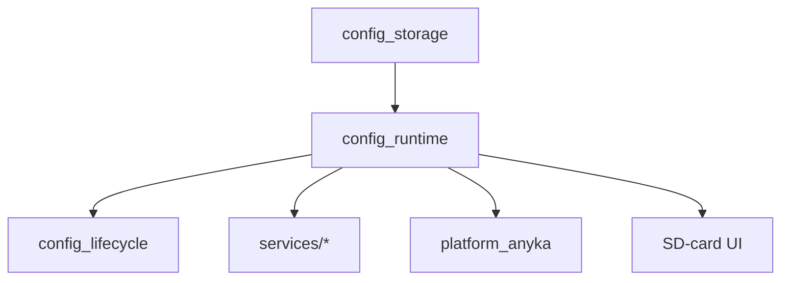

# Design Document

## Overview

We will refactor the ONVIF daemon configuration system into a consolidated schema-driven manager that keeps INI parsing but modernizes how defaults, validation, and runtime access are handled. A single `config_runtime` module will own section/key metadata, resolve values into `application_config`, expose typed accessors, and coordinate safe load/save operations. Platform and service layers will consume configuration exclusively through this manager, eliminating legacy buffer readers.

## Steering Document Alignment

### Technical Standards (tech.md)
- Stays within the existing C toolchain on Anyka hardware while enhancing validation and error logging.
- Reuses established utilities (`validation`, `logging`, `stream_config_utils`) and sticks to ONVIF error constants.
- Maintains layered architecture: configuration logic remains separate from hardware-specific code and service handlers.

### Project Structure (structure.md)
- Keeps code under `src/core/config/`, with services using the published header interfaces.
- Replaces `platform_config_*` parsing in `src/platform/platform_anyka.c` with runtime manager calls.
- Adds unit tests in `tests/src/core/config/` following project layout conventions.

## Code Reuse Analysis

### Existing Components to Leverage
- **`core/config/config.c`**: Existing parameter definitions, defaults, and validation helpers become the base for the unified manager.
- **`core/lifecycle/config_lifecycle.c`**: Continues to allocate memory but delegates initialization to `config_runtime_bootstrap`.
- **`utils/validation/common_validation`**: Provides length/range checks for schema-driven validation.
- **`utils/stream/stream_config_utils`**: Still maps loaded values onto video encoder settings after the run-time manager prepares them.

### Integration Points
- **Platform abstraction (`platform_anyka.c`)**: Drops its local INI parser and forwards load/save/get operations to the runtime manager.
- **Service handlers (`services/*`)**: Keep consuming `application_config` but can use helper getters to avoid manual key lookups.
- **Tooling (SD-card UI/CLI)**: Uses new persistence helpers to write atomically and leverages configuration summaries for display.

## Architecture

The configuration layer will consist of two tightly integrated units:
1. **Schema & Runtime Manager (`config_runtime.c/h`)** – Declares the configuration schema, binds entries to `application_config`, exposes getters/setters, and triggers validation.
2. **INI Storage Helpers (`config_storage.c/h`)** – Wrap existing INI parsing/persistence logic into reusable functions that load into or save from the runtime manager with checksum and temp-file safeguards.



### Modular Design Principles
- **Single File Responsibility**: `config_runtime` handles schema + runtime state; `config_storage` handles file operations.
- **Component Isolation**: Services interact only with `config_runtime` APIs, keeping parsing details hidden.
- **Service Layer Separation**: Configuration logic remains in core; platform/services consume via interfaces.
- **Utility Modularity**: Reuse validation/logging utilities; no duplicated logic.

## Components and Interfaces

### Config Runtime (`core/config/config_runtime.*`)
- **Purpose:** Maintain canonical schema definitions and runtime manager instance.
- **Interfaces:**
  - `int config_runtime_bootstrap(struct application_config* cfg);`
  - `int config_runtime_get_int(config_section_t section, const char* key, int* out_value);`
  - `int config_runtime_set_int(config_section_t section, const char* key, int value);`
  - `const struct application_config* config_runtime_snapshot(void);`
  - `int config_runtime_apply_defaults(void);`
- **Dependencies:** `config.h`, `utils/validation`, `utils/error`.
- **Reuses:** Existing parameter arrays, `config_init`, `config_validate`, summary generation.

### Config Storage (`core/config/config_storage.*`)
- **Purpose:** Load/save INI files safely into the runtime manager.
- **Interfaces:**
  - `int config_storage_load(const char* path, config_manager_t* manager);`
  - `int config_storage_save(const char* path, const config_manager_t* manager);`
  - `int config_storage_reload(const char* path);`
- **Dependencies:** Standard C I/O, platform logging, runtime manager.
- **Reuses:** Current INI parsing loops (relocated from `config.c` and `platform_anyka.c`).

### Platform Adapter Updates (`platform_anyka.c`)
- **Purpose:** Serve as thin wrappers that call runtime/storage helpers.
- **Interfaces:**
  - `platform_result_t platform_config_load(const char* filename);`
  - `platform_result_t platform_config_save(const char* filename);`
  - `const char* platform_config_get_string(...)` → delegates to runtime getters.
- **Dependencies:** Config runtime/storage headers.
- **Reuses:** Existing logging pathways for error reporting.

## Data Models

### Schema Entry (C structure)
```
typedef struct {
  config_section_t section;
  const char* section_name;
  const char* key;
  config_value_type_t type;
  int required;
  int min_value;
  int max_value;
  size_t max_length;
  const char* default_literal;
} config_schema_entry_t;
```
- Used to generate runtime parameter arrays and drive validation.

### Runtime Snapshot
```
typedef struct {
  config_manager_t manager;
  struct application_config* app_config;
  uint32_t generation_counter;
} config_runtime_state_t;
```
- Generation counter helps tooling detect updates after persistence.

## Error Handling

### Error Scenarios
1. **INI Load Failure:**
   - **Handling:** Log warning, apply defaults (`config_runtime_apply_defaults`), set generation counter, return `ONVIF_ERROR_IO`.
   - **User Impact:** Daemon runs with safe defaults; summary indicates fallback.

2. **Validation Failure:**
   - **Handling:** Reject update, log structured error (`section:key`, reason), return `ONVIF_ERROR_INVALID`.
   - **User Impact:** Caller sees exact failure, no partial state applied.

3. **Save Failure (Disk Full):**
   - **Handling:** Attempt temp-file write; if rename fails, log error, leave manager unchanged.
   - **User Impact:** Configuration remains consistent, warning instructs to free space.

## Testing Strategy

### Unit Testing
- Create CMocka tests for `config_runtime` (default application, validation bounds, getters/setters).
- Mock file I/O in `config_storage` tests to simulate load/save success, truncation, and checksum mismatch scenarios.

### Integration Testing
- Update `config_lifecycle` tests to ensure bootstrap + load produce coherent `application_config` with and without real INI files.
- Verify platform adapter wrappers correctly forward to runtime manager in mock builds.

### End-to-End Testing
- SD-card workflow: modify INI via UI/tool, confirm atomic persistence, restart daemon, inspect summary logs.
- Run ONVIF service smoke tests (`GetDeviceInformation`, `GetStreamUri`) to ensure services observe updated values.
