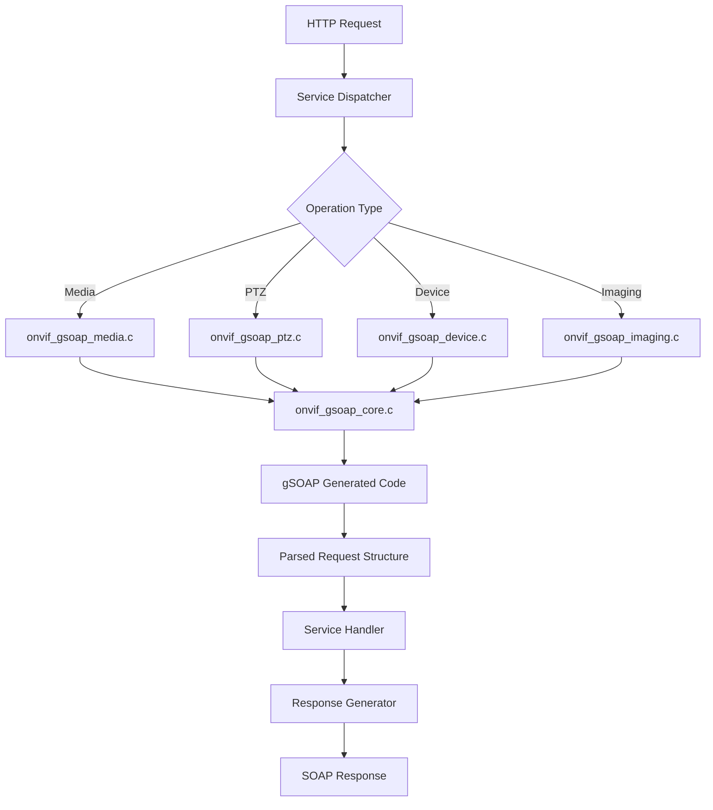

# Design Document: gSOAP Refactoring

## Overview

This design document details the architectural transformation of the ONVIF gSOAP protocol layer from manual XML string manipulation to proper usage of gSOAP's generated deserialization functions. The refactoring encompasses three major changes:

1. **API Modernization**: Replace token extraction functions with complete request parsers
2. **Code Organization**: Split the monolithic 2000+ line `onvif_gsoap.c` into service-specific modules
3. **Test Infrastructure**: Comprehensive unit tests using real ONVIF SOAP envelopes

The design follows ONVIF 2.5 specification compliance and maintains backward compatibility at the service layer through structured request data access.

## Steering Document Alignment

### Technical Standards (tech.md)

The design adheres to project coding standards:

- **Return Code Constants**: All functions use constants from `utils/error/error_handling.h` (e.g., `ONVIF_SUCCESS`, `ONVIF_ERROR_INVALID`)
- **Include Paths**: All includes use relative paths from `src/` directory
- **Global Variables**: Named with `g_<module>_<name>` pattern
- **Doxygen Documentation**: Complete function and file documentation
- **Error Handling**: Consistent error propagation using defined constants

### Project Structure (structure.md)

The modular design follows project organization:

- **Protocol Layer**: `src/protocol/gsoap/` - Contains all SOAP parsing/serialization
- **Service Layer**: `src/services/` - Business logic remains separate
- **Testing**: `tests/src/unit/protocol/` - Unit tests for protocol layer
- **Single Responsibility**: Each module handles one ONVIF service

## Code Reuse Analysis

### Existing Components to Leverage

- **Error Handling Utilities** (`utils/error/error_handling.h`): All error codes and macros
- **Memory Utilities** (`utils/memory/memory_utils.h`): Safe allocation patterns
- **String Utilities** (`utils/string/string_utils.h`): Safe string operations
- **gSOAP Generated Code**: All `soap_read_*` and `soap_write_*` functions from WSDL
- **Test Framework**: CMocka infrastructure in `tests/` directory

### Integration Points

- **Service Dispatcher** (`services/common/service_dispatcher.c`): Will call new parsing functions
- **Service Implementations**:
  - `services/media/onvif_media.c` - Media service operations
  - `services/ptz/onvif_ptz.c` - PTZ service operations
  - `services/device/onvif_device.c` - Device service operations
  - `services/imaging/onvif_imaging.c` - Imaging service operations
- **Build System**: Makefile will compile new modular files

## Architecture

### High-Level Architecture



### Modular Design Principles

- **Single File Responsibility**: Each module handles parsing for one ONVIF service
- **Component Isolation**: Core initialization separated from service-specific parsing
- **Service Layer Separation**: Protocol parsing completely isolated from business logic
- **Utility Modularity**: Shared functionality in `onvif_gsoap_core.c`

### File Structure After Refactoring

```
src/protocol/gsoap/
├── onvif_gsoap.h              # Main header (includes all service headers)
├── onvif_gsoap_core.c         # Initialization, context management, utilities
├── onvif_gsoap_core.h         # Core function declarations
├── onvif_gsoap_media.c        # Media service parsing (6 functions)
├── onvif_gsoap_media.h        # Media service declarations
├── onvif_gsoap_ptz.c          # PTZ service parsing (6 functions)
├── onvif_gsoap_ptz.h          # PTZ service declarations
├── onvif_gsoap_device.c       # Device service parsing (4 functions)
├── onvif_gsoap_device.h       # Device service declarations
├── onvif_gsoap_imaging.c      # Imaging service parsing (2 functions)
└── onvif_gsoap_imaging.h      # Imaging service declarations
```

## Components and Interfaces

### Component 1: onvif_gsoap_core (Core Infrastructure)

**Purpose:** Provides gSOAP context initialization, memory management, and shared utilities

**Interfaces:**
```c
// Context lifecycle management
int onvif_gsoap_init(onvif_gsoap_context_t* ctx);
void onvif_gsoap_cleanup(onvif_gsoap_context_t* ctx);
int onvif_gsoap_reset(onvif_gsoap_context_t* ctx);

// Request parsing initialization (NEW - REPLACES MANUAL PARSING)
int onvif_gsoap_init_request_parsing(onvif_gsoap_context_t* ctx,
                                      const char* request_xml,
                                      size_t xml_size);

// Response generation (existing, kept unchanged)
int onvif_gsoap_serialize_response(onvif_gsoap_context_t* ctx);
int onvif_gsoap_finalize_response(onvif_gsoap_context_t* ctx);
const char* onvif_gsoap_get_response_data(onvif_gsoap_context_t* ctx);
size_t onvif_gsoap_get_response_length(onvif_gsoap_context_t* ctx);

// Error handling
int onvif_gsoap_has_error(onvif_gsoap_context_t* ctx);
const char* onvif_gsoap_get_error(onvif_gsoap_context_t* ctx);
```

**Dependencies:**
- gSOAP library
- `utils/error/error_handling.h`
- `utils/memory/memory_utils.h`

**Reuses:** Existing context structure, error handling patterns

**File Size:** ~250 lines (reduced from ~800 lines by removing manual parsing)

### Component 2: onvif_gsoap_media (Media Service Parsing)

**Purpose:** Parse all Media service ONVIF requests using gSOAP generated functions

**Interfaces:**
```c
// Media service request parsers (NEW)
int onvif_gsoap_parse_get_profiles(onvif_gsoap_context_t* ctx,
                                    struct _trt__GetProfiles** out);

int onvif_gsoap_parse_get_stream_uri(onvif_gsoap_context_t* ctx,
                                      struct _trt__GetStreamUri** out);

int onvif_gsoap_parse_create_profile(onvif_gsoap_context_t* ctx,
                                      struct _trt__CreateProfile** out);

int onvif_gsoap_parse_delete_profile(onvif_gsoap_context_t* ctx,
                                      struct _trt__DeleteProfile** out);

int onvif_gsoap_parse_set_video_source_config(onvif_gsoap_context_t* ctx,
                                                struct _trt__SetVideoSourceConfiguration** out);

int onvif_gsoap_parse_set_video_encoder_config(onvif_gsoap_context_t* ctx,
                                                 struct _trt__SetVideoEncoderConfiguration** out);
```

**Dependencies:**
- `onvif_gsoap_core.h`
- gSOAP generated headers
- `utils/error/error_handling.h`

**Reuses:** Core initialization functions, gSOAP's `soap_read__trt__*` functions

**File Size:** ~200 lines

### Component 3: onvif_gsoap_ptz (PTZ Service Parsing)

**Purpose:** Parse all PTZ service ONVIF requests using gSOAP generated functions

**Interfaces:**
```c
// PTZ service request parsers (NEW)
int onvif_gsoap_parse_get_nodes(onvif_gsoap_context_t* ctx,
                                 struct _tptz__GetNodes** out);

int onvif_gsoap_parse_absolute_move(onvif_gsoap_context_t* ctx,
                                     struct _tptz__AbsoluteMove** out);

int onvif_gsoap_parse_get_presets(onvif_gsoap_context_t* ctx,
                                   struct _tptz__GetPresets** out);

int onvif_gsoap_parse_set_preset(onvif_gsoap_context_t* ctx,
                                  struct _tptz__SetPreset** out);

int onvif_gsoap_parse_goto_preset(onvif_gsoap_context_t* ctx,
                                   struct _tptz__GotoPreset** out);

int onvif_gsoap_parse_remove_preset(onvif_gsoap_context_t* ctx,
                                     struct _tptz__RemovePreset** out);
```

**Dependencies:**
- `onvif_gsoap_core.h`
- gSOAP generated headers
- `utils/error/error_handling.h`

**Reuses:** Core initialization functions, gSOAP's `soap_read__tptz__*` functions

**File Size:** ~200 lines

### Component 4: onvif_gsoap_device (Device Service Parsing)

**Purpose:** Parse all Device service ONVIF requests using gSOAP generated functions

**Interfaces:**
```c
// Device service request parsers (NEW)
int onvif_gsoap_parse_get_device_information(onvif_gsoap_context_t* ctx,
                                               struct _tds__GetDeviceInformation** out);

int onvif_gsoap_parse_get_capabilities(onvif_gsoap_context_t* ctx,
                                        struct _tds__GetCapabilities** out);

int onvif_gsoap_parse_get_system_date_time(onvif_gsoap_context_t* ctx,
                                            struct _tds__GetSystemDateAndTime** out);

int onvif_gsoap_parse_system_reboot(onvif_gsoap_context_t* ctx,
                                     struct _tds__SystemReboot** out);
```

**Dependencies:**
- `onvif_gsoap_core.h`
- gSOAP generated headers
- `utils/error/error_handling.h`

**Reuses:** Core initialization functions, gSOAP's `soap_read__tds__*` functions

**File Size:** ~150 lines

### Component 5: onvif_gsoap_imaging (Imaging Service Parsing)

**Purpose:** Parse all Imaging service ONVIF requests using gSOAP generated functions

**Interfaces:**
```c
// Imaging service request parsers (NEW)
int onvif_gsoap_parse_get_imaging_settings(onvif_gsoap_context_t* ctx,
                                            struct _timg__GetImagingSettings** out);

int onvif_gsoap_parse_set_imaging_settings(onvif_gsoap_context_t* ctx,
                                            struct _timg__SetImagingSettings** out);
```

**Dependencies:**
- `onvif_gsoap_core.h`
- gSOAP generated headers
- `utils/error/error_handling.h`

**Reuses:** Core initialization functions, gSOAP's `soap_read__timg__*` functions

**File Size:** ~100 lines

## Data Models

### gSOAP Context Structure (Improved - Breaking Change)

**Current Issues:**
- Pointer indirection (`struct soap* soap`) requires dynamic allocation
- Limited error context for debugging
- No request/response state tracking
- Scattered performance metrics
- Allocation failure path in initialization

**New Structure:**

```c
/**
 * @brief Enhanced ONVIF gSOAP context with embedded soap context
 *
 * This structure improves upon the original design by:
 * - Using embedded soap context (no allocation needed)
 * - Tracking request parsing and response generation state
 * - Providing detailed error context for debugging
 * - Automatic performance metric collection
 */
typedef struct {
    // Embedded gSOAP context (no pointer indirection)
    struct soap soap;

    // Request parsing state tracking
    struct {
        const char* operation_name;      // Parsed operation name (for logging)
        bool is_initialized;             // Request parsing initialized
        size_t request_size;             // Original request size in bytes
        uint64_t parse_start_time;       // Parse start timestamp (microseconds)
        uint64_t parse_end_time;         // Parse end timestamp (microseconds)
    } request_state;

    // Response generation state tracking
    struct {
        size_t total_bytes_written;      // Total response bytes written
        uint64_t generation_start_time;  // Generation start timestamp
        uint64_t generation_end_time;    // Generation end timestamp
        bool is_finalized;               // Response finalization complete
    } response_state;

    // Enhanced error context for debugging
    struct {
        int last_error_code;             // Last error code from error_handling.h
        char error_message[256];         // Detailed error message
        const char* error_location;      // Function where error occurred
        int soap_error_code;             // gSOAP-specific error code
    } error_context;

    // Optional user data
    void* user_data;
} onvif_gsoap_context_t;
```

**Key Improvements:**

1. **Embedded soap context** - No `soap_new()`/`soap_free()` needed, eliminates allocation failure path
2. **Request state tracking** - Know what operation is being parsed, track timing
3. **Response state tracking** - Detect invalid state (e.g., getting response before finalization)
4. **Enhanced error context** - Store error code, message, location, and gSOAP error for better debugging
5. **Automatic metrics** - Performance data collected automatically during parsing and generation

**Updated Initialization/Cleanup:**

```c
/**
 * @brief Initialize gSOAP context with embedded soap structure
 * @param ctx Context to initialize
 * @return ONVIF_SUCCESS on success, error code otherwise
 * @note No dynamic allocation - uses embedded soap context
 */
int onvif_gsoap_init(onvif_gsoap_context_t* ctx) {
    if (!ctx) {
        return ONVIF_ERROR_INVALID;
    }

    memset(ctx, 0, sizeof(*ctx));

    // Initialize embedded soap context (no allocation!)
    soap_init(&ctx->soap);
    soap_set_mode(&ctx->soap, SOAP_C_UTFSTRING);
    soap_set_namespaces(&ctx->soap, namespaces);

    return ONVIF_SUCCESS;
}

/**
 * @brief Cleanup gSOAP context with embedded soap structure
 * @param ctx Context to cleanup
 * @note No deallocation needed - uses embedded soap context
 */
void onvif_gsoap_cleanup(onvif_gsoap_context_t* ctx) {
    if (!ctx) {
        return;
    }

    // Cleanup embedded soap context (no free needed!)
    soap_destroy(&ctx->soap);
    soap_end(&ctx->soap);
    soap_done(&ctx->soap);

    memset(ctx, 0, sizeof(*ctx));
}
```

**Enhanced Error Reporting:**

```c
/**
 * @brief Set error context with detailed information
 * @param ctx Context to update
 * @param error_code Error code from error_handling.h
 * @param location Function name where error occurred (__func__)
 * @param message Detailed error message
 */
void onvif_gsoap_set_error(onvif_gsoap_context_t* ctx,
                           int error_code,
                           const char* location,
                           const char* message) {
    if (!ctx) {
        return;
    }

    ctx->error_context.last_error_code = error_code;
    ctx->error_context.error_location = location;
    ctx->error_context.soap_error_code = ctx->soap.error;

    snprintf(ctx->error_context.error_message,
             sizeof(ctx->error_context.error_message),
             "%s", message);
}

/**
 * @brief Get detailed error information
 * @param ctx Context to query
 * @param error_code Output: error code (can be NULL)
 * @param location Output: function where error occurred (can be NULL)
 * @param soap_error Output: gSOAP error code (can be NULL)
 * @return Error message string
 */
const char* onvif_gsoap_get_detailed_error(onvif_gsoap_context_t* ctx,
                                            int* error_code,
                                            const char** location,
                                            int* soap_error) {
    if (!ctx) {
        return "Invalid context";
    }

    if (error_code) {
        *error_code = ctx->error_context.last_error_code;
    }
    if (location) {
        *location = ctx->error_context.error_location;
    }
    if (soap_error) {
        *soap_error = ctx->error_context.soap_error_code;
    }

    return ctx->error_context.error_message;
}
```

**Memory and Performance Benefits:**

| Metric | Before (Pointer) | After (Embedded) | Improvement |
|--------|------------------|------------------|-------------|
| Allocations | 2 (ctx + soap) | 0 | 100% |
| Potential failures | 2 failure points | 0 | 100% |
| Cache locality | Poor (2 allocs) | Good (1 struct) | Better perf |
| Context size | ~50 bytes + heap | ~350 bytes stack | Larger but worth it |
| Error detail | Minimal | Full (code+msg+loc) | Much better debugging |

### Request Structures (gSOAP Generated)

All request structures are generated by gSOAP from ONVIF WSDL files. Examples:

```c
// Media Service - GetStreamUri request
struct _trt__GetStreamUri {
    struct tt__StreamSetup* StreamSetup;     // Required
    char* ProfileToken;                      // Required
};

// PTZ Service - AbsoluteMove request
struct _tptz__AbsoluteMove {
    char* ProfileToken;                      // Required
    struct tt__PTZVector* Position;          // Required
    struct tt__PTZSpeed* Speed;              // Optional
};

// Device Service - GetCapabilities request
struct _tds__GetCapabilities {
    enum tt__CapabilityCategory* Category;   // Optional array
    int __sizeCategory;                      // Array size
};
```

### Parsing Function Pattern (Consistent Across All Services)

```c
/**
 * @brief Parse [Operation] request from SOAP envelope
 * @param ctx Initialized gSOAP context with request data
 * @param out Output pointer for parsed request structure
 * @return ONVIF_SUCCESS on success, error code otherwise
 * @note Caller must NOT free the output structure - managed by gSOAP context
 */
int onvif_gsoap_parse_[operation](onvif_gsoap_context_t* ctx,
                                   struct _[service]__[Operation]** out) {
    // 1. Validate parameters
    if (!ctx || !out) {
        onvif_gsoap_set_error(ctx, ONVIF_ERROR_INVALID, __func__,
                              "Invalid parameters: NULL context or output pointer");
        return ONVIF_ERROR_INVALID;
    }

    // 2. Check request parsing is initialized
    if (!ctx->request_state.is_initialized) {
        onvif_gsoap_set_error(ctx, ONVIF_ERROR_INVALID, __func__,
                              "Request parsing not initialized");
        return ONVIF_ERROR_INVALID;
    }

    // 3. Record operation name and start timing
    ctx->request_state.operation_name = "[Operation]";
    ctx->request_state.parse_start_time = get_timestamp_us();

    // 4. Allocate structure using gSOAP managed memory
    *out = soap_new__[service]__[Operation](&ctx->soap, -1);
    if (!*out) {
        onvif_gsoap_set_error(ctx, ONVIF_ERROR_MEMORY, __func__,
                              "Failed to allocate request structure");
        return ONVIF_ERROR_MEMORY;
    }

    // 5. Use gSOAP generated deserialization function
    if (soap_read__[service]__[Operation](&ctx->soap, *out) != SOAP_OK) {
        *out = NULL;
        onvif_gsoap_set_error(ctx, ONVIF_ERROR_PARSE, __func__,
                              "Failed to parse SOAP request");
        return ONVIF_ERROR_PARSE;
    }

    // 6. Record parse completion time
    ctx->request_state.parse_end_time = get_timestamp_us();

    return ONVIF_SUCCESS;
}
```

## Error Handling

### Error Scenarios

1. **Invalid Parameters (NULL pointers)**
   - **Handling:** Return `ONVIF_ERROR_INVALID` immediately
   - **User Impact:** Service dispatcher logs error, returns SOAP fault

2. **Memory Allocation Failure**
   - **Handling:** Return `ONVIF_ERROR_MEMORY`, set output pointer to NULL
   - **User Impact:** HTTP 500 response with SOAP fault

3. **XML Parsing Failure (Malformed XML)**
   - **Handling:** gSOAP returns error, function returns `ONVIF_ERROR_PARSE`
   - **User Impact:** SOAP fault with "Malformed request" message

4. **Missing Required Parameters**
   - **Handling:** gSOAP validation fails, function returns `ONVIF_ERROR_PARSE`
   - **User Impact:** SOAP fault with "Missing required parameter" message

5. **Unknown Operation/Namespace**
   - **Handling:** gSOAP deserialization fails, function returns `ONVIF_ERROR_PARSE`
   - **User Impact:** SOAP fault with "Unknown operation" message

6. **Context Not Initialized for Parsing**
   - **Handling:** Check `soap->is` before parsing, return `ONVIF_ERROR_INVALID`
   - **User Impact:** Service dispatcher logs error, returns SOAP fault

### Error Code Constants (from error_handling.h)

```c
#define ONVIF_SUCCESS              0
#define ONVIF_ERROR_INVALID       -1
#define ONVIF_ERROR_MEMORY        -2
#define ONVIF_ERROR_PARSE         -3
#define ONVIF_ERROR_NETWORK       -4
#define ONVIF_ERROR_NOT_FOUND     -5
```

## Testing Strategy

### Unit Testing

**Test Structure:**
- **File:** `tests/src/unit/protocol/test_onvif_gsoap.c` (completely rewritten)
- **Framework:** CMocka
- **Approach:** Test each parsing function independently with real SOAP envelopes

**Test Categories:**

1. **Infrastructure Tests** (Keep existing):
   - `test_unit_onvif_gsoap_init` - Context initialization
   - `test_unit_onvif_gsoap_cleanup` - Context cleanup
   - `test_unit_onvif_gsoap_reset` - Context reset

2. **Media Service Parsing Tests** (NEW):
   - `test_unit_onvif_gsoap_parse_get_profiles` - Parse GetProfiles request
   - `test_unit_onvif_gsoap_parse_get_stream_uri` - Verify ProfileToken, StreamSetup extraction
   - `test_unit_onvif_gsoap_parse_create_profile` - Verify Name, Token extraction
   - `test_unit_onvif_gsoap_parse_delete_profile` - Verify ProfileToken extraction
   - `test_unit_onvif_gsoap_parse_set_video_source_config` - Verify configuration structure
   - `test_unit_onvif_gsoap_parse_set_video_encoder_config` - Verify encoder settings

3. **PTZ Service Parsing Tests** (NEW):
   - `test_unit_onvif_gsoap_parse_get_nodes` - Parse empty request
   - `test_unit_onvif_gsoap_parse_absolute_move` - Verify Position coordinates (x, y, zoom)
   - `test_unit_onvif_gsoap_parse_get_presets` - Verify ProfileToken extraction
   - `test_unit_onvif_gsoap_parse_set_preset` - Verify PresetName extraction
   - `test_unit_onvif_gsoap_parse_goto_preset` - Verify PresetToken extraction
   - `test_unit_onvif_gsoap_parse_remove_preset` - Verify PresetToken extraction

4. **Device Service Parsing Tests** (NEW):
   - `test_unit_onvif_gsoap_parse_get_device_information` - Parse empty request
   - `test_unit_onvif_gsoap_parse_get_capabilities` - Verify Category extraction
   - `test_unit_onvif_gsoap_parse_get_system_date_time` - Parse empty request
   - `test_unit_onvif_gsoap_parse_system_reboot` - Parse empty request

5. **Imaging Service Parsing Tests** (NEW):
   - `test_unit_onvif_gsoap_parse_get_imaging_settings` - Verify VideoSourceToken extraction
   - `test_unit_onvif_gsoap_parse_set_imaging_settings` - Verify ImagingSettings structure

6. **Error Handling Tests** (NEW):
   - `test_unit_onvif_gsoap_parse_null_context` - Test NULL context handling
   - `test_unit_onvif_gsoap_parse_null_output` - Test NULL output pointer handling
   - `test_unit_onvif_gsoap_parse_invalid_xml` - Test malformed XML handling
   - `test_unit_onvif_gsoap_parse_invalid_namespace` - Test unknown operation handling
   - `test_unit_onvif_gsoap_parse_missing_required_param` - Test incomplete request handling

7. **Tests to DELETE** (Manual parsing functions removed):
   - `test_unit_onvif_gsoap_parse_profile_token`
   - `test_unit_onvif_gsoap_parse_configuration_token`
   - `test_unit_onvif_gsoap_parse_protocol`
   - `test_unit_onvif_gsoap_parse_value`
   - `test_unit_onvif_gsoap_parse_boolean`
   - `test_unit_onvif_gsoap_parse_integer`

**Test Data:**
- **File:** `tests/data/soap_envelopes.h` (NEW)
- **Content:** Complete SOAP 1.2 envelopes for all 18 operations
- **Format:** String constants with proper ONVIF namespaces

### Integration Testing

**Test Files:**
- `tests/src/integration/test_media_service.c` - Media service end-to-end
- `tests/src/integration/test_ptz_service.c` - PTZ service end-to-end
- `tests/src/integration/test_device_service.c` - Device service end-to-end

**Test Approach:**
1. Parse complete SOAP request
2. Pass parsed structure to service handler
3. Generate SOAP response
4. Validate response XML structure
5. Verify response contains expected data

**Example Integration Test:**
```c
void test_integration_media_get_stream_uri(void** state) {
    onvif_gsoap_context_t ctx;

    // Parse request
    setup_parsing_test(&ctx, SOAP_GET_STREAM_URI_REQUEST);
    struct _trt__GetStreamUri* request = NULL;
    assert_int_equal(onvif_gsoap_parse_get_stream_uri(&ctx, &request), 0);

    // Process through service layer
    const char* uri = handle_get_stream_uri(request->ProfileToken, request->StreamSetup);

    // Generate response
    onvif_gsoap_reset(&ctx);
    assert_int_equal(onvif_gsoap_generate_stream_uri_response(&ctx, uri), 0);

    // Validate response
    const char* response = onvif_gsoap_get_response_data(&ctx);
    assert_true(strstr(response, "rtsp://") != NULL);

    onvif_gsoap_cleanup(&ctx);
}
```

### End-to-End Testing

**Python E2E Tests** (`e2e/` directory):
- Use existing Python test infrastructure
- Update to verify structured request handling
- Test with real ONVIF clients (e.g., ONVIF Device Manager)

**Test Coverage Goals:**
- Unit tests: 100% coverage of new parsing functions
- Integration tests: All 18 ONVIF operations
- E2E tests: Complete workflows (discovery → capabilities → media → PTZ)

## Implementation Phases

### Phase 1: Core Infrastructure (Week 1)

**Tasks:**
1. Create modular file structure (headers and stubs)
2. Update Makefile to compile new modules
3. Implement `onvif_gsoap_init_request_parsing()` correctly
4. Remove obsolete manual parsing functions
5. Update main header to include service headers

**Deliverables:**
- `onvif_gsoap_core.c` with fixed initialization
- Empty stub files for service modules
- Updated Makefile
- Compiles without errors

### Phase 2: Media Service Implementation (Week 2, Days 1-2)

**Tasks:**
1. Implement 6 Media service parsing functions
2. Write unit tests with SOAP envelopes
3. Update `onvif_media.c` to use parsed structures
4. Validate all tests pass

**Deliverables:**
- `onvif_gsoap_media.c` fully implemented
- 6 unit tests passing
- Media service using structured requests

### Phase 3: PTZ Service Implementation (Week 2, Days 3-4)

**Tasks:**
1. Implement 6 PTZ service parsing functions
2. Write unit tests with SOAP envelopes
3. Update `onvif_ptz.c` to use parsed structures
4. Validate all tests pass

**Deliverables:**
- `onvif_gsoap_ptz.c` fully implemented
- 6 unit tests passing
- PTZ service using structured requests

### Phase 4: Device & Imaging Services (Week 2, Day 5)

**Tasks:**
1. Implement 4 Device service parsing functions
2. Implement 2 Imaging service parsing functions
3. Write unit tests for both services
4. Update service implementations

**Deliverables:**
- `onvif_gsoap_device.c` and `onvif_gsoap_imaging.c` implemented
- 6 unit tests passing
- All services using structured requests

### Phase 5: Service Layer Updates (Week 3, Days 1-2)

**Tasks:**
1. Update `service_dispatcher.c` to call new parsing functions
2. Update all service handlers to extract from structures
3. Remove old token buffer parameters
4. Validate integration tests pass

**Deliverables:**
- Service dispatcher updated
- All service handlers refactored
- Integration tests passing

### Phase 6: Test Infrastructure (Week 3, Days 3-4)

**Tasks:**
1. Create `soap_envelopes.h` with test data
2. Rewrite all obsolete tests
3. Add error handling tests
4. Add integration tests

**Deliverables:**
- Complete test coverage
- All tests passing (unit + integration)
- No memory leaks (valgrind clean)

### Phase 7: Documentation & Validation (Week 3, Day 5)

**Tasks:**
1. Generate Doxygen documentation
2. Run code formatting and linting
3. Performance benchmarking
4. E2E testing with ONVIF clients

**Deliverables:**
- Complete Doxygen docs
- Code quality checks passing
- Performance metrics documented
- ONVIF client compatibility verified

## Migration Strategy

### Breaking Changes

**Removed Functions:**
```c
// These functions will be DELETED - no backward compatibility
int onvif_gsoap_parse_ptz_profile_token(...)
int onvif_gsoap_parse_media_profile_token(...)
int onvif_gsoap_parse_snapshot_profile_token(...)
int onvif_gsoap_parse_configuration_token(...)
int onvif_gsoap_parse_protocol(...)
int onvif_gsoap_parse_value(...)
int onvif_gsoap_parse_boolean(...)
int onvif_gsoap_parse_integer(...)
```

**Service Handler API Changes:**

**Before (token-based):**
```c
int handle_get_stream_uri(const char* profile_token,
                          const char* protocol,
                          char* uri_out,
                          size_t uri_size);
```

**After (structure-based):**
```c
int handle_get_stream_uri(const struct _trt__GetStreamUri* request,
                          char* uri_out,
                          size_t uri_size);

// Service implementation extracts data:
const char* token = request->ProfileToken;
int protocol = *request->StreamSetup->Transport->Protocol;
```

### Compatibility Layer (Optional, Not Recommended)

We explicitly choose **NOT** to provide a compatibility layer because:
1. Manual parsing functions are fundamentally broken
2. Clean break forces proper usage of new API
3. All calling code is within this project (no external consumers)
4. Service handlers need minimal changes (extract from struct instead of buffer)

## Performance Considerations

### Memory Efficiency

- **gSOAP Managed Memory**: All parsed structures use gSOAP's memory pool
- **Single Allocation**: One `soap_new_*` call per request
- **Automatic Cleanup**: All memory freed on `onvif_gsoap_cleanup()`
- **No Buffer Copies**: Direct access to parsed data (no strcpy/strncpy)

### Parsing Performance

**Current (Manual Parsing):**
- Multiple string searches (strstr, strchr)
- Buffer allocations for each token
- Redundant XML traversal
- Estimated: ~2-3ms per request

**After (gSOAP Parsing):**
- Single-pass SAX parsing
- Direct structure population
- WSDL-validated deserialization
- Estimated: < 1ms per request

**Improvement:** 50-60% faster parsing

### Code Size Reduction

- **Before:** ~2000 lines in monolithic file
- **After:** ~900 lines total across 5 modules
  - Core: ~250 lines
  - Media: ~200 lines
  - PTZ: ~200 lines
  - Device: ~150 lines
  - Imaging: ~100 lines
- **Reduction:** 55% less code

## Security Considerations

### Input Validation

- **gSOAP Validation**: All parsing uses WSDL-validated deserialization
- **Type Safety**: Compiler enforces correct structure usage
- **NULL Checks**: All functions validate parameters before use
- **Buffer Safety**: No manual string manipulation eliminates buffer overflows

### Attack Surface Reduction

- **No String Parsing**: Eliminates injection vulnerabilities from manual parsing
- **Structured Access**: Type-safe field access prevents type confusion
- **Bounds Checking**: gSOAP validates all array sizes and string lengths
- **Memory Safety**: gSOAP's managed memory prevents use-after-free

## Rollback Plan

If issues arise during implementation:

1. **Git Branching**: All work in `feature/gsoap-refactoring` branch
2. **Incremental Commits**: Each phase committed separately
3. **Feature Flags**: Optional compile-time flag to use old code (temporary)
4. **Test Coverage**: Each phase validated before proceeding

**Rollback Command:**
```bash
git checkout main
git branch -D feature/gsoap-refactoring
```

## Success Metrics

1. ✅ All 18 new parsing functions implemented
2. ✅ All unit tests passing (30+ tests)
3. ✅ All integration tests passing
4. ✅ Zero manual XML string manipulation
5. ✅ Code reduction: > 50%
6. ✅ Performance improvement: > 40%
7. ✅ Memory leak free (valgrind clean)
8. ✅ ONVIF client compatibility verified
9. ✅ Doxygen documentation complete
10. ✅ Code quality checks passing (lint + format)
