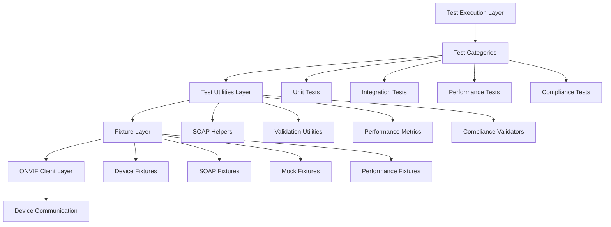

# Design Document

## Overview

The integration test improvements will transform the current flat, duplicated test structure into a modular, organized framework that supports comprehensive ONVIF Profile S & T compliance validation, statistical performance analysis, and maintainable code quality standards. The design leverages existing ONVIF client infrastructure while introducing clear separation of concerns, reusable utilities, and automated quality enforcement.

## Steering Document Alignment

### Technical Standards (tech.md)
The design follows the project's established technical patterns:
- **Platform Abstraction**: Test utilities will abstract device communication similar to `src/platform/platform_anyka.c`
- **Modular Architecture**: Follows the layered approach with clear separation between fixtures, utilities, and test implementations
- **ONVIF Compliance**: Maintains consistency with the main ONVIF implementation's compliance validation patterns
- **Error Handling**: Implements standardized error handling similar to `src/utils/error/error_handling.c`

### Project Structure (structure.md)
Implementation will follow project organization conventions:
- Directory structure mirrors the main project's modular organization
- Utilities are grouped by purpose (validation, performance, compliance)
- Configuration management follows existing patterns from `integration-tests/config.py`
- Documentation standards align with the project's Doxygen requirements

## Code Reuse Analysis

### Existing Components to Leverage
- **ONVIFDeviceClient**: Extend the existing client from `tests/fixtures.py` with enhanced error handling and compliance validation
- **SOAP utilities**: Build upon existing `make_soap_request` and `validate_xml_response` functions
- **Configuration system**: Reuse and extend `config.py` for test data management and environment-specific settings
- **Logging infrastructure**: Leverage existing `logging_config.py` for structured test reporting
- **Performance tracking**: Extend existing `performance_tracker` with statistical analysis capabilities

### Integration Points
- **ONVIF Server**: Tests will integrate with the existing ONVIF server implementation in `cross-compile/onvif/`
- **Device Configuration**: Will reuse existing device configuration patterns from `integration-tests/config.py`
- **Test Execution**: Integration with existing `run_tests.py` execution framework
- **Local Development**: Integration with local development workflows and testing processes

## Architecture

The design implements a layered architecture with clear separation of concerns:



### Modular Design Principles
- **Single File Responsibility**: Each utility file handles one specific domain (SOAP, validation, performance, compliance)
- **Component Isolation**: Test categories are completely isolated with no shared state or dependencies
- **Service Layer Separation**: Clear separation between data access (fixtures), business logic (utilities), and test execution
- **Utility Modularity**: Break utilities into focused, single-purpose modules with clear interfaces

### Python Development Guidelines

#### Code Style and Standards
- **PEP 8 Compliance**: All code must follow PEP 8 style guidelines with 88-character line length
- **Type Hints**: Use Python 3.9+ type hints for all function parameters and return values
- **Docstrings**: Google-style docstrings for all public functions, classes, and modules
- **Import Organization**: Use isort with Black profile for consistent import ordering
- **Error Handling**: Use specific exception types, avoid bare except clauses

#### Python-Specific Architecture Patterns
- **Dataclasses**: Use `@dataclass` for data structures with automatic `__init__`, `__repr__`, and comparison methods
- **Context Managers**: Implement `__enter__`/`__exit__` or use `contextlib` for resource management
- **Decorators**: Use decorators for cross-cutting concerns like logging, retry logic, and performance tracking
- **Generators**: Use generators for memory-efficient data processing and test data generation
- **Async/Await**: Use asyncio for concurrent operations where appropriate (performance tests)

#### Testing Framework Integration
- **Pytest Fixtures**: Leverage pytest's dependency injection with proper scope management (session, module, function)
- **Parametrized Tests**: Use `@pytest.mark.parametrize` for data-driven testing
- **Test Markers**: Custom markers for test categorization and selective execution
- **Plugins**: Integrate with pytest-cov, pytest-html, pytest-xdist for enhanced functionality
- **Mocking**: Use unittest.mock for isolation, pytest-mock for convenience

#### Package and Module Structure
```python
integration-tests/
├── tests/
│   ├── unit/                    # Unit tests with mocked dependencies
│   ├── integration/             # Integration tests with real ONVIF calls
│   ├── performance/             # Performance and load tests
│   └── compliance/              # ONVIF specification compliance tests
├── fixtures/                    # Pytest fixtures organized by domain
│   ├── __init__.py             # Expose common fixtures
│   ├── device_fixtures.py      # Device connection and config fixtures
│   ├── soap_fixtures.py        # SOAP request/response fixtures
│   ├── performance_fixtures.py # Performance testing fixtures
│   └── mock_fixtures.py        # Mock objects for unit tests
├── utils/                       # Utility modules
│   ├── __init__.py             # Common utility exports
│   ├── onvif_validator.py      # ONVIF spec validation utilities
│   ├── soap_helpers.py         # SOAP request/response helpers
│   ├── performance_metrics.py  # Performance collection and analysis
│   └── test_data_manager.py    # Test data setup/teardown
└── config/                      # Configuration management
    ├── __init__.py             # Configuration exports
    ├── test_config.py          # Test configuration classes
    └── device_profiles.yaml    # Device configuration profiles
```

#### Dependency Management
- **Virtual Environment**: Use Python virtual environments for isolation
- **Requirements Files**: Separate requirements.txt for runtime and requirements-dev.txt for development
- **Version Pinning**: Pin exact versions for reproducible builds
- **Dependency Groups**: Organize dependencies by purpose (testing, linting, performance)

#### Python-Specific Error Handling
```python
# Custom exception hierarchy
class ONVIFTestError(Exception):
    """Base exception for ONVIF testing errors."""
    pass

class ONVIFConnectionError(ONVIFTestError):
    """ONVIF device connection failed."""
    pass

class ONVIFComplianceError(ONVIFTestError):
    """ONVIF compliance validation failed."""
    pass

class ONVIFPerformanceError(ONVIFTestError):
    """Performance threshold exceeded."""
    pass
```

#### Resource Management
- **Connection Pooling**: Reuse HTTP connections for better performance
- **Cleanup Strategies**: Use try/finally blocks and context managers for proper resource cleanup
- **Memory Management**: Monitor memory usage in long-running tests, use generators for large datasets
- **Logging**: Structured logging with proper log levels and context information

### Python Best Practices

#### Code Organization and Structure
- **Module Design**: Keep modules focused with clear responsibility boundaries
- **Function Size**: Limit functions to ~20 lines, classes to ~200 lines maximum
- **Naming Conventions**: Use snake_case for functions/variables, PascalCase for classes, UPPER_CASE for constants
- **Import Order**: Follow PEP 8 import order (standard library, third-party, local imports)
- **Docstrings**: Use Google-style docstrings with Args, Returns, Raises sections

```python
def validate_onvif_response(response: requests.Response, operation_name: str) -> bool:
    """Validate ONVIF SOAP response format and content.

    Args:
        response: HTTP response object from ONVIF request
        operation_name: Expected ONVIF operation name (e.g., 'GetDeviceInformation')

    Returns:
        True if response is valid ONVIF format, False otherwise

    Raises:
        ONVIFValidationError: If response format is critically invalid

    Example:
        >>> response = make_onvif_request("GetDeviceInformation")
        >>> is_valid = validate_onvif_response(response, "GetDeviceInformation")
    """
```

#### Performance and Memory Optimization
- **Lazy Evaluation**: Use generators for large datasets, lazy imports for optional dependencies
- **Memory Profiling**: Use `memory_profiler` for tracking memory usage in performance tests
- **Caching**: Implement `@functools.lru_cache` for expensive computations
- **Connection Reuse**: Use `requests.Session` for persistent connections

```python
import functools
from typing import Generator

@functools.lru_cache(maxsize=128)
def get_onvif_namespace_map() -> Dict[str, str]:
    """Cached ONVIF namespace mappings."""
    return {
        'soap': 'http://www.w3.org/2003/05/soap-envelope',
        'tds': 'http://www.onvif.org/ver10/device/wsdl',
        # ... other namespaces
    }

def generate_test_data() -> Generator[Dict[str, Any], None, None]:
    """Generate test data lazily to avoid memory issues."""
    for i in range(1000):
        yield {'test_id': i, 'data': f'test_data_{i}'}
```

#### Error Handling and Robustness
- **Specific Exceptions**: Create custom exception hierarchy for different error types
- **Context Managers**: Use for resource management and cleanup
- **Retry Logic**: Implement exponential backoff for network operations
- **Graceful Degradation**: Handle partial failures without stopping entire test suite

```python
import contextlib
import time
from typing import ContextManager

class ONVIFTestContext:
    """Context manager for ONVIF test sessions."""

    def __init__(self, device_config: DeviceConfig):
        self.device_config = device_config
        self.session = None

    def __enter__(self) -> 'ONVIFTestContext':
        self.session = requests.Session()
        self.session.auth = HTTPDigestAuth(
            self.device_config.username,
            self.device_config.password
        )
        return self

    def __exit__(self, exc_type, exc_val, exc_tb):
        if self.session:
            self.session.close()

def retry_with_backoff(max_attempts: int = 3, backoff_factor: float = 2.0):
    """Decorator for retrying operations with exponential backoff."""
    def decorator(func):
        @functools.wraps(func)
        def wrapper(*args, **kwargs):
            for attempt in range(max_attempts):
                try:
                    return func(*args, **kwargs)
                except (ConnectionError, TimeoutError) as e:
                    if attempt == max_attempts - 1:
                        raise
                    wait_time = backoff_factor ** attempt
                    time.sleep(wait_time)
            return None
        return wrapper
    return decorator
```

#### Testing Best Practices
- **Test Isolation**: Use fixtures to ensure test independence
- **Descriptive Names**: Test names should describe what they test and expected outcome
- **AAA Pattern**: Arrange, Act, Assert structure for clarity
- **Parametrization**: Use pytest.mark.parametrize for testing multiple inputs
- **Mocking**: Mock external dependencies, never real ONVIF devices in unit tests

```python
@pytest.mark.parametrize("manufacturer,model,expected_valid", [
    ("Anyka", "AK3918", True),
    ("", "AK3918", False),
    ("Anyka", "", False),
    (None, "AK3918", False),
])
def test_device_info_validation(manufacturer: str, model: str, expected_valid: bool):
    """Test device information validation with various input combinations."""
    # Arrange
    device_info = {'Manufacturer': manufacturer, 'Model': model}

    # Act
    result = validate_device_information(device_info)

    # Assert
    assert result == expected_valid
```

### Code Quality Tools and Configuration

#### Core Quality Tools Setup

**Development Dependencies (requirements-dev.txt)**
```txt
# Code formatting and linting
black==24.8.0
isort==5.13.2
pylint==3.3.1
flake8==7.1.1
mypy==1.11.2

# Testing framework
pytest==8.3.2
pytest-cov==5.0.0
pytest-html==4.1.1
pytest-xdist==3.6.0
pytest-mock==3.12.0
pytest-asyncio==0.24.0

# Code quality and security
bandit==1.7.9
safety==3.2.4
vulture==2.11  # Find dead code
radon==6.0.1   # Complexity analysis

# Performance profiling
memory-profiler==0.61.0
line-profiler==4.1.3
py-spy==0.3.14

# Pre-commit hooks
pre-commit==3.8.0
```

#### Comprehensive Pre-commit Configuration (.pre-commit-config.yaml)
```yaml
repos:
  - repo: https://github.com/pre-commit/pre-commit-hooks
    rev: v4.6.0
    hooks:
      - id: trailing-whitespace
      - id: end-of-file-fixer
      - id: check-yaml
      - id: check-json
      - id: check-toml
      - id: check-merge-conflict
      - id: debug-statements
      - id: check-docstring-first
      - id: check-added-large-files
        args: ['--maxkb=1000']

  - repo: https://github.com/psf/black
    rev: 24.8.0
    hooks:
      - id: black
        args: [--line-length=88, --target-version=py39]

  - repo: https://github.com/pycqa/isort
    rev: 5.13.2
    hooks:
      - id: isort
        args: [--profile=black, --line-length=88]

  - repo: https://github.com/pycqa/flake8
    rev: 7.1.1
    hooks:
      - id: flake8
        additional_dependencies:
          - flake8-docstrings
          - flake8-bugbear
          - flake8-comprehensions
          - flake8-simplify
        args: [--max-line-length=88, --extend-ignore=E203,W503]

  - repo: https://github.com/pycqa/pylint
    rev: v3.3.1
    hooks:
      - id: pylint
        args: [--fail-under=8.0]

  - repo: https://github.com/pre-commit/mirrors-mypy
    rev: v1.11.2
    hooks:
      - id: mypy
        additional_dependencies: [types-requests, types-PyYAML]
        args: [--strict, --ignore-missing-imports]

  - repo: https://github.com/PyCQA/bandit
    rev: 1.7.9
    hooks:
      - id: bandit
        args: [-r, -x, tests/]

  - repo: https://github.com/jendrikseipp/vulture
    rev: v2.11
    hooks:
      - id: vulture
        args: [--min-confidence=80]
```

#### Advanced Quality Configuration (pyproject.toml)
```toml
[tool.black]
line-length = 88
target-version = ['py39']
include = '\.pyi?$'

[tool.isort]
profile = "black"
multi_line_output = 3
line_length = 88
known_first_party = ["tests", "fixtures", "utils"]

[tool.pylint.main]
load-plugins = ["pylint.extensions.docparams", "pylint.extensions.typing"]
py-version = "3.9"

[tool.pylint.messages_control]
max-line-length = 88
disable = [
    "C0114",  # missing-module-docstring
    "R0903",  # too-few-public-methods
    "W0613",  # unused-argument (common in pytest fixtures)
]

[tool.pylint.design]
max-args = 7
max-locals = 15
max-returns = 6
max-branches = 12
max-statements = 50

[tool.mypy]
python_version = "3.9"
strict = true
warn_return_any = true
warn_unused_configs = true
disallow_untyped_defs = true
disallow_incomplete_defs = true

[tool.coverage.run]
source = ["tests", "fixtures", "utils"]
omit = ["*/test_*.py", "setup.py", "venv/*"]
branch = true

[tool.coverage.report]
exclude_lines = [
    "pragma: no cover",
    "def __repr__",
    "raise AssertionError",
    "raise NotImplementedError",
    "if __name__ == .__main__.:",
    "if TYPE_CHECKING:",
]
show_missing = true
precision = 2
fail_under = 90

[tool.bandit]
exclude_dirs = ["tests"]
skips = ["B101", "B601"]  # Skip assert_used and shell_injection_subprocess

[tool.vulture]
min_confidence = 80
paths = ["integration-tests"]
ignore_decorators = ["@pytest.fixture", "@pytest.mark.*"]
```

#### Automated Quality Validation Scripts

**scripts/quality_check.py**
```python
#!/usr/bin/env python3
"""Comprehensive code quality validation script."""

import subprocess
import sys
from pathlib import Path
from typing import List, Tuple

class QualityChecker:
    """Runs comprehensive quality checks."""

    def __init__(self, project_root: Path = Path(".")):
        self.project_root = project_root
        self.checks: List[Tuple[str, List[str], str]] = [
            ("Code formatting (Black)", ["black", "--check", "."], "Run: black ."),
            ("Import sorting (isort)", ["isort", "--check-only", "."], "Run: isort ."),
            ("Linting (Pylint)", ["pylint", "integration-tests/"], "Fix issues reported"),
            ("Type checking (mypy)", ["mypy", "integration-tests/"], "Add type hints"),
            ("Security (Bandit)", ["bandit", "-r", "integration-tests/"], "Fix security issues"),
            ("Dead code (Vulture)", ["vulture", "integration-tests/"], "Remove unused code"),
            ("Test coverage", ["pytest", "--cov", "--cov-fail-under=90"], "Add more tests"),
        ]

    def run_all_checks(self) -> bool:
        """Run all quality checks and return overall success."""
        results = []

        print("🚀 Running comprehensive quality checks...\n")

        for name, command, fix_hint in self.checks:
            success = self._run_check(name, command, fix_hint)
            results.append(success)

        passed = sum(results)
        total = len(results)

        print(f"\n📊 Quality Check Results: {passed}/{total} passed")

        if passed == total:
            print("🎉 All quality checks passed!")
            return True
        else:
            print("❌ Some quality checks failed. See details above.")
            return False

    def _run_check(self, name: str, command: List[str], fix_hint: str) -> bool:
        """Run individual quality check."""
        print(f"🔍 {name}")

        try:
            result = subprocess.run(
                command,
                capture_output=True,
                text=True,
                cwd=self.project_root
            )

            if result.returncode == 0:
                print(f"  ✅ Passed")
                return True
            else:
                print(f"  ❌ Failed")
                if result.stdout:
                    print(f"  Output: {result.stdout.strip()}")
                if result.stderr:
                    print(f"  Error: {result.stderr.strip()}")
                print(f"  💡 Fix: {fix_hint}")
                return False

        except FileNotFoundError:
            print(f"  ⚠️  Tool not found: {command[0]}")
            print(f"  💡 Install: pip install {command[0]}")
            return False

        print()

if __name__ == "__main__":
    checker = QualityChecker()
    success = checker.run_all_checks()
    sys.exit(0 if success else 1)
```

## Components and Interfaces

### Test Organization Component
- **Purpose:** Organizes tests into logical categories with proper pytest markers
- **Interfaces:** Directory structure, pytest configuration, marker definitions
- **Dependencies:** pytest, existing test infrastructure
- **Reuses:** Existing `pytest.ini` and `conftest.py` patterns

### Fixture Consolidation Component
- **Purpose:** Eliminates code duplication by providing centralized, reusable fixtures
- **Interfaces:** Device fixtures, SOAP fixtures, mock fixtures, performance fixtures
- **Dependencies:** Existing ONVIFDeviceClient, configuration system
- **Reuses:** Current fixture patterns from `tests/fixtures.py` and `conftest.py`

### ONVIF Compliance Validator Component
- **Purpose:** Validates ONVIF Profile S & T specification compliance
- **Interfaces:** `ONVIFProfileSValidator`, `ONVIFProfileTValidator`, `ComplianceResult` data structures
- **Dependencies:** ONVIF client, SOAP utilities, XML validation
- **Reuses:** Existing SOAP validation patterns and ONVIF namespace definitions

### Performance Analysis Component
- **Purpose:** Provides statistical performance analysis with regression detection
- **Interfaces:** `PerformanceCollector`, `PerformanceMetrics`, `PerformanceBaseline`
- **Dependencies:** psutil, statistics library, test configuration
- **Reuses:** Existing performance tracking infrastructure

### Code Quality Enforcement Component
- **Purpose:** Automates code quality standards with pre-commit hooks and validation
- **Interfaces:** Quality check scripts, pre-commit configuration, validation utilities
- **Dependencies:** black, isort, pylint, flake8, pre-commit
- **Reuses:** Existing project quality standards and local development patterns

## Data Models

### ComplianceResult
```python
from dataclasses import dataclass, field
from typing import List, Optional
from enum import Enum

class ComplianceLevel(Enum):
    """ONVIF compliance levels."""
    MANDATORY = "mandatory"
    CONDITIONAL = "conditional"
    OPTIONAL = "optional"

@dataclass
class ComplianceResult:
    """Result of ONVIF compliance validation."""
    feature_name: str
    is_compliant: bool
    applicable: bool = True
    level: ComplianceLevel = ComplianceLevel.MANDATORY
    issues: List[str] = field(default_factory=list)
    warnings: List[str] = field(default_factory=list)
    recommendations: List[str] = field(default_factory=list)

    def __post_init__(self) -> None:
        """Validate data after initialization."""
        if not self.feature_name.strip():
            raise ValueError("feature_name cannot be empty")

    @property
    def status_emoji(self) -> str:
        """Get emoji representation of compliance status."""
        if not self.applicable:
            return "⚪"
        return "✅" if self.is_compliant else "❌"
```

### PerformanceMetrics
```python
import statistics
from dataclasses import dataclass, field
from typing import List, Optional

@dataclass
class PerformanceMetrics:
    """Performance metrics for ONVIF operations."""
    operation_name: str
    response_times: List[float] = field(default_factory=list)
    cpu_usage: List[float] = field(default_factory=list)
    memory_usage: List[float] = field(default_factory=list)
    error_count: int = 0
    success_count: int = 0

    @property
    def avg_response_time(self) -> float:
        """Calculate average response time."""
        return statistics.mean(self.response_times) if self.response_times else 0.0

    @property
    def p95_response_time(self) -> float:
        """Calculate 95th percentile response time."""
        if not self.response_times:
            return 0.0
        sorted_times = sorted(self.response_times)
        index = int(0.95 * len(sorted_times))
        return sorted_times[index]

    @property
    def success_rate(self) -> float:
        """Calculate success rate as percentage."""
        total = self.success_count + self.error_count
        return (self.success_count / total * 100) if total > 0 else 0.0
```

### DeviceConfig (Extended)
```python
from dataclasses import dataclass
from typing import Optional
from urllib.parse import urlparse

@dataclass
class DeviceConfig:
    """Extended device configuration for comprehensive testing."""
    name: str
    ip_address: str
    http_port: int = 8080
    username: str = "admin"
    password: str = "admin"
    timeout: int = 30

    # Expected device information for validation
    expected_manufacturer: str = "Anyka"
    expected_model: str = "AK3918 Camera"
    expected_firmware_version: str = "1.0.0"

    # ONVIF service endpoints
    device_service_path: str = "/onvif/device_service"
    media_service_path: str = "/onvif/media_service"
    ptz_service_path: str = "/onvif/ptz_service"
    imaging_service_path: str = "/onvif/imaging_service"

    def __post_init__(self) -> None:
        """Validate configuration after initialization."""
        if not self.ip_address:
            raise ValueError("ip_address is required")
        if not (1 <= self.http_port <= 65535):
            raise ValueError("http_port must be between 1 and 65535")

    @property
    def base_url(self) -> str:
        """Get base URL for the device."""
        return f"http://{self.ip_address}:{self.http_port}"

    @property
    def device_service_url(self) -> str:
        """Get device service URL."""
        return f"{self.base_url}{self.device_service_path}"

    @property
    def auth_tuple(self) -> tuple[str, str]:
        """Get authentication tuple for requests."""
        return (self.username, self.password)
```

### TestSession
```python
from dataclasses import dataclass, field
from datetime import datetime
from typing import List, Dict, Any, Optional

@dataclass
class TestSession:
    """Represents a complete test execution session."""
    session_id: str
    started_at: datetime = field(default_factory=datetime.now)
    device_config: Optional[DeviceConfig] = None
    performance_results: Dict[str, PerformanceMetrics] = field(default_factory=dict)
    compliance_results: List[ComplianceResult] = field(default_factory=list)
    test_counts: Dict[str, int] = field(default_factory=lambda: {
        "passed": 0, "failed": 0, "skipped": 0, "errors": 0
    })
    ended_at: Optional[datetime] = None

    @property
    def duration_seconds(self) -> float:
        """Calculate session duration in seconds."""
        if not self.ended_at:
            return (datetime.now() - self.started_at).total_seconds()
        return (self.ended_at - self.started_at).total_seconds()

    @property
    def total_tests(self) -> int:
        """Get total number of tests executed."""
        return sum(self.test_counts.values())

    def add_performance_result(self, result: PerformanceMetrics) -> None:
        """Add performance result to session."""
        self.performance_results[result.operation_name] = result

    def add_compliance_result(self, result: ComplianceResult) -> None:
        """Add compliance result to session."""
        self.compliance_results.append(result)
```

## Error Handling

### Error Scenarios
1. **ONVIF Communication Failures**
   - **Handling:** Implement retry logic with exponential backoff, detailed error logging
   - **User Impact:** Clear error messages indicating network issues vs device configuration problems

2. **SOAP Format Validation Failures**
   - **Handling:** Provide detailed XML parsing errors with line numbers and expected format
   - **User Impact:** Specific feedback on what SOAP elements are missing or malformed

3. **Compliance Validation Failures**
   - **Handling:** Generate detailed compliance reports showing which specific requirements failed
   - **User Impact:** Actionable information on what needs to be fixed for ONVIF compliance

4. **Performance Regression Detection**
   - **Handling:** Compare against baseline metrics with configurable tolerance levels
   - **User Impact:** Clear indication of performance degradation with historical comparison

5. **Test Infrastructure Failures**
   - **Handling:** Graceful degradation with partial test execution and clear error reporting
   - **User Impact:** Tests continue where possible, clear indication of what couldn't be tested

## Testing Strategy

### Unit Testing (pytest + unittest.mock)
- **Approach:** Test individual utility functions and validators in isolation with mocked dependencies
- **Framework:** pytest with unittest.mock for mocking, pytest-mock for convenience
- **Key Components:** SOAP helpers, validation utilities, performance metrics calculation, compliance validators
- **Python Patterns:**
  - Use `@pytest.fixture` for test setup and teardown
  - `@pytest.mark.parametrize` for data-driven tests
  - `unittest.mock.patch` for dependency isolation
  - `pytest.raises()` for exception testing
- **Coverage Target:** 95% code coverage for utility modules
- **Example Structure:**
```python
def test_soap_helper_create_envelope(mock_soap_request):
    """Test SOAP envelope creation with proper namespaces."""
    # Arrange
    body_content = "<test>content</test>"
    expected_namespaces = {'soap': 'http://...'}

    # Act
    result = SOAPHelper.create_soap_envelope(body_content)

    # Assert
    assert "soap:Envelope" in result
    assert body_content in result
```

### Integration Testing (pytest + requests)
- **Approach:** Test complete ONVIF service interactions with real device communication
- **Framework:** pytest with requests library for HTTP communication
- **Key Flows:** Device service operations, media service streaming, PTZ control, imaging configuration
- **Python Patterns:**
  - Session-scoped fixtures for device connections
  - Context managers for resource cleanup
  - Retry decorators for flaky network operations
  - Custom assertions for ONVIF response validation
- **Coverage Target:** All ONVIF Profile S & T mandatory operations
- **Example Structure:**
```python
@pytest.mark.integration
@pytest.mark.onvif_device
def test_get_device_information(device_client):
    """Test GetDeviceInformation operation compliance."""
    # Act
    response = device_client.get_device_information()

    # Assert
    assert response.status_code == 200
    device_info = parse_device_information(response.text)
    assert_required_fields(device_info, ['Manufacturer', 'Model'])
```

### Performance Testing (pytest + asyncio + statistics)
- **Approach:** Statistical analysis with multiple iterations, baseline comparison, regression detection
- **Framework:** pytest with asyncio for concurrent testing, statistics for analysis
- **Key Metrics:** Response times (mean, median, 95th percentile), throughput, resource usage
- **Python Patterns:**
  - `asyncio.gather()` for concurrent operations
  - Context managers for performance measurement
  - Generator functions for continuous load testing
  - Dataclasses for metrics collection
- **Thresholds:** Response time <2s average, >95% success rate, <5% memory increase
- **Example Structure:**
```python
@pytest.mark.performance
@pytest.mark.asyncio
async def test_concurrent_device_operations():
    """Test device operations under concurrent load."""
    async def single_operation():
        return await device_client.async_get_device_info()

    # Execute 50 concurrent operations
    tasks = [single_operation() for _ in range(50)]
    results = await asyncio.gather(*tasks, return_exceptions=True)

    success_count = sum(1 for r in results if not isinstance(r, Exception))
    assert success_count / len(results) >= 0.95
```

### Compliance Testing (pytest + lxml + custom validators)
- **Approach:** Validate ONVIF Profile S & T specification compliance with detailed reporting
- **Framework:** pytest with lxml for XML validation, custom compliance validators
- **Key Validations:** SOAP format compliance, ONVIF operation compliance, feature availability
- **Python Patterns:**
  - Custom pytest markers for compliance levels
  - Parametrized tests for multiple compliance scenarios
  - Custom assertion helpers for ONVIF validation
  - Detailed compliance reporting with HTML output
- **Coverage Target:** 100% compliance requirements validated
- **Example Structure:**
```python
@pytest.mark.compliance
@pytest.mark.profile_s_compliance
@pytest.mark.mandatory
def test_profile_s_user_authentication(compliance_validator):
    """Test Profile S mandatory user authentication."""
    result = compliance_validator.validate_user_authentication()

    assert result.is_compliant, f"Authentication failed: {result.issues}"
    assert result.level == ComplianceLevel.MANDATORY
```

### Quality Assurance (pre-commit + pytest-cov + mypy)
- **Approach:** Automated pre-commit hooks, local quality gates, comprehensive reporting
- **Framework:** pre-commit hooks with Black, isort, Pylint, pytest-cov for coverage, mypy for type checking
- **Standards:** Pylint ≥8.0, Black formatting, 90% test coverage, 100% type hint coverage
- **Python Quality Tools:**
  - `black` for code formatting
  - `isort` for import sorting
  - `pylint` for code analysis
  - `mypy` for static type checking
  - `pytest-cov` for coverage reporting
  - `bandit` for security vulnerability scanning
- **Validation:** Automated quality check scripts with pass/fail criteria
- **Local Development Integration:**
```bash
# scripts/setup_dev_environment.sh
#!/bin/bash
# Setup development environment for integration tests

python -m venv venv
source venv/bin/activate
pip install -r requirements-dev.txt
pre-commit install

echo "Development environment setup complete!"
echo "Run 'source venv/bin/activate' to activate the virtual environment"
echo "Run 'python scripts/quality_check.py' to validate code quality"
```