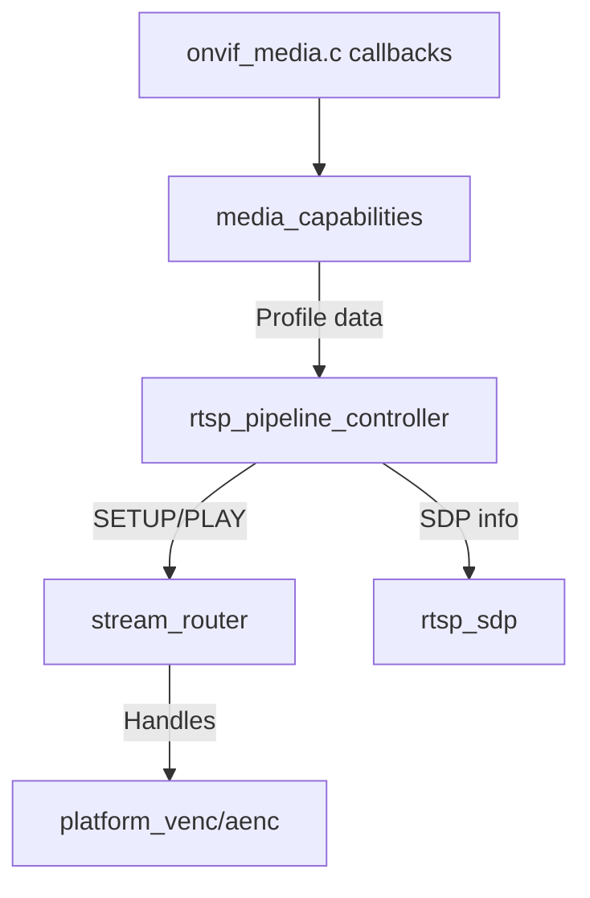

# Design Document

## Overview

We will complete the ONVIF media pipeline by tightening the relationship between the existing Media service (`src/services/media/onvif_media.c`), the RTSP stack under `src/networking/rtsp/`, and the Anyka hardware adapters (`src/platform`). The solution keeps the current dual-profile model (main/sub) but enriches it with Profile S/T compliant capability data, SDP output that mirrors Anyka's reference firmware, and deterministic transport handling (rejecting RTPS/RTSPS). A shared stream router will sit on top of the already implemented `platform_venc_*`/`platform_aenc_*` primitives so RTSP and future web streaming consume the same encoder feeds without spawning redundant encode jobs or software transcoders.

## Steering Document Alignment

### Technical Standards (tech.md)
- Keep the pure-C implementation, GNU Make build, gSOAP, and Anyka SDK usage; no TLS/SSL dependencies will be introduced, reflecting the requirement to reject RTPS/RTSPS.
- Drive all configuration via the `core/config` APIs (already used across services) so behaviour matches documented ONVIF 2.5 standards.
- Reuse the Anyka platform abstraction (`platform_anyka.c`) for encoder lifecycle control, ensuring portability across AK3918-based boards as mandated by the tech steering doc.

### Project Structure (structure.md)
- Extend existing modules instead of replacing them: augment `onvif_media.c`, `rtsp_session.c`, `rtsp_sdp.c`, `rtsp_rtp.c`, and `rtsp_multistream.c` with new helpers that stay within their current file responsibilities.
- Add a focused adapter in `src/platform/adapters/anyka_stream_bindings.c` (single responsibility: binding VI/VENC handles to stream profiles) and a reusable helper in `src/utils/stream/stream_router.c` (manages consumers) to stay aligned with the structure guide.
- Follow the documented include order and naming conventions; new headers will live under `src/services/media/` or `src/utils/stream/` with `onvif_`/`stream_` prefixes as required.

## Code Reuse Analysis

### Existing Components to Leverage
- **`onvif_media.c` profile cache** (`g_media_profiles`, `onvif_media_get_profiles`) already exposes two profiles; we will keep this structure but add:
  - Dynamic population of resolution/bitrate/frame rate by querying `platform_vi_get_sensor_resolution` and configuration values instead of hard-coded defaults.
  - A new helper `media_apply_profile_overrides()` that updates the existing `struct media_profile` entries before returning them to gSOAP handlers.
- **`rtsp_session` and `rtsp_multistream`** currently accept TCP/UDP transport but do not enforce capability-driven policies. We will:
  - Extend `rtsp_session_set_timeout` and `rtsp_update_session_activity` to honour Media-provided timeout values.
  - Reuse `rtsp_multistream_start_stream()` to start RTP threads, but guard it with the new stream router to ensure encoder handles are reused.
- **`rtsp_sdp.c`** already builds a minimal SDP. We will reuse `sdp_add_media`, `sdp_set_media_fmtp`, and inject Anyka-style fmtp strings (from reference `mini_rtsp.c`) via new helper `rtsp_sdp_populate_video_profile()`.
- **`platform_anyka.c`** provides `platform_venc_request_stream`, `platform_venc_get_frame`, `platform_venc_cleanup`, and active-count tracking (`g_encoder_active_count`). The stream router will wrap these APIs, preserving their locking semantics.
- **Mocks in `tests/src/mocks/`** (e.g., `platform_mock.c`, `network_mock.c`) already simulate platform behaviour and will be extended to cover encoder reuse scenarios without rewriting the mock infrastructure.

### Integration Points
- **Media SOAP entry points** (`__tev__GetProfiles`, etc.) already call `service_dispatcher` callbacks; we will update the Media callback implementations to call the new `media_capabilities_*` helpers before constructing responses with `smart_response_builder`.
- **RTSP request dispatcher** (likely in `rtsp_server.c`) will invoke the new `rtsp_pipeline_handle_transport()` when processing SETUP. This function will reuse the existing parser (`rtsp_parse_transport_header`) and respond with `RTSP_UNSUPPORTED_TRANSPORT` when encountering RTPS/RTSPS.
- **Anyka reference firmware** (`platform/libapp/src/onvif/mini_rtsp.c`) demonstrates how to share encoder buffers between connections. We will map these patterns onto our router so we can compare behaviour during integration tests.

## Architecture

The enhanced media pipeline reuses existing modules but adds clearer boundaries:
1. **Capability Layer (Media service)** reads configuration/hardware data and populates `struct media_profile` + transport descriptors.
2. **Transport Layer (RTSP)** consumes the capability data to validate DESCRIBE/SETUP requests, populate SDP, and manage sessions.
3. **Stream Routing Layer (Platform adapters + utils)** keeps a single encoder instance per profile and hands out read-only handles to multiple consumers.

### Modular Design Principles
- **Single File Responsibility**: `onvif_media.c` remains the Media service entry point; capability-specific logic is extracted into `onvif_media_capabilities.c`. RTSP code continues to live in its current directory, and encoder sharing logic is isolated in a stream router module.
- **Component Isolation**: The stream router exposes a narrow API (`acquire`, `release`, `stats`); RTSP code never interacts with raw platform handles directly.
- **Service Layer Separation**: SOAP/gSOAP interactions stay in Media service files; RTSP modules keep managing RTSP verbs and RTP I/O.
- **Utility Modularity**: Shared stream re-use logic lives in `src/utils/stream/` for future reuse by the web UI streamer.



## Components and Interfaces

### Media Capability Enhancements (`onvif_media_capabilities.c`)
- **Purpose:** Replace hard-coded media profiles with runtime-derived values and expose transport metadata used by both Media responses and RTSP sessions.
- **Implementation Plan:**
  - Hook into `onvif_media_get_profiles` and `onvif_media_get_profile` to call `media_capabilities_refresh()` before returning data.
  - Add `media_capabilities_get_transport(const char* token, struct media_transport_info* out)` that builds URIs using existing `network_utils_get_ip_address()` and `onvif_constants` path templates.
  - Reuse `core/config/config_get_media_profile()` (if present; otherwise extend config) to read bitrate/GOP/audio enablement per profile.

### RTSP Pipeline Controller (`rtsp_pipeline_controller.c`)
- **Purpose:** Provide glue between Media capability data and RTSP sessions without rewriting the RTSP server.
- **Implementation Plan:**
  - Add `rtsp_pipeline_prepare_session()` which calls into `stream_router_acquire()` and initializes `rtsp_session_t` fields (client ports, timeout) based on `media_transport_info`.
  - Inject this controller inside existing `rtsp_handle_setup()` (or equivalent) in `rtsp_server.c`, replacing ad-hoc logic that currently constructs RTP ports manually.
  - Extend `rtsp_handle_describe()` to call `media_capabilities_get_transport()` and then populate SDP via new helper `rtsp_sdp_apply_capabilities()`.

### Stream Router (`utils/stream/stream_router.c`)
- **Purpose:** Track references to encoder feeds so any consumer reuses hardware handles.
- **Implementation Plan:**
  - Maintain an internal table indexed by profile token (reusing tokens from `g_media_profiles`).
  - On first `stream_router_acquire()`, call `platform_venc_request_stream()` / `platform_aenc_request_stream()`; on subsequent calls, bump a reference counter and return existing handles.
  - Ensure thread safety using `pthread_mutex_t` with the same initialization macros used elsewhere (see `utils/network/network_utils.c` for patterns).
  - Hook into `rtsp_pipeline_on_disconnect()` to invoke `stream_router_release()`; if refcount hits zero, call `platform_venc_cancel_stream()` / `platform_venc_cleanup()`.

## Data Models

### `struct media_transport_info`
```
struct media_transport_info {
  char protocol[MEDIA_PROTOCOL_BUFFER_SIZE];
  int rtp_transport;        // RTP_TRANSPORT_UDP or RTP_TRANSPORT_TCP
  bool multicast_supported; // pulled from config + Anyka capability
  bool secure_supported;    // always false; used to raise ONVIF errors
  uint16_t rtp_port;
  uint16_t rtcp_port;
  char uri[RTSP_MAX_URI_LEN];
  int timeout_seconds;      // derived from config or default 60
};
```

### `struct stream_router_handle`
```
struct stream_router_handle {
  const char* profile_token;
  platform_venc_handle_t video_handle;
  platform_aenc_handle_t audio_handle;
  uint32_t consumer_id;
  bool audio_enabled;
};
```

## Error Handling

### Error Scenario 1: Unsupported Transport Request
- **Description:** Client sends SETUP requesting `RTP/SAVP`, `RTP/AVP/TCP/TLS`, or RTPS.
- **Handling:** `rtsp_pipeline_handle_transport()` checks `media_transport_info.secure_supported` and returns `RTSP_UNSUPPORTED_TRANSPORT`. Media callback surfaces `ONVIF_ERROR_UNSUPPORTED` using existing error constants.
- **User Impact:** Client receives a standards-compliant error; supported UDP/TCP transports continue operating.

### Error Scenario 2: Encoder Handle Exhaustion
- **Description:** `stream_router_acquire()` cannot obtain encoder handles (hardware fault or exceeding `g_encoder_active_count`).
- **Handling:** Return `STREAM_ROUTER_ERROR_RESOURCE`; RTSP controller responds with `RTSP_SERVICE_UNAVAILABLE`, Media service logs error via `service_logging`, and watchdog metrics are updated using `platform_venc_log_error_context()`.
- **User Impact:** Client sees a clean failure and can retry; system avoids deadlocks or leaking encoder resources.

## Testing Strategy

### Unit Testing
- Expand `tests/src/unit/services/media/test_onvif_media_callbacks.c` to validate capability refresh and URI generation (use `network_mock.c` + new config fixtures).
- Add `tests/src/unit/networking/rtsp/test_rtsp_pipeline_controller.c` with mocked `stream_router` and `rtsp_session` objects to verify rejection of RTPS/RTSPS and timeout propagation.
- Extend `tests/src/unit/utils/stream/` with tests for refcounting and handle reuse (mock `platform_venc_request_stream` provided by `platform_mock.c`).

### Integration Testing
- Update SD-card hack scripts to script DESCRIBE/SETUP/PLAY using `ffmpeg`/`gst-rtsp-client` captures, verifying SDP includes both video and audio (when enabled) and that simultaneous main/sub streams do not duplicate encoder initialisation (confirm by parsing logs for `platform_venc_init`).
- Capture RTP output and compare sequence timing against Anyka reference firmware to ensure jitter/latency stay within requirements.

### End-to-End Testing
- Run ONVIF Profile S/T conformance test harness focusing on Media service calls (`GetProfiles`, `GetVideoEncoderConfigurationOptions`, `GetStreamUri`) and RTSP behaviour under concurrent load.
- Simulate network drop/reconnect via iptables in integration tests to ensure `rtsp_pipeline_on_disconnect()` releases handles and allows clean re-PLAY without restarting `onvifd`.
