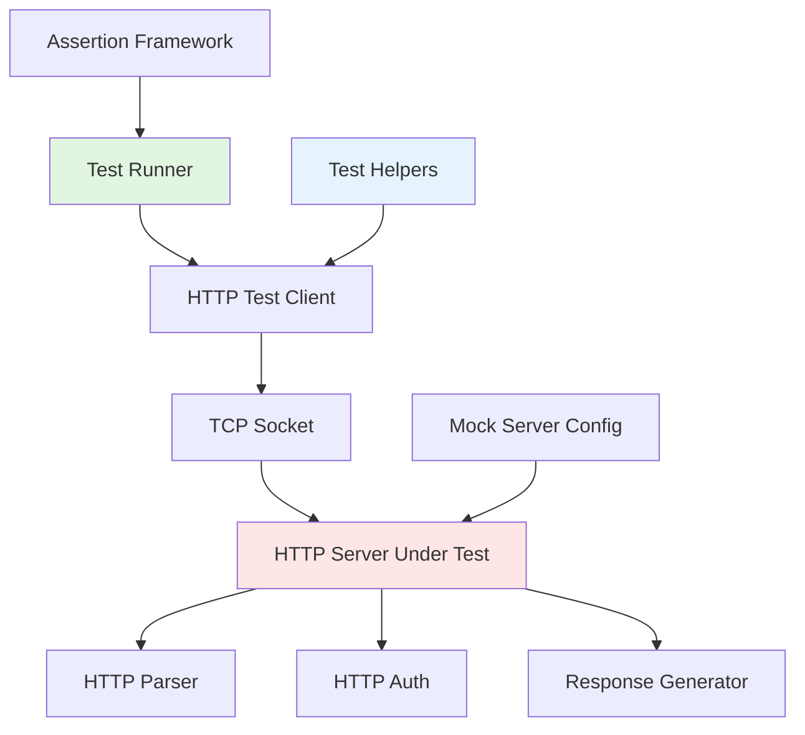

# Design Document

## Overview

This design specifies a comprehensive integration testing framework for HTTP/1.1 compliance based on RFC 9112 and ONVIF Core Specification requirements. The framework will be implemented in C using the existing CMocka-based test infrastructure and will validate the HTTP server implementation in [src/networking/http/](cross-compile/onvif/src/networking/http/).

The testing framework integrates with the existing test system at [cross-compile/onvif/tests/](cross-compile/onvif/tests/) and follows the established patterns for integration tests. It provides comprehensive coverage of HTTP protocol compliance, security validation, and ONVIF-specific requirements.

## Steering Document Alignment

### Technical Standards (tech.md)

The design follows the project's technical standards:

- **Language**: C (embedded systems programming) with CMocka testing framework
- **Build System**: GNU Make with native compilation for tests
- **Code Quality**: Mandatory linting, formatting, and unit testing
- **Test Framework**: CMocka for unit and integration testing with mocking support
- **Code Organization**: Modular design with single responsibility per file
- **Naming Conventions**:
  - Test naming: `test_integration_http_<feature>_<scenario>` for integration tests
  - Global variables: `g_http_compliance_<variable_name>` format
  - Return codes: Predefined constants (NEVER magic numbers)

### Project Structure (structure.md)

The implementation follows project organization conventions:

```
cross-compile/onvif/tests/
├── src/
│   ├── integration/
│   │   └── http_compliance/          # NEW: HTTP compliance integration tests
│   │       ├── test_http_message_format.c      # Message format validation
│   │       ├── test_http_methods.c             # Method support testing
│   │       ├── test_http_headers.c             # Header validation
│   │       ├── test_http_transfer_encoding.c   # Chunked encoding
│   │       ├── test_http_auth.c                # Authentication testing
│   │       ├── test_http_status_codes.c        # Status code compliance
│   │       ├── test_http_request_target.c      # Request-target formats
│   │       ├── test_http_connection.c          # Connection management
│   │       ├── test_http_content_type.c        # Content-Type validation
│   │       └── test_http_error_security.c      # Error response security
│   ├── common/
│   │   ├── http_test_helpers.c       # NEW: HTTP-specific test utilities
│   │   └── http_test_helpers.h       # NEW: HTTP test helper declarations
│   └── runner/
│       └── test_http_compliance_runner.c # NEW: HTTP compliance test runner
├── Makefile                          # UPDATED: Add HTTP compliance targets
└── README.md                         # UPDATED: Document HTTP compliance tests
```

**File Organization**:
- One test file per HTTP compliance requirement category
- Reuse existing test infrastructure in `src/common/`
- Follow integration test patterns established in existing tests

## Code Reuse Analysis

### Existing Components to Leverage

1. **HTTP Server Implementation** ([src/networking/http/http_server.c](cross-compile/onvif/src/networking/http/http_server.c))
   - Target of compliance testing
   - Provides `http_server_start()`, `http_server_stop()`, `process_connection()`

2. **HTTP Parser** ([src/networking/http/http_parser.c](cross-compile/onvif/src/networking/http/http_parser.c))
   - Core parsing logic being tested
   - Functions: `parse_http_request_state_machine()`, `parse_http_request_line()`, `parse_http_headers()`
   - Types: `http_request_t`, `http_response_t`, `http_header_t`

3. **HTTP Authentication** ([src/networking/http/http_auth.c](cross-compile/onvif/src/networking/http/http_auth.c))
   - Digest authentication implementation
   - Already has unit tests at [tests/src/unit/networking/test_http_auth.c](cross-compile/onvif/tests/src/unit/networking/test_http_auth.c)

4. **Test Helpers** ([tests/src/common/test_helpers.c](cross-compile/onvif/tests/src/common/test_helpers.c))
   - `test_helper_http_create_request()` - Create test HTTP requests
   - `test_helper_http_create_response()` - Create test HTTP responses
   - `test_helper_http_build_basic_auth_header()` - Build auth headers
   - `test_helper_http_init_auth_config()` - Initialize auth config

5. **Generic Mock Framework** ([tests/src/common/generic_mock_framework.c](cross-compile/onvif/tests/src/common/generic_mock_framework.c))
   - Reusable mocking infrastructure for test isolation

6. **Existing HTTP Tests**:
   - `test_http_auth.c` - Authentication unit tests (patterns to follow)
   - `test_http_metrics_simple.c` - Metrics testing patterns

### Integration Points

1. **HTTP Server** - Tests will interact with the running HTTP server via TCP sockets
2. **Test Runner System** - Integration with existing modular test runners
3. **Build System** - Makefile integration for test compilation and execution
4. **Coverage Analysis** - Integration with lcov/gcov for coverage reporting

## Architecture

The HTTP compliance testing framework uses a **client-server integration testing** approach:



### Modular Design Principles

- **Single File Responsibility**: Each test file tests one specific HTTP compliance category
- **Component Isolation**: HTTP server runs in isolated test environment with controlled configuration
- **Service Layer Separation**:
  - Test client layer (sends HTTP requests)
  - Server layer (processes requests)
  - Validation layer (asserts compliance)
- **Utility Modularity**: HTTP test helpers are focused, single-purpose modules

### Testing Strategy

**Integration Test Approach**:
1. Start HTTP server in test mode with controlled configuration
2. Create test HTTP client that sends raw HTTP requests via TCP
3. Validate server responses against RFC 9112 and ONVIF requirements
4. Use CMocka assertions for validation
5. Clean up server and resources after each test

**Key Design Decisions**:
- **Integration tests** (not unit tests) because we're testing the complete HTTP protocol flow
- **Raw socket communication** to test actual HTTP protocol compliance
- **Isolated server instances** for each test category to prevent interference
- **Reuse existing test infrastructure** to minimize code duplication

## Components and Interfaces

### Component 1: HTTP Test Client (`http_test_helpers.c/h`)

- **Purpose**: Provides utilities for sending raw HTTP requests and validating responses
- **Interfaces**:
  ```c
  // Create raw HTTP request string
  int http_test_create_raw_request(const char* method, const char* uri,
                                    const char* version, http_header_t* headers,
                                    int header_count, const char* body,
                                    char* buffer, size_t buffer_size);

  // Send HTTP request via TCP socket
  int http_test_send_request(const char* host, int port, const char* request,
                             char* response, size_t response_size);

  // Parse HTTP response
  int http_test_parse_response(const char* response, int* status_code,
                               http_header_t* headers, int* header_count,
                               char** body);

  // Validate HTTP response format
  int http_test_validate_response_format(const char* response);

  // Assert HTTP status code
  void http_test_assert_status_code(int actual, int expected, const char* description);

  // Assert HTTP header present
  void http_test_assert_header_present(http_header_t* headers, int header_count,
                                       const char* header_name);

  // Get header value
  const char* http_test_get_header_value(http_header_t* headers, int header_count,
                                         const char* header_name);
  ```
- **Dependencies**:
  - `networking/http/http_parser.h` - HTTP types
  - `src/common/test_helpers.h` - Base test utilities
  - POSIX sockets - Network communication
- **Reuses**: Existing `http_request_t` and `http_response_t` types from parser

### Component 2: HTTP Message Format Tests (`test_http_message_format.c`)

- **Purpose**: Validate RFC 9112 message format compliance
- **Interfaces**: CMocka test functions following `test_integration_http_<feature>_<scenario>` pattern
  ```c
  void test_integration_http_message_format_valid_request(void** state);
  void test_integration_http_message_format_crlf_line_endings(void** state);
  void test_integration_http_message_format_lf_only_accepted(void** state);
  void test_integration_http_message_format_invalid_header_whitespace(void** state);
  void test_integration_http_message_format_invalid_syntax(void** state);
  ```
- **Dependencies**: HTTP test client, HTTP server
- **Reuses**: `test_helper_http_create_request()` patterns

### Component 3: HTTP Method Tests (`test_http_methods.c`)

- **Purpose**: Validate ONVIF method support (POST, GET only)
- **Interfaces**:
  ```c
  void test_integration_http_methods_post_allowed(void** state);
  void test_integration_http_methods_get_allowed(void** state);
  void test_integration_http_methods_put_rejected(void** state);
  void test_integration_http_methods_delete_rejected(void** state);
  void test_integration_http_methods_405_includes_allow_header(void** state);
  ```
- **Dependencies**: HTTP test client
- **Reuses**: Existing HTTP request creation utilities

### Component 4: HTTP Header Tests (`test_http_headers.c`)

- **Purpose**: Validate Host header and other header requirements
- **Interfaces**:
  ```c
  void test_integration_http_headers_host_required(void** state);
  void test_integration_http_headers_multiple_host_rejected(void** state);
  void test_integration_http_headers_host_validation(void** state);
  void test_integration_http_headers_invalid_host_rejected(void** state);
  ```
- **Dependencies**: HTTP test client
- **Reuses**: Header parsing utilities from `http_parser.h`

### Component 5: Transfer Encoding Tests (`test_http_transfer_encoding.c`)

- **Purpose**: Validate chunked transfer encoding support
- **Interfaces**:
  ```c
  void test_integration_http_transfer_chunked_basic(void** state);
  void test_integration_http_transfer_chunked_multiple_chunks(void** state);
  void test_integration_http_transfer_chunked_with_trailers(void** state);
  void test_integration_http_transfer_multiple_encodings_rejected(void** state);
  void test_integration_http_transfer_unknown_encoding_501(void** state);
  void test_integration_http_transfer_chunked_not_final_rejected(void** state);
  ```
- **Dependencies**: HTTP test client with chunked encoding support
- **Reuses**: Existing transfer encoding parsing logic

### Component 6: HTTP Authentication Tests (`test_http_auth.c`)

- **Purpose**: Validate digest authentication as required by ONVIF
- **Interfaces**:
  ```c
  void test_integration_http_auth_401_without_credentials(void** state);
  void test_integration_http_auth_digest_challenge_format(void** state);
  void test_integration_http_auth_valid_credentials_accepted(void** state);
  void test_integration_http_auth_invalid_credentials_rejected(void** state);
  void test_integration_http_auth_digest_parameters(void** state);
  ```
- **Dependencies**: HTTP test client, HTTP auth module
- **Reuses**: `test_helper_http_build_basic_auth_header()` patterns, extend for digest

### Component 7: Status Code Tests (`test_http_status_codes.c`)

- **Purpose**: Validate ONVIF-required status code compliance
- **Interfaces**:
  ```c
  void test_integration_http_status_200_success(void** state);
  void test_integration_http_status_400_malformed_request(void** state);
  void test_integration_http_status_401_unauthorized(void** state);
  void test_integration_http_status_405_method_not_allowed(void** state);
  void test_integration_http_status_415_unsupported_media_type(void** state);
  void test_integration_http_status_500_internal_error(void** state);
  ```
- **Dependencies**: HTTP test client
- **Reuses**: Response parsing utilities

### Component 8: Request-Target Tests (`test_http_request_target.c`)

- **Purpose**: Validate request-target format support
- **Interfaces**:
  ```c
  void test_integration_http_request_target_origin_form(void** state);
  void test_integration_http_request_target_absolute_form(void** state);
  void test_integration_http_request_target_asterisk_form(void** state);
  void test_integration_http_request_target_invalid_rejected(void** state);
  ```
- **Dependencies**: HTTP test client
- **Reuses**: Request parsing utilities

### Component 9: Connection Management Tests (`test_http_connection.c`)

- **Purpose**: Validate HTTP/1.1 connection handling
- **Interfaces**:
  ```c
  void test_integration_http_connection_keep_alive(void** state);
  void test_integration_http_connection_close(void** state);
  void test_integration_http_connection_persistent_default(void** state);
  void test_integration_http_connection_timeout(void** state);
  void test_integration_http_connection_graceful_close(void** state);
  ```
- **Dependencies**: HTTP test client with connection state tracking
- **Reuses**: Server connection management logic

### Component 10: Content-Type Tests (`test_http_content_type.c`)

- **Purpose**: Validate SOAP Content-Type requirements
- **Interfaces**:
  ```c
  void test_integration_http_content_type_soap_xml_accepted(void** state);
  void test_integration_http_content_type_text_xml_accepted(void** state);
  void test_integration_http_content_type_unsupported_rejected(void** state);
  void test_integration_http_content_type_missing_rejected(void** state);
  ```
- **Dependencies**: HTTP test client
- **Reuses**: Content-Type parsing utilities

### Component 11: Error Security Tests (`test_http_error_security.c`)

- **Purpose**: Validate secure error handling
- **Interfaces**:
  ```c
  void test_integration_http_error_no_internal_details(void** state);
  void test_integration_http_error_no_stack_traces(void** state);
  void test_integration_http_error_no_file_paths(void** state);
  void test_integration_http_error_minimal_information(void** state);
  ```
- **Dependencies**: HTTP test client, error response parsing
- **Reuses**: Response validation utilities

### Component 12: Test Runner (`test_http_compliance_runner.c`)

- **Purpose**: Execute all HTTP compliance tests and report results
- **Interfaces**:
  ```c
  int main(void);  // Standard CMocka test runner
  ```
- **Dependencies**: All test components
- **Reuses**: Existing test runner patterns from `test_integration_runner.c`

## Data Models

### HTTP Test Request Structure
```c
typedef struct {
    char method[16];              // HTTP method (GET, POST, etc.)
    char uri[256];                // Request URI
    char version[16];             // HTTP version (HTTP/1.1)
    http_header_t headers[32];    // Request headers
    int header_count;             // Number of headers
    char* body;                   // Request body (optional)
    size_t body_length;           // Body length
    int use_chunked;              // Use chunked encoding flag
} http_test_request_t;
```

### HTTP Test Response Structure
```c
typedef struct {
    int status_code;              // HTTP status code
    char status_text[64];         // Status text
    http_header_t headers[32];    // Response headers
    int header_count;             // Number of headers
    char* body;                   // Response body
    size_t body_length;           // Body length
    double response_time_ms;      // Response time measurement
} http_test_response_t;
```

### HTTP Test Configuration
```c
typedef struct {
    char server_host[256];        // Test server hostname
    int server_port;              // Test server port
    int timeout_ms;               // Request timeout
    int enable_auth;              // Enable authentication flag
    char auth_username[64];       // Authentication username
    char auth_password[64];       // Authentication password
} http_test_config_t;
```

## Error Handling

### Error Scenarios

1. **Server Startup Failure**
   - **Handling**: Skip tests with appropriate message, fail test suite
   - **User Impact**: Clear error message indicating server could not start

2. **Network Connection Failure**
   - **Handling**: Retry with exponential backoff, fail after max attempts
   - **User Impact**: Test marked as failed with network error details

3. **Invalid HTTP Response**
   - **Handling**: Parse error captured, test assertion failure with details
   - **User Impact**: Clear indication of protocol violation

4. **Timeout Waiting for Response**
   - **Handling**: Test fails with timeout error after configured duration
   - **User Impact**: Timeout error with request details for debugging

5. **Resource Allocation Failure**
   - **Handling**: Clean up partial allocations, fail test gracefully
   - **User Impact**: Clear error message about resource constraints

6. **Server Crash During Test**
   - **Handling**: Detect crash, collect core dump if available, fail test
   - **User Impact**: Server crash reported with debugging information

## Testing Strategy

### Unit Testing

**NOT APPLICABLE** - This spec creates integration tests, not unit tests. Unit tests for HTTP components already exist at:
- `tests/src/unit/networking/test_http_auth.c`
- `tests/src/unit/networking/test_http_metrics_simple.c`

### Integration Testing

**PRIMARY FOCUS** - Integration tests will validate HTTP protocol compliance:

1. **Test Organization**:
   - One test file per requirement category (10 files total)
   - Each file contains 4-6 test functions covering different scenarios
   - Test naming: `test_integration_http_<category>_<scenario>`

2. **Test Execution**:
   - Server started in isolated process for each test suite
   - Test client connects via TCP socket
   - Raw HTTP requests sent, responses validated
   - Server stopped and cleaned up after test suite

3. **Key Flows to Test**:
   - Valid request → 200 OK response flow
   - Invalid request → appropriate error code flow
   - Authentication challenge → credentials → success flow
   - Chunked encoding → proper parsing flow
   - Connection management → keep-alive/close flow

4. **Test Data**:
   - Pre-defined valid/invalid HTTP requests
   - Expected response patterns for assertions
   - Edge cases (empty body, large headers, etc.)

5. **Assertion Strategy**:
   - Status code validation
   - Header presence and value validation
   - Response format compliance validation
   - Error message security validation

### End-to-End Testing

**COMPLEMENTARY** - E2E tests in `e2e/` directory will complement integration tests:
- Integration tests focus on HTTP protocol compliance
- E2E tests focus on ONVIF service functionality
- Both test suites should pass for full compliance

### Coverage Goals

- **Code Coverage**: >90% of HTTP server and parser code
- **Requirement Coverage**: 100% of requirements from requirements.md
- **RFC Coverage**: All relevant RFC 9112 sections for ONVIF compliance
- **ONVIF Coverage**: All HTTP-related ONVIF Core Specification requirements

### Test Execution Workflow

```bash
# Run all HTTP compliance tests
make test-http-compliance

# Run specific test category
make test-http-compliance-methods
make test-http-compliance-auth
make test-http-compliance-chunked

# Run with coverage analysis
make test-http-compliance-coverage

# Generate coverage report
make test-http-compliance-coverage-html
```

### Performance Requirements

- **Test Suite Execution**: Complete in <60 seconds
- **Individual Test**: Complete in <5 seconds
- **Server Startup**: <2 seconds
- **Request Timeout**: 10 seconds default
- **Memory Usage**: <100MB for entire test suite
