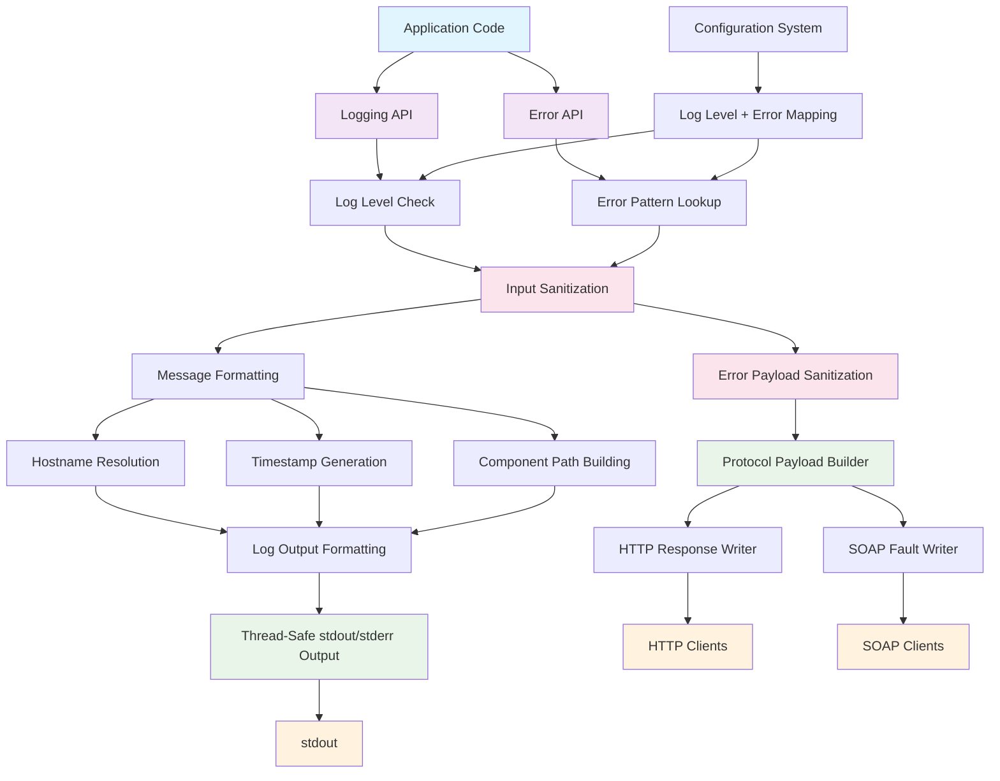

# Design Document

## Overview

The diagnostics modernization program will replace four fragmented logging implementations and numerous bespoke error helpers with a single, function-based API stack that provides consistent, debuggable, and performance-optimized logging and error handling for the entire ONVIF project. The design focuses on simplicity, reliability, and embedded systems optimization while maintaining the standardized log format: `YYYY-MM-DD HH:MM:SS,mmm LEVEL [HOSTNAME] component.path.identifier Message text` and delivering protocol-compliant error responses.

The system will be implemented as a standalone utility module suite that integrates seamlessly with the existing configuration system and provides thread-safe logging operations, structured error propagation, and correlation metadata with minimal overhead.

## Steering Document Alignment

### Technical Standards (tech.md)

**Language Compliance**: The implementation follows C99 standards with GCC cross-compiler compatibility for ARM architecture (Anyka AK3918 SoC).

**Dependency Management**: The unified diagnostics system has minimal dependencies, using only standard C libraries (`stdio.h`, `time.h`, `pthread.h`) and the existing configuration and error code definitions, maintaining the project's lightweight embedded systems philosophy.

**Performance Requirements**: The design ensures sub-second response times by implementing early return optimization for disabled log levels, using fixed memory buffers to avoid dynamic allocation overhead, and precomputing protocol mappings so error propagation requires no heap allocations.

**Security Standards**: The implementation includes comprehensive input validation, format string attack prevention, buffer overflow protection, and error-payload sanitization, maintaining the project's "Security First" principle.

### Project Structure (structure.md)

**Utility Organization**: The logging system will be placed in `src/utils/logging/` and the error handling system in `src/utils/error/` following the established utility module pattern, with clear separation between header interfaces and implementations.

**Naming Conventions**: All functions follow the `log_<level>()` and `error_<action>()` patterns, global variables use `g_log_<name>` or `g_error_<name>` formats, and types use `log_<type>_t` or `error_<type>_t` suffixes, consistent with project standards.

**Include Patterns**: The implementation follows the mandatory include order: system headers, third-party libraries, project headers, ensuring consistent and predictable compilation.

**Documentation**: All functions include comprehensive Doxygen documentation with `@brief`, `@param`, and `@return` tags, supporting the project's documentation standards.

## Code Reuse Analysis

### Existing Components to Leverage

- **Configuration System** (`src/core/config/config.h`): The existing `struct logging_settings` provides the foundation for logging configuration, which will be extended to support the unified system's log level and hostname settings.

- **Platform Utilities** (`src/platform/platform.h`): Platform-specific functions for hostname retrieval and system information will be leveraged for the hostname component of log messages.

- **String Utilities** (`src/utils/string/string_shims.h`): Existing safe string manipulation functions will be used for log message formatting and hostname handling to prevent buffer overflows.

- **Memory Management** (`src/utils/memory/memory_manager.h`): The existing memory management utilities will be used for any temporary buffer allocation, ensuring consistent memory handling patterns.
- **Error Code Catalog** (`src/utils/error/error_codes.h` / `error_handling.h`): Existing enumerations and constants supply canonical error identifiers that the unified API will expose without duplicating definitions.

### Integration Points

- **Configuration Loading** (`src/core/lifecycle/config_lifecycle.c`): The logging system will integrate with the existing configuration loading process, reading log level settings during system initialization.

- **Application Config Structure**: The `struct application_config` will be extended with logging configuration, replacing the existing fragmented logging settings.

- **Error Handling System** (`src/utils/error/error_handling.h`): The logging pipeline and new error management layer will converge here, replacing ad-hoc helpers with consolidated context, mapping, and escalation logic.

- **Thread Safety**: Integration with existing pthread mutex patterns used throughout the codebase for consistent thread-safe operations.

## Architecture

The logging system follows a layered architecture with clear separation of concerns:

1. **Logging API Layer**: Simple function-based interface for all logging operations
2. **Error API Layer**: Context builders, pattern registry, and protocol translation helpers that return structured `error_result_t` objects
3. **Formatting & Correlation Layer**: Standardized message formatting with timestamp, hostname, correlation identifiers, and component identification shared by logs and errors
4. **Security & Sanitization Layer**: Normalizes user-supplied data and enforces injection-prevention rules before formatting or emitting protocol payloads
5. **Output & Response Layer**: Thread-safe stdout output with buffering optimization plus HTTP/SOAP response writers that reuse sanitized buffers
6. **Configuration Layer**: Integration with existing configuration management for log levels, hostname cache, and error mapping overrides

### Modular Design Principles

- **Single File Responsibility**: `logging.c` handles all logging functionality, `logging.h` provides the public API, `error_manager.c` orchestrates error contexts and mappings, and `error_protocol.c` handles HTTP/SOAP marshalling.
- **Component Isolation**: The diagnostics system exposes independent logging and error entry points while sharing internal helpers through private headers, ensuring components can adopt one or both capabilities without circular dependencies.
- **Service Layer Separation**: Clear separation between the public APIs, internal formatting logic, error pattern registry, and transport/output handling keeps responsibilities testable and maintainable.
- **Utility Modularity**: Focused single-purpose modules (`logging_*`, `error_*`, `logging_sanitizer`) provide well-defined services to the entire application.



## Components and Interfaces

### Logging Core
- **Purpose:** Provides the main logging API and coordinates all logging operations
- **Interfaces:**
  - `log_error(const char* format, ...)` - Error level logging
  - `log_warning(const char* format, ...)` - Warning level logging
  - `log_info(const char* format, ...)` - Info level logging
  - `log_debug(const char* format, ...)` - Debug level logging
- **Dependencies:** Configuration system, platform utilities for hostname
- **Reuses:** Existing string utilities, memory management patterns

### Contextual Logging Component
- **Purpose:** Provides context-aware logging with service and operation identification
- **Interfaces:**
  - `log_error_ctx(const log_context_t* ctx, const char* format, ...)` - Contextual error logging
  - `log_info_ctx(const log_context_t* ctx, const char* format, ...)` - Contextual info logging
  - `log_context_create(const char* component, const char* operation)` - Context creation with correlation identifier assignment
  - `log_context_destroy(log_context_t* ctx)` - Context cleanup
- **Dependencies:** Memory management utilities
- **Reuses:** Existing memory allocation patterns, string handling utilities

### Error Handling Core
- **Purpose:** Supplies unified error context management, pattern lookup, and structured error construction that replaces legacy helpers.
- **Interfaces:**
  - `error_context_init(error_context_t* ctx, const char* service, const char* action, const char* request_id)` - Populate service context and bind a correlation identifier
  - `error_result_from_pattern(error_pattern_t pattern, const char* custom_message, error_result_t* out)` - Build reusable error descriptors from canonical patterns
  - `error_record_emit(const error_context_t* ctx, const error_result_t* result, log_level_t severity)` - Emit correlated log entries and update metrics counters
  - `error_register_pattern(const error_pattern_descriptor_t* descriptor)` - Optional hook for extending mappings during platform bring-up
- **Dependencies:** Logging API for correlation, configuration system for pattern table overrides, ONVIF constants for standardized codes
- **Reuses:** Existing error patterns, `http_parser` status definitions, gSOAP fault representations

### Protocol Response Adapter
- **Purpose:** Translate structured error results into HTTP responses and SOAP faults while reusing sanitized buffers.
- **Interfaces:**
  - `error_write_http_response(const error_context_t* ctx, const error_result_t* result, http_response_t* response)`
  - `error_write_soap_fault(const error_context_t* ctx, const error_result_t* result, struct soap* soap)`
  - `error_select_http_status(error_pattern_t pattern)` - Lookup helper used by both public functions
- **Dependencies:** gSOAP runtime, HTTP response structures, sanitization helpers shared with logging
- **Reuses:** `onvif_gsoap_generate_fault_response`, unified sanitization pipeline, existing HTTP status constants

### Diagnostics Metrics Layer
- **Purpose:** Maintain lightweight counters for error categories and expose hooks for future telemetry exporters.
- **Interfaces:**
  - `error_metrics_increment(error_pattern_t pattern)`
  - `error_metrics_snapshot(error_metrics_t* out)`
- **Dependencies:** Atomic integer utilities or mutex-protected counters reused from existing telemetry code
- **Reuses:** Logging correlation identifiers for label values, configuration defaults for throttling behaviour

### Configuration Integration Component
- **Purpose:** Manages logging configuration and provides runtime settings
- **Interfaces:**
  - `log_config_init(void)` - Initialize logging from application config
  - `log_config_cleanup(void)` - Cleanup logging resources
  - `log_is_level_enabled(log_level_t level)` - Check if level is enabled
- **Dependencies:** Configuration system (`struct logging_settings`)
- **Reuses:** Existing configuration loading patterns, lifecycle management

### Format Engine Component
- **Purpose:** Generates standardized log message format with all required components
- **Interfaces:**
  - `format_log_message(log_level_t level, const char* hostname, const char* component_path, const char* message)` - Internal formatting
  - `get_timestamp_string(char* buffer, size_t size)` - ISO timestamp generation
  - `get_hostname_string(char* buffer, size_t size)` - System hostname retrieval
- **Dependencies:** System time functions, platform hostname utilities
- **Reuses:** Existing timestamp utilities from platform_logging, string manipulation utilities

## Data Models

### Log Context Structure
```c
typedef struct {
    char component[32];    // Component name (e.g., "onvif.device", "platform.video")
    char operation[32];    // Operation name (e.g., "get_capabilities", "init")
    char session_id[16];   // Optional session identifier for request tracing
} log_context_t;
```

### Log Level Enumeration
```c
typedef enum {
    LOG_LEVEL_TRACE = 0,   // Most verbose debugging information
    LOG_LEVEL_DEBUG = 1,   // Debug information for development
    LOG_LEVEL_INFO = 2,    // General informational messages
    LOG_LEVEL_NOTICE = 3,  // Significant but normal events
    LOG_LEVEL_WARNING = 4, // Warning conditions that should be noted
    LOG_LEVEL_ERROR = 5,   // Error conditions that need attention
    LOG_LEVEL_FATAL = 6    // Fatal errors that may cause system failure
} log_level_t;
```

### Configuration Structure
```c
typedef struct {
    log_level_t min_level;     // Minimum log level to output
    bool enable_timestamps;    // Include timestamps in output (always true)
    bool enable_hostname;      // Include hostname in output (always true)
    char hostname[64];         // Cached system hostname
    pthread_mutex_t mutex;     // Thread safety mutex
} log_config_t;
```

### Error Context Structure
```c
typedef struct {
    const char* service_name;      // ONVIF service identifier
    const char* action_name;       // Specific action or RPC name
    const char* request_id;        // Optional request/correlation identifier
    log_level_t log_level;         // Suggested log severity for the error
    char correlation_id[16];       // Generated identifier shared with logging
} error_context_t;
```

### Error Result Structure
```c
typedef struct {
    error_pattern_t pattern;       // Canonical error pattern
    int error_code;                // Stable numeric identifier (ONVIF_*)
    const char* user_message;      // Sanitized message to expose to clients
    const char* developer_hint;    // Optional guidance for maintainers
    const char* soap_fault_code;   // ONVIF-compliant fault code value
    const char* soap_fault_string; // Fault string for SOAP payloads
    http_status_t http_status;     // Selected HTTP status code
} error_result_t;
```

### Error Metrics Snapshot
```c
typedef struct {
    uint32_t counters[ERROR_PATTERN_MAX]; // Per-pattern counters for diagnostics
    uint64_t last_updated_ms;             // Timestamp of last update
} error_metrics_t;
```

## Security and Sanitization Strategy

The unified logger enforces defensive sanitization before formatting to satisfy the Security First principle and Requirement 7:

- **Maximum Message Length**: Log payloads are truncated to 1024 bytes (including terminator). When truncation occurs, a suffix "..." is appended and a single warning is emitted per context to avoid log floods.
- **Control Character Filtering**: Characters below ASCII 0x20 (except `\t`) and 0x7F are replaced with a space. Embedded `\n` and `\r` are normalized to spaces to prevent multi-line injection.
- **Format String Safety**: All public APIs accept `const char *format` and route through bounded `vsnprintf` helpers that reject `%n` specifiers and enforce explicit length caps.
- **Sensitive Token Redaction**: Key/value pairs with case-insensitive keys such as `password`, `passwd`, `token`, `secret`, or `apikey` are rewritten to `***` before emission. This helper is reusable by ONVIF services when constructing context payloads.
- **UTF-8 Validation**: Invalid byte sequences are replaced with `?` to keep downstream tooling stable.

The sanitization logic resides in `src/utils/logging/logging_sanitizer.c` with a companion header to keep responsibilities isolated and testable. The error protocol adapter reuses these helpers before emitting HTTP or SOAP payloads, guaranteeing the same protections described above.

## Configuration Behavior

Requirement 6 mandates simple configuration semantics. The design adopts the following policies:

- **Read-Only Runtime Configuration**: Log level and hostname cache are loaded during startup from `logging_settings` and stored in `log_config_t`. Updating levels requires a process restart; no runtime setters are exposed.
- **Stdout-Only Transport**: All log records are written to stdout. If stdout becomes unavailable, output falls back to stderr and a single `LOG_ERROR` is emitted indicating degraded mode.
- **Static Defaults**: When configuration data is missing, defaults of `LOG_LEVEL_INFO`, hostname `UNKNOWN-HOST`, and timestamps enabled are applied.
- **Configuration Validation**: Invalid log levels are clamped to the nearest supported value and a warning is logged once per boot cycle.
- **Error Mapping Overrides**: Optional configuration entries allow operators to override HTTP status codes or fault detail templates for specific error patterns while preserving default sanitization rules.
- **Correlation Prefix Configuration**: The prefix used when generating correlation identifiers is configurable to support multi-device deployments and avoid identifier collisions.


## Error Handling

### Error Scenarios

1. **Configuration Loading Failure**
   - **Handling:** Use default log level (INFO), continue with degraded functionality
   - **User Impact:** Logging works with default settings, no service interruption

2. **Hostname Resolution Failure**
   - **Handling:** Use fallback hostname "UNKNOWN-HOST", log warning about hostname failure
   - **User Impact:** Logs show fallback hostname, functionality continues normally

3. **Output Failure (stdout unavailable)**
   - **Handling:** Attempt stderr output as fallback, no exceptions thrown
   - **User Impact:** Logs may appear on stderr instead of stdout, no application crash

4. **Memory Allocation Failure for Context**
   - **Handling:** Return NULL from context creation, graceful degradation to non-contextual logging
   - **User Impact:** Logs lack context information but continue to work

5. **Thread Mutex Lock Failure**
   - **Handling:** Attempt a bounded retry (three spins). If locking still fails, drop the log entry, increment a diagnostic counter, and emit a throttled `LOG_ERROR` once per minute indicating contention.
   - **User Impact:** Individual log lines may be skipped under extreme contention, but output remains well-formed and the application stays stable.

6. **Format String Vulnerabilities**
   - **Handling:** Input validation and sanitization, limited format specifier support
   - **User Impact:** Safe logging operation, potential sanitization of malicious input

7. **Error Pattern Lookup Failure**
   - **Handling:** Fallback to `ERROR_PATTERN_INTERNAL_ERROR`, emit correlated fatal log, and attach developer hint instructing maintainers to register the new pattern.
   - **User Impact:** Client receives a generic internal error response while diagnostics clearly indicate the missing pattern.

8. **SOAP Fault Generation Failure**
   - **Handling:** Retry fault generation with a temporary gSOAP context; if it still fails, return HTTP 500 with minimal XML payload while logging the root cause and correlation identifier.
   - **User Impact:** Client receives a standards-compliant fallback fault, and debugging information remains available via logs.

9. **Metrics Counter Overflow**
   - **Handling:** Saturate counters at `UINT32_MAX` and emit a throttled warning instructing operators to reset metrics during maintenance windows.
   - **User Impact:** Observability remains intact; counter overflow does not crash the system but signals maintenance action.

## Testing Strategy

### Unit Testing

**Core Function Testing:**
- Test all log level functions (`log_error`, `log_info`, etc.) with various message formats
- Verify log level filtering works correctly (disabled levels produce no output)
- Test context creation, usage, and cleanup operations
- Validate timestamp and hostname formatting functions
- Validate `error_context_init`, `error_result_from_pattern`, and `error_record_emit` flows for every canonical pattern
- Ensure protocol adapters generate correct HTTP status codes and SOAP faults per Requirement 12
- Confirm metrics counters increment and snapshot correctly without race conditions

**Error Condition Testing:**
- Test behavior with NULL parameters, invalid format strings
- Test configuration loading with missing/corrupt config files
- Test thread safety with concurrent logging operations
- Test memory allocation failures and recovery
- Exercise fallback behaviours when pattern descriptors are missing or malformed
- Force gSOAP invocation failures to verify HTTP fallback responses

### Integration Testing

**Configuration Integration:**
- Test loading logging configuration from application config files
- Verify integration with existing config lifecycle management
- Test configuration changes and their effects on logging behavior

**System Integration:**
- Test logging from all major components (ONVIF services, platform layer, utilities)
- Verify contextual logging works correctly across service boundaries
- Test logging under system load with video streaming and ONVIF operations
- Validate that services convert legacy error helpers to unified calls and still return expected SOAP faults
- Confirm correlation identifiers appear in both logs and HTTP/SOAP responses for representative workflows

**Thread Safety Testing:**
- Test concurrent logging from multiple threads (HTTP server, RTSP server, main daemon)
- Verify no race conditions or deadlocks under heavy concurrent load
- Test logging performance impact on real-time video operations

### End-to-End Testing

**Log Format Validation:**
- Verify all log messages follow the exact required format: `YYYY-MM-DD HH:MM:SS,mmm LEVEL [HOSTNAME] component.path.identifier Message text`
- Test log parsing with standard Unix tools (grep, awk, sed)
- Validate timestamp accuracy and hostname resolution

**Migration Testing:**
- Test complete migration from existing logging systems
- Verify no legacy logging calls remain in codebase
- Test that all previous log information is preserved with new format
- Ensure migration tooling updates legacy error handling patterns and reports unresolved sites accurately

**Performance Testing:**
- Measure logging overhead impact on camera operations
- Verify disabled log levels have zero performance cost
- Test memory usage remains within 32KB limit under load

**Production Scenario Testing:**
- Test logging during camera startup, operation, and shutdown
- Verify logs provide sufficient information for troubleshooting
- Test log volume and stdout handling under continuous operation
- Validate end-to-end behaviour for critical error scenarios (authentication failure, media service misconfiguration, storage faults) on hardware, ensuring both logs and client-facing errors align.
