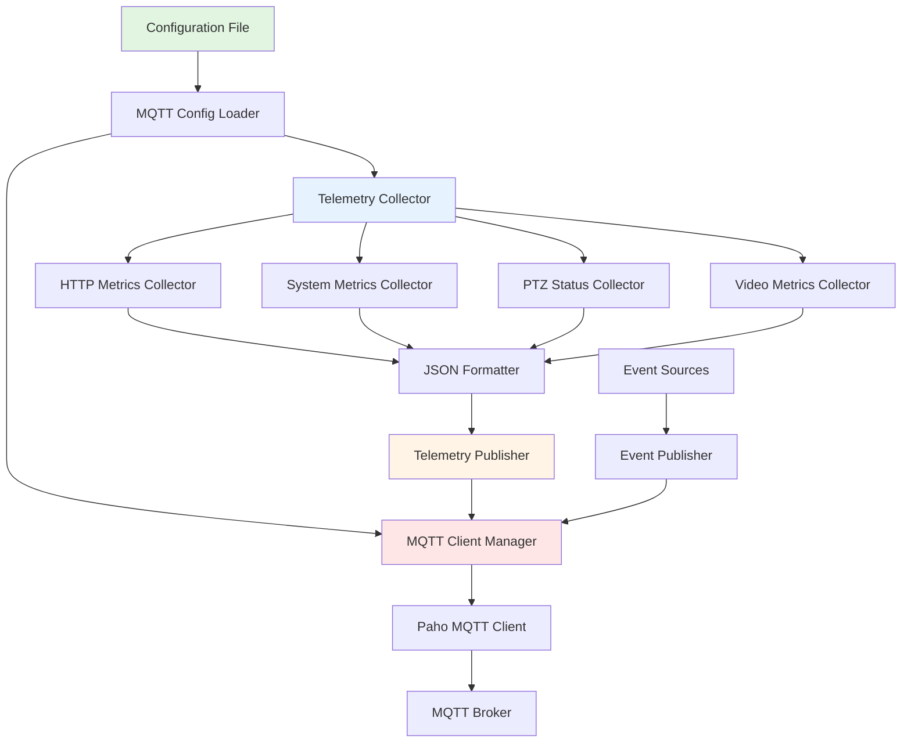

# Design Document

## Overview

This design specifies an MQTT (Message Queuing Telemetry Transport) integration for real-time telemetry transmission from the Anyka AK3918 IP camera firmware. The implementation uses Eclipse Paho Embedded C client library for minimal resource footprint and integrates with existing HTTP performance metrics, system monitoring, and camera status infrastructure.

The MQTT telemetry system follows a modular architecture with clean separation between telemetry collection, data formatting, and MQTT publishing. It leverages existing utilities (buffer pools, thread management, configuration) while adding new components for MQTT client management, JSON serialization, and periodic publishing.

## Steering Document Alignment

### Technical Standards (tech.md)

The design follows the project's technical standards:

- **Language**: C (embedded systems programming) with POSIX threading
- **Build System**: GNU Make with ARM cross-compilation toolchain
- **Code Quality**: Mandatory linting, formatting, and unit testing
- **Code Organization**: Modular design with single responsibility per file
- **Naming Conventions**:
  - Functions: `mqtt_<module>_<action>` (e.g., `mqtt_client_connect`, `mqtt_telemetry_publish`)
  - Global variables: `g_mqtt_<module>_<variable_name>` format
  - Return codes: Predefined constants (`MQTT_SUCCESS`, `MQTT_ERROR_CONNECTION`, etc.)
- **Libraries**: Eclipse Paho Embedded C (paho.mqtt.embedded-c) for minimal footprint

### Project Structure (structure.md)

The implementation follows project organization conventions:

```
cross-compile/onvif/
├── src/
│   ├── telemetry/                    # NEW: Telemetry subsystem
│   │   ├── mqtt_client.c/h           # MQTT client wrapper
│   │   ├── mqtt_config.c/h           # MQTT configuration management
│   │   ├── telemetry_collector.c/h   # Telemetry data collection
│   │   ├── telemetry_publisher.c/h   # Telemetry publishing orchestration
│   │   └── json_formatter.c/h        # JSON payload formatting
│   ├── networking/http/              # EXISTING: HTTP metrics source
│   ├── platform/                     # EXISTING: System metrics source
│   ├── services/ptz/                 # EXISTING: PTZ status source
│   └── utils/
│       ├── memory/                   # EXISTING: Buffer pool to reuse
│       ├── logging/                  # EXISTING: Logging utilities
│       └── config/                   # EXISTING: Configuration parsing
├── lib/
│   └── libpaho-embed-mqtt3c.a        # NEW: Paho Embedded C library
├── include/
│   └── paho/                         # NEW: Paho headers (MQTTClient.h, etc.)
└── configs/
    └── mqtt_telemetry.ini            # NEW: MQTT configuration file
```

**File Organization**:
- `src/telemetry/` - New directory for all MQTT telemetry code
- Reuse existing utilities from `utils/` subdirectories
- Configuration file in `configs/` directory

## Code Reuse Analysis

### Existing Components to Leverage

1. **HTTP Performance Metrics** ([src/networking/http/http_server.h](cross-compile/onvif/src/networking/http/http_server.h))
   - `http_performance_metrics_t` structure with request counts, latency, errors
   - `http_metrics_get_current()` - Retrieve current HTTP metrics
   - Used as primary data source for HTTP telemetry

2. **Thread Pool** ([src/networking/common/thread_pool.h](cross-compile/onvif/src/networking/common/thread_pool.h))
   - Existing thread management infrastructure
   - Can be used for background telemetry publishing thread

3. **Buffer Pool** ([src/networking/common/buffer_pool.h](cross-compile/onvif/src/networking/common/buffer_pool.h))
   - Memory-efficient buffer allocation
   - Reuse for MQTT message buffers

4. **Configuration Utilities** ([src/core/config/](cross-compile/onvif/src/core/config/))
   - INI file parsing infrastructure
   - Extend for MQTT configuration

5. **Logging Utilities** ([src/utils/logging/](cross-compile/onvif/src/utils/logging/))
   - Existing logging framework
   - Use for MQTT connection status and errors

6. **Memory Manager** ([src/utils/memory/memory_manager.h](cross-compile/onvif/src/utils/memory/memory_manager.h))
   - Safe memory allocation with tracking
   - Use for all MQTT-related allocations

7. **PTZ Status** ([src/services/ptz/onvif_ptz.h](cross-compile/onvif/src/services/ptz/onvif_ptz.h))
   - `ptz_status` structure with position and movement state
   - `onvif_ptz_get_status()` - Retrieve current PTZ status
   - Used as data source for PTZ telemetry

8. **Platform Abstraction** ([src/platform/platform.h](cross-compile/onvif/src/platform/platform.h))
   - System metrics (CPU, memory, temperature)
   - `platform_irled_get_status()` - IR LED status
   - Used as data source for system/camera telemetry

### Integration Points

- **HTTP Server**: Periodically query HTTP metrics for telemetry
- **PTZ Service**: Query PTZ status on movement and periodically
- **Platform Layer**: Query system metrics for telemetry
- **Configuration System**: Load MQTT settings from INI file
- **Logging System**: Log MQTT connection events and errors

### Required Implementations in Existing Codebase

The following components need to be implemented or enhanced in the existing ONVIF codebase to support telemetry:

1. **Platform System Info Implementation** ([src/platform/platform_anyka.c](cross-compile/onvif/src/platform/platform_anyka.c))
   - **Function**: `platform_get_system_info()` - Already declared in platform.h but needs implementation
   - **Purpose**: Collect CPU usage, memory usage, temperature, uptime from /proc filesystem
   - **Implementation**: Read `/proc/stat`, `/proc/meminfo`, `/proc/uptime`, temperature sensor
   - **Returns**: `platform_system_info_t` structure with all system metrics

2. **Video/RTSP Metrics API** ([src/networking/rtsp/](cross-compile/onvif/src/networking/rtsp/))
   - **Function**: `rtsp_get_active_session_count()` - Needs to be added
   - **Function**: `rtsp_get_current_bitrate()` - Needs to be added
   - **Function**: `rtsp_get_current_fps()` - Needs to be added
   - **Purpose**: Provide video streaming metrics for telemetry
   - **Note**: If not implementable, can stub with zeros initially

3. **Configuration File Updates** ([configs/anyka_cfg.ini](cross-compile/onvif/configs/anyka_cfg.ini))
   - **Section**: `[telemetry]` - Add new section for telemetry enable/disable
   - **Section**: `[mqtt]` - Add new section for MQTT broker configuration
   - **Section**: `[telemetry_intervals]` - Add section for publishing intervals
   - **Purpose**: Centralized configuration for all telemetry settings

4. **Main Application Integration** ([src/main.c](cross-compile/onvif/src/main.c) or equivalent)
   - **Integration**: Initialize telemetry subsystem on startup (if enabled)
   - **Integration**: Cleanup telemetry subsystem on shutdown
   - **Purpose**: Lifecycle management of telemetry system

## Architecture

The MQTT telemetry system uses a **publisher-collector** architecture with periodic background publishing:



### Modular Design Principles

- **Single File Responsibility**: Each file handles one specific telemetry concern
- **Component Isolation**: MQTT client, collectors, formatters, publishers are independent
- **Central Telemetry Coordinator**: `telemetry_collector.c` is the SINGLE source of truth for all telemetry data
  - Acts as central gathering point for ALL metrics (HTTP, system, PTZ, video, camera)
  - Provides unified API for telemetry access
  - Handles enable/disable logic centrally based on configuration
  - Coordinates collection from all subsystems (HTTP server, platform layer, PTZ service, video encoder)
- **Service Layer Separation**:
  - Data collection layer (collectors) - **CENTRAL COORDINATOR**
  - Formatting layer (JSON serializer)
  - Publishing layer (MQTT publisher)
  - Transport layer (MQTT client wrapper)
- **Utility Modularity**: Reuse existing buffer pool, logging, configuration utilities

### Threading Model

**Main Thread**: Configuration loading, initialization, cleanup

**Background Telemetry Thread**:
- Periodic timer-based collection and publishing
- Runs at lowest priority to avoid impacting camera operations
- Sleeps between publishing intervals

**Event Thread** (optional):
- Immediate publishing of critical events
- Higher priority than periodic telemetry

## Components and Interfaces

### Component 1: MQTT Client Manager (`mqtt_client.c/h`)

- **Purpose**: Wrapper around Paho Embedded C client for connection management
- **Interfaces**:
  ```c
  // Connection management
  int mqtt_client_init(const mqtt_config_t* config);
  int mqtt_client_connect(void);
  int mqtt_client_disconnect(void);
  void mqtt_client_cleanup(void);

  // Publishing
  int mqtt_client_publish(const char* topic, const char* payload,
                          int payload_len, int qos, int retained);

  // Status
  int mqtt_client_is_connected(void);
  const char* mqtt_client_get_connection_error(void);
  ```
- **Dependencies**: Paho MQTT Embedded C library, pthread, socket API
- **Reuses**: Logging utilities for connection status

### Component 2: MQTT Configuration (`mqtt_config.c/h`)

- **Purpose**: Load and manage MQTT configuration from INI file
- **Interfaces**:
  ```c
  typedef struct {
      int telemetry_enabled;        // Global telemetry enable/disable
      int mqtt_enabled;             // MQTT connection enable/disable
      char broker_host[256];
      int broker_port;
      char client_id[64];
      char username[64];
      char password[64];
      char topic_prefix[128];
      int keep_alive_interval;
      int system_metrics_interval;  // Seconds
      int http_metrics_interval;
      int ptz_status_interval;
      int video_metrics_interval;
      int qos_telemetry;            // Default QoS for telemetry
      int qos_events;               // Default QoS for events
  } mqtt_config_t;

  int mqtt_config_load(const char* config_file, mqtt_config_t* config);
  void mqtt_config_free(mqtt_config_t* config);
  int mqtt_config_validate(const mqtt_config_t* config);
  ```
- **Dependencies**: Configuration utilities, string utilities
- **Reuses**: Existing INI parsing utilities from `utils/config/`

### Component 3: Telemetry Collector (`telemetry_collector.c/h`) - **CENTRAL TELEMETRY COORDINATOR**

- **Purpose**: **SINGLE CENTRAL POINT** for all telemetry data collection in the application
  - Coordinates data gathering from ALL subsystems (HTTP, platform, PTZ, video, camera)
  - Enforces enable/disable logic based on configuration
  - Provides unified telemetry API to rest of application
  - Acts as abstraction layer between data sources and consumers
- **Interfaces**:
  ```c
  typedef struct {
      char device_id[64];
      uint64_t timestamp_ms;
      // HTTP metrics
      uint64_t http_total_requests;
      uint64_t http_successful_requests;
      uint64_t http_client_errors;
      uint64_t http_server_errors;
      double http_avg_latency_ms;
      // System metrics
      float cpu_usage_percent;
      float memory_usage_percent;
      uint64_t uptime_seconds;
      // PTZ status
      float ptz_pan;
      float ptz_tilt;
      float ptz_zoom;
      int ptz_moving;
      // Video metrics
      int video_active_sessions;
      uint64_t video_bitrate_kbps;
      float video_frame_rate;
      // Camera status
      int ir_led_status;
      int temperature;
  } telemetry_data_t;

  int telemetry_collector_init(void);
  int telemetry_collector_get_http_metrics(telemetry_data_t* data);
  int telemetry_collector_get_system_metrics(telemetry_data_t* data);
  int telemetry_collector_get_ptz_status(telemetry_data_t* data);
  int telemetry_collector_get_video_metrics(telemetry_data_t* data);
  int telemetry_collector_get_camera_status(telemetry_data_t* data);
  void telemetry_collector_cleanup(void);
  ```
- **Dependencies**: HTTP server, platform layer, PTZ service
- **Reuses**: HTTP metrics, platform APIs, PTZ APIs

### Component 4: JSON Formatter (`json_formatter.c/h`)

- **Purpose**: Format telemetry data as JSON for MQTT publishing
- **Interfaces**:
  ```c
  int json_format_http_metrics(const telemetry_data_t* data,
                                char* buffer, size_t buffer_size);
  int json_format_system_metrics(const telemetry_data_t* data,
                                  char* buffer, size_t buffer_size);
  int json_format_ptz_status(const telemetry_data_t* data,
                              char* buffer, size_t buffer_size);
  int json_format_video_metrics(const telemetry_data_t* data,
                                 char* buffer, size_t buffer_size);
  int json_format_event(const char* event_type, const char* event_data,
                        char* buffer, size_t buffer_size);
  ```
- **Dependencies**: String utilities, snprintf
- **Reuses**: Safe string formatting utilities

**Note**: For simplicity, use manual JSON generation with snprintf rather than adding a JSON library dependency. This keeps the footprint minimal.

### Component 5: Telemetry Publisher (`telemetry_publisher.c/h`)

- **Purpose**: Orchestrate periodic telemetry collection and publishing
- **Interfaces**:
  ```c
  int telemetry_publisher_init(const mqtt_config_t* config);
  int telemetry_publisher_start(void);
  int telemetry_publisher_stop(void);
  void telemetry_publisher_cleanup(void);

  // Event publishing (immediate, not periodic)
  int telemetry_publisher_publish_event(const char* event_type,
                                        const char* event_data);
  ```
- **Dependencies**: Telemetry collector, JSON formatter, MQTT client
- **Reuses**: Thread utilities for background publishing thread

### Component 6: Event Publisher (part of `telemetry_publisher.c`)

- **Purpose**: Publish immediate event notifications
- **Interfaces**: (Integrated into telemetry_publisher)
  ```c
  // Called by other modules when events occur
  int mqtt_event_motion_detected(void);
  int mqtt_event_auth_failure(const char* username);
  int mqtt_event_ptz_complete(void);
  int mqtt_event_stream_started(const char* profile);
  int mqtt_event_stream_stopped(const char* profile);
  int mqtt_event_system_error(const char* error_msg);
  ```
- **Dependencies**: MQTT client, JSON formatter
- **Reuses**: Existing event sources throughout codebase

### Component 7: HTTP Telemetry API (`telemetry_http_handler.c/h`)

- **Purpose**: Provide HTTP endpoint for on-demand telemetry retrieval
- **HTTP Endpoints**:
  - `GET /api/telemetry/all` - Get all telemetry data as JSON
  - `GET /api/telemetry/system` - Get system metrics only
  - `GET /api/telemetry/http` - Get HTTP metrics only
  - `GET /api/telemetry/ptz` - Get PTZ status only
  - `GET /api/telemetry/video` - Get video metrics only
  - `GET /api/telemetry/camera` - Get camera status only
- **Interfaces**:
  ```c
  // Initialize HTTP telemetry endpoint handler
  int telemetry_http_handler_init(void);

  // HTTP request handler for telemetry endpoints
  int telemetry_http_handle_request(const http_request_t* request,
                                     http_response_t** response);

  // Cleanup HTTP telemetry handler
  void telemetry_http_handler_cleanup(void);
  ```
- **Response Format**: JSON with HTTP 200 OK on success, 500 on error
  ```json
  {
    "device_id": "camera_001",
    "timestamp_ms": 1234567890,
    "telemetry": {
      "system": { /* system metrics */ },
      "http": { /* http metrics */ },
      "ptz": { /* ptz status */ },
      "video": { /* video metrics */ },
      "camera": { /* camera status */ }
    }
  }
  ```
- **Dependencies**: Telemetry collector, JSON formatter, HTTP server
- **Reuses**: HTTP request handling infrastructure, JSON formatting functions
- **Security**: No authentication required (same network access as ONVIF)
- **Use Cases**:
  - Manual telemetry inspection via web browser or curl
  - Integration with monitoring dashboards
  - Debugging telemetry collection without MQTT broker

## Data Models

### MQTT Configuration Structure
```c
typedef struct {
    int telemetry_enabled;          // Global telemetry enable (default: 0)
    int mqtt_enabled;               // MQTT connection enable (default: 0)
    char broker_host[256];          // MQTT broker hostname
    int broker_port;                // MQTT broker port (default: 1883)
    char client_id[64];             // MQTT client ID
    char username[64];              // Broker authentication username
    char password[64];              // Broker authentication password
    char topic_prefix[128];         // Topic prefix (default: "camera")
    int keep_alive_interval;        // Keep-alive interval in seconds (default: 60)
    int system_metrics_interval;    // System metrics publishing interval (default: 30)
    int http_metrics_interval;      // HTTP metrics publishing interval (default: 60)
    int ptz_status_interval;        // PTZ status publishing interval (default: 10)
    int video_metrics_interval;     // Video metrics publishing interval (default: 30)
    int qos_telemetry;              // QoS for telemetry (default: 1)
    int qos_events;                 // QoS for events (default: 1)
} mqtt_config_t;
```

### Telemetry Data Structure
```c
typedef struct {
    char device_id[64];             // Camera device ID
    uint64_t timestamp_ms;          // UTC timestamp in milliseconds

    // HTTP server metrics
    uint64_t http_total_requests;
    uint64_t http_successful_requests;
    uint64_t http_client_errors;
    uint64_t http_server_errors;
    uint64_t http_total_response_bytes;
    double http_avg_latency_ms;
    double http_min_latency_ms;
    double http_max_latency_ms;
    int http_current_connections;

    // System metrics
    float cpu_usage_percent;
    float memory_usage_percent;
    uint64_t uptime_seconds;

    // PTZ status
    float ptz_pan;
    float ptz_tilt;
    float ptz_zoom;
    int ptz_moving;

    // Video streaming metrics
    int video_active_sessions;
    uint64_t video_bitrate_kbps;
    float video_frame_rate;

    // Camera status
    int ir_led_status;
    int temperature;
} telemetry_data_t;
```

### JSON Payload Examples

**HTTP Metrics** (`camera/{device_id}/telemetry/http`):
```json
{
  "device_id": "camera-001",
  "timestamp": 1704067200000,
  "total_requests": 12345,
  "successful_requests": 12000,
  "client_errors": 300,
  "server_errors": 45,
  "avg_latency_ms": 25.5,
  "current_connections": 5
}
```

**System Metrics** (`camera/{device_id}/telemetry/system`):
```json
{
  "device_id": "camera-001",
  "timestamp": 1704067200000,
  "cpu_usage_percent": 45.2,
  "memory_usage_percent": 62.8,
  "uptime_seconds": 86400
}
```

**PTZ Status** (`camera/{device_id}/telemetry/ptz`):
```json
{
  "device_id": "camera-001",
  "timestamp": 1704067200000,
  "pan": 45.5,
  "tilt": -10.2,
  "zoom": 2.5,
  "moving": false
}
```

**Event** (`camera/{device_id}/events/motion`):
```json
{
  "device_id": "camera-001",
  "timestamp": 1704067200000,
  "event_type": "motion",
  "event_data": "Motion detected in zone 1"
}
```

## Error Handling

### Error Scenarios

1. **MQTT Broker Unreachable**
   - **Handling**: Retry connection with exponential backoff (1s, 2s, 4s, 8s, max 60s)
   - **User Impact**: Telemetry collection continues, messages buffered (max 100), logged as warning

2. **Broker Authentication Failure**
   - **Handling**: Log error, disable MQTT publishing, do not retry automatically
   - **User Impact**: Clear error logged, telemetry collection continues if enabled

3. **Message Publishing Failure (QoS 1)**
   - **Handling**: Paho client handles retry automatically, exponential backoff
   - **User Impact**: Transparent to application, message eventually delivered or dropped after timeout

4. **JSON Formatting Buffer Overflow**
   - **Handling**: Truncate data, log warning, publish truncated payload
   - **User Impact**: Partial telemetry data published, warning logged

5. **Telemetry Collection Failure (e.g., HTTP metrics unavailable)**
   - **Handling**: Skip that metric type for this interval, log debug message
   - **User Impact**: Missing metric in telemetry payload, continues next interval

6. **Configuration File Missing or Invalid**
   - **Handling**: Use defaults (telemetry_enabled=false, mqtt_enabled=false), log error
   - **User Impact**: MQTT disabled by default, requires valid config to enable

## Testing Strategy

### Unit Testing

- **MQTT Configuration Parser**: Test INI file parsing, validation, defaults
- **JSON Formatter**: Test JSON generation for all telemetry types, edge cases
- **Telemetry Collector**: Test data collection from mocked sources
- **MQTT Client Wrapper**: Test connection, publishing with mocked Paho client

**Test files**:
- `tests/src/unit/telemetry/test_mqtt_config.c`
- `tests/src/unit/telemetry/test_json_formatter.c`
- `tests/src/unit/telemetry/test_telemetry_collector.c`
- `tests/src/unit/telemetry/test_mqtt_client.c`

### Integration Testing

- **End-to-End MQTT Publishing**: Connect to local Mosquitto broker, verify messages published
- **Telemetry Collection**: Verify real HTTP/system/PTZ metrics collected correctly
- **Event Publishing**: Trigger events, verify immediate publishing
- **Connection Resilience**: Test disconnect/reconnect, exponential backoff
- **Configuration Loading**: Test various config scenarios (disabled, partial, full)

**Test files**:
- `tests/src/integration/telemetry/test_mqtt_publishing.c`
- `tests/src/integration/telemetry/test_mqtt_resilience.c`

### End-to-End Testing

- **Manual Testing**: Subscribe to MQTT topics using mosquitto_sub, verify payloads
- **Load Testing**: Verify resource usage <1MB memory, <5% CPU under load
- **Long-Running Test**: Run for 24+ hours, verify stability and no memory leaks

## Library Selection and Integration

### Eclipse Paho Embedded C

**Selected Library**: `paho.mqtt.embedded-c`
- Repository: https://github.com/eclipse-paho/paho.mqtt.embedded-c
- License: Eclipse Public License / Eclipse Distribution License (permissive)
- Footprint: ~30KB code size
- Dependencies: None (pure C with platform abstraction)

**Advantages**:
- Designed specifically for embedded systems
- No external dependencies (networking, threading abstracted)
- Very small footprint (<100KB with all features)
- Platform abstraction layer for easy porting
- Well-maintained Eclipse project

**Integration Steps**:
1. Clone paho.mqtt.embedded-c repository
2. Copy `MQTTClient-C` source to `cross-compile/onvif/lib/paho/`
3. Implement Linux platform layer (`MQTTLinux.c` provided)
4. Cross-compile with ARM toolchain
5. Link static library `libpaho-embed-mqtt3c.a` to onvifd binary

**Build Integration**:
```makefile
# Paho MQTT library
PAHO_DIR = lib/paho
PAHO_INCLUDES = -I$(PAHO_DIR)/MQTTPacket/src -I$(PAHO_DIR)/MQTTClient-C/src
PAHO_LIBS = -L$(PAHO_DIR) -lpaho-embed-mqtt3c

# Add to main build
INCLUDES += $(PAHO_INCLUDES)
LIBS += $(PAHO_LIBS)
```

## Configuration File Format

**File**: `configs/mqtt_telemetry.ini`

```ini
[telemetry]
enabled = false                     # Global telemetry enable/disable (default: false)

[mqtt]
enabled = false                     # MQTT connection enable/disable (default: false)
broker_host = localhost             # MQTT broker hostname/IP
broker_port = 1883                  # MQTT broker port (default: 1883)
client_id = anyka-camera-001        # MQTT client ID (default: camera-{mac_address})
username =                          # Broker username (empty = no auth)
password =                          # Broker password (empty = no auth)
topic_prefix = camera               # Topic prefix (default: "camera")
keep_alive = 60                     # Keep-alive interval in seconds (default: 60)

[qos]
telemetry = 1                       # QoS for telemetry data (0, 1, or 2; default: 1)
events = 1                          # QoS for events (0, 1, or 2; default: 1)

[intervals]
system_metrics = 30                 # System metrics interval in seconds (0 = disabled)
http_metrics = 60                   # HTTP metrics interval in seconds (0 = disabled)
ptz_status = 10                     # PTZ status interval in seconds (0 = disabled)
video_metrics = 30                  # Video metrics interval in seconds (0 = disabled)

[device]
device_id =                         # Device ID (empty = auto-generate from MAC/serial)
```

## Performance Considerations

### Memory Footprint

- **Paho Embedded C Library**: ~30KB code, ~10KB data
- **MQTT Client Manager**: ~5KB code, ~2KB data
- **Telemetry Collector**: ~10KB code, ~5KB data
- **JSON Formatter**: ~5KB code
- **Telemetry Publisher**: ~5KB code, ~2KB data
- **Buffers**: JSON buffer (4KB), message queue (100 messages * 1KB = 100KB worst case)
- **Total Estimate**: ~150KB code, ~120KB data = **~270KB < 1MB requirement** ✓

### CPU Usage

- **Periodic Publishing**: Short bursts every 10-60 seconds (collect + format + publish)
- **Background Thread**: Sleeps between intervals, lowest priority
- **Expected Usage**: <1% average, <10% peak during publishing
- **Target**: <5% average ✓

### Network Bandwidth

- **HTTP Metrics**: ~500 bytes JSON, every 60s = 8 bytes/sec
- **System Metrics**: ~300 bytes JSON, every 30s = 10 bytes/sec
- **PTZ Status**: ~200 bytes JSON, every 10s = 20 bytes/sec
- **Video Metrics**: ~300 bytes JSON, every 30s = 10 bytes/sec
- **Events**: ~200 bytes, occasional (< 1/sec average)
- **Total Average**: ~50 bytes/sec = **~0.4 KB/sec << 10KB/sec requirement** ✓

### Latency

- **Connection**: <5 seconds to broker on startup
- **Publishing (QoS 0)**: <100ms (fire and forget)
- **Publishing (QoS 1)**: <500ms (acknowledgment required)
- **Event Publishing**: Immediate (< 1 second from trigger to publish)

## Security Considerations

### Authentication

- **Username/Password**: Stored in plaintext INI file (acceptable per requirements)
- **File Permissions**: Configuration file should be readable only by camera process user

### Data Privacy

- **No Sensitive Data**: Passwords, keys, certificates excluded from all telemetry payloads
- **IP Address Handling**: Optional anonymization/exclusion configuration (future enhancement)

### Network Security

- **TCP Only**: No TLS support (per requirements)
- **Broker Trust**: Assumes trusted network environment
- **Cleartext Communication**: All MQTT traffic unencrypted

## Implementation Phases

### Phase 1: Foundation (Tasks 1-5)
- MQTT configuration loading
- Paho library integration and cross-compilation
- MQTT client wrapper implementation
- Basic connection management

### Phase 2: Telemetry Collection (Tasks 6-10)
- Telemetry collector implementation
- HTTP metrics collection
- System metrics collection
- PTZ status collection
- JSON formatter implementation

### Phase 3: Publishing (Tasks 11-15)
- Telemetry publisher orchestration
- Periodic publishing thread
- Event publishing hooks
- Integration with existing services

### Phase 4: Testing and Validation (Tasks 16-20)
- Unit tests for all components
- Integration tests with Mosquitto broker
- Resource usage validation
- Long-running stability tests
