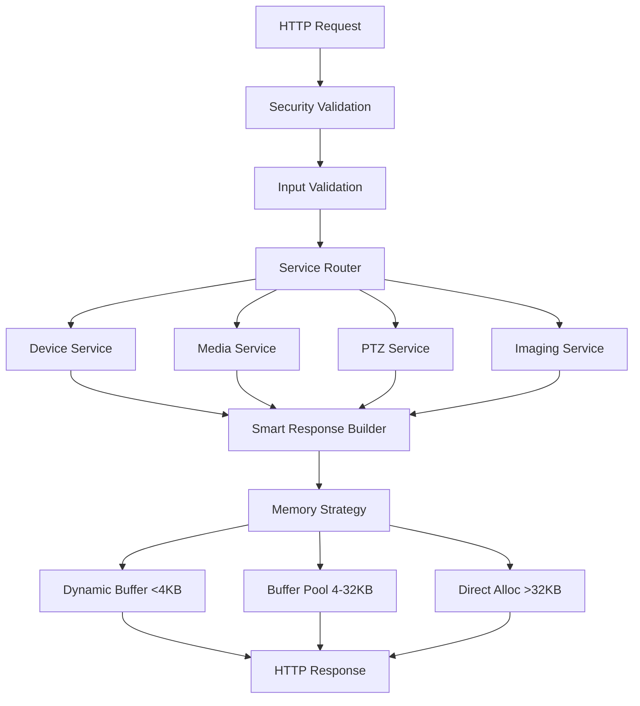

# Design Document

## Project Type
Embedded system refactoring for ONVIF 2.5 compliant IP camera firmware targeting Anyka AK3918 SoC with memory optimization and security hardening focus.

## Overview

This design focuses on **device service as reference implementation** for memory optimization patterns in the ONVIF HTTP service architecture. The device service already has significant infrastructure in place and serves as the foundation for establishing memory-efficient patterns that can be applied to other services later.

**Current Status**: Device service has smart response builders implemented with dynamic buffer and buffer pool integration. The remaining work focuses on **completing device service optimization** and **establishing reference patterns** for future service refactoring. The system has been partially refactored with architecture simplifications complete - the HTTP-ONVIF adapter layer has been removed and services now use direct HTTP request processing.

The design preserves all existing ONVIF functionality while targeting a 65%+ reduction in memory usage and eliminating security vulnerabilities through comprehensive input validation and authentication enablement.

## Core Technologies

### Primary Language(s)
- **Language**: C99 with POSIX.1b extensions (`-std=c99 -D_POSIX_C_SOURCE=199309L`)
- **Compiler**: arm-anykav200-linux-uclibcgnueabi-gcc (cross-compilation toolchain)
- **Runtime**: uClibc on Anyka AK3918 ARM platform
- **Language-specific tools**: Make build system, Doxygen documentation, clang-tidy static analysis

### Key Dependencies/Libraries
- **gSOAP 2.8**: SOAP/XML processing engine for ONVIF protocol implementation
- **libgsoap**: Core SOAP processing and XML serialization
- **libgsoapck**: Cookie/session management for SOAP services
- **Anyka SDK**: Platform-specific libraries (libakuio, libakispsdk, libakv_encode, libplat_*)
- **pthread**: POSIX threading for concurrent request handling
- **libxml2**: XML processing and validation (removed from linking due to gSOAP efficiency)

### Application Architecture
**Layered embedded service architecture** with platform abstraction:
- **HTTP/SOAP Transport Layer**: Connection management and protocol handling
- **ONVIF Service Layer**: Device, Media, PTZ, Imaging service implementations
- **Platform Abstraction Layer**: Hardware-agnostic camera control interface
- **Anyka Hardware Layer**: Direct SDK integration for video/audio processing

### Data Storage
- **Primary storage**: Configuration files (INI format), in-memory structures
- **Caching**: Buffer pools for response optimization, connection-based request buffers
- **Data formats**: SOAP/XML for ONVIF protocol, JSON for internal APIs, binary streams for video/audio

### External Integrations
- **Protocols**: HTTP/SOAP for ONVIF, RTSP for video streaming, WS-Discovery multicast
- **Authentication**: HTTP Basic Auth (being implemented), RTSP digest authentication
- **Hardware Integration**: Anyka AK3918 video encoder, PTZ motor controls, sensor management

## Development Environment

### Build & Development Tools
- **Build System**: GNU Make with enhanced debugging support and dual build types (debug/release)
- **Package Management**: Anyka SDK libraries, cross-compilation toolchain in `/opt/arm-anykav200-crosstool/`
- **Development workflow**: SD card payload testing, hot reload via file replacement, UART debugging
- **Cross-compilation**: Native WSL Ubuntu environment with `arm-anykav200-linux-uclibcgnueabi-` toolchain

### Code Quality Tools
- **Static Analysis**: clang-tidy with project-specific rules, cppcheck integration
- **Formatting**: Consistent 2-space indentation, project-specific style enforcement
- **Testing Framework**: Integration tests using Python pytest, unit testing for utilities
- **Documentation**: Doxygen with mandatory function documentation and file headers

### Version Control & Collaboration
- **VCS**: Git with WSL Ubuntu native environment
- **Branching Strategy**: Feature-based development with SD card testing workflow
- **Code Review Process**: AGENTS.md compliance verification, security vulnerability assessment

## Technical Requirements & Constraints

### Performance Requirements
- **Memory optimization**: 65%+ reduction in memory usage for typical ONVIF responses
- **Response time targets**: <100ms for device operations, <200ms for media operations
- **Throughput**: Support concurrent ONVIF client connections with efficient buffer pool utilization
- **Resource utilization**: Optimized for Anyka AK3918 embedded constraints (limited RAM/storage)

### Compatibility Requirements
- **Platform Support**: Anyka AK3918 ARM platform, uClibc runtime environment
- **Dependency Versions**: gSOAP 2.8+, POSIX.1b threading, C99 standard compliance
- **Standards Compliance**: ONVIF 2.5 specification, SOAP 1.2, HTTP/1.1, RTSP RFC 2326

### Security & Compliance
- **Authentication**: HTTP Basic authentication for all ONVIF operations (currently bypassed)
- **Input validation**: Comprehensive validation using existing utilities, XML/SOAP injection prevention
- **Buffer security**: Safe string operations via string_shims.h, buffer overflow prevention
- **Memory tracking**: ONVIF_MALLOC/ONVIF_FREE for leak detection and resource monitoring

### Scalability & Reliability
- **Expected Load**: Multiple concurrent ONVIF clients, real-time video streaming
- **Availability Requirements**: Embedded system reliability, graceful error handling
- **Growth Projections**: Pattern replication across Device, Media, PTZ, Imaging services

## Steering Document Alignment

### Technical Standards (tech.md)
The design strictly follows AGENTS.md coding standards including:
- **MANDATORY**: Relative include paths from `src/` directory (no `../` paths)
- **MANDATORY**: Global variable naming convention `g_<module>_<variable_name>`
- **MANDATORY**: Global variables placed at top of file after includes
- **MANDATORY**: Comprehensive Doxygen documentation for all functions with `@brief`, `@param`, `@return`
- **MANDATORY**: Consistent file headers with `@file`, `@brief`, `@author kkrzysztofik`, `@date 2025`
- Use of existing utilities to prevent code duplication
- Safe string functions and proper input validation

### Project Structure (structure.md)
Implementation follows the established project structure:
- Services organized under `src/services/{service}/` (device, media, ptz, imaging, snapshot)
- Utilities leveraged from `src/utils/` (memory, string, validation, logging, security)
- Platform abstraction maintained via `src/platform/` with Anyka-specific implementations
- Network components in `src/networking/` (http, rtsp, common components)
- Generated SOAP code in `src/generated/` from WSDL definitions

## Code Reuse Analysis

### Existing Components to Leverage
- **memory_manager.c/h**: Dynamic buffer allocation and tracking system for small response optimization (must integrate in HTTP layer)
- **buffer_pool.c/h**: Pre-allocated buffer pool for medium response optimization (already integrated, but 0% utilization)
- **security_hardening.c/h**: Authentication and validation functions (currently bypassed with if(0))
- **string_shims.c/h**: Safe string manipulation functions (included but unused, 3×unsafe strcpy present)
- **service_logging.c/h**: Structured service logging with context (not used in HTTP layer)
- **common_validation.c/h**: Comprehensive validation utilities (not used in HTTP layer)
- **platform_logging.c/h**: Basic logging infrastructure (used extensively)

### Device Service Current State Analysis
- **Smart Response Builders**: `build_response_with_dynamic_buffer()`, `build_response_with_buffer_pool()` functions implemented
- **Memory Tracking**: All allocations use `ONVIF_MALLOC/FREE` for tracking (100% coverage)
- **Buffer Pool Integration**: `g_device_response_buffer_pool` available but 0% utilization
- **Remaining Issues**: 2×128KB allocations in logging, memory copies in response building

### Integration Points
- **HTTP Server**: Direct service invocation without adapter conversion (completed)
- **gSOAP Context**: XML/SOAP processing using existing infrastructure
- **Thread Pool**: Existing connection management for concurrent requests
- **Configuration System**: Leverage existing device configuration for service parameters

## Architecture

The refactored architecture eliminates unnecessary abstraction layers and implements memory-efficient response handling:

### Modular Design Principles
- **Single File Responsibility**: Each service handles one ONVIF service type (Device, Media, PTZ, Imaging)
- **Component Isolation**: Response builders, validators, and memory managers are separate utilities
- **Service Layer Separation**: Clear separation between HTTP handling, service logic, and response generation
- **Utility Modularity**: Memory management, validation, and logging are focused, reusable modules



## Components and Interfaces

### Smart Response Builder (Enhanced)
- **Purpose**: Optimize memory allocation with zero-copy patterns and size-based strategies using existing utilities
- **Interfaces**:
  - `build_optimized_response(onvif_response_t* response, const char* content, size_t hint) -> int`
  - `build_small_response_direct(onvif_response_t* response, const char* content) -> int` (zero-copy)
  - `build_medium_response_pooled(onvif_response_t* response, const char* content) -> int` (pool + direct)
- **Dependencies**: memory_manager.h, buffer_pool.h, service_logging.h
- **Reuses**: Existing dynamic_buffer_t, buffer_pool_t, ONVIF_MALLOC/ONVIF_FREE tracking
- **Zero-Copy Pattern**: Build responses directly in final buffer, eliminate intermediate copies

### HTTP Security Validator
- **Purpose**: Validate HTTP headers, content-type, body presence, and size limits using existing utilities
- **Interfaces**: `validate_http_request(const http_request_t* request) -> int`
- **Dependencies**: common_validation.h, service_logging.h, string_shims.h
- **Reuses**: Existing http_request_t structure, validation utilities

### Service Handler Standardizer
- **Purpose**: Provide consistent service handler interface across all ONVIF services
- **Interfaces**: `enhanced_service_handler(config, request, response, gsoap_ctx) -> int`
- **Dependencies**: Smart response builder, validation components
- **Reuses**: Existing service_handler_config_t and onvif_response_t structures

## Memory Optimization Patterns

### Pattern 1: Zero-Copy Response Building
**Current Issue**: Device service builds responses with multiple memory copies
```c
// CURRENT (Inefficient - Multiple Copies)
dynamic_buffer_t response_buffer;
dynamic_buffer_init(&response_buffer, 0);
dynamic_buffer_append_string(&response_buffer, "<?xml version=\"1.0\"?>");
// ... build response ...
memcpy(response->body, dynamic_buffer_data(&response_buffer), response_length);
```

**Optimized Pattern**: Build responses directly in final buffer
```c
// OPTIMIZED (Zero-Copy - Direct Building)
size_t estimated_size = estimate_response_size(soap_content);
response->body = ONVIF_MALLOC(estimated_size + 1);
if (!response->body) return -1;

// Build directly in final buffer
int result = snprintf(response->body, estimated_size + 1,
                     "<?xml version=\"1.0\"?><soap:Envelope>%s</soap:Envelope>",
                     soap_content);
response->body_length = (size_t)result;
```

### Pattern 2: Smart Buffer Pool Utilization
**Current Issue**: Buffer pool exists but 0% utilization (50×32KB = 1.6MB unused)
```c
// OPTIMIZED (Smart Utilization)
char* temp_buffer = buffer_pool_get(&g_device_response_buffer_pool);
if (temp_buffer) {
    // Use for temporary XML processing
    process_xml_in_place(temp_buffer, soap_content);
    // Build final response with direct allocation
    response->body = ONVIF_MALLOC(actual_size + 1);
    // Copy processed content to final buffer
    buffer_pool_return(&g_device_response_buffer_pool, temp_buffer);
}
```

### Pattern 3: Connection-Based HTTP Buffering
**Current Issue**: HTTP server uses 32KB stack buffer per request
```c
// OPTIMIZED (Connection Buffer)
// Use connection_t.buffer for response building
// Eliminate stack allocation waste
```

## Data Models

### Enhanced Service Response Structure
```c
typedef struct {
    char* body;                    // Response content (dynamically allocated)
    size_t body_length;           // Actual content length
    int status_code;              // HTTP status code
    const char* content_type;     // Content type header
    allocation_strategy_t strategy; // Which allocation method was used
} onvif_response_t;
```

### Memory Strategy Enumeration
```c
typedef enum {
    STRATEGY_SMALL_DYNAMIC,       // <4KB using dynamic_buffer_t
    STRATEGY_MEDIUM_POOLED,       // 4-32KB using buffer_pool_t
    STRATEGY_LARGE_DIRECT,        // >32KB using direct allocation
    STRATEGY_ERROR_FALLBACK       // Error handling allocation
} allocation_strategy_t;
```

## Error Handling

### Error Scenarios
1. **Memory Allocation Failure:**
   - **Handling**: Graceful fallback to smaller allocation strategies, return appropriate SOAP fault
   - **User Impact**: Service temporarily unavailable response with retry suggestion

2. **Authentication Failure:**
   - **Handling**: Return HTTP 401 with proper WWW-Authenticate header
   - **User Impact**: Clear authentication error requiring credential check

3. **XML Injection Attempt:**
   - **Handling**: Block request, log security event, return generic error
   - **User Impact**: Request rejected without revealing security detection

4. **Buffer Pool Exhaustion:**
   - **Handling**: Automatic fallback to direct allocation with warning log
   - **User Impact**: No visible impact, slight performance degradation

## Technical Decisions & Rationale

### Decision Log
1. **gSOAP over libxml2**: Chosen for ONVIF/SOAP efficiency despite slightly larger memory footprint. gSOAP provides integrated SOAP processing and reduces complexity versus separate XML parsing.

2. **Connection-based Buffer Strategy**: Replaced per-request stack buffers with persistent connection buffers to eliminate 32KB×concurrent_requests memory waste. This aligns with embedded resource constraints.

3. **Device Service as Reference Implementation**: Leverages existing smart response builder infrastructure to establish patterns before applying to Media/PTZ/Imaging services. Reduces risk and provides proven optimization baseline.

4. **Size-based Allocation Strategy**: Implements 3-tier allocation (direct <4KB, pool 4-32KB, direct >32KB) based on response characteristics analysis. Maximizes buffer pool utilization while handling large responses efficiently.

5. **HTTP Basic Auth Implementation**: Selected over digest auth for ONVIF compliance simplicity. Easier to implement correctly and debug in embedded environment, with HTTPS providing transport security.

## Known Limitations

- **Buffer Pool Fixed Size**: 50×32KB pool size not dynamically adjustable. Future enhancement could implement adaptive pool sizing based on usage patterns.

- **Authentication Security**: HTTP Basic Auth transmits credentials in base64 (easily decoded). Limitation exists due to ONVIF specification requirements and embedded HTTPS complexity.

- **Memory Tracking Overhead**: ONVIF_MALLOC/ONVIF_FREE tracking adds slight performance overhead. Trade-off accepted for memory leak detection in embedded environment.

- **Single Response Builder Pattern**: Current smart response builders optimized for typical ONVIF responses. Large binary responses (like snapshots) may need specialized handling.

## Testing Strategy

### Unit Testing
- Response builder allocation strategies with various size inputs (1KB, 16KB, 64KB test cases)
- Validation functions with known good/bad inputs including malicious XML/SOAP injection attempts
- Memory management correctness and leak detection using ONVIF_MALLOC tracking
- Service handler error path coverage with simulated allocation failures

### Integration Testing
- End-to-end request processing through all validation and response stages
- Authentication flow testing with valid/invalid credentials and rate limiting scenarios
- Concurrent request handling with buffer pool utilization under load (10+ concurrent clients)
- Memory optimization verification across all service types with before/after measurements

### End-to-End Testing
- Full ONVIF client compatibility testing with GetDeviceInformation, GetCapabilities, GetProfiles
- Performance benchmarking comparing before/after memory usage using /proc/self/status VmRSS
- Security penetration testing against authentication bypass, XML injection, and buffer overflow attempts
- Stress testing with concurrent connections and varying response sizes (1KB-1MB range)

### SD Card Testing Workflow
- **Primary Development Method**: Copy compiled `onvifd` binary to `SD_card_contents/anyka_hack/usr/bin/`
- **Configuration Testing**: Update `anyka_cfg.ini` for various test scenarios
- **Live Device Testing**: Boot camera with SD card to test real hardware integration
- **UART Debugging**: Monitor camera boot and service logs via UART for issue diagnosis