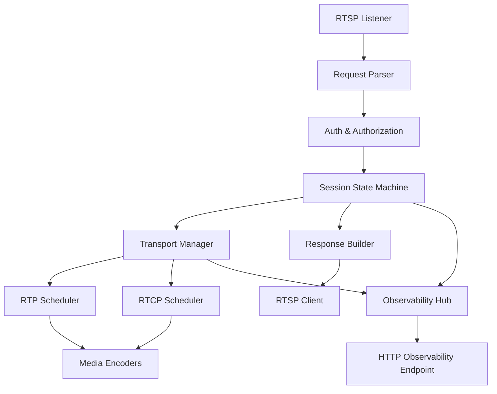

# Design Document

## Overview

The video-audio-rtsp-refactoring feature introduces a layered RTSP control stack that separates request parsing, RFC 2326 state management, transport negotiation, and RTP/RTCP coordination. The new design formalises compliance with RFC 2326 for method handling, uses deterministic state machines to coordinate multi-track playback, and aligns SDP generation, authentication, observability, and statistics exposure with the ONVIF media subsystem. The resulting pipeline allows ONVIF media services to expose standards-compliant stream URIs while reusing the Anyka-specific encoder bridges.

## Steering Document Alignment

### Technical Standards (tech.md)
- Reuses the existing C-based platform, gSOAP stack, and digest authentication utilities as mandated in `tech.md`.
- Implements complete RTSP method handling and SDP generation in accordance with RFC 2326, RFC 2327, and RTCP RFC 3550, matching the documented compliance targets.
- Observes logging, security, and testing expectations described in the technology steering guide by routing diagnostics through the platform logging abstraction, extending the mandatory unit/integration test suites, and surfacing telemetry through a shared observability endpoint.

### Project Structure (structure.md)
- Places RTSP control modules under `cross-compile/onvif/src/networking/rtsp/`, keeping utilities in `src/utils/` as outlined by the structure steering document.
- Splits responsibilities across focused files (`rtsp_request_parser.c`, `rtsp_state_machine.c`, `rtsp_transport_manager.c`, `rtsp_response_builder.c`, `network_auth_shared.c`, `network_observability.c`) to preserve the single-responsibility and modularity principles.
- Extends existing `rtsp_session.c`, `rtsp_rtp.c`, and `rtsp_rtcp.c` while maintaining include order, naming conventions, and Doxygen documentation requirements.

## Code Reuse Analysis

### Existing Components to Leverage
- **`rtsp_session.c` / `rtsp_session.h`**: Provide session storage, timeout handling, and mutex protection. Will be extended to track RFC 2326 session state, authentication context, and multi-track bindings.
- **`rtsp_rtp.c` / `rtsp_rtcp.c`**: Continue handling packet scheduling and RTCP reporting. The transport manager orchestrates these modules rather than duplicating their logic.
- **`rtsp_sdp.c`**: Supplies SDP generation utilities. Will be refactored to emit standards-compliant SDP blocks per track and aggregate control URIs.
- **`utils/network` and `utils/security`**: Offer socket helpers, digest authentication, and validation utilities; the refactoring will reuse them for input validation and credentials management.
- **Platform logging in `platform/platform.h`**: Used for structured diagnostics and observability.
- **`networking/http/http_auth.c`**: Source for digest helper routines that will be extracted into shared authentication utilities for reuse in RTSP.

### Integration Points
- **ONVIF Media Service (`src/services/media/`)**: Provides stream URIs and configuration to clients; will consume the new RTSP capability descriptors and expose configuration knobs for timeout/transport policies.
- **Encoder interface (`src/platform/adapters/`)**: Supplies raw audio/video frames and codec metadata. The RTP/RTP modules already integrate with these adapters; the refactoring preserves the integration through clearer interfaces.
- **Configuration subsystem (`src/core/config/`)**: Holds RTSP server configuration (authentication realm, port, transport preferences). New options (timeouts, keep-alive policies, observability toggles) will be added through this layer.
- **HTTP observability endpoint (`src/networking/http/`)**: Serves the combined telemetry collected by the new network observability hub.

## Architecture

The design adopts a pipeline formed by request parsing, authentication/authorisation, state machine evaluation, transport negotiation, and response generation. Each stage is implemented by a dedicated module, linked together via explicit interfaces and shared context structures. The transport manager bridges successful state transitions to the RTP and RTCP schedulers, while the session registry keeps authoritative session metadata. A central observability hub aggregates metrics from RTSP and HTTP components and exposes them via an HTTP endpoint for diagnostics.

### Modular Design Principles
- **Single File Responsibility**: Parsing, state transitions, transport handling, authentication, response creation, and observability reside in separate files to avoid monoliths.
- **Component Isolation**: Each module exposes narrow headers under `networking/rtsp/` or `networking/common/` with well-defined data structures, preventing circular dependencies.
- **Service Layer Separation**: Media service orchestrators call into the RTSP server through a single façade (`rtsp_server.c`) that delegates to the modularised internals.
- **Utility Modularity**: Common parsing helpers, digest routines, and metrics aggregation live in reusable modules to promote cross-protocol consistency.



## Components and Interfaces

### Component 1: `rtsp_request_parser`
- **Purpose:** Parse incoming RTSP requests, validate headers, and populate canonical `rtsp_request_t` structures with method, URI, headers, and body metadata.
- **Interfaces:**
  - `int rtsp_parse_request(const char* raw_request, rtsp_request_t* out_request);`
  - `int rtsp_validate_headers(const rtsp_request_t* request);`
- **Dependencies:** Utilises `utils/string/string_utils.h` for tokenisation, `utils/validation/common_validation.h` for bounds checking.
- **Reuses:** Existing header parsing logic from HTTP utilities where applicable, sharing token tables for methods and headers.

### Component 2: `rtsp_state_machine`
- **Purpose:** Implement RFC 2326 session state transitions (INIT → READY → PLAYING → RECORDING) with enforcement of method validity per section 10.
- **Interfaces:**
  - `int rtsp_state_machine_apply(rtsp_session_t* session, const rtsp_request_t* request, rtsp_response_t* response);`
  - `const rtsp_state_transition_t* rtsp_get_supported_transitions(void);`
- **Dependencies:** Depends on `rtsp_session.h` for session metadata and authentication status.
- **Reuses:** Works with existing session timeout helpers and new enums added to `rtsp_types.h`.

### Component 3: `rtsp_transport_manager`
- **Purpose:** Coordinate transport negotiation for UDP unicast/multicast and TCP interleaved streams, allocate resources, and configure RTP/RTCP pipelines.
- **Interfaces:**
  - `int rtsp_transport_negotiate(rtsp_session_t* session, const rtsp_request_t* request, rtsp_transport_config_t* out_transport);`
  - `int rtsp_transport_commit(rtsp_session_t* session, const rtsp_transport_config_t* transport);`
- **Dependencies:** Uses `rtsp_rtp.h`, `rtsp_rtcp.h`, and platform socket utilities.
- **Reuses:** Extends `rtsp_multistream.c` to handle aggregate control URIs and multi-track synchronisation.

### Component 4: `rtsp_response_builder`
- **Purpose:** Construct compliant RTSP responses with correct status codes, mandatory headers, and SDP bodies.
- **Interfaces:**
  - `int rtsp_build_response(const rtsp_request_t* request, const rtsp_response_context_t* context, rtsp_response_t* out_response);`
  - `int rtsp_response_serialize(const rtsp_response_t* response, char* buffer, size_t buffer_size);`
- **Dependencies:** Leverages `rtsp_sdp.h` for SDP generation and uses `utils/string` helpers for safe formatting.
- **Reuses:** Shares header formatting logic with HTTP response utilities to ensure consistent Date and CSeq handling.

### Component 5: `network_auth_shared`
- **Purpose:** Offer digest challenge generation, nonce handling, credential parsing, and header formatting utilities shared by HTTP and RTSP auth layers.
- **Interfaces:**
  - `int network_auth_generate_challenge(network_auth_challenge_t* challenge);`
  - `int network_auth_validate_response(const network_auth_challenge_t* challenge, const network_auth_credentials_t* creds);`
- **Dependencies:** Uses `utils/security/digest_auth.h` and existing HTTP auth helpers.
- **Reuses:** Extracted from `http_auth.c` to eliminate duplication and guarantee identical behaviour across protocols.

### Component 6: `rtsp_security_gateway`
- **Purpose:** Validate authentication and authorisation decisions before state transitions, integrating shared digest auth helpers and media policy checks.
- **Interfaces:**
  - `int rtsp_security_check(rtsp_session_t* session, const rtsp_request_t* request, rtsp_response_t* response);`
- **Dependencies:** Uses `network_auth_shared.h`, `rtsp_auth.h`, and configuration services.
- **Reuses:** Builds upon shared digest utilities and session credential storage.

### Component 7: `rtsp_observability`
- **Purpose:** Emit per-request diagnostics, metrics, and structured logs for QA observability and for the central hub.
- **Interfaces:**
  - `void rtsp_observe_request(const rtsp_request_t* request, const rtsp_response_t* response);`
  - `void rtsp_observe_transport(const rtsp_session_t* session, const rtsp_transport_config_t* transport);`
  - `void rtsp_observe_rtp_metrics(const rtsp_session_t* session, const rtsp_rtp_metrics_t* metrics);`
- **Dependencies:** Relies on platform logging and `network_observability.h` for shared metric aggregation APIs.
- **Reuses:** Reuses logging patterns from ONVIF HTTP server modules.

### Component 8: `network_observability`
- **Purpose:** Aggregate metrics from RTSP and HTTP subsystems and expose them via an HTTP endpoint for real-time monitoring.
- **Interfaces:**
  - `int network_observability_publish(const network_metric_update_t* update);`
  - `int network_observability_snapshot(network_metric_snapshot_t* out_snapshot);`
  - `int http_observability_handle_request(const http_request_t* request, http_response_t* response);`
- **Dependencies:** Depends on platform logging, HTTP server routing, and thread-safe data structures.
- **Reuses:** Shares string formatting helpers and configuration settings with existing HTTP modules.

## Metrics Catalog

The observability solution tracks the following metrics, grouped for clarity and exposed as structured JSON under the observability endpoint:

- **Session State Metrics**: active session count, per-state counts (INIT/READY/PLAYING/RECORDING), session age histogram, last-activity timestamps, expired session counter.
- **Method Flow Metrics**: total requests per method (DESCRIBE/SETUP/PLAY/PAUSE/TEARDOWN/GET_PARAMETER/OPTIONS), per-method 4xx/5xx counts, retry counters, average/percentile request latency.
- **Transport Metrics**: number of sessions using UDP unicast, UDP multicast, TCP interleaved; port/channel allocation success/failure counts; SSRC changes detected; keep-alive response counters.
- **RTP Quality Metrics**: jitter (ms) per track, packet loss percentage, out-of-order/duplicate packet counts, RTP timestamp drift, RTCP sender/receiver report intervals, bitrate/FPS estimates.
- **Security Metrics**: authentication successes/failures, nonce replay detections, forbidden method hits, throttled clients, TLS/SRTP negotiation outcomes (where configured).
- **Resource Utilisation Metrics**: estimated bandwidth per session, encoder bitrate/FPS, sockets/file descriptors in use, buffer queue depth averages, CPU load hints where available.
- **Client Insight Metrics**: unique client IP count, top user-agent signatures, distribution of client protocol versions.

Each metric is represented as either a counter (monotonic), gauge (current value), or histogram (latency/jitter buckets). Producers (RTSP modules) update metrics through the `network_observability_publish` API, and the HTTP observability endpoint returns snapshots such as:

```json
{
  "sessions": {"active": 3, "by_state": {"READY": 1, "PLAYING": 2}},
  "methods": {"DESCRIBE": {"count": 42, "errors_4xx": 1}},
  "transport": {"udp_unicast": 2, "tcp_interleaved": 1},
  "rtp": {"video": {"jitter_ms": 18.2, "loss_pct": 0.3}},
  "security": {"auth_failures": 4, "forbidden": 1},
  "resource": {"bandwidth_kbps": 4720, "sockets_in_use": 8}
}
```

## Data Models

### Model 1: `rtsp_request_t`
```
typedef struct {
  rtsp_method_t method;              // Enumerated method (DESCRIBE, SETUP, etc.)
  char uri[RTSP_URI_MAX_LENGTH];     // Validated request URI
  char version[RTSP_VERSION_LENGTH]; // Expect "RTSP/1.0"
  rtsp_header_list_t headers;        // Normalised header key/value pairs
  size_t header_count;               // Number of parsed headers
  char body[RTSP_BODY_MAX_LENGTH];   // SDP or parameter payload
  size_t body_length;                // Payload length
} rtsp_request_t;
```

### Model 2: `rtsp_session_t` (extended)
```
typedef struct rtsp_session {
  char session_id[RTSP_SESSION_ID_LENGTH];
  rtsp_session_state_t state;                 // INIT, READY, PLAYING, etc.
  time_t created_time;
  time_t last_activity;
  int timeout_seconds;
  rtsp_transport_config_t transports[RTSP_MAX_TRACKS];
  size_t transport_count;
  rtsp_auth_context_t auth_context;          // Credentials and permissions
  rtsp_aggregate_control_t aggregate_control;// Aggregate URI and track bindings
  struct rtsp_session* next;                 // Linked list chaining
} rtsp_session_t;
```

### Model 3: `rtsp_transport_config_t`
```
typedef struct {
  rtsp_transport_protocol_t protocol;   // UDP_UNICAST, UDP_MULTICAST, TCP_INTERLEAVED
  uint16_t client_port_rtp;
  uint16_t client_port_rtcp;
  uint16_t server_port_rtp;
  uint16_t server_port_rtcp;
  uint8_t interleaved_channel_rtp;
  uint8_t interleaved_channel_rtcp;
  uint32_t ssrc;
  rtsp_media_track_t track;             // Video or audio metadata
} rtsp_transport_config_t;
```

### Model 4: `network_metric_snapshot_t`
```
typedef struct {
  network_metric_session_t session_metrics;
  network_metric_method_t method_metrics;
  network_metric_transport_t transport_metrics;
  network_metric_rtp_t rtp_metrics;
  network_metric_security_t security_metrics;
  network_metric_resource_t resource_metrics;
  network_metric_client_t client_metrics;
} network_metric_snapshot_t;
```

## Error Handling

### Error Scenarios
1. **Scenario 1:** Client issues a method invalid for the current state (e.g., PLAY without prior SETUP).
   - **Handling:** `rtsp_state_machine_apply` returns `RTSP_ERROR_INVALID_STATE`; response builder emits `455 Method Not Valid In This State` with Allow/Public headers. Session remains unchanged and the observability hub increments invalid-method counters.
   - **User Impact:** Client receives standard 455 response and may retry with correct sequence.

2. **Scenario 2:** Transport negotiation fails because requested protocol (e.g., UDP multicast) is disabled in configuration.
   - **Handling:** `rtsp_transport_negotiate` returns `RTSP_ERROR_UNSUPPORTED_TRANSPORT`; response builder sends `461 Unsupported Transport` and enumerates supported transports. Observability hub records the failure event.
   - **User Impact:** Client learns which transports are available and can adjust accordingly.

3. **Scenario 3:** Authentication challenge fails due to expired nonce or incorrect credentials.
   - **Handling:** `rtsp_security_check` issues new digest challenge, increments failure counters, and logs via platform logging. Session is not advanced and a `401 Unauthorized` response is sent.
   - **User Impact:** Client receives a fresh challenge; repeated failures trigger configurable throttling.

## Testing Strategy

### Unit Testing
- Extend `cross-compile/onvif/tests/networking/rtsp/` with CMocka suites covering request parsing, header validation, state machine transitions, transport configuration, authentication gateway, and response serialization.
- Mock transport allocation and authentication utilities to test edge cases (invalid headers, unsupported methods, malformed SDP).

### Integration Testing
- Create integration tests using loopback sockets that execute full RTSP sequences (DESCRIBE → SETUP audio/video → PLAY → PAUSE → TEARDOWN) for UDP unicast, UDP multicast, and TCP interleaved scenarios, verifying RFC 2326-compliant headers and SDP bodies.
- Validate keep-alive behaviour via GET_PARAMETER and OPTIONS requests, assess session timeout handling, and check RTCP sender report intervals.
- Confirm that observability metrics update correctly by querying the HTTP observability endpoint during test runs.

### End-to-End Testing
- Update `e2e/` RTSP scenarios to stream real encoder output, confirm audio/video synchronisation, and capture Wireshark traces to ensure compliance with RFC 2326 and RFC 3550.
- Exercise ONVIF Media `GetStreamUri` flows to guarantee that advertised URIs negotiate successfully with standards-compliant NVRs (e.g., ONVIF Device Test Tool, VLC, ffmpeg).
- Validate that the observability endpoint surfaces the expected metrics during sustained streaming and adverse network conditions.
