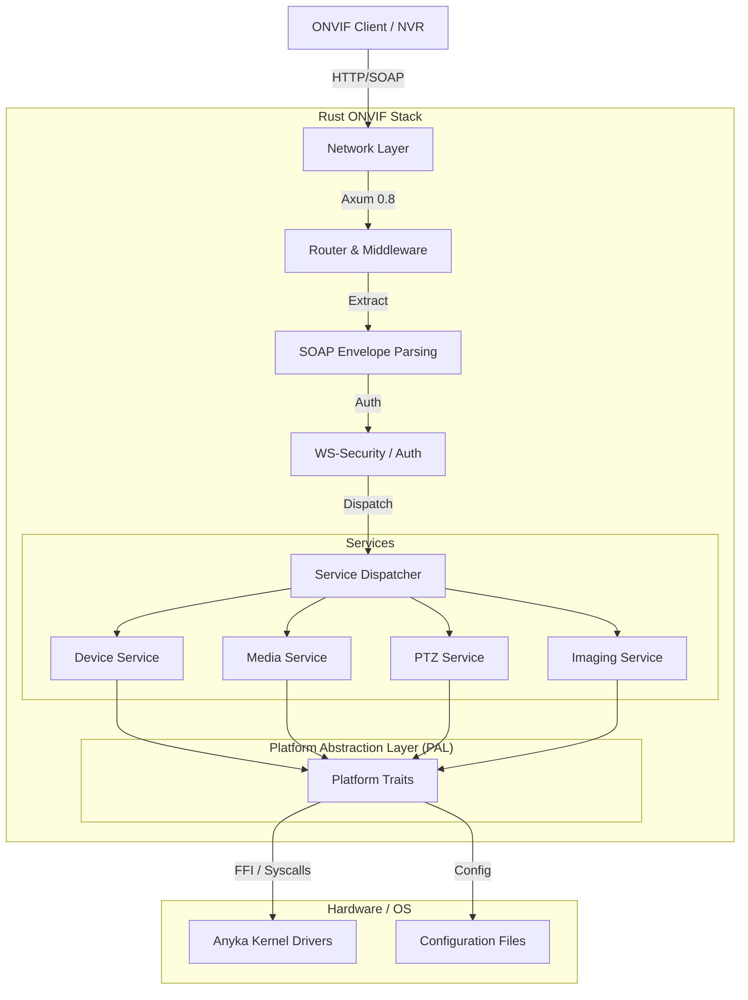

# Architecture: Anyka AK3918 ONVIF Services (Rust)

## 1. High-Level Overview

The `onvif-rust` project is a modern, memory-safe implementation of the ONVIF 24.12 protocol stack designed specifically for the Anyka AK3918 IP camera platform. It leverages Rust's asynchronous ecosystem to provide high performance and reliability on resource-constrained embedded hardware (ARM926EJ-S, 64MB RAM).

### Core Goals

- **Compliance**: Full ONVIF 24.12 compatibility (Profile S/T).
- **Safety**: Memory safety through Rust's ownership model.
- **Performance**: Asynchronous I/O using `tokio` and `axum`.
- **Maintainability**: Modular design with clear separation of concerns.

## 2. System Architecture

The system follows a layered architecture, separating network handling, protocol parsing, business logic, and hardware interaction.



### 2.1. Network Layer (`src/main.rs`, `src/app.rs`)

- **Runtime**: `tokio` (1.0) provides the asynchronous runtime.
- **Web Server**: `axum` (0.8) handles HTTP/1.1 requests.
- **Routing**: Routes are defined for standard ONVIF endpoints (e.g., `/onvif/device_service`).

### 2.2. Protocol Layer (`src/onvif/soap.rs`, `src/onvif/ws_security.rs`)

- **Serialization**: `quick-xml` and `serde` are used for high-performance XML parsing and generation.
- **SOAP Handling**: A custom `SoapRequest` extractor parses the SOAP Envelope, Header, and Body.
- **Security**: `ws_security` implements WS-UsernameToken validation (Digest/PasswordText).

### 2.3. Service Layer (`src/onvif/`)

Each ONVIF service is a distinct module implementing specific port types:

- **Device**: System info, network config, users, system reboot/reset.
- **Media**: Video profiles, encoder configuration, RTSP stream URIs.
- **PTZ**: Pan/Tilt/Zoom control, presets.
- **Imaging**: Image settings (brightness, contrast, exposure).

### 2.4. Platform Abstraction Layer (`src/platform/`)

To ensure portability and testability, all hardware interactions are abstracted behind traits.

- **`Platform` Trait**: Defines methods for system operations (e.g., `get_mac_address`, `ptz_move`).
- **`AnykaPlatform`**: Concrete implementation interacting with AK3918 hardware.
- **`StubPlatform`**: Mock implementation for unit testing and non-hardware development.

## 3. Module Structure

```text
src/
├── auth/           # Authentication logic (HTTP Digest, WS-Security)
├── config/         # Configuration management (Persistent storage)
├── discovery/      # WS-Discovery implementation (UDP)
├── lifecycle/      # Application startup/shutdown/health
├── logging/        # Structured logging setup
├── onvif/          # Core ONVIF logic
│   ├── device/     # Device service implementation
│   ├── media/      # Media service implementation
│   ├── ptz/        # PTZ service implementation
│   ├── imaging/    # Imaging service implementation
│   ├── types/      # Generated/Manual XML data structures
│   ├── soap.rs     # SOAP envelope handling
│   └── dispatcher.rs # Request routing
├── platform/       # Hardware abstraction layer
└── utils/          # Common utilities (Time, Net, String)
```

## 4. Key Design Decisions

### 4.1. Error Handling

We use a tiered error handling strategy:

- **Library/Domain Errors**: `thiserror` is used to define precise, typed errors for each module (e.g., `OnvifError`, `ConfigError`).
- **Application Errors**: `anyhow` is used in the main application loop for unrecoverable errors.
- **ONVIF Faults**: A mapping layer converts internal Rust errors into standard SOAP Faults (Sender/Receiver) as required by the ONVIF spec.

### 4.2. Logging & Tracing

- **Crate**: `tracing` is used instead of `println!` or `log`.
- **Structure**: Logs are structured (JSON/Text) to allow easier parsing.
- **Levels**:
  - `ERROR`: System failures.
  - `WARN`: Recoverable issues (e.g., auth failure).
  - `INFO`: High-level events (startup, service calls).
  - `DEBUG`: Detailed flow information.
  - `TRACE`: Packet/Payload dumps.

### 4.3. Concurrency Model

- **Request Isolation**: Each HTTP request is handled in its own Tokio task.
- **Shared State**: Global state (Configuration, Platform handle) is shared via `Arc<RwLock<T>>` or `Arc<DashMap<K, V>>` for thread safety.
- **Blocking Operations**: Heavy I/O or FFI calls that might block are offloaded to `tokio::task::spawn_blocking`.

## 5. Hardware Considerations (Anyka AK3918)

- **Memory**: The system operates within strict memory limits (64MB total system RAM). `cap` crate is used to monitor and enforce limits.
- **CPU**: ARM926EJ-S is a single-core architecture. Async I/O is crucial to avoid blocking the single thread on network waits.
- **Endianness**: Little-endian.
