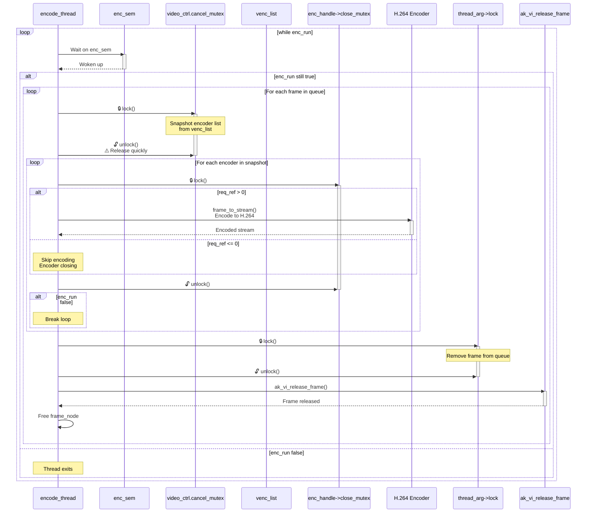

# Anyka Platform Initialization and Deinitialization Flow

This document describes the complete initialization and shutdown sequence for the Anyka video platform, including all SDK components, threads, and resource management.

## Mutex Inventory

### SDK Mutexes (C/pthread)

#### VENC Module (`ak_venc.c`)

- **`close_lock`** (global): Protects encoder close operations, prevents concurrent close/cancel
- **`cancel_lock`** (global): Protects stream cancel operations
- **`video_ctrl.lock`** (global): Protects global video control state (inited_enc_grp_num, module_init)
- **`video_ctrl.cancel_mutex`** (global): Protects encoder list during cancel (venc_list traversal)
- **`enc_handle->lock`** (per encoder): Protects encoder handle state (req_ref, user_map, is_stream_mode)
- **`enc_handle->close_mutex`** (per encoder): Protects encoder during close operations
- **`thread_arg->lock`** (per thread group): Protects frame queue (head_frame list)
- **`_Mutex_fetch`** (global): Protects YUV frame fetch operations (rarely used)

#### VI Module (`ak_vi.c`)

- **`vi_ctrl.lock`** (global): Protects device registration/initialization
- **`pdev->vi_lock`** (per device): Protects device-specific operations (channel attr, capture state)
- **`pdev->frame_lock`** (per device): Protects frame queue operations (frame_list)
- **`box_lock`** (global): Protects motion detection box operations

#### ISP Module (`isp_vi.c`)

- **`isp_manipulate_mutex_lock`** (global): Protects ISP hardware manipulation (capture on/off)
- **`isp_frame_list_lock`** (global): Protects ISP internal frame list

### Rust Mutexes (parking_lot::RwLock)

#### AnykaVideoInput

- **`handle`**: `RwLock<Option<Arc<VideoInputHandle>>>`
- **`channel_layout`**: `RwLock<(Resolution, Resolution)>`

#### AnykaVideoEncoder

- **`configurations`**: `RwLock<Vec<VideoEncoderConfig>>`
- **`main_handle`**: `RwLock<Option<Arc<VideoEncoderHandle>>>`
- **`sub_handle`**: `RwLock<Option<Arc<VideoEncoderHandle>>>`
- **`main_state`**: `RwLock<EncoderState>`
- **`sub_state`**: `RwLock<EncoderState>`
- **`callbacks`**: `Arc<RwLock<HashMap<CallbackId, Arc<dyn FrameCallback>>>>`
- **`main_stream_handle`**: `RwLock<Option<Arc<VideoStreamHandle>>>`
- **`sub_stream_handle`**: `RwLock<Option<Arc<VideoStreamHandle>>>`
- **`main_read_thread`**: RwLock<Option<JoinHandle<()>>>
- **`sub_read_thread`**: RwLock<Option<JoinHandle<()>>>

## Initialization Flow (with Mutexes)

```mermaid
sequenceDiagram
    rect rgb(30, 50, 70)
        Note over RustApp,RustVENC: 🦀 onvif-rust (Rust Application Layer)
        participant RustApp as AnykaPlatform<br/>(Rust)
        participant RustVI as AnykaVideoInput<br/>(Rust)
        participant RustVENC as AnykaVideoEncoder<br/>(Rust)
        participant RustMainRead as Main Reader Thread<br/>(Rust std::thread)
        participant RustSubRead as Sub Reader Thread<br/>(Rust std::thread)
    end
    
    rect rgb(50, 30, 30)
        Note over CmdSrv,SDKEnc: 📚 SDK (Vendor C Library)
        participant CmdSrv as Command Server<br/>(SDK)
        participant ISP as ISP Module<br/>(SDK)
        participant VI as Video Input<br/>(SDK ak_vi_*)
        participant VPSS as VPSS Module<br/>(SDK ak_vpss_*)
        participant VENC as Video Encoder<br/>(SDK ak_venc_*)
        participant SDKCap as capture_thread<br/>(SDK pthread, tid 731)
        participant SDKEnc as encode_thread<br/>(SDK pthread, tid 732)
    end

    rect rgb(30, 50, 70)
        Note over RustApp: 🦀 Rust: register_cmd_server()
        RustApp->>CmdSrv: FFI: ak_cmd_server_register()<br/>Port 7000
        activate CmdSrv
        CmdSrv-->>RustApp: Command server registered
        deactivate CmdSrv
    end
    
    rect rgb(50, 30, 30)
        Note over RustApp,ISP: 📚 SDK: ISP sensor matching
        RustApp->>ISP: FFI: ak_isp_match_sensor()<br/>🔒 cfglock (SDK mutex)
        activate ISP
        ISP-->>RustApp: Sensor matched (GC1084)
        deactivate ISP
    end
    
    rect rgb(50, 30, 30)
        Note over RustApp,VI: 📚 SDK: Video input open
        RustApp->>VI: FFI: ak_vi_open(DEV0)<br/>🔒 vi_ctrl.lock (SDK)<br/>🔒 pdev->vi_lock (SDK)<br/>Init: pdev->frame_lock (SDK)
        activate VI
        VI-->>RustApp: vi_handle
        deactivate VI
    end
    
    rect rgb(30, 50, 70)
        Note over RustVI: 🦀 Rust: Store handle in RwLock
        RustApp->>RustVI: video_input.open()<br/>🔓 handle.write() (Rust RwLock)
        activate RustVI
        RustVI-->>RustApp: Handle stored
        deactivate RustVI
    end
    
    rect rgb(50, 30, 30)
        Note over RustApp,VPSS: 📚 SDK: VPSS initialization
        RustApp->>VPSS: FFI: ak_vpss_init(vi_handle)
        activate VPSS
        VPSS-->>RustApp: VPSS initialized
        deactivate VPSS
    end
    
    rect rgb(50, 30, 30)
        Note over RustApp,VI: 📚 SDK: Query sensor resolution
        RustApp->>VI: FFI: ak_vi_get_sensor_resolution()<br/>🔒 pdev->vi_lock (SDK)
        activate VI
        VI-->>RustApp: 1280x720
        deactivate VI
    end
    
    rect rgb(30, 50, 70)
        Note over RustVI: 🦀 Rust: Store resolution
        RustApp->>RustVI: Store resolution<br/>🔓 sensor_resolution.write() (Rust)
        activate RustVI
        RustVI-->>RustApp: Resolution stored
        deactivate RustVI
    end
    
    rect rgb(50, 30, 30)
        Note over RustApp,VI: 📚 SDK: Configure channels
        RustApp->>VI: FFI: ak_vi_set_channel_attr()<br/>🔒 pdev->vi_lock (SDK)<br/>Main: 1280x720, Sub: 640x360
        activate VI
        VI-->>RustApp: Channels configured
        deactivate VI
    end
    
    rect rgb(30, 50, 70)
        Note over RustVENC: 🦀 Rust: Sync encoder configs
        RustApp->>RustVENC: sync_configurations_to_channel_layout()<br/>🔓 configurations.write() (Rust RwLock)
        activate RustVENC
        RustVENC-->>RustApp: Configs synced
        deactivate RustVENC
    end
    
    rect rgb(50, 30, 30)
        Note over RustApp,VI: 📚 SDK: Start capture pipeline
        RustApp->>VI: FFI: ak_vi_capture_on()<br/>🔒 vi_ctrl.lock (SDK)<br/>🔒 isp_manipulate_mutex_lock (SDK)<br/>VIDIOC_STREAMON
        activate VI
        VI->>ISP: Start ISP stream
        activate ISP
        ISP-->>VI: Stream started
        deactivate ISP
        VI-->>RustApp: Capture started
        deactivate VI
    end
    
    Note over RustApp: 🦀 Rust: Stabilization delay (200ms)
    
    rect rgb(50, 30, 30)
        Note over RustApp,VENC: 📚 SDK: Initialize encoders
        RustApp->>VENC: FFI: ak_venc_open() Main<br/>🔒 close_lock (SDK)<br/>🔒 video_ctrl.lock (SDK)<br/>🔒 enc_handle->lock (SDK)<br/>Init: enc_handle->close_mutex (SDK)
        activate VENC
        VENC-->>RustApp: main_encoder_handle
        deactivate VENC
        
        RustApp->>VENC: FFI: ak_venc_open() Sub<br/>🔒 close_lock (SDK)<br/>🔒 video_ctrl.lock (SDK)<br/>🔒 enc_handle->lock (SDK)
        activate VENC
        VENC-->>RustApp: sub_encoder_handle
        deactivate VENC
    end
    
    rect rgb(30, 50, 70)
        Note over RustVENC: 🦀 Rust: Store encoder handles
        RustApp->>RustVENC: Store handles<br/>🔓 main_handle.write() (Rust)<br/>🔓 sub_handle.write() (Rust)
        activate RustVENC
        RustVENC-->>RustApp: Handles stored
        deactivate RustVENC
    end
    
    rect rgb(50, 30, 30)
        Note over RustApp,SDKCap: 📚 SDK: Request streams (spawns SDK threads)
        RustApp->>VENC: FFI: ak_venc_request_stream() Main<br/>🔒 cancel_lock (SDK)<br/>🔒 video_ctrl.lock (SDK)<br/>🔒 enc_handle->lock (SDK)<br/>Init: thread_arg->lock (SDK)
        activate VENC
        VENC->>SDKCap: pthread_create() capture_thread<br/>tid 731
        activate SDKCap
        VENC->>SDKEnc: pthread_create() encode_thread<br/>tid 732
        activate SDKEnc
        VENC-->>RustApp: main_stream_handle
        deactivate VENC
        
        RustApp->>VENC: FFI: ak_venc_request_stream() Sub<br/>🔒 cancel_lock (SDK)<br/>🔒 video_ctrl.lock (SDK)<br/>🔒 enc_handle->lock (SDK)
        activate VENC
        VENC-->>RustApp: sub_stream_handle
        deactivate VENC
    end
    
    rect rgb(30, 50, 70)
        Note over RustApp,RustSubRead: 🦀 Rust: Spawn reader threads
        RustApp->>RustMainRead: std::thread::spawn()<br/>frame_read_loop()<br/>🔓 main_read_thread.write() (Rust)
        activate RustMainRead
        
        RustApp->>RustSubRead: std::thread::spawn()<br/>frame_read_loop()<br/>🔓 sub_read_thread.write() (Rust)
        activate RustSubRead
    end
    
    rect rgb(30, 50, 70)
        Note over RustApp,RustSubRead: 🦀 Rust: Wait for pipeline readiness (5s timeout)
        
        alt Readiness OK
            RustMainRead->>VENC: FFI: ak_venc_get_stream()<br/>Poll for frames
            VENC-->>RustMainRead: Frame data
            RustSubRead->>VENC: FFI: ak_venc_get_stream()<br/>Poll for frames
            VENC-->>RustSubRead: Frame data
            Note over RustApp: 🦀 Platform Initialized<br/>All threads running
        else Readiness Failed
            RustApp->>RustVENC: Rollback: stop_streaming()<br/>🦀 Rust method
            RustApp->>RustVENC: Rollback: close_all_encoders()<br/>🦀 Rust method
            RustApp->>RustVI: Rollback: capture_off()<br/>🦀 Rust method
            RustApp->>RustVI: Rollback: destroy_vpss()<br/>🦀 Rust method
            RustApp->>RustVI: Rollback: close()<br/>🦀 Rust method
            Note over RustApp: 🦀 Initialization Failed
        end
    end
```



### Initialization Steps Detail

1. **Command Server Registration** (`register_cmd_server`)
   - Registers IPC command server on port 7000
   - Required for VPSS IPC hooks to bind cleanly
   - Must be done before VPSS/video init

2. **ISP Sensor Matching** (`match_sensor`)
   - Scans `/etc/jffs2/` and `/usr/local/` for ISP config files
   - Matches sensor ID (e.g., GC1084)
   - Loads ISP configuration (v3/v4 format conversion if needed)

3. **Video Input Open** (`ak_vi_open`)
   - Opens video device DEV0
   - Registers device with VI subsystem
   - Returns vi_handle

4. **VPSS Initialization** (`ak_vpss_init`)
   - Initializes Video Post-Processing SubSystem
   - Sets up ISP processing pipeline
   - Must be called immediately after vi_open

5. **Sensor Resolution Query** (`get_sensor_resolution`)
   - Queries actual sensor resolution (e.g., 1280x720)
   - Used to configure channels and encoders

6. **Channel Configuration** (`set_channel_attr`)
   - Configures main channel: 1280x720
   - Configures sub channel: 640x360
   - Sets up dual-channel capture

7. **Capture Start** (`ak_vi_capture_on`)
   - Allocates capture buffers (ION memory)
   - Starts ISP stream (VIDIOC_STREAMON)
   - Drops first 4 frames for stabilization
   - SDK spawns internal capture thread (tid 731)

8. **Encoder Initialization** (`ak_venc_open`)
   - Main encoder: 1280x720 @ 15fps, 2000kbps, GOP=30
   - Sub encoder: 640x360 @ 15fps, 300kbps, GOP=30
   - Allocates encoder buffers

9. **Stream Request** (`ak_venc_request_stream`)
   - Binds VI handle to encoder handle
   - SDK spawns internal threads:
     - `capture_thread` (tid 731): Calls `capture_encode_frame`
     - `encode_thread` (tid 732): Encodes frames to H.264
   - Returns stream_handle

10. **Reader Threads** (`frame_read_loop`)
    - Main reader thread: Polls `ak_venc_get_stream` for main stream
    - Sub reader thread: Polls `ak_venc_get_stream` for sub stream
    - Both check `stop_signal` and exit cooperatively

11. **Readiness Validation** (`wait_for_stream_readiness`)
    - Waits up to 5s for frames to start flowing
    - Validates main_frames > 0 and sub_frames > 0
    - Fails if no frames received within timeout

## Deinitialization Flow (with Mutexes)

```mermaid
sequenceDiagram
    rect rgb(30, 50, 70)
        Note over RustApp,RustSubRead: 🦀 onvif-rust (Rust Application Layer)
        participant RustApp as AnykaPlatform<br/>(Rust)
        participant RustPTZ as PTZ Control<br/>(Rust)
        participant RustMainRead as Main Reader Thread<br/>(Rust std::thread)
        participant RustSubRead as Sub Reader Thread<br/>(Rust std::thread)
        participant RustVI as AnykaVideoInput<br/>(Rust)
        participant RustVENC as AnykaVideoEncoder<br/>(Rust)
    end
    
    rect rgb(50, 30, 30)
        Note over VI,SDKEnc: 📚 SDK (Vendor C Library)
        participant VI as Video Input<br/>(SDK ak_vi_*)
        participant VENC as Video Encoder<br/>(SDK ak_venc_*)
        participant SDKCap as capture_thread<br/>(SDK pthread, tid 731)
        participant SDKEnc as encode_thread<br/>(SDK pthread, tid 732)
        participant VPSS as VPSS Module<br/>(SDK ak_vpss_*)
        participant CmdSrv as Command Server<br/>(SDK)
    end

    rect rgb(30, 50, 70)
        Note over RustApp: 🦀 Rust: Shutdown signal received
        
        RustApp->>RustPTZ: ptz.stop() (best-effort)<br/>🦀 Rust method
        activate RustPTZ
        RustPTZ-->>RustApp: PTZ stopped
        deactivate RustPTZ
        
        RustApp->>RustMainRead: stop_signal.store(true)<br/>🔓 AtomicBool (Rust)
        RustApp->>RustSubRead: stop_signal.store(true)<br/>🔓 AtomicBool (Rust)
        Note over RustApp: 🦀 Rust: Grace period (50ms)
    end
    
    rect rgb(40, 40, 40)
        Note over RustApp,VI: ⚠️ CRITICAL: Must be BEFORE cancel
        rect rgb(30, 50, 70)
            Note over RustApp: 🦀 Rust: Clear VI buffers
            RustApp->>RustVI: video_input.clear_buffer()<br/>🦀 Rust wrapper method
            activate RustVI
        end
        rect rgb(50, 30, 30)
            Note over RustVI,VI: 📚 SDK: Clear buffers
            RustVI->>VI: FFI: ak_vi_clear_buffer()<br/>Unblock capture thread
            activate VI
            VI-->>RustVI: Buffers cleared
            deactivate VI
        end
        RustVI-->>RustApp: Buffers cleared
        deactivate RustVI
    end
    
    rect rgb(50, 30, 30)
        Note over RustApp,VENC: 📚 SDK: Cancel streams
        RustApp->>VENC: FFI: ak_venc_cancel_stream() Main<br/>🔒 close_lock (SDK)<br/>🔒 cancel_lock (SDK)<br/>🔒 enc_handle->lock (SDK)<br/>🔒 video_ctrl.lock (SDK)<br/>🔒 video_ctrl.cancel_mutex (SDK)
        activate VENC
        
        alt Cancel Success
            rect rgb(50, 30, 30)
                Note over VENC: 📚 SDK: encode_thread_group_exit()
                VENC->>VENC: Set cap_run=0 (SDK variable)
                VENC->>VENC: Set enc_run=0 (SDK variable)
                VENC->>SDKCap: pthread_cancel() + pthread_join()<br/>⚠️ BLOCKING (SDK)
                activate SDKCap
                SDKCap-->>VENC: Thread exited
                deactivate SDKCap
                VENC->>SDKEnc: pthread_join()<br/>⚠️ BLOCKING (SDK)
                activate SDKEnc
                SDKEnc-->>VENC: Thread exited
                deactivate SDKEnc
            end
            VENC-->>RustApp: Cancel success
        else Cancel Timeout
            rect rgb(60, 20, 20)
                Note over VENC: ⚠️ encode_thread_group_exit<br/>stuck in pthread_join
            end
            VENC-->>RustApp: Cancel timeout (2s)
        end
        deactivate VENC
        
        RustApp->>VENC: FFI: ak_venc_cancel_stream() Sub<br/>🔒 close_lock (SDK)<br/>🔒 cancel_lock (SDK)<br/>🔒 enc_handle->lock (SDK)<br/>🔒 video_ctrl.lock (SDK)<br/>🔒 video_ctrl.cancel_mutex (SDK)
        activate VENC
        VENC-->>RustApp: Cancel result
        deactivate VENC
    end
    
    rect rgb(30, 50, 70)
        Note over RustApp,RustSubRead: 🦀 Rust: Join reader threads
        RustApp->>RustMainRead: join_thread_with_timeout()<br/>🔓 main_read_thread.write.take (Rust)<br/>3s timeout
        activate RustMainRead
        alt Join Success
            RustMainRead-->>RustApp: Thread joined
        else Join Timeout
            RustMainRead-->>RustApp: Join timeout
        end
        deactivate RustMainRead
        
        RustApp->>RustSubRead: join_thread_with_timeout()<br/>🔓 sub_read_thread.write.take (Rust)<br/>3s timeout
        activate RustSubRead
        alt Join Success
            RustSubRead-->>RustApp: Thread joined
        else Join Timeout
            RustSubRead-->>RustApp: Join timeout
        end
        deactivate RustSubRead
    end
    
    rect rgb(50, 30, 30)
        Note over RustApp,VENC: 📚 SDK: Close encoders
        alt All Threads Joined
            RustApp->>VENC: FFI: ak_venc_close() Main + Sub<br/>🔒 close_lock (SDK)<br/>🔒 enc_handle->close_mutex (SDK)<br/>🔒 enc_handle->lock (SDK)<br/>🔒 video_ctrl.lock (SDK)
            activate VENC
            VENC-->>RustApp: Encoders closed
            deactivate VENC
        else Hard Shutdown Required
            rect rgb(60, 20, 20)
                Note over RustApp: 🔓 requires_hard_shutdown=true<br/>🦀 Rust: Mark unsafe shutdown
            end
            RustApp->>VENC: FFI: ak_venc_close() (best-effort)
        end
    end
    
    rect rgb(50, 30, 30)
        Note over RustApp,VI: 📚 SDK: Stop capture
        RustApp->>VI: FFI: ak_vi_capture_off()<br/>🔒 vi_ctrl.lock (SDK)<br/>🔒 isp_manipulate_mutex_lock (SDK)<br/>🔒 pdev->frame_lock (SDK)<br/>VIDIOC_STREAMOFF
        activate VI
        VI-->>RustApp: Capture stopped
        deactivate VI
    end
    
    rect rgb(50, 30, 30)
        Note over RustApp,VPSS: 📚 SDK: Destroy VPSS
        RustApp->>VPSS: FFI: ak_vpss_destroy()
        activate VPSS
        VPSS-->>RustApp: VPSS destroyed
        deactivate VPSS
    end
    
    rect rgb(50, 30, 30)
        Note over RustApp,VI: 📚 SDK: Close video input
        RustApp->>VI: FFI: ak_vi_close()<br/>🔒 vi_ctrl.lock (SDK)<br/>🔒 pdev->vi_lock (SDK)<br/>Destroy: pdev->frame_lock (SDK)
        activate VI
        VI-->>RustApp: VI closed
        deactivate VI
    end
    
    rect rgb(30, 50, 70)
        Note over RustVI: 🦀 Rust: Handle dropped (RAII)
        RustApp->>RustVI: Drop VideoInputHandle<br/>🦀 Rust Drop trait
        activate RustVI
        RustVI-->>RustApp: Handle dropped
        deactivate RustVI
    end
    
    rect rgb(50, 30, 30)
        Note over RustApp,CmdSrv: 📚 SDK: Unregister command server
        RustApp->>CmdSrv: FFI: ak_cmd_unregister_module()
        activate CmdSrv
        CmdSrv-->>RustApp: Command server unregistered
        deactivate CmdSrv
    end
    
    rect rgb(30, 50, 70)
        Note over RustApp: 🦀 Shutdown Complete
    end
```



### Deinitialization Steps Detail

1. **PTZ Stop** (`ptz.stop`)
   - Best-effort PTZ motor stop
   - PTZHandle Drop will call `ak_drv_ptz_close` if needed
   - Errors logged but don't abort shutdown

2. **Signal Stop** (`stop_signal.store(true)`)
   - Sets atomic flag to signal reader threads
   - 50ms grace period for cooperative exit
   - Reader threads check this flag before each `ak_venc_get_stream` call

3. **Clear VI Buffers** (`ak_vi_clear_buffer`) **[CRITICAL]**
   - Clears VI frame queue
   - Unblocks SDK's `capture_encode_frame` thread stuck in `ak_vi_get_frame`
   - Must be called BEFORE `ak_venc_cancel_stream`

4. **Cancel Streams** (`ak_venc_cancel_stream`)
   - Decrements encoder reference count
   - If last stream, calls `encode_thread_group_exit()`:
     - Sets `cap_run = 0` (signals capture thread to exit)
     - Posts to `cap_sem` (wakes capture thread)
     - Calls `ak_thread_cancel()` on capture thread
     - Calls `ak_thread_join()` on capture thread **[BLOCKING]**
     - Sets `enc_run = 0` (signals encode thread to exit)
     - Calls `ak_thread_join()` on encode thread **[BLOCKING]**
   - 2s timeout - if this blocks, shutdown is stuck

5. **Join Reader Threads** (`join_thread_with_timeout`)
   - Main reader thread: 3s timeout
   - Sub reader thread: 3s timeout
   - Should exit quickly after cancel (checks `stop_signal`)

6. **Close Encoders** (`ak_venc_close`)
   - Closes main encoder handle
   - Closes sub encoder handle
   - Releases encoder resources

7. **Capture Off** (`ak_vi_capture_off`)
   - Stops ISP stream (VIDIOC_STREAMOFF)
   - Frees capture buffers (ION memory)
   - Must be called before closing VI

8. **Destroy VPSS** (`ak_vpss_destroy`)
   - Cleans up ISP processing pipeline
   - Must be called before closing VI (SDK requirement)

9. **Close VI** (`ak_vi_close`)
   - Releases video input device
   - Unregisters device from VI subsystem
   - Closes device handle

10. **Unregister Command Server** (`ak_cmd_unregister_module`)
    - Unregisters IPC command server
    - Cleans up IPC resources

## Detailed Mutex Flow: ak_venc_cancel_stream

This shows the exact mutex acquisition order during stream cancellation:

```mermaid
sequenceDiagram
    participant Caller as Caller Thread
    participant CloseLock as close_lock
    participant CancelLock as cancel_lock
    participant EncLock as enc_handle->lock
    participant VCLock as video_ctrl.lock
    participant CancelMutex as video_ctrl.cancel_mutex
    participant ThreadExit as encode_thread_group_exit
    participant CapThread as capture_thread
    participant EncThread as encode_thread

    Note over Caller: ak_venc_cancel_stream() called
    
    Caller->>CloseLock: 🔒 lock()
    activate CloseLock
    
    Caller->>CancelLock: 🔒 lock()
    activate CancelLock
    
    alt enc_handle valid
        Caller->>EncLock: 🔒 lock()
        activate EncLock
        Note over EncLock: Decrement req_ref<br/>Clear user_map bit
        Caller->>EncLock: 🔓 unlock()
        deactivate EncLock
        
        alt Last stream (req_ref <= 0)
            Caller->>VCLock: 🔒 lock()
            activate VCLock
            Note over VCLock: Decrement inited_enc_grp_num
            Caller->>VCLock: 🔓 unlock()
            deactivate VCLock
            
            Caller->>CancelMutex: 🔒 lock()
            activate CancelMutex
            Note over CancelMutex: Remove from venc_list
            Caller->>CancelMutex: 🔓 unlock()
            deactivate CancelMutex
            
            Caller->>EncLock: 🔒 lock()
            activate EncLock
            Note over EncLock: Clear is_stream_mode flag
            Caller->>EncLock: 🔓 unlock()
            deactivate EncLock
            
            rect rgb(60, 20, 20)
                Note over Caller,ThreadExit: ⚠️ NO LOCKS HELD during thread exit
                Caller->>ThreadExit: encode_thread_group_exit()
                activate ThreadExit
                
                ThreadExit->>CapThread: Set cap_run=0
                ThreadExit->>VI: ak_vi_clear_buffer()
                ThreadExit->>CapThread: Post cap_sem
                ThreadExit->>CapThread: ak_thread_cancel()
                ThreadExit->>CapThread: ak_thread_join()<br/>⚠️ BLOCKING
                activate CapThread
                CapThread-->>ThreadExit: Thread exited
                deactivate CapThread
                
                ThreadExit->>EncThread: Set enc_run=0
                ThreadExit->>EncThread: Post enc_sem
                ThreadExit->>EncThread: ak_thread_join()<br/>⚠️ BLOCKING
                activate EncThread
                EncThread-->>ThreadExit: Thread exited
                deactivate EncThread
                
                ThreadExit-->>Caller: Threads exited
                deactivate ThreadExit
            end
        end
    end
    
    Caller->>CancelLock: 🔓 unlock()
    deactivate CancelLock
    
    Caller->>CloseLock: 🔓 unlock()
    deactivate CloseLock
    
    Note over Caller: Return
```



## Detailed Mutex Flow: capture_encode_frame

Shows mutex usage in the capture thread that can get stuck:

```mermaid
sequenceDiagram
    participant CapThread as capture_thread
    participant CapSem as cap_sem
    participant FrameLock as pdev->frame_lock
    participant VI as ak_vi_get_frame
    participant ThreadArgLock as thread_arg->lock
    participant EncSem as enc_sem
    participant EncThread as encode_thread

    loop while cap_run && inited_enc_grp_num > 0
        CapThread->>CapSem: Wait on cap_sem
        activate CapSem
        CapSem-->>CapThread: Woken up
        deactivate CapSem
        
        alt cap_run still true
            CapThread->>CapThread: Allocate frame_node
            
            CapThread->>FrameLock: 🔒 lock()<br/>⚠️ CRITICAL: Can block here
            activate FrameLock
            
            CapThread->>VI: ak_vi_get_frame()
            activate VI
            
            alt Frame queue backpressure<br/>frame_count >= 2
                VI-->>CapThread: Error 23 (NO_DATA)
                CapThread->>FrameLock: 🔓 unlock()
                deactivate FrameLock
                deactivate VI
                CapThread->>CapThread: Free frame_node
                Note over CapThread: Sleep 10ms<br/>⚠️ Returns error, retries
            else Frame available
                VI-->>CapThread: Frame data
                deactivate VI
                CapThread->>FrameLock: 🔓 unlock()
                deactivate FrameLock
                
                CapThread->>ThreadArgLock: 🔒 lock()
                activate ThreadArgLock
                Note over ThreadArgLock: Add frame to encode queue
                CapThread->>ThreadArgLock: 🔓 unlock()
                deactivate ThreadArgLock
                
                CapThread->>EncSem: Post enc_sem<br/>Wake encode thread
                activate EncSem
                EncSem->>EncThread: Signal
                deactivate EncSem
                
                Note over CapThread: Sleep 10ms
            end
        else cap_run false
            Note over CapThread: Thread exits
        end
    end
```

## Detailed Mutex Flow: encode_frame

Shows mutex usage in the encode thread:



## Mutex Summary Table

| Mutex Name | Module | Scope | Purpose | Lock Order |
| ---------- | ----- | ----- | ------- | ---------- |
| `close_lock` | VENC | Global | Prevents concurrent encoder close/cancel | 1st |
| `cancel_lock` | VENC | Global | Protects stream cancel operations | 2nd |
| `video_ctrl.lock` | VENC | Global | Protects global state (inited_enc_grp_num) | 3rd |
| `video_ctrl.cancel_mutex` | VENC | Global | Protects encoder list during cancel | 4th |
| `enc_handle->lock` | VENC | Per encoder | Protects encoder handle state | 5th |
| `enc_handle->close_mutex` | VENC | Per encoder | Protects encoder during close | 6th |
| `thread_arg->lock` | VENC | Per thread group | Protects frame queue | Independent |
| `_Mutex_fetch` | VENC | Global | Protects YUV fetch (rarely used) | Independent |
| `vi_ctrl.lock` | VI | Global | Protects device registration | 1st |
| `pdev->vi_lock` | VI | Per device | Protects device operations | 2nd |
| `pdev->frame_lock` | VI | Per device | Protects frame queue | 3rd |
| `box_lock` | VI | Global | Protects motion detection box | Independent |
| `isp_manipulate_mutex_lock` | ISP | Global | Protects ISP hardware access | 1st |
| `isp_frame_list_lock` | ISP | Global | Protects ISP frame list | 2nd |
| `cfglock` | ISP | Global | Protects ISP config loading | Independent |

## Deadlock Risk Analysis

### High Risk Scenarios

1. **Shutdown Deadlock** (Current Issue):
   - Thread A: `ak_venc_cancel_stream()` holds `close_lock` → `cancel_lock` → `video_ctrl.lock` → `video_ctrl.cancel_mutex`
   - Thread B: `capture_encode_frame()` holds `pdev->frame_lock` (blocked in `ak_vi_get_frame()`)
   - Thread A calls `encode_thread_group_exit()` which tries to `ak_thread_join()` Thread B
   - **Risk**: Thread B is stuck holding `pdev->frame_lock`, preventing cleanup
   - **Mitigation**: Call `ak_vi_clear_buffer()` BEFORE `ak_venc_cancel_stream()` to unblock Thread B

2. **Encode Thread Deadlock**:
   - Thread A: `encode_frame()` holds `video_ctrl.cancel_mutex` (snapshotting encoder list)
   - Thread B: `ak_venc_cancel_stream()` tries to acquire `video_ctrl.cancel_mutex` (to remove from list)
   - **Risk**: Low - `cancel_mutex` is held briefly for snapshot only
   - **Mitigation**: Snapshot pattern releases mutex quickly before encoding

3. **Close/Cancel Race**:
   - Thread A: `ak_venc_close()` holds `close_lock`
   - Thread B: `ak_venc_cancel_stream()` tries to acquire `close_lock`
   - **Risk**: Low - `close_lock` prevents concurrent close/cancel
   - **Mitigation**: `close_lock` is designed for this protection

### Lock Ordering Violations to Avoid

❌ **WRONG**: Acquiring locks in different order

```text
Thread 1: close_lock → cancel_lock → video_ctrl.lock
Thread 2: video_ctrl.lock → cancel_lock → close_lock  // DEADLOCK RISK
```

✅ **CORRECT**: Always acquire in same order

```text
Thread 1: close_lock → cancel_lock → video_ctrl.lock
Thread 2: close_lock → cancel_lock → video_ctrl.lock  // Safe
```

## Thread Lifecycle

### SDK Internal Threads (Created by `ak_venc_request_stream`)

1. **capture_thread** (tid 731)
   - Function: `capture_thread()` → `capture_encode_frame()`
   - Loop condition: `while (cap_run && inited_enc_grp_num > 0)`
   - Blocking call: `ak_vi_get_frame()` - can block on frame queue backpressure
   - Exit: Sets `cap_run = 0`, posts `cap_sem`, calls `ak_thread_cancel()`, then `ak_thread_join()`
   - **Problem**: If stuck in blocking `ak_vi_get_frame()`, pthread cancellation may not work immediately

2. **encode_thread** (tid 732)
   - Function: `encode_thread()` → `encode_frame()`
   - Loop condition: `while (enc_run)`
   - Blocking call: `ak_thread_sem_wait(&enc_sem)` - waits for frames
   - Exit: Sets `enc_run = 0`, posts `enc_sem`, calls `ak_thread_join()`

3. **change_fps_thread** (tid 729)
   - Function: `change_fps_pthread()`
   - Manages FPS changes
   - Exits cleanly on `isp_module_deinit()`

### Application Threads (Created by Rust code)

1. **main-read** thread
   - Function: `frame_read_loop()` for main stream
   - Loop condition: `while !stop_signal.load()`
   - Blocking call: `ak_venc_get_stream()` - non-blocking, returns immediately if no data
   - Exit: Checks `stop_signal` before each call, exits cooperatively

2. **sub-read** thread
   - Function: `frame_read_loop()` for sub stream
   - Same as main-read thread

3. **anyka-shutdown-worker** thread
   - Function: Runs `shutdown_video_pipeline()` in blocking context
   - Purpose: Avoids async cancellation races
   - Timeout: 12s deadline (200ms in tests)

## Mutex Lock Ordering

### Critical Lock Order (MUST be followed to avoid deadlocks)

1. **VENC Lock Order**:

   ```text
   close_lock → cancel_lock → video_ctrl.lock → video_ctrl.cancel_mutex → enc_handle->lock → enc_handle->close_mutex
   ```

2. **VI Lock Order**:

   ```text
   vi_ctrl.lock → pdev->vi_lock → pdev->frame_lock
   ```

3. **ISP Lock Order**:

   ```text
   isp_manipulate_mutex_lock → isp_frame_list_lock
   ```

### Cross-Module Lock Interactions

- **VI → VENC**: `ak_vi_get_frame()` holds `pdev->frame_lock` while calling into VENC (indirectly via capture thread)
- **VENC → VI**: `encode_thread_group_exit()` calls `ak_vi_clear_buffer()` (no VI locks held)
- **ISP → VI**: ISP operations hold `isp_manipulate_mutex_lock` before accessing VI structures

## Critical Shutdown Issue

The current shutdown sequence has a race condition:

1. `ak_venc_cancel_stream()` acquires locks: `close_lock` → `cancel_lock` → `enc_handle->lock` → `video_ctrl.lock` → `video_ctrl.cancel_mutex`
2. Calls `encode_thread_group_exit()` which:
   - Sets `cap_run = 0` (no locks needed)
   - Calls `ak_vi_clear_buffer()` (no locks, but should be called BEFORE cancel)
   - Calls `ak_thread_join()` on capture thread **[BLOCKING]**
3. Capture thread is stuck in `ak_vi_get_frame()` holding `pdev->frame_lock` (backpressure)
4. `ak_thread_join()` blocks indefinitely waiting for capture thread to exit
5. This causes `ak_venc_cancel_stream()` to timeout (2s) while holding multiple locks
6. Reader threads may also timeout waiting for cancel to complete

**Solution**: Call `ak_vi_clear_buffer()` BEFORE `ak_venc_cancel_stream()` to unblock the capture thread. This ensures the capture thread can exit cooperatively before we try to join it.

## Thread-Mutex Interaction Map

### capture_thread (tid 731) Mutex Usage

```mermaid
sequenceDiagram
    participant CapThread as capture_thread<br/>(tid 731)
    participant CapSem as cap_sem<br/>(semaphore)
    participant FrameLock as pdev->frame_lock<br/>(mutex)
    participant VI as ak_vi_get_frame<br/>(VI module)
    participant ThreadArgLock as thread_arg->lock<br/>(mutex)
    participant EncQueue as Encode Queue

    CapThread->>CapSem: Wait on cap_sem
    activate CapSem
    CapSem-->>CapThread: Woken up
    deactivate CapSem
    
    CapThread->>CapThread: Allocate frame_node
    
    rect rgb(40, 40, 40)
        Note over CapThread,FrameLock: ⚠️ CRITICAL: Can block here
        CapThread->>FrameLock: 🔒 lock()
        activate FrameLock
        
        CapThread->>VI: ak_vi_get_frame()
        activate VI
        
        alt Frame queue backpressure<br/>frame_count >= 2
            rect rgb(60, 20, 20)
                Note over VI: ⚠️ BLOCKING: Returns error 23
                VI-->>CapThread: Error 23 (NO_DATA)
            end
            CapThread->>FrameLock: 🔓 unlock()
            deactivate FrameLock
            deactivate VI
            CapThread->>CapThread: Free frame_node<br/>Sleep 10ms, retry
        else Frame available
            VI-->>CapThread: Frame data
            deactivate VI
            CapThread->>FrameLock: 🔓 unlock()
            deactivate FrameLock
        end
    end
    
    CapThread->>ThreadArgLock: 🔒 lock()
    activate ThreadArgLock
    CapThread->>EncQueue: add_to_encode_list()<br/>Add frame to queue
    activate EncQueue
    EncQueue-->>CapThread: Frame queued
    deactivate EncQueue
    CapThread->>ThreadArgLock: 🔓 unlock()
    deactivate ThreadArgLock
    
    CapThread->>CapSem: Post enc_sem<br/>Wake encode thread
    Note over CapThread: Sleep 10ms, loop
```

### encode_thread (tid 732) Mutex Usage

```mermaid
sequenceDiagram
    participant EncThread as encode_thread<br/>(tid 732)
    participant EncSem as enc_sem<br/>(semaphore)
    participant CancelMutex as video_ctrl.cancel_mutex<br/>(mutex)
    participant VencList as venc_list<br/>(encoder list)
    participant CloseMutex as enc_handle->close_mutex<br/>(mutex)
    participant Encoder as H.264 Encoder
    participant ThreadArgLock as thread_arg->lock<br/>(mutex)
    participant EncQueue as Encode Queue
    participant VI as ak_vi_release_frame<br/>(VI module)

    EncThread->>EncSem: Wait on enc_sem
    activate EncSem
    EncSem-->>EncThread: Woken up
    deactivate EncSem
    
    rect rgb(40, 40, 40)
        Note over EncThread,CancelMutex: Snapshot encoder list<br/>⚠️ Release quickly
        EncThread->>CancelMutex: 🔒 lock()
        activate CancelMutex
        EncThread->>VencList: Snapshot encoder list
        activate VencList
        VencList-->>EncThread: Encoder snapshot
        deactivate VencList
        EncThread->>CancelMutex: 🔓 unlock()
        deactivate CancelMutex
    end
    
    loop For each encoder in snapshot
        EncThread->>CloseMutex: 🔒 lock()
        activate CloseMutex
        
        alt req_ref > 0
            EncThread->>Encoder: frame_to_stream()<br/>Encode to H.264
            activate Encoder
            Encoder-->>EncThread: Encoded stream
            deactivate Encoder
        else req_ref <= 0
            Note over EncThread: Skip encoding<br/>Encoder closing
        end
        
        EncThread->>CloseMutex: 🔓 unlock()
        deactivate CloseMutex
    end
    
    EncThread->>ThreadArgLock: 🔒 lock()
    activate ThreadArgLock
    EncThread->>EncQueue: list_del()<br/>Remove frame from queue
    activate EncQueue
    EncQueue-->>EncThread: Frame removed
    deactivate EncQueue
    EncThread->>ThreadArgLock: 🔓 unlock()
    deactivate ThreadArgLock
    
    EncThread->>VI: ak_vi_release_frame()<br/>Release VI frame
    Note over EncThread: Free frame_node<br/>Loop if more frames
```



## Quick Check: Find Stuck Threads

**One-liner to find stuck threads:**

```bash
ONVIF_PID=$(pgrep -f onvif-rust || pidof onvif-rust) && \
for tid in /proc/$ONVIF_PID/task/*; do \
    state=$(awk '{print $3}' $tid/stat 2>/dev/null); \
    [ "$state" = "D" ] && echo "⚠️ STUCK: $(basename $tid) ($(cat $tid/comm 2>/dev/null)) -> $(cat $tid/wchan 2>/dev/null)"; \
done
```

**Expected stuck thread from your logs:**

- **capture_thread (tid 731)**: State=D, Wait=`__down_interruptible` or `do_sys_poll`
- **Cause**: Blocked in `ak_vi_get_frame()` holding `pdev->frame_lock` due to backpressure
- **Solution**: Call `ak_vi_clear_buffer()` BEFORE `ak_venc_cancel_stream()`

For detailed debugging procedures, see [DEBUG_STUCK_THREADS.md](DEBUG_STUCK_THREADS.md).

## Thread Debugging on Embedded Systems

### 1. List All Threads in Process

```bash
# Method 1: Using /proc filesystem
cat /proc/<pid>/task/*/comm

# Method 2: Using ps (if available)
ps -T -p <pid>

# Method 3: Using BusyBox ps
ps -o pid,tid,comm,stat -p <pid>
```

### 2. Check Thread States

```bash
# Check thread state (R=running, S=sleeping, D=uninterruptible sleep)
for tid in /proc/<pid>/task/*; do
    echo "TID: $(basename $tid)"
    echo "  Name: $(cat $tid/comm)"
    echo "  State: $(awk '{print $3}' $tid/stat)"
    echo "  Stack: $(cat $tid/stack 2>/dev/null | head -5)"
done
```

### 3. Monitor Thread Activity

```bash
# Watch thread count over time
watch -n 1 'cat /proc/<pid>/status | grep Threads'

# Check thread CPU usage
top -H -p <pid>

# Using BusyBox top (if available)
top -H
```

### 4. Check for Stuck Threads

```bash
# Find threads in uninterruptible sleep (D state) - likely stuck in kernel I/O
for tid in /proc/<pid>/task/*; do
    state=$(awk '{print $3}' $tid/stat)
    if [ "$state" = "D" ]; then
        echo "STUCK THREAD: $(basename $tid)"
        echo "  Name: $(cat $tid/comm)"
        echo "  Stack:"
        cat $tid/stack 2>/dev/null | head -10
    fi
done
```

### 5. Thread Stack Traces

```bash
# Get stack trace for specific thread (requires GDB or similar)
gdb -p <pid> -ex "thread apply all bt" -ex "quit"

# Using /proc (if kernel supports it)
cat /proc/<pid>/task/<tid>/stack
```

### 6. Check Thread Wait Channels

```bash
# See what threads are waiting on (requires kernel support)
cat /proc/<pid>/task/<tid>/wchan

# Common values:
# - futex_wait_queue_me: Waiting on mutex/semaphore
# - do_sys_poll: Waiting in poll/select
# - __down_interruptible: Waiting on semaphore
# - schedule: General sleep
```

### 7. Monitor Thread Creation/Exit

```bash
# Count threads over time
while true; do
    echo "$(date): $(cat /proc/<pid>/status | grep Threads | awk '{print $2}') threads"
    sleep 1
done
```

### 8. Using strace (if available)

```bash
# Trace all threads
strace -f -p <pid>

# Trace specific syscalls
strace -f -e trace=ioctl,poll,select -p <pid>
```

### 9. Check Thread Priorities

```bash
# Thread priorities and scheduling policy
for tid in /proc/<pid>/task/*; do
    echo "TID: $(basename $tid)"
    echo "  Priority: $(awk '{print $18}' $tid/stat)"
    echo "  Policy: $(chrt -p $(basename $tid) 2>/dev/null || echo 'unknown')"
done
```

### 10. Memory Usage Per Thread

```bash
# RSS (Resident Set Size) per thread
for tid in /proc/<pid>/task/*; do
    echo "TID: $(basename $tid)"
    echo "  RSS: $(awk '/VmRSS/ {print $2}' $tid/status) KB"
done
```

## Expected Thread Count

After full initialization, the process should have:

- 1 main thread (application entry point)
- 2 reader threads (main-read, sub-read)
- 2 SDK capture threads (one per stream group, shared between main/sub)
- 2 SDK encode threads (one per stream group)
- 1 change_fps_thread (ISP FPS management)
- 1 anyka-shutdown-worker (only during shutdown)
- Various tokio runtime threads (depends on tokio configuration)

**Total**: ~8-12 threads depending on tokio configuration

## Debugging Stuck Threads

If shutdown hangs, check:

1. **Thread states**: Look for threads in 'D' (uninterruptible sleep) state
2. **Wait channels**: Check `/proc/<pid>/task/<tid>/wchan` to see what threads are waiting on
3. **Stack traces**: Use GDB or `/proc/<pid>/task/<tid>/stack` to see where threads are stuck
4. **SDK threads**: The `capture_encode_frame` thread (tid 731) is most likely to get stuck in `ak_vi_get_frame()`

## References

- `cross-compile/onvif-rust/src/platform/anyka.rs` - Platform implementation
- `cross-compile/anyka_reference/platform/libmpi/src/venc/ak_venc.c` - SDK reference
- `cross-compile/anyka_reference/libre_anyka_app/main.c` - Working example
