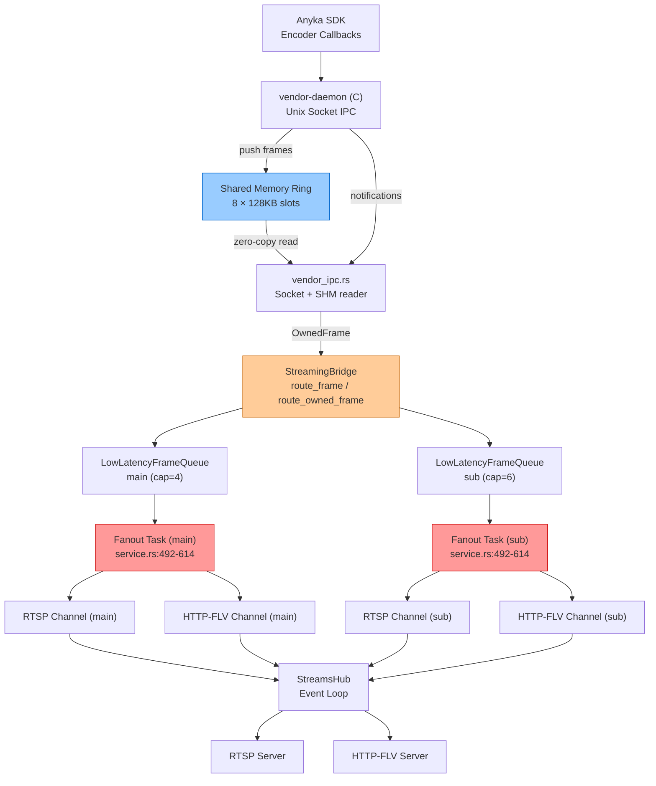
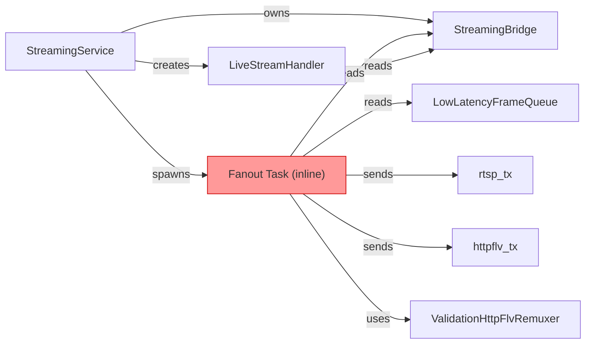
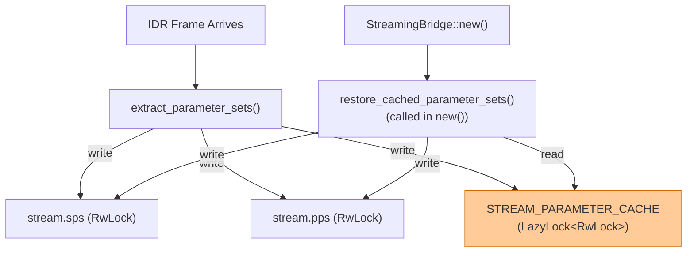
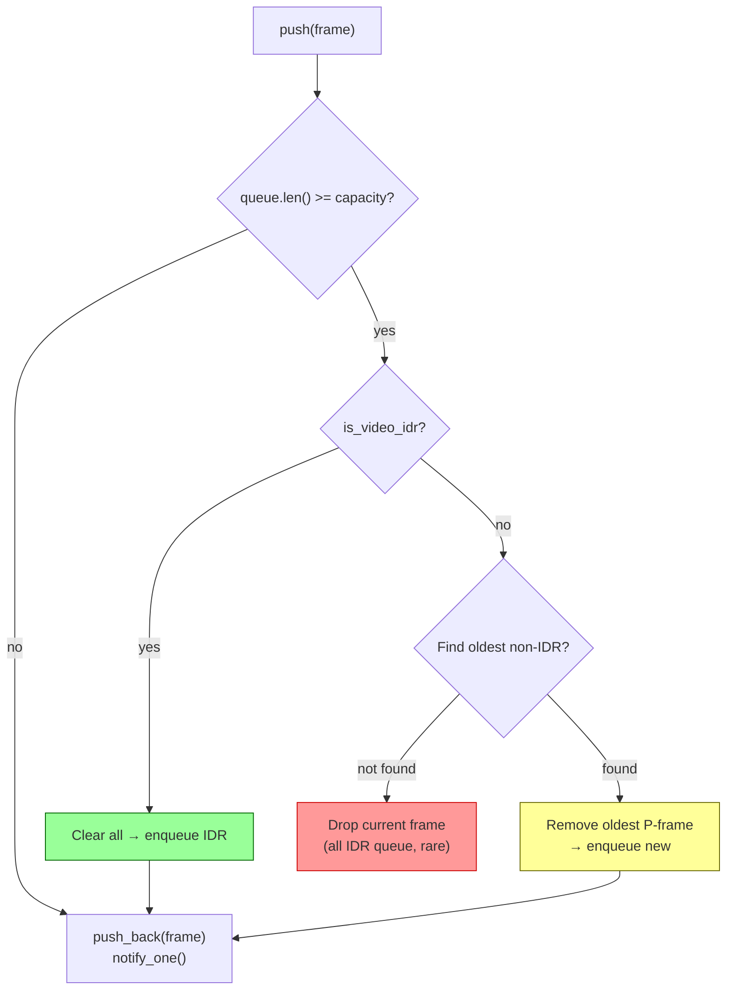
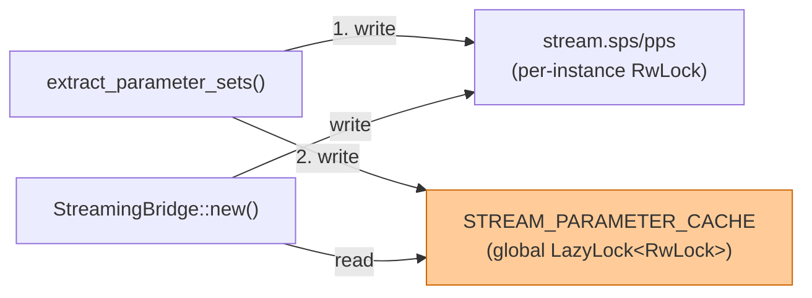
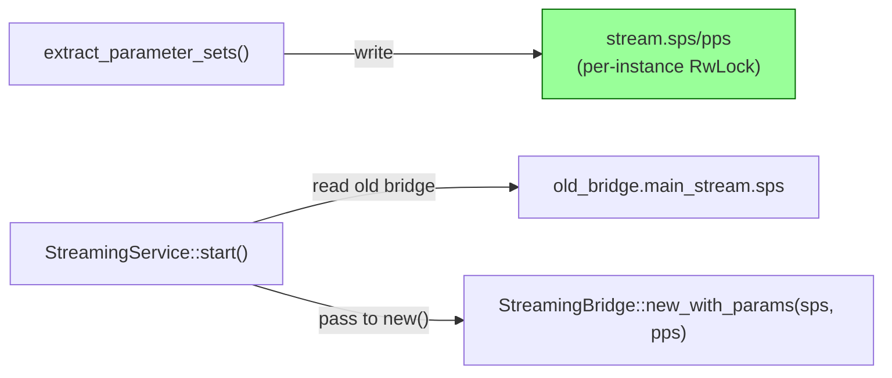
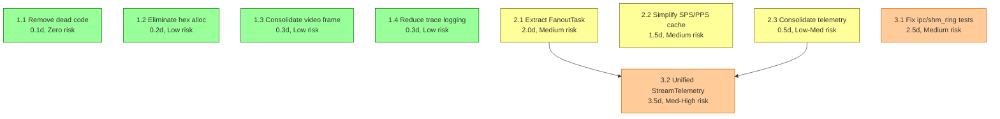
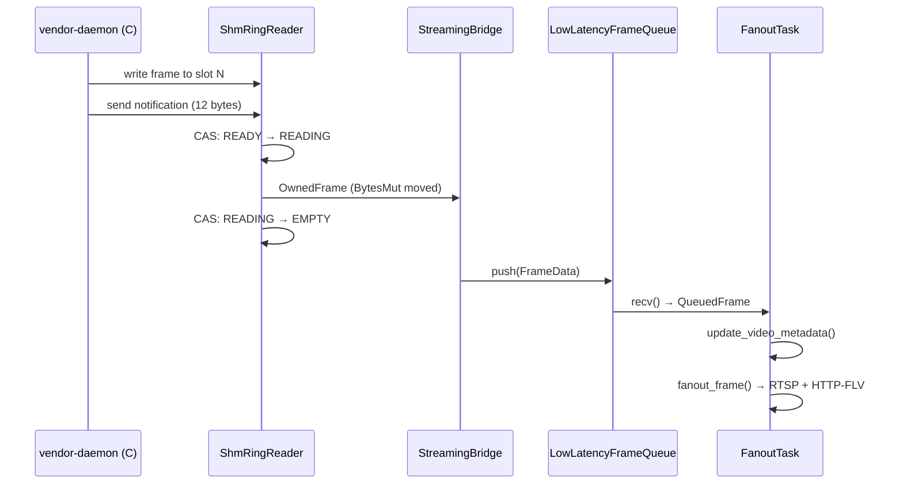

# Architectural Complexity Analysis & Simplification Roadmap

**Project**: onvif-rust RTSP/Video Pipeline on Anyka AK3918
**Date**: 2026-02-28
**Scope**: Streaming subsystem (~28K LOC across onvif-rust + streaming-lib)
**Target**: 32MB RAM embedded Linux platform

---

## 1. Executive Summary

The streaming subsystem delivers H.264 video from the Anyka SDK through a zero-copy shared memory ring buffer to RTSP and HTTP-FLV subscribers. The architecture is **fundamentally sound** — the IPC design, CAS-based lease access, and smart queue eviction are well-engineered for the constrained platform.

However, five complexity hotspots create maintenance burden, reduce testability, and consume unnecessary CPU/memory in the hot path:

### Top 5 Complexity Drivers

| Rank | Hotspot | Location | Impact |
|------|---------|----------|--------|
| 1 | **Fanout task inline closure** | `service.rs:492-614` | 122-line untestable async loop mixing 6 concerns |
| 2 | **NAL hex allocation in hot path** | `bridge.rs:545-568` | Heap allocations on every IDR for debug logging |
| 3 | **Dual-level SPS/PPS caching** | `bridge.rs` + global `LazyLock` | Per-stream `RwLock` + `LazyLock<RwLock>` for bridge reconstruction |
| 4 | **process_video_frame duplication** | `bridge.rs:424-489` | 63 lines of near-identical code in two methods |
| 5 | **3 ignored mmap tests** | `ipc/shm_ring.rs` | 23% of shm tests disabled due to file I/O race conditions |

### What's NOT Complex (Corrections)

These areas were evaluated and found to be well-designed:

- **RTP fragmentation**: Simple `if size <= MTU then Single else FU-A` dispatch — clean, RFC-compliant
- **Error handling**: Well-structured with `thiserror`, zero `unwrap()`/`expect()` in production code
- **Queue drop logic**: Clean 3-way branch (IDR flush / P-frame evict / drop current)
- **Unsafe blocks**: All 22 in `ipc/shm_ring.rs` have safety comments, all verified correct

### Proposed Actions

**9 simplification proposals** organized in 3 phases:

- **Phase 1** (1 day, zero risk): Remove dead code, eliminate hot-path allocations, consolidate duplicated methods → **-55 LOC**
- **Phase 2** (4 days, medium risk): Extract FanoutTask struct, simplify SPS/PPS caching, consolidate telemetry → **-95 LOC**
- **Phase 3** (6 days, medium-high risk): Fix ignored tests, unify stream telemetry → **+60 LOC**

**Net result**: -90 LOC, improved testability, no RFC impact.

---

## 2. Detailed Component Analysis

### 2.1 Frame Pipeline Architecture



### 2.2 Codebase Metrics

| File | LOC | Structs | Tests | Ignored | Complexity Rating |
|------|-----|---------|-------|---------|-------------------|
| `streaming/service.rs` | 841 | 2 | 9 | 0 | **Very High** (fanout closure) |
| `streaming/bridge.rs` | 1,183 | 6 | 24 | 0 | **High** (NAL parsing, queue, dual cache) |
| `streaming/helpers.rs` | 543 | 0 | 16 | 0 | Medium |
| `hal/anyka/ipc/shm_ring.rs` | 1,441 | 5 | 13 | 3 | **High** (atomics, unsafe, mmap) |
| `hal/vendor_ipc.rs` | 2,178 | — | — | — | Medium-High |
| `platform/anyka.rs` | 5,710 | 8 | — | — | High (cfg sprawl) |
| `platform/traits.rs` | 950 | 19 | — | — | Medium |
| `platform/stubs.rs` | 1,738 | — | — | — | Low (mirror) |
| streaming-lib `rtp_h264.rs` | 1,724 | 3 | 60+ | 0 | Medium |

---

### 2.3 Subsystem: Streaming Service (`service.rs`)

**Purpose**: Orchestrates RTSP + HTTP-FLV streaming lifecycle — creates StreamsHub, publishes streams, spawns servers, runs fanout tasks.

**Current State**:

- `StreamingService` manages 5 `JoinHandle`s (RTSP, HTTP-FLV, StreamsHub, main fanout, sub fanout)
- `LiveStreamHandler` implements `TStreamHandler` for late-joiner bootstrap (SPS/PPS + IDR delivery)
- The `publish_stream` method (lines 426-617) contains a 122-line inline async closure that is the #1 complexity hotspot

**Coupling Analysis**:



The fanout closure (lines 492-614) mixes **6 distinct concerns**:

1. Queue consumption (`bridge_queue.recv()`)
2. Queue lag tracking (`queue_delay_ms` threshold counting)
3. Video metadata updates (`bridge_ref.update_video_metadata()`)
4. Frame byte counting (`fanout_bytes`)
5. SPS/PPS change detection + HTTP-FLV remuxer refresh
6. Frame dispatch to RTSP + HTTP-FLV channels

**Dead Code** (lines 586-590):

```rust
// Track I-frames
if matches!(&frame, FrameData::Video { .. }) {
    // We can't easily distinguish I/P frames here, but we count video frames
    // in the periodic summary
}
```

This is a no-op block — the `if` body is empty. Pure dead code.

**RFC Compliance**: No RTSP/RTP protocol logic here — this is pure orchestration. No RFC impact from any changes.

---

### 2.4 Subsystem: Streaming Bridge (`bridge.rs`)

**Purpose**: Receives raw SDK frames via `FrameCallback` / `OwnedFrameCallback`, routes by `StreamId`, extracts SPS/PPS from IDR frames, manages per-stream queue state.

**Current State**:

- `StreamingBridge` implements both `FrameCallback` (copy path) and `OwnedFrameCallback` (zero-copy path)
- `LowLatencyFrameQueue` provides bounded, mutex-based queue with smart eviction
- `BytesMutPool` reduces malloc pressure on uClibc target
- Dual-level SPS/PPS caching: per-stream `RwLock` fields + global `LazyLock<RwLock<CachedStreamParameterSets>>`

**Complexity Hotspot #2: NAL Hex Allocation** (lines 545-550, 563-568):

```rust
// In extract_parameter_sets, for BOTH SPS and PPS:
let hex_prefix: String = nal
    .iter()
    .take(8)
    .map(|b| format!("{:02x}", b))
    .collect::<Vec<_>>()
    .join(" ");
tracing::debug!(
    size = nal.len(),
    hex_prefix = %hex_prefix,
    "SPS extracted/updated"
);
```

This allocates a `Vec<String>` and a joined `String` on every IDR frame (approximately once per second per stream). The allocation is unconditional — it runs even when `DEBUG` logging is disabled. The NAL size + type already provide sufficient diagnostic information.

**Complexity Hotspot #3: Dual-Level SPS/PPS Caching**:



The global cache exists to survive bridge reconstruction (when `StreamingService::start()` re-creates the bridge with new queue capacities). This is a workaround for the bridge being re-created with `Arc::new()` in `start()`. The pattern causes:

- Two write paths (per-stream + global) on every SPS/PPS update
- One read path (global → per-stream) on bridge construction
- Process-wide state that complicates test isolation (tests must manually clear it)

**Complexity Hotspot #4: Duplicated `process_video_frame` Methods**:

```rust
// Method 1: process_video_frame (lines 455-489) — used by route_frame (copy path)
fn process_video_frame(&self, stream: &StreamState, frame: &Frame, data: BytesMut, timestamp_ms: u32) {
    let stream_name = match frame.stream_id { ... };  // extra: stream name resolution
    stream.last_timestamp_ms.store(timestamp_ms, ...);
    tracing::trace!(stream = stream_name, ...);        // extra: stream name in log
    let frame_data = FrameData::Video { timestamp: timestamp_ms, data };
    stream.frame_queue.push(frame_data, timestamp_ms, frame.frame_type == FrameType::VideoIFrame);
}

// Method 2: process_owned_video_frame (lines 425-452) — used by route_owned_frame (zero-copy)
fn process_owned_video_frame(&self, stream: &StreamState, data: BytesMut, frame_type: FrameType, timestamp_ms: u32) {
    stream.last_timestamp_ms.store(timestamp_ms, ...);
    tracing::trace!(size = data.len(), ...);           // no stream name
    let frame_data = FrameData::Video { timestamp: timestamp_ms, data };
    stream.frame_queue.push(frame_data, timestamp_ms, frame_type == FrameType::VideoIFrame);
}
```

The core logic is identical: store timestamp → trace log → create `FrameData::Video` → push to queue. The only differences are the trace log fields and how `is_idr` is determined (both compare `FrameType::VideoIFrame`).

**RFC Compliance**: No RTP/RTSP protocol code. Annex-B NAL parsing follows ITU-T H.264 Annex B start code conventions correctly.

---

### 2.5 Subsystem: Streaming Helpers (`helpers.rs`)

**Purpose**: Shared utility functions for frame fanout, SDP generation, server spawning.

**Current State**:

- `fanout_frame()` dispatches to RTSP + HTTP-FLV channels with remuxing
- `generate_av_sdp()` builds SDP with proper profile-level-id and audio config
- Well-tested: 16 tests covering all code paths

**Complexity Hotspot #4 (minor): Verbose Fanout Trace Logging** (lines 33-49):

```rust
match &frame {
    FrameData::Video { timestamp, data } => {
        tracing::trace!(timestamp, size = data.len(), "Dispatching video frame to RTSP");
    }
    FrameData::Audio { timestamp, data } => {
        tracing::trace!(timestamp, size = data.len(), "Dispatching audio frame to RTSP");
    }
    _ => {}
}
```

Four match arms (two for RTSP dispatch, two for HTTP-FLV dispatch) that could be a single trace call with the frame variant name.

**RFC Compliance**: SDP generation follows RFC 4566 correctly. Profile-level-id encoding matches RFC 6184. Audio config follows RFC 3640 AAC-hbr mode.

---

### 2.6 Subsystem: Shared Memory Ring Buffer (`ipc/shm_ring.rs`)

**Purpose**: Zero-copy frame delivery from C vendor-daemon via POSIX shared memory with CAS-based lease access.

**Current State**:

- `ShmRingReader` manages mmap lifecycle with proper cleanup in `Drop`
- CAS state machine: EMPTY → WRITING → READY → READING → EMPTY
- All 22 unsafe blocks have safety comments and are verified correct
- Version 2 protocol adds diagnostic counters and wall-clock timing
- `FrameNotification` provides socket-based slot signaling

**Test Infrastructure Issues** (3 ignored tests):

| Test | Lines | Ignore Reason |
|------|-------|---------------|
| `test_open_invalid_magic` | 1033-1080 | `"Disabled due to intermittent segfault"` |
| `test_read_and_release_slot` | 1151-1290 | `"mmap test has race condition with file I/O in tests"` |
| `test_read_slot_into_bytesmut` | 1293-1360 | `"mmap test has race condition with file I/O in tests"` |

Root cause: Tests create temporary files, write headers via file I/O, then open the same file with `mmap()`. File I/O writes may not be visible to the mmap'd region due to kernel page cache timing. The `sync_all()` call in the test setup doesn't guarantee mmap visibility in all cases.

**Fix approach** (Phase 3.1): Replace file-backed mmap with anonymous mmap (`MAP_ANONYMOUS | MAP_SHARED`) and add `#[cfg(test)]` constructor `ShmRingReader::open_from_raw()` that accepts a pre-allocated memory region.

**Unsafe Block Inventory**:

| Location | Purpose | Safety Status |
|----------|---------|---------------|
| `open_path`: `libc::open` | Open shm file | Correct: CString ensures null-termination |
| `open_path`: `libc::fstat` | Get file size | Correct: valid fd, zeroed stat buf |
| `open_path`: `libc::mmap` | Map shared memory | Correct: verified size, proper flags |
| `open_path`: `libc::close` (×3) | Close on error | Correct: owned fd, error paths |
| `open_path`: `libc::munmap` | Unmap on error | Correct: owned mmap region |
| `header_from_ptr` | Cast mmap to struct | Correct: verified magic/version |
| `slot_header` | Index slot header | Correct: bounds checked by caller |
| `slot_data` | Index slot data | Correct: bounds within mmap |
| `write_seq_atomic` | Atomic field access | Correct: fixed offset, valid alignment |
| `read_seq_atomic` | Atomic field access | Correct: fixed offset |
| `flags_atomic` | Atomic field access | Correct: fixed offset |
| `slot_state_atomic` | Atomic CAS target | Correct: per-slot state field |
| `Drop::drop` | munmap + close | Correct: owned resources |

**RFC Compliance**: No protocol code. This is hardware abstraction.

---

### 2.7 Subsystem: Low-Latency Frame Queue (`bridge.rs:43-179`)

**Purpose**: Bounded, mutex-based frame queue with intelligent eviction strategy.

**Current State** — well-designed eviction logic:



The `QueueTelemetry` struct tracks enqueued/dequeued/dropped counts with atomics. The `maybe_log_telemetry()` method fires every 500 enqueue events. This is clean and well-structured — no simplification needed for the queue itself.

The telemetry reporting is split between:

- `QueueTelemetry` in `bridge.rs` (queue-level: enqueued/dequeued/dropped)
- Fanout counters in `service.rs:496-500` (fanout-level: frame count, bytes, lag)

This split is the basis for Phase 2.3 (consolidate) and Phase 3.2 (unify).

---

## 3. Proposed Simplifications

### Phase 1: Low Risk, High Impact (~1 developer-day)

All Phase 1 items are independent and can be implemented in parallel.

---

#### Proposal 1.1: Remove Dead I-Frame Tracking Code

**Location**: `service.rs:586-590`
**LOC Delta**: -5
**Risk**: None
**Effort**: 0.1 days

**Before** (current code):

```rust
// Track I-frames
if matches!(&frame, FrameData::Video { .. }) {
    // We can't easily distinguish I/P frames here, but we count video frames
    // in the periodic summary
}
```

**After**: Delete these 5 lines entirely. The `if` body is empty — this is dead code from an earlier iteration where I-frame tracking was planned but never implemented. The comment itself documents why it can't work.

---

#### Proposal 1.2: Eliminate Hex Formatting Allocation in `extract_parameter_sets`

**Location**: `bridge.rs:545-550` (SPS) and `bridge.rs:563-568` (PPS)
**LOC Delta**: -10
**Risk**: Low (diagnostic change only)
**Effort**: 0.2 days

**Before** (current code, runs on every IDR frame ~1/sec/stream):

```rust
7 => {
    // SPS
    let hex_prefix: String = nal
        .iter()
        .take(8)
        .map(|b| format!("{:02x}", b))
        .collect::<Vec<_>>()
        .join(" ");
    tracing::debug!(
        size = nal.len(),
        hex_prefix = %hex_prefix,
        "SPS extracted/updated"
    );
    // ...
}
```

**After** (Option A — remove hex entirely, keep size + type):

```rust
7 => {
    // SPS
    tracing::debug!(size = nal.len(), "SPS extracted/updated");
    // ...
}
```

**After** (Option B — gate behind tracing level check, zero-cost when disabled):

```rust
7 => {
    // SPS
    if tracing::enabled!(tracing::Level::DEBUG) {
        let hex_prefix: String = nal.iter().take(8)
            .map(|b| format!("{:02x}", b))
            .collect::<Vec<_>>()
            .join(" ");
        tracing::debug!(size = nal.len(), hex_prefix = %hex_prefix, "SPS extracted/updated");
    } else {
        tracing::debug!(size = nal.len(), "SPS extracted/updated");
    }
    // ...
}
```

**Recommendation**: Option A. The NAL size is sufficient for diagnostics. SPS/PPS content can be inspected via Wireshark when needed. The hex prefix provides marginal value but costs 2 heap allocations per IDR frame.

---

#### Proposal 1.3: Consolidate `process_video_frame` / `process_owned_video_frame`

**Location**: `bridge.rs:424-489`
**LOC Delta**: -25
**Risk**: Low
**Effort**: 0.3 days

**Before** — two methods with near-identical logic:

```rust
// 63 lines total across both methods. Core logic is identical:
// 1. Store timestamp
// 2. Trace log
// 3. Create FrameData::Video
// 4. Push to queue with is_idr flag
```

**After** — single shared method:

```rust
/// Enqueue a video frame into the stream's low-latency queue.
fn enqueue_video(
    &self,
    stream: &StreamState,
    data: BytesMut,
    frame_type: FrameType,
    timestamp_ms: u32,
) {
    stream
        .last_timestamp_ms
        .store(timestamp_ms, portable_atomic::Ordering::Relaxed);

    tracing::trace!(
        size = data.len(),
        timestamp_ms,
        frame_type = ?frame_type,
        "Video frame enqueued"
    );

    let frame_data = FrameData::Video {
        timestamp: timestamp_ms,
        data,
    };
    stream.frame_queue.push(
        frame_data,
        timestamp_ms,
        frame_type == FrameType::VideoIFrame,
    );
}
```

Then `process_video_frame` and `process_owned_video_frame` both call `self.enqueue_video(stream, data, frame.frame_type, timestamp_ms)`. The `stream_name` trace field from `process_video_frame` is dropped (it's only visible at TRACE level and the queue label already identifies the stream).

---

#### Proposal 1.4: Reduce Fanout Trace Logging Verbosity

**Location**: `helpers.rs:33-49` and `helpers.rs:55-71`
**LOC Delta**: -15
**Risk**: Low (trace-level only)
**Effort**: 0.3 days

**Before** — 4 match arms for RTSP + HTTP-FLV dispatch logging:

```rust
match &frame {
    FrameData::Video { timestamp, data } => {
        tracing::trace!(timestamp, size = data.len(), "Dispatching video frame to RTSP");
    }
    FrameData::Audio { timestamp, data } => {
        tracing::trace!(timestamp, size = data.len(), "Dispatching audio frame to RTSP");
    }
    _ => {}
}
```

**After** — single trace with frame variant name:

```rust
tracing::trace!(
    frame_type = match &frame {
        FrameData::Video { .. } => "video",
        FrameData::Audio { .. } => "audio",
        _ => "other",
    },
    "Dispatching frame to RTSP"
);
```

The per-frame timestamp and size are already logged upstream in the fanout task. Duplicating them at TRACE level in the dispatch function adds no diagnostic value.

---

### Phase 2: Medium Effort, Medium Risk (~4 developer-days)

---

#### Proposal 2.1: Extract `FanoutTask` Struct from Inline Closure

**Location**: `service.rs:492-614`
**LOC Delta**: +50/-120 (net: -70 after removing closure variables)
**Risk**: Medium (async task restructuring)
**Effort**: 2.0 days

The 122-line inline closure currently captures 10 variables and mixes 6 concerns in a single `loop {}`. Extracting it into a named struct enables unit testing of each concern independently.

**Proposed struct**:

```rust
/// Fanout task that routes frames from a bridge queue to RTSP and HTTP-FLV channels.
struct FanoutTask {
    bridge: Arc<StreamingBridge>,
    bridge_queue: Arc<LowLatencyFrameQueue>,
    is_main: bool,
    stream_name: String,
    rtsp_tx: mpsc::UnboundedSender<FrameData>,
    httpflv_tx: mpsc::UnboundedSender<FrameData>,

    // Mutable state
    httpflv_remuxer: Option<ValidationHttpFlvRemuxer>,
    cached_sps: Option<Vec<u8>>,
    cached_pps: Option<Vec<u8>>,
    frame_count: u64,
    total_bytes: u64,
    first_frame_logged: bool,
    lag_over_250ms: u64,
    lag_over_500ms: u64,
}

impl FanoutTask {
    /// Main loop — consumes frames from bridge queue and fans out.
    async fn run(&mut self) { /* main loop, ~30 lines */ }

    /// Check if SPS/PPS changed and refresh the HTTP-FLV remuxer.
    fn update_remuxer(&mut self) { /* ~20 lines */ }

    /// Record queue lag threshold crossing.
    fn record_lag(&mut self, delay_ms: u64) { /* ~5 lines */ }

    /// Emit periodic telemetry (every 300 frames).
    fn emit_telemetry(&self) { /* ~10 lines */ }
}
```

**Testing benefit**: Each method can be tested independently:

- `update_remuxer()` can be tested with mock SPS/PPS changes
- `record_lag()` can be tested with various delay values
- `emit_telemetry()` can be tested for correct counter reporting

---

#### Proposal 2.2: Simplify SPS/PPS Dual-Level Caching

**Location**: `bridge.rs:181-194` (global static) + `bridge.rs:586-603` (write) + `bridge.rs:635-656` (restore)
**LOC Delta**: -30
**Risk**: Medium (requires integration testing for bridge reconstruction scenario)
**Effort**: 1.5 days

**Current architecture** — dual write on every SPS/PPS update:



**Proposed architecture** — pass cached values as constructor parameters:



The `StreamingService::start()` method already has access to the old bridge before creating the new one. It can read the cached SPS/PPS from the old bridge and pass them to the new bridge's constructor, eliminating the global static entirely.

**Changes**:

1. Delete `STREAM_PARAMETER_CACHE`, `CachedParameterSets`, `CachedStreamParameterSets`
2. Delete `restore_cached_parameter_sets()`
3. Remove global cache write from `extract_parameter_sets()`
4. Add `new_with_cached_params(main_sps, main_pps, sub_sps, sub_pps, ...)` to `StreamingBridge`
5. In `StreamingService::start()`, read old bridge params before creating new bridge

---

#### Proposal 2.3: Consolidate Queue Telemetry Accounting

**Location**: `bridge.rs:75-125` (push method telemetry)
**LOC Delta**: -10/+15 (net: +5)
**Risk**: Low-Medium
**Effort**: 0.5 days

**Current state**: The `push()` method performs 4 separate atomic increments, then calls `notify.notify_one()`, then `maybe_log_telemetry()`. Each dropped frame path has its own telemetry increment pattern.

**Proposed**: Extract telemetry into a method:

```rust
impl QueueTelemetry {
    /// Record a push event with overflow/flush tracking.
    fn record_push(
        &self,
        dropped_on_overflow: u64,
        dropped_on_flush: u64,
        depth: usize,
    ) {
        self.enqueued.fetch_add(1, Ordering::Relaxed);
        if dropped_on_overflow > 0 {
            self.dropped_on_overflow.fetch_add(dropped_on_overflow, Ordering::Relaxed);
        }
        if dropped_on_flush > 0 {
            self.dropped_on_flush.fetch_add(dropped_on_flush, Ordering::Relaxed);
        }
        self.max_depth.fetch_max(depth, Ordering::Relaxed);
    }
}
```

This consolidates the telemetry accounting into a single call site, making the `push()` method's logic clearer.

---

### Phase 3: Higher Effort, Strategic Value (~6 developer-days)

---

#### Proposal 3.1: Fix `ipc/shm_ring.rs` Ignored Test Infrastructure

**Location**: `ipc/shm_ring.rs` tests (lines 1033, 1151, 1293)
**LOC Delta**: +80/-60 (net: +20)
**Risk**: Medium (test infrastructure change)
**Effort**: 2.5 days

**Root cause**: File-backed mmap tests have race conditions between file I/O writes and mmap visibility.

**Solution**: Replace file-backed test setup with anonymous mmap:

```rust
#[cfg(test)]
impl ShmRingReader {
    /// Create a reader from pre-allocated anonymous memory (for testing).
    ///
    /// # Safety
    /// The caller must ensure `base` points to a valid, correctly-sized
    /// memory region with a properly initialized ring header.
    unsafe fn open_from_raw(base: *mut u8, size: usize) -> Self {
        Self {
            base,
            size,
            fd: -1, // No file descriptor for anonymous mmap
            local_read_seq: 0,
        }
    }
}

/// Test helper: create anonymous mmap with valid ring buffer layout.
fn create_test_ring_anonymous() -> (*mut u8, usize) {
    let base = unsafe {
        libc::mmap(
            std::ptr::null_mut(),
            VD_SHM_TOTAL_SIZE,
            libc::PROT_READ | libc::PROT_WRITE,
            libc::MAP_ANONYMOUS | libc::MAP_SHARED,
            -1,
            0,
        )
    };
    assert_ne!(base, libc::MAP_FAILED);

    // Write header directly to mmap'd memory
    let header = base as *mut RingHeader;
    unsafe {
        (*header).magic = VD_SHM_MAGIC;
        (*header).version = VD_SHM_VERSION;
        // ... initialize remaining fields
    }

    (base as *mut u8, VD_SHM_TOTAL_SIZE)
}
```

This eliminates the file I/O → mmap race condition entirely, since both the test setup and the reader operate on the same mmap'd memory region.

**Note**: The `Drop` implementation must be updated to handle `fd == -1` (skip `libc::close` for anonymous mmap).

---

#### Proposal 3.2: Introduce Unified `StreamTelemetry` Struct

**Location**: New file `streaming/telemetry.rs`
**LOC Delta**: +120/-80 (net: +40)
**Risk**: Medium-High (cross-module refactoring)
**Effort**: 3.5 days
**Dependencies**: Requires 2.1 (FanoutTask) + 2.3 (queue telemetry consolidation)

**Current state** — telemetry is split across two modules:

| Metric | Current Location | Tracking Mechanism |
|--------|-----------------|-------------------|
| `enqueued` | `bridge.rs` QueueTelemetry | `AtomicU64` |
| `dequeued` | `bridge.rs` QueueTelemetry | `AtomicU64` |
| `dropped_on_overflow` | `bridge.rs` QueueTelemetry | `AtomicU64` |
| `dropped_on_flush` | `bridge.rs` QueueTelemetry | `AtomicU64` |
| `max_depth` | `bridge.rs` QueueTelemetry | `AtomicUsize` |
| `frame_count` | `service.rs` fanout closure | `u64` local |
| `total_bytes` | `service.rs` fanout closure | `u64` local |
| `lag_over_250ms` | `service.rs` fanout closure | `u64` local |
| `lag_over_500ms` | `service.rs` fanout closure | `u64` local |

**Proposed**: Unified `StreamTelemetry` that owns both queue-level and fanout-level counters:

```rust
/// Per-stream telemetry counters for monitoring frame pipeline health.
pub struct StreamTelemetry {
    // Queue-level (written by bridge, read by fanout)
    pub enqueued: AtomicU64,
    pub dequeued: AtomicU64,
    pub dropped_on_overflow: AtomicU64,
    pub dropped_on_flush: AtomicU64,
    pub max_depth: AtomicUsize,

    // Fanout-level (written by fanout task, read by telemetry reporter)
    pub frames_fanned_out: AtomicU64,
    pub bytes_fanned_out: AtomicU64,
    pub lag_over_250ms: AtomicU64,
    pub lag_over_500ms: AtomicU64,
}
```

This enables a single telemetry snapshot for each stream, simplifying monitoring and debugging.

---

## 4. Refactoring Roadmap

### Dependency Graph



### Phase Execution Plan

| Phase | Items | Effort | Risk | Net LOC | Validation |
|-------|-------|--------|------|---------|------------|
| **Phase 1** | 1.1, 1.2, 1.3, 1.4 | ~1 day | Zero-to-Low | **-55** | `cargo test --lib` + `cargo clippy` |
| **Phase 2** | 2.1, 2.2, 2.3 | ~4 days | Medium | **-95** | Unit tests + hardware RTSP/FLV playback |
| **Phase 3** | 3.1, 3.2 | ~6 days | Medium-High | **+60** | `cargo test -- --include-ignored` + E2E |
| **Total** | **9 proposals** | **~11 days** | | **-90** | |

---

## 5. Backwards Compatibility & Migration

### Critical Files Affected

| File | Proposals | Phase(s) |
|------|-----------|----------|
| `src/streaming/service.rs` | 1.1, 2.1, 3.2 | 1, 2, 3 |
| `src/streaming/bridge.rs` | 1.2, 1.3, 2.2, 2.3, 3.2 | 1, 2, 3 |
| `src/streaming/helpers.rs` | 1.4 | 1 |
| `src/hal/anyka/ipc/shm_ring.rs` | 3.1 | 3 |
| `src/streaming/mod.rs` | 3.2 (new `telemetry.rs`) | 3 |

### RFC Compliance Matrix

All 9 proposals have **zero RFC impact**:

| Standard | Affected? | Rationale |
|----------|-----------|-----------|
| RFC 3550 (RTP) | No | No changes to RTP packet format or timing |
| RFC 6184 (H.264 RTP) | No | No changes to fragmentation (Single NAL / FU-A) |
| RFC 7826 (RTSP 2.0) | No | No changes to RTSP session semantics |
| RFC 4566 (SDP) | No | No changes to SDP generation |
| RFC 3640 (AAC RTP) | No | No changes to audio packaging |
| ITU-T H.264 Annex B | No | NAL parsing unchanged |

### Public API Stability

| API | Status | Notes |
|-----|--------|-------|
| `StreamingBridge::new()` | **Modified in 2.2** | Add `new_with_cached_params()`, deprecate old signature |
| `StreamingBridge::route_frame()` | Unchanged | |
| `StreamingBridge::route_owned_frame()` | Unchanged | |
| `StreamingService::start()` | Unchanged (internal refactoring) | |
| `LowLatencyFrameQueue::push()` | Unchanged | Internal telemetry call extracted |
| `ShmRingReader::open()` | Unchanged | |
| `ShmRingReader::open_from_raw()` | **New in 3.1** (`#[cfg(test)]` only) | Test-only API |

### Migration Notes

- **Phase 1**: No migration needed. All changes are internal refactoring.
- **Phase 2.2**: If any external code creates `StreamingBridge` directly (unlikely — only `StreamingService` does), it needs updating. The old `new()` can be preserved as a thin wrapper.
- **Phase 3.1**: Test-only changes. No production code migration.
- **Phase 3.2**: `QueueTelemetry` struct moves to new module. If any code accesses telemetry directly (none currently does), it needs updating.

---

## 6. Verification Strategy

### Per-Phase Validation

**Phase 1** (all items):

```bash
cargo test --lib                    # All 50+ streaming tests pass
cargo clippy -- -D warnings         # Zero warnings
cargo fmt --check                   # Formatting clean
```

**Phase 2** (structural changes):

```bash
cargo test --lib                    # All tests + new FanoutTask tests
cargo test -- test_fanout           # Specifically verify fanout behavior
cargo test -- test_bridge           # Bridge routing + SPS/PPS caching

# Hardware validation:
# 1. VLC RTSP connect to main + sub streams
# 2. HTTP-FLV playback via browser
# 3. Mid-stream reconnect → verify SPS/PPS delivery
```

**Phase 3** (test infrastructure + telemetry):

```bash
cargo test -- --include-ignored     # All 3 previously-ignored tests pass
cargo test -- test_shm              # SHM-specific validation
cargo test -- test_telemetry        # New telemetry tests
```

### End-to-End Validation (All Phases)

1. Deploy to AK3918 via SD card
2. RTSP stream to VLC at 1080p 25fps — verify <100ms latency
3. HTTP-FLV playback via browser — verify smooth video
4. Mid-stream reconnect — verify SPS/PPS delivery to late joiners
5. Memory footprint check — must remain <8MB for onvif-rust binary
6. Run for 24h stability test — no memory growth, no panics

---

## Appendix A: Data Flow Detail

### Frame Copy Path (Legacy)

```
SDK callback → vendor_ipc.rs (socket read) → memcpy into BytesMut
  → StreamingBridge::route_frame() → memcpy into BytesMut
    → LowLatencyFrameQueue::push()
      → Fanout Task: recv() → dispatch to RTSP + HTTP-FLV channels
```

**Copies**: 2 (socket → BytesMut → queue)

### Frame Zero-Copy Path (Current)

```
SDK callback → vendor-daemon → write to shm slot
  → notification via socket (12 bytes)
    → ShmRingReader::read_slot_into_bytesmut() → memcpy shm→BytesMut (1 copy)
      → StreamingBridge::route_owned_frame() → move BytesMut (0 copies)
        → LowLatencyFrameQueue::push()
          → Fanout Task: recv() → dispatch to RTSP + HTTP-FLV channels
```

**Copies**: 1 (shm → BytesMut)

### Push-Only Delivery Model


