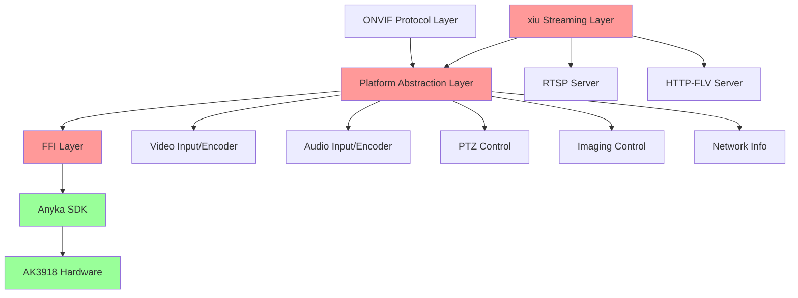

# Epic Brief: Anyka Hardware Integration

## Summary

The ONVIF Rust implementation currently operates entirely on stub/mock implementations for all hardware interactions (video, audio, PTZ, imaging). This prevents deployment to actual Anyka AK3918 camera hardware and blocks real-world validation of the ONVIF 24.12 compliance work. We need to replace all stub implementations with real Anyka SDK integrations across the entire platform abstraction layer, enabling the ONVIF server to control actual camera hardware. Additionally, we need to integrate streaming protocols (RTSP, HTTP-FLV with MSE) using the xiu media server components to provide both ONVIF-compliant streaming and browser-compatible playback. This integration must be extremely memory-efficient (24MB total budget) and performance-optimized for the severely resource-constrained AK3918 embedded environment (32MB RAM total), with comprehensive testing to ensure production readiness.

## Context & Problem

**Who's Affected:**

- **Firmware developers** who need to deploy and test ONVIF functionality on actual AK3918 hardware
- **QA/validation teams** who cannot perform real-world compliance testing with stub implementations
- **End users** who need a working ONVIF-compliant IP camera with full hardware control
- **Integration partners** who require validated hardware integration before deployment

**Current State:**  
The project has a well-architected platform abstraction layer (file:cross-compile/onvif-rust/src/platform/) with:

- ✅ Complete trait definitions for all hardware interfaces
- ✅ Fully functional stub implementations for testing
- ✅ Partial FFI layer with basic wrappers (file:cross-compile/onvif-rust/src/ffi/)
- ⚠️ Skeleton Anyka implementation with TODO markers (file:cross-compile/onvif-rust/src/platform/anyka.rs)
- ⚠️ No actual hardware integration - all operations are simulated

**The Pain:**

1. **Cannot deploy to hardware**: The ONVIF server runs but doesn't control any real camera functions
2. **Cannot validate compliance**: ONVIF 24.12 conformance testing requires real hardware responses
3. **Cannot test performance**: Memory usage, latency, and throughput are unknown on actual hardware
4. **Cannot verify stability**: Hardware failure modes, resource leaks, and edge cases are untested
5. **No browser streaming**: ONVIF RTSP requires VLC/specialized clients; browsers need HTTP-FLV or WebRTC
6. **Blocks production readiness**: No path to deployment without hardware integration and streaming protocols

**Where in the Product:**  
This affects the entire platform abstraction layer that sits between the ONVIF protocol handlers and the hardware:

**Root Cause:**  
The platform abstraction was intentionally designed with stubs to enable ONVIF protocol development without hardware dependencies. Now that the protocol layer is mature, the hardware integration has become the critical path to production deployment.

## Scope

**In Scope:**

*Hardware Integration:*

- Complete FFI bindings for all Anyka SDK APIs (video, audio, PTZ, imaging)
- Safe Rust wrapper layer with proper error handling and resource management
- Full implementation of all platform traits in file:cross-compile/onvif-rust/src/platform/anyka.rs
- Vendor header preparation and consolidation

*Streaming Protocols:*

- Create new workspace member: cross-compile/streaming-lib/ (forked from xiu with attribution)
- Copy minimal xiu components: RTSP, HTTP-FLV, and required dependencies only
- Apply ARMv5TEJ patches (portable-atomic, openssl-src for uClibc)
- RTSP server implementation (ONVIF-compliant streaming)
- HTTP-FLV server with MSE support (browser-compatible streaming)
- Protocol conversion and stream routing
- Shared hardware access coordination between ONVIF and streaming layers
- Single unified executable architecture (maximize memory sharing and zero-copy)

*Testing & Validation:*

- Comprehensive test suite (unit tests with mocks + integration tests on hardware)
- Memory profiling and optimization for 24MB budget (8MB ONVIF + 16MB streaming)
- Performance benchmarking and latency optimization
- Browser compatibility validation (MSE support: Chrome, Firefox, Safari, Edge)

*Documentation:*

- Integration guide for hardware and streaming components
- Memory management patterns and optimization strategies
- API documentation for platform abstraction and streaming interfaces

**Out of Scope:**

- Changes to ONVIF protocol layer (already implemented)
- New ONVIF features beyond 24.12 compliance
- Hardware modifications or firmware updates to AK3918
- Alternative hardware platforms (focus is AK3918 only)
- Production deployment infrastructure (SD card system already exists)
- WebRTC implementation (deferred due to complexity and resource constraints)
- HLS implementation (deferred; HTTP-FLV provides better latency for embedded use)
- RTMP server (not required for ONVIF or browser streaming)
- Multiple executable architecture (using single unified binary for memory efficiency)
- Full xiu library (copying only minimal required components)

## Success Metrics

**Technical Validation:**

- All ONVIF services operate with real hardware (zero stub usage in production build)
- Memory usage stays within AK3918 constraints (< 24MB total: 8MB ONVIF + 16MB streaming)
- Video streaming latency < 100ms end-to-end for RTSP
- HTTP-FLV latency < 3 seconds (acceptable for browser streaming)
- All unit tests pass (100% success rate)
- Integration tests validate against reference C implementations
- Zero memory leaks detected in 24-hour stress test
- Zero resource leaks (file descriptors, SDK handles)
- Browser streaming validated on Chrome, Firefox, Safari, Edge (desktop and mobile)

**Functional Validation:**

- Dual video encoders: 1080p@25fps (Main) and 720p@30fps (Sub) simultaneously
- HTTP-FLV streaming works in modern browsers (Chrome, Firefox, Safari, Edge)
- Audio encoding: AAC only (512KB footprint, optimized for browsers)
- PTZ control responds within 200ms
- Imaging settings apply correctly and persist
- Network configuration reads system state accurately
- All ONVIF conformance tests pass with real hardware (note: AAC audio may limit client compatibility)
- Maximum 4 concurrent streaming clients supported (guaranteed stability)
- Stream switching between protocols without hardware reinitialization

## Constraints

**Memory Constraints:**

- AK3918 has severely limited RAM (32MB total, shared with video buffers and system)
- ONVIF server must operate in < 8MB footprint (control plane only)
- Streaming layer must operate in < 16MB footprint (media plane)
  - Dual video encoders: 6-8MB (1080p + 720p simultaneous)
  - Single audio encoder: 512KB (AAC only)
  - Network buffers: ~1.3MB (4 clients × 320KB per client)
  - Protocol overhead: ~2MB (RTSP + HTTP-FLV servers)
  - Remaining: ~4-6MB buffer headroom
- Total application budget: 24MB (leaving 8MB for system and buffers)
- Maximum 4 concurrent streaming clients (hard limit for stability)
- Zero-copy strategies MANDATORY where possible
- Efficient buffer management CRITICAL for survival
- xiu components must use patched versions with portable-atomic (ARMv5TEJ lacks 64-bit atomics)
- Shared memory pools between ONVIF and streaming layers where feasible
- Frame delivery via zero-copy callback interface (read-only pointers)

**Performance Constraints:**

- Real-time video encoding cannot be interrupted
- PTZ commands must be responsive (< 200ms)
- Audio capture must maintain continuous stream
- Network operations must not block video pipeline

**Platform Constraints:**

- Custom ARM uClibc toolchain (file:toolchain/arm-anykav200-crosstool-ng/)
- ARMv5TEJ architecture (no 64-bit atomic operations)
- Cross-compilation required for all development
- SD card deployment system for testing
- Limited debugging capabilities on embedded target
- Single unified executable architecture (onvif-server binary)
- streaming-lib workspace member (cross-compile/streaming-lib/)
  - Forked from xiu with MIT license attribution
  - Minimal components only (RTSP, HTTP-FLV, dependencies)
  - ARMv5TEJ patches applied (portable-atomic, openssl-src)
  - Cannot use upstream xiu crates directly from crates.io

