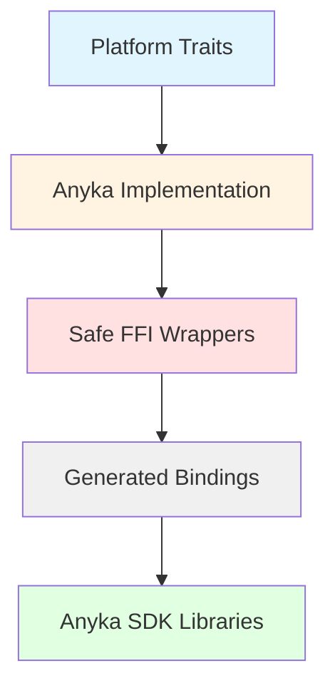
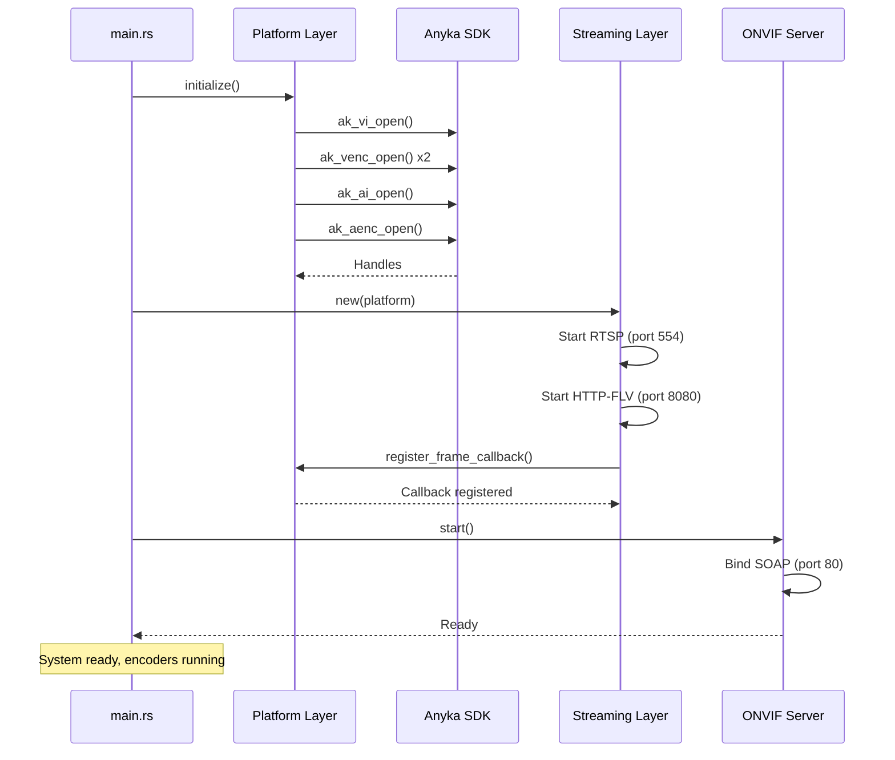
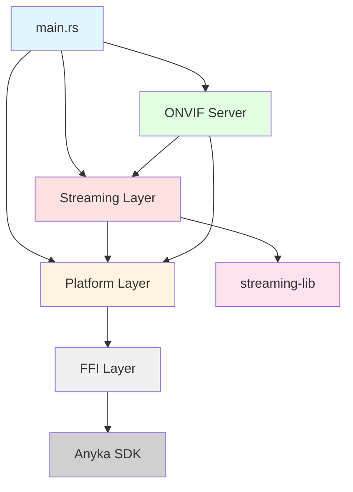

# Tech Plan: Hardware Integration and Streaming Architecture

## Overview

This technical plan defines the architecture for integrating Anyka AK3918 hardware with the ONVIF Rust implementation and adding streaming protocols (RTSP, HTTP-FLV) using components from the xiu media server. The design prioritizes memory efficiency (24MB budget), zero-copy frame delivery, and maintainable code organization.

**Target Platform:** Anyka AK3918 (ARMv5TEJ, 32MB RAM, uClibc)
**Memory Budget:** 24MB total (8MB ONVIF + 16MB streaming)
**Architecture:** Single unified executable with always-on streaming servers

---

## 1. Architectural Approach

### 1.1 FFI Layer Architecture

The FFI layer provides safe Rust wrappers around the Anyka SDK C libraries. We use bindgen to generate raw bindings, then wrap them with safe, idiomatic Rust APIs.

#### Layer Structure



#### Module Organization

**Modular FFI wrappers organized by subsystem:**

```
src/ffi/
├── mod.rs              # Public exports and common types
├── generated.rs        # Re-export bindgen output
├── video.rs            # Safe wrappers for ak_vi_*, ak_venc_*
├── audio.rs            # Safe wrappers for ak_ai_*, ak_aenc_*
├── ptz.rs              # Safe wrappers for ak_drv_ptz_*
└── imaging.rs          # Safe wrappers for imaging SDK
```

**Rationale:**
- Clear separation by hardware subsystem
- Easier to maintain and test
- Parallel development possible
- Matches platform trait organization

#### Safe Wrapper Pattern

Each FFI wrapper module follows this pattern:

```rust
// Example: ffi/video.rs
use super::generated::*;
use crate::platform::PlatformError;

pub struct VideoInputHandle(*mut c_void);

impl VideoInputHandle {
    pub fn open(device: VideoDevType) -> Result<Self, PlatformError> {
        unsafe {
            let handle = ak_vi_open(device as i32);
            if handle.is_null() {
                Err(PlatformError::HardwareFailure("ak_vi_open failed".into()))
            } else {
                Ok(Self(handle))
            }
        }
    }
    
    pub fn set_channel_attr(&self, attr: &VideoChannelAttr) -> Result<(), PlatformError> {
        unsafe {
            let ret = ak_vi_set_channel_attr(self.0, attr);
            check_result(ret, "ak_vi_set_channel_attr")
        }
    }
}

impl Drop for VideoInputHandle {
    fn drop(&mut self) {
        unsafe { ak_vi_close(self.0); }
    }
}
```

**Key Patterns:**
- **RAII handles**: Automatic resource cleanup via Drop
- **Error conversion**: C error codes → `Result<T, PlatformError>`
- **Null safety**: Check null pointers before wrapping
- **Type safety**: Wrap raw pointers in newtype structs

#### Error Handling Strategy

**SDK Error Codes → Rust Result:**

```rust
fn check_result(ret: i32, context: &str) -> Result<(), PlatformError> {
    match ret {
        AK_SUCCESS => Ok(()),
        AK_FAILED => Err(PlatformError::HardwareFailure(context.into())),
        _ => Err(PlatformError::HardwareFailure(
            format!("{}: error code {}", context, ret)
        )),
    }
}
```

**Error propagation:**
- FFI layer: Convert SDK errors to `PlatformError`
- Platform layer: Propagate `PlatformError` to ONVIF layer
- ONVIF layer: Convert `PlatformError` to SOAP faults

---

### 1.2 streaming-lib Architecture

The streaming-lib is a new workspace member created by extracting minimal components from xiu and applying ARMv5TEJ patches.

#### Workspace Structure

```
cross-compile/
├── onvif-rust/              # Main ONVIF server
│   ├── Cargo.toml
│   │   [dependencies]
│   │   streaming-lib = { path = "../streaming-lib" }
│   └── src/
│       ├── main.rs          # Unified entry point
│       ├── onvif/           # ONVIF protocol layer
│       ├── platform/        # Hardware abstraction
│       └── streaming/       # NEW: Streaming integration
│           ├── mod.rs       # Public API
│           ├── rtsp.rs      # RTSP server wrapper
│           └── httpflv.rs   # HTTP-FLV server wrapper
│
└── streaming-lib/           # NEW: Forked from xiu
    ├── Cargo.toml           # Library crate (no [[bin]])
    ├── LICENSE              # xiu MIT license
    ├── NOTICE               # Attribution file
    ├── README.md            # Fork documentation
    └── src/
        ├── lib.rs           # Public API
        ├── rtsp/            # From xiu/protocol/rtsp
        ├── httpflv/         # From xiu/protocol/httpflv
        ├── codec/           # From xiu/library/codec/h264
        ├── container/       # From xiu/library/container/flv
        ├── streamhub/       # From xiu/library/streamhub
        ├── bytesio/         # From xiu/library/bytesio
        └── common/          # From xiu/library/common
```

#### Workspace Root Configuration

**Create cross-compile/Cargo.toml:**

```toml
[workspace]
members = ["onvif-rust", "streaming-lib"]
resolver = "2"

[patch.crates-io]
# ARMv5TEJ compatibility patches (from xiu)
webrtc-util = { path = "xiu/patches/webrtc-util-0.7.0-full" }
webrtc-ice = { path = "xiu/patches/webrtc-ice-0.9.1-full" }
webrtc-sctp = { path = "xiu/patches/webrtc-sctp-0.8.0-full" }
rtp = { path = "xiu/patches/rtp-0.8.0-full" }
tokio-metrics = { path = "xiu/patches/tokio-metrics-0.2.2-full" }
openssl-src = { path = "xiu/patches/openssl-src-300.2.3+3.2.1" }
```

**Rationale:**
- Patches applied at workspace root (standard Cargo pattern)
- All workspace members inherit patches automatically
- Single source of truth for ARMv5TEJ compatibility
- Easier to maintain and update patches

#### Component Extraction from xiu

**Minimal components to copy:**

| xiu Source | streaming-lib Destination | Purpose |
|------------|---------------------------|---------|
| `protocol/rtsp/` | `src/rtsp/` | RTSP server implementation |
| `protocol/httpflv/` | `src/httpflv/` | HTTP-FLV server implementation |
| `library/codec/h264/` | `src/codec/` | H.264 codec handling |
| `library/container/flv/` | `src/container/` | FLV container format |
| `library/streamhub/` | `src/streamhub/` | Stream management |
| `library/bytesio/` | `src/bytesio/` | Binary I/O utilities |
| `library/common/` | `src/common/` | Common utilities |

**NOT copied (out of scope):**
- `protocol/rtmp/` - Not needed
- `protocol/webrtc/` - Deferred
- `protocol/hls/` - Deferred
- `application/xiu/` - Building our own app
- `library/logger/` - Using our own logging

#### ARMv5TEJ Patches

**Cargo.toml patches for portable-atomic:**

```toml
[dependencies]
portable-atomic = { version = "1.11", features = ["std"] }

[patch.crates-io]
# Patch webrtc dependencies for ARMv5TEJ
webrtc-util = { path = "../xiu/patches/webrtc-util-0.7.0-full" }
webrtc-ice = { path = "../xiu/patches/webrtc-ice-0.9.1-full" }
webrtc-sctp = { path = "../xiu/patches/webrtc-sctp-0.8.0-full" }
rtp = { path = "../xiu/patches/rtp-0.8.0-full" }
tokio-metrics = { path = "../xiu/patches/tokio-metrics-0.2.2-full" }
openssl-src = { path = "../xiu/patches/openssl-src-300.2.3+3.2.1" }
```

**Rationale:** ARMv5TEJ lacks 64-bit atomic operations. The portable-atomic crate provides software fallbacks, and patched dependencies use it instead of native atomics.

#### Public API Design

**streaming-lib/src/lib.rs:**

```rust
pub mod rtsp;
pub mod httpflv;
pub mod codec;
pub mod container;
pub mod streamhub;

// Re-export key types
pub use rtsp::RtspServer;
pub use httpflv::HttpFlvServer;
pub use streamhub::{StreamHub, StreamId};

// Frame delivery interface
pub trait FrameSource: Send + Sync {
    fn register_callback(&self, callback: Box<dyn FrameCallback>);
}

pub trait FrameCallback: Send + Sync {
    fn on_frame(&self, frame: &Frame);
}

pub struct Frame {
    pub data: *const u8,
    pub size: usize,
    pub timestamp: u64,
    pub frame_type: FrameType,
}
```

**Integration in onvif-rust:**

```rust
// src/streaming/mod.rs
use streaming_lib::{RtspServer, HttpFlvServer};

pub struct StreamingLayer {
    rtsp_server: RtspServer,
    httpflv_server: HttpFlvServer,
}

impl StreamingLayer {
    pub async fn new(platform: Arc<dyn Platform>) -> Result<Self> {
        let rtsp_server = RtspServer::new("0.0.0.0:554")?;
        let httpflv_server = HttpFlvServer::new("0.0.0.0:8080")?;
        
        // Register frame callbacks with platform
        platform.register_frame_callback(
            Box::new(rtsp_server.clone()),
            StreamId::Main
        );
        
        Ok(Self { rtsp_server, httpflv_server })
    }
}
```

#### Licensing and Attribution

**NOTICE file:**

```
This project includes code derived from xiu (https://github.com/harlanc/xiu)
Copyright (c) xiu contributors
Licensed under MIT License

Modifications:
- Extracted minimal components (RTSP, HTTP-FLV, H.264 codec, FLV container)
- Applied ARMv5TEJ compatibility patches (portable-atomic)
- Applied uClibc target support patches (openssl-src)
- Integrated with Anyka AK3918 hardware platform
- Removed unused protocols (RTMP, WebRTC, HLS)

Original xiu license: See LICENSE file
```

---

### 1.3 Memory Management Strategy

Hybrid approach: custom pools for hot paths + monitoring for total usage.

#### Memory Budget Allocation

```
Total: 24MB
├── ONVIF Control: 8MB
│   ├── SOAP processing: ~2MB
│   ├── Authentication: ~512KB
│   ├── Configuration: ~1MB
│   ├── URI registry: ~256KB
│   └── Overhead: ~4MB
│
└── Streaming Media: 16MB
    ├── Dual video encoders: 6-8MB
    │   ├── Main (1080p): 4MB
    │   └── Sub (720p): 3MB
    ├── Audio encoder (AAC): 512KB
    ├── Network buffers: 1.3MB
    │   └── 4 clients × 320KB each
    ├── Packet/tag buffers: 1MB
    │   ├── RTP packet pool: 1MB (reusable, 16 × 64KB)
    │   └── FLV tag pool: 16KB (reusable, 16 × 1KB headers only)
    ├── Protocol overhead: 1.5MB
    │   ├── RTSP server: 768KB
    │   └── HTTP-FLV server: 768KB
    ├── Send queues: 512KB
    │   ├── RTSP queue: 256KB
    │   └── HTTP-FLV queue: 256KB
    └── Headroom: 2-4MB
```

**Pre-allocated Pools:**
- Network buffers: 4 × 320KB = 1.3MB
- RTP packet buffers: 16 × 64KB = 1MB (reused)
- FLV tag buffers: 16 × 1KB = 16KB (headers only, zero-copy)
- Total pre-allocated: 2.3MB

#### Custom Memory Pools (Hot Paths)

**Network buffer pool:**

```rust
// Pre-allocated network buffers for client connections
struct NetworkBufferPool {
    buffers: Vec<Box<[u8; 320 * 1024]>>,  // 320KB per client
    available: Arc<Mutex<Vec<usize>>>,     // Available buffer indices
}

impl NetworkBufferPool {
    fn new(capacity: usize) -> Self {
        let buffers = (0..capacity)
            .map(|_| Box::new([0u8; 320 * 1024]))
            .collect();
        let available = Arc::new(Mutex::new((0..capacity).collect()));
        Self { buffers, available }
    }
    
    fn acquire(&self) -> Option<BufferHandle> {
        let mut avail = self.available.lock();
        avail.pop().map(|idx| BufferHandle { pool: self, idx })
    }
}

struct BufferHandle<'a> {
    pool: &'a NetworkBufferPool,
    idx: usize,
}

impl Drop for BufferHandle<'_> {
    fn drop(&mut self) {
        self.pool.available.lock().push(self.idx);
    }
}
```

**Usage:**
- 4 pre-allocated buffers (4 × 320KB = 1.3MB)
- Acquired when client connects
- Returned to pool when client disconnects
- Zero allocation during steady-state operation

#### Global Memory Monitoring

**Using `cap` crate for hard limits:**

```rust
use cap::Cap;
use std::sync::atomic::{AtomicBool, AtomicUsize, Ordering};

static MEMORY_USAGE: AtomicUsize = AtomicUsize::new(0);
static ACCEPT_NEW_CLIENTS: AtomicBool = AtomicBool::new(true);

// At startup
fn enforce_memory_limit() {
    Cap::new()
        .set_limit(24 * 1024 * 1024)  // 24MB hard limit
        .apply()
        .expect("Failed to set memory limit");
}

// Continuous monitoring (every 100ms for spike detection)
async fn monitor_memory_usage() {
    loop {
        tokio::time::sleep(Duration::from_millis(100)).await;
        
        let usage = get_current_memory_usage();
        let usage_mb = usage / (1024 * 1024);
        
        MEMORY_USAGE.store(usage, Ordering::Relaxed);
        
        // Tighter thresholds for proactive rejection
        if usage_mb > 22 {
            error!("Memory critical: {}MB / 24MB", usage_mb);
            ACCEPT_NEW_CLIENTS.store(false, Ordering::SeqCst);
        } else if usage_mb > 20 {
            warn!("Memory pressure: {}MB / 24MB", usage_mb);
            ACCEPT_NEW_CLIENTS.store(false, Ordering::SeqCst);
        } else if usage_mb < 18 {
            ACCEPT_NEW_CLIENTS.store(true, Ordering::SeqCst);
        }
    }
}

// Check before large allocations
fn check_memory_before_allocation(size: usize) -> bool {
    let current = MEMORY_USAGE.load(Ordering::Relaxed);
    let after = current + size;
    
    if after > 22 * 1024 * 1024 {
        warn!("Allocation would exceed budget: {}MB", after / (1024 * 1024));
        false
    } else {
        true
    }
}
```

**Tighter Control:**
- Monitor every 100ms (fast spike detection)
- Proactive rejection at 20MB (not 22MB)
- Check before large allocations
- Three-tier thresholds: 18MB (ok), 20MB (pressure), 22MB (critical)
- 100ms interval catches spikes before they exceed budget

**Memory usage tracking:**

```rust
#[cfg(target_os = "linux")]
fn get_current_memory_usage() -> usize {
    use std::fs;
    
    // Read /proc/self/status
    if let Ok(status) = fs::read_to_string("/proc/self/status") {
        for line in status.lines() {
            if let Some(rss) = line.strip_prefix("VmRSS:") {
                // Parse RSS in KB
                if let Some(kb) = rss.trim().split_whitespace().next() {
                    if let Ok(kb_val) = kb.parse::<usize>() {
                        return kb_val * 1024;  // Convert to bytes
                    }
                }
            }
        }
    }
    0
}
```

#### Zero-Copy Frame Delivery

**No memcpy between SDK → Platform → Streaming:**

```rust
// Anyka SDK produces frame in its buffer
let sdk_buffer: *const u8 = /* from SDK */;

// Platform wraps with read-only pointer
let frame = Frame {
    data: sdk_buffer,  // Zero-copy: just pointer
    size: frame_size,
    timestamp: get_timestamp(),
    frame_type: FrameType::VideoIFrame,
};

// Streaming servers read directly
for callback in &self.callbacks {
    callback.on_frame(&frame);  // Synchronous, read-only
}

// Platform frees SDK buffer after callbacks return
unsafe { ak_venc_release_frame(sdk_buffer); }
```

**Memory savings:**
- No frame copies: saves 4MB+ per second at 25fps
- Critical for 24MB budget survival

#### Frame Lifetime Management (Zero-Copy with Extended Lifetime)

**Challenge:** FLV tags reference frame data (zero-copy), but SDK frees frames after callbacks return.

**Solution: Extended Frame Lifetime**

```rust
// Platform layer extends frame lifetime
impl AnykaPlatform {
    fn invoke_callbacks(&self, frame: &Frame) {
        // Increment reference count before invoking callbacks
        let frame_handle = self.acquire_frame_ref(frame);
        
        for callback in &self.callbacks {
            callback.on_frame(frame);  // Callbacks can reference frame
        }
        
        // Frame handle stored in send queue
        // SDK buffer not freed until all sends complete
    }
}

// FlvTagHandle holds frame reference
struct FlvTagHandle {
    header: [u8; 16],           // FLV tag header
    frame_ref: *const u8,       // Zero-copy reference to SDK buffer
    _frame_handle: FrameHandle, // Keeps SDK buffer alive
}

impl Drop for FlvTagHandle {
    fn drop(&mut self) {
        // When tag is sent and dropped, frame reference count decrements
        // SDK buffer freed when all references released
    }
}
```

**Lifetime Flow:**
1. SDK produces frame → Platform acquires reference
2. Callbacks invoked → FLV tag references frame data
3. Tag queued for send → Frame handle moved to queue
4. Network send completes → Tag dropped
5. All references released → SDK buffer freed

**Benefits:**
- Zero-copy (no frame data copying)
- Safe (no use-after-free)
- Memory efficient (16KB tag pool vs 3.2MB if copying)

---

### 1.4 Always-On Streaming Architecture

Streaming servers and encoders are always running, even with no clients.

#### Rationale

1. **ONVIF Compliance**: `GetStreamUri` must return valid URIs immediately
2. **Simplicity**: No complex state management for start/stop
3. **Responsiveness**: Zero latency for first client connection
4. **Predictable Memory**: Baseline usage is constant and measurable

#### Initialization Sequence



#### Encoder Management

**Dual encoders always active:**

```rust
// Platform initialization
impl AnykaPlatform {
    async fn initialize(&self) -> PlatformResult<()> {
        // Main encoder: 1080p@25fps
        let main_config = VideoEncoderConfig {
            resolution: Resolution::new(1920, 1080),
            framerate: 25,
            bitrate: 4000,
            encoding: VideoEncoding::H264,
            ..Default::default()
        };
        self.video_encoder.init(&main_config).await?;
        
        // Sub encoder: 720p@30fps
        let sub_config = VideoEncoderConfig {
            resolution: Resolution::new(1280, 720),
            framerate: 30,
            bitrate: 2000,
            encoding: VideoEncoding::H264,
            ..Default::default()
        };
        self.video_encoder.init(&sub_config).await?;
        
        // Start encoding immediately
        self.start_encoding().await?;
        
        Ok(())
    }
}
```

**Frame delivery to all registered callbacks:**

```rust
// SDK encoder callback (invoked by Anyka SDK)
extern "C" fn encoder_callback(
    frame_data: *const u8,
    frame_size: usize,
    timestamp: u64,
    user_data: *mut c_void
) {
    let platform = unsafe { &*(user_data as *const AnykaPlatform) };
    
    let frame = Frame {
        data: frame_data,
        size: frame_size,
        timestamp,
        frame_type: detect_frame_type(frame_data),
    };
    
    // Invoke all registered callbacks (RTSP, HTTP-FLV)
    for callback in platform.callbacks.read().iter() {
        callback.on_frame(&frame);
    }
}
```

#### Client Connection Handling

**RTSP server:**

```rust
impl RtspServer {
    async fn handle_client(&self, stream: TcpStream) -> Result<()> {
        // Check client limit
        if self.client_count.load(Ordering::SeqCst) >= 4 {
            return Err(Error::TooManyClients);
        }
        
        self.client_count.fetch_add(1, Ordering::SeqCst);
        
        // Acquire network buffer from pool
        let buffer = self.buffer_pool.acquire()
            .ok_or(Error::NoBuffersAvailable)?;
        
        // Handle RTSP session
        self.handle_rtsp_session(stream, buffer).await?;
        
        self.client_count.fetch_sub(1, Ordering::SeqCst);
        Ok(())
    }
}
```

**HTTP-FLV server:**

```rust
impl HttpFlvServer {
    async fn handle_request(&self, req: Request) -> Result<Response> {
        // Check client limit
        if self.client_count.load(Ordering::SeqCst) >= 4 {
            return Ok(Response::builder()
                .status(503)
                .body("Service Unavailable: Too many clients".into())?);
        }
        
        self.client_count.fetch_add(1, Ordering::SeqCst);
        
        // Stream FLV
        let stream = self.create_flv_stream().await?;
        
        Ok(Response::builder()
            .status(200)
            .header("Content-Type", "video/x-flv")
            .body(stream)?)
    }
}
```

---

### 1.5 Vendor Header Preparation

Manual one-time setup to consolidate Anyka SDK headers.

#### Setup Process

**Step 1: Create vendor directory structure**

```bash
cd cross-compile/onvif-rust
mkdir -p vendor/include
mkdir -p vendor/lib
```

**Step 2: Symlink existing headers**

```bash
# Use existing headers from cross-compile/onvif/
ln -s ../../onvif/include vendor/include
```

**Alternative: Copy if symlink not preferred**

```bash
# Copy headers from existing onvif directory
cp -r ../onvif/include/* vendor/include/
```

**Step 3: Copy static libraries from anyka_reference**

```bash
# Copy static libraries (.a files) from IOT-ANYKA-PTZdaemon
cp ../anyka_reference/IOT-ANYKA-PTZdaemon/libs/*.a vendor/lib/

# Verify required libraries
ls vendor/lib/libplat_vi.a
ls vendor/lib/libmpi_venc.a
ls vendor/lib/libplat_common.a
```

**Note:** We use static libraries (.a) from anyka_reference, not dynamic libraries (.so) from onvif/lib/, to create a self-contained binary without runtime dependencies.

**Step 4: Verify headers**

```bash
# Check that required headers exist
ls vendor/include/ak_common.h
ls vendor/include/ak_vi.h
ls vendor/include/ak_venc.h
ls vendor/include/ak_ai.h
ls vendor/include/ak_aenc.h
ls vendor/include/ak_drv_ptz.h
```

#### Documentation

**Create vendor/README.md:**

```markdown
# Vendor Headers and Libraries

This directory contains Anyka SDK headers and libraries for cross-compilation.

## Source

Headers and libraries copied from:
- `../anyka_reference/akipc/include/` → `vendor/include/`
- `../anyka_reference/akipc/lib/` → `vendor/lib/`

## Setup

Run once before building:

```bash
./scripts/prepare_vendor.sh
```

## Contents

- `include/`: Anyka SDK C headers
- `lib/`: Anyka SDK static libraries (.a files)

## License

Anyka SDK is proprietary. Headers and libraries are used under license.
```

**Create scripts/prepare_vendor.sh:**

```bash
#!/bin/bash
set -e

SCRIPT_DIR="$(cd "$(dirname "${BASH_SOURCE[0]}")" && pwd)"
PROJECT_ROOT="$(dirname "$SCRIPT_DIR")"
VENDOR_DIR="$PROJECT_ROOT/vendor"
ONVIF_DIR="$PROJECT_ROOT/../onvif"
REF_DIR="$PROJECT_ROOT/../anyka_reference"

echo "Preparing vendor headers and libraries..."

# Create directories
mkdir -p "$VENDOR_DIR/include"
mkdir -p "$VENDOR_DIR/lib"

# Copy headers from existing onvif directory
echo "Copying headers from cross-compile/onvif/..."
cp -r "$ONVIF_DIR/include/"*.h "$VENDOR_DIR/include/"

# Copy static libraries from anyka_reference
echo "Copying static libraries from IOT-ANYKA-PTZdaemon..."
cp "$REF_DIR/IOT-ANYKA-PTZdaemon/libs/"*.a "$VENDOR_DIR/lib/"

echo "Vendor preparation complete!"
echo "Headers: $(ls -1 $VENDOR_DIR/include/*.h | wc -l) files"
echo "Libraries: $(ls -1 $VENDOR_DIR/lib/*.a | wc -l) files"

# Verify critical files
echo "\nVerifying critical files..."
for header in ak_common.h ak_vi.h ak_venc.h ak_ai.h ak_aenc.h ak_drv_ptz.h; do
    if [ -f "$VENDOR_DIR/include/$header" ]; then
        echo "  ✓ $header"
    else
        echo "  ✗ $header (MISSING!)"
    fi
done
```

#### Build Integration

**build.rs checks for vendor headers:**

```rust
fn generate_anyka_bindings() {
    let vendor_include = PathBuf::from("vendor/include");
    
    if !vendor_include.exists() {
        println!(
            "cargo:warning=Vendor headers not found. Run: ./scripts/prepare_vendor.sh"
        );
        println!("cargo:rustc-cfg=use_stubs");
        return;
    }
    
    // Continue with bindgen...
}
```

---

## 2. Data Model

### 2.1 Frame Delivery Interface

The frame delivery interface enables zero-copy streaming from Anyka SDK to streaming servers.

#### Frame Structure

```rust
/// A video or audio frame from the encoder.
///
/// Frames are delivered via synchronous callbacks with read-only access.
/// The platform owns the buffer and frees it after callbacks return.
pub struct Frame {
    /// Read-only pointer to frame data (zero-copy).
    pub data: *const u8,
    
    /// Size of frame data in bytes.
    pub size: usize,
    
    /// Timestamp in microseconds since epoch.
    pub timestamp: u64,
    
    /// Type of frame (I-frame, P-frame, audio, etc.).
    pub frame_type: FrameType,
    
    /// Stream identifier (Main or Sub).
    pub stream_id: StreamId,
}

/// Frame type for video and audio.
#[derive(Debug, Clone, Copy, PartialEq, Eq)]
pub enum FrameType {
    /// H.264 I-frame (keyframe).
    VideoIFrame,
    
    /// H.264 P-frame (predicted).
    VideoPFrame,
    
    /// H.264 B-frame (bidirectional).
    VideoBFrame,
    
    /// Audio packet (AAC).
    AudioPacket,
}

/// Stream identifier for dual encoders.
#[derive(Debug, Clone, Copy, PartialEq, Eq)]
pub enum StreamId {
    /// Main stream (1080p@25fps).
    Main,
    
    /// Sub stream (720p@30fps).
    Sub,
}
```

#### Callback Trait

```rust
/// Callback trait for receiving frames.
///
/// Callbacks are invoked synchronously in the encoder thread.
/// Implementations must be fast (< 1ms) to avoid blocking encoding.
/// Use pre-allocated buffers and async queues for network I/O.
pub trait FrameCallback: Send + Sync + std::panic::UnwindSafe {
    /// Called when a new frame is available.
    ///
    /// # Safety
    ///
    /// The frame data pointer is valid only during this call.
    /// Do not store the pointer. Use pre-allocated buffers for packetization.
    /// Queue packets for async network I/O (do not send in callback).
    fn on_frame(&self, frame: &Frame);
}
```

**Callback Timing Requirements:**
- Packetization into pre-allocated buffers: < 0.5ms
- Queue packet handles for async send: < 0.1ms
- Total callback duration: < 1ms
- Network I/O happens asynchronously in separate task

#### Registration Interface

```rust
/// Handle for a registered frame callback.
///
/// Automatically unregisters when dropped.
pub struct CallbackHandle {
    platform: Weak<AnykaPlatform>,
    id: usize,
}

impl Drop for CallbackHandle {
    fn drop(&mut self) {
        if let Some(platform) = self.platform.upgrade() {
            platform.unregister_callback(self.id);
        }
    }
}

/// Platform extension for frame callbacks.
pub trait FrameCallbackRegistry {
    /// Register a frame callback for a specific stream.
    ///
    /// Returns a handle that automatically unregisters when dropped.
    fn register_frame_callback(
        &self,
        callback: Arc<dyn FrameCallback>,
        stream_id: StreamId,
    ) -> CallbackHandle;
    
    /// Manually unregister a callback.
    fn unregister_callback(&self, id: usize);
}
```

#### Implementation in Platform Layer

```rust
impl AnykaPlatform {
    fn invoke_callbacks(&self, frame: &Frame) {
        let callbacks = self.callbacks.read();
        
        for (id, callback) in callbacks.iter() {
            // Isolate callback failures with panic catching
            let result = std::panic::catch_unwind(std::panic::AssertUnwindSafe(|| {
                let start = Instant::now();
                callback.on_frame(frame);
                let duration = start.elapsed();
                
                if duration > Duration::from_millis(1) {
                    warn!(
                        "Slow callback {}: {:?} (should be < 1ms)",
                        id, duration
                    );
                }
            }));
            
            if result.is_err() {
                error!("Callback {} panicked, unregistering", id);
                // Mark for removal (can't modify during iteration)
                self.failed_callbacks.lock().push(*id);
            }
        }
        
        // Remove failed callbacks after iteration
        let failed = self.failed_callbacks.lock().drain(..).collect::<Vec<_>>();
        for id in failed {
            self.unregister_callback(id);
        }
    }
}
```

**Panic Isolation:**
- `catch_unwind` isolates callback panics
- Failed callbacks are unregistered automatically
- System continues running despite callback failures
- Requires callbacks to be `UnwindSafe` (added to trait bound)

---

### 2.2 Configuration Types

#### Video Encoder Configuration

Already defined in file:cross-compile/onvif-rust/src/platform/traits.rs:

```rust
pub struct VideoEncoderConfig {
    pub token: String,
    pub name: String,
    pub resolution: Resolution,
    pub framerate: u32,
    pub bitrate: u32,
    pub encoding: VideoEncoding,
    pub bitrate_mode: BitrateMode,
    pub gop_length: u32,
    pub quality: u32,
}
```

**Mapping to Anyka SDK:**

| Rust Field | Anyka SDK Field | Notes |
|------------|-----------------|-------|
| `resolution.width` | `EncodeParam.width` | Direct mapping |
| `resolution.height` | `EncodeParam.height` | Direct mapping |
| `framerate` | `EncodeParam.fps` | Direct mapping |
| `bitrate` | `EncodeParam.bps` | Convert kbps → bps |
| `encoding` | `EncodeParam.enc_out_type` | H264=0, HEVC=2 |
| `bitrate_mode` | `EncodeParam.br_mode` | CBR=0, VBR=1 |
| `gop_length` | `EncodeParam.goplen` | Direct mapping |
| `quality` | `EncodeParam.minqp/maxqp` | Map 0-100 → QP range |

#### Audio Encoder Configuration

```rust
pub struct AudioEncoderConfig {
    pub token: String,
    pub name: String,
    pub sample_rate: u32,
    pub channels: u32,
    pub encoding: AudioEncoding,
    pub bitrate: u32,
}

pub enum AudioEncoding {
    Aac,  // Only AAC supported (per Epic Brief)
}
```

**Mapping to Anyka SDK:**

| Rust Field | Anyka SDK Field | Notes |
|------------|-----------------|-------|
| `sample_rate` | `AudioParam.sample_rate` | 8000, 16000, 44100, 48000 |
| `channels` | `AudioParam.channel_num` | 1 (mono) or 2 (stereo) |
| `encoding` | `AudioParam.type_` | AAC codec type |
| `bitrate` | Encoder config | AAC bitrate in kbps |

---

### 2.3 Streaming Protocol Types

#### RTSP Session

```rust
/// RTSP session state.
pub struct RtspSession {
    /// Session ID.
    pub id: String,
    
    /// Client address.
    pub client_addr: SocketAddr,
    
    /// Stream ID (Main or Sub).
    pub stream_id: StreamId,
    
    /// RTP transport (UDP or TCP).
    pub transport: RtpTransport,
    
    /// Network buffer handle.
    buffer: BufferHandle,
}

pub enum RtpTransport {
    Udp { client_port: u16, server_port: u16 },
    Tcp { interleaved: u8 },
}
```

#### HTTP-FLV Stream

```rust
/// HTTP-FLV streaming session.
pub struct HttpFlvStream {
    /// Client address.
    pub client_addr: SocketAddr,
    
    /// Stream ID (Main or Sub).
    pub stream_id: StreamId,
    
    /// FLV header sent.
    pub header_sent: bool,
    
    /// Network buffer handle.
    buffer: BufferHandle,
}
```

---

## 3. Component Architecture

### 3.1 Platform Layer

The platform layer implements hardware abstraction traits using Anyka SDK FFI.

#### Component Structure

```
src/platform/
├── mod.rs              # Public exports
├── traits.rs           # Platform abstraction traits (existing)
├── stubs.rs            # Stub implementations (existing)
└── anyka.rs            # Anyka implementation (to be completed)
    ├── AnykaPlatform
    ├── AnykaVideoInput
    ├── AnykaVideoEncoder
    ├── AnykaAudioInput
    ├── AnykaAudioEncoder
    ├── AnykaPTZControl
    ├── AnykaImagingControl
    └── AnykaNetworkInfo
```

#### AnykaPlatform Implementation

```rust
pub struct AnykaPlatform {
    initialized: AtomicBool,
    device_info: DeviceInfo,
    
    // Hardware interfaces
    video_input: Arc<AnykaVideoInput>,
    video_encoder: Arc<AnykaVideoEncoder>,
    audio_input: Arc<AnykaAudioInput>,
    audio_encoder: Arc<AnykaAudioEncoder>,
    ptz_control: Option<Arc<AnykaPTZControl>>,
    imaging_control: Option<Arc<AnykaImagingControl>>,
    network_info: Option<Arc<AnykaNetworkInfo>>,
    
    // Frame callback registry
    callbacks: RwLock<HashMap<usize, Arc<dyn FrameCallback>>>,
    next_callback_id: AtomicUsize,
    failed_callbacks: Mutex<Vec<usize>>,  // Track failed callbacks for removal
    
    // Stream URI registry (for ONVIF GetStreamUri)
    stream_uris: RwLock<HashMap<String, StreamUriInfo>>,
}

pub struct StreamUriInfo {
    pub rtsp_uri: String,
    pub httpflv_uri: String,
    pub stream_id: StreamId,
}

impl Platform for AnykaPlatform {
    // ... existing methods ...
    
    fn register_stream_uri(&self, profile_token: &str, info: StreamUriInfo) {
        self.stream_uris.write().insert(profile_token.to_string(), info);
    }
    
    fn get_stream_uri(&self, profile_token: &str, protocol: &str) -> Option<String> {
        let uris = self.stream_uris.read();
        uris.get(profile_token).map(|info| {
            match protocol {
                "RTSP" => info.rtsp_uri.clone(),
                "HTTP-FLV" => info.httpflv_uri.clone(),
                _ => info.rtsp_uri.clone(),  // Default to RTSP
            }
        })
    }
}
```

**URI Registry Pattern:**
- Platform layer acts as URI registry
- Streaming layer registers URIs during initialization
- ONVIF layer queries platform for URIs (loose coupling)
- Supports multiple protocols per profile

#### Initialization Flow

```rust
impl AnykaPlatform {
    pub async fn initialize(&self) -> PlatformResult<()> {
        // 1. Open video input
        self.video_input.open().await?;
        
        // 2. Configure dual video channels (SDK channel architecture)
        // Note: Anyka SDK uses video channels (VIDEO_CHN_MAIN, VIDEO_CHN_SUB)
        // configured via single video_channel_attr, not separate encoder instances
        let channel_attr = VideoChannelAttr {
            main: ChannelConfig {
                width: 1920,
                height: 1080,
                max_width: 1920,
                max_height: 1080,
            },
            sub: ChannelConfig {
                width: 1280,
                height: 720,
                max_width: 1280,
                max_height: 720,
            },
            crop: CropConfig {
                width: 1920,
                height: 1080,
            },
        };
        self.video_input.set_channel_attr(&channel_attr).await?;
        
        // 3. Initialize encoders for both channels
        let main_config = VideoEncoderConfig {
            token: "VideoEncoder_1".into(),
            resolution: Resolution::new(1920, 1080),
            framerate: 25,
            bitrate: 4000,
            encoding: VideoEncoding::H264,
            ..Default::default()
        };
        self.video_encoder.init(&main_config).await?;
        
        let sub_config = VideoEncoderConfig {
            token: "VideoEncoder_2".into(),
            resolution: Resolution::new(1280, 720),
            framerate: 30,
            bitrate: 2000,
            encoding: VideoEncoding::H264,
            ..Default::default()
        };
        self.video_encoder.init(&sub_config).await?;
        
        // 3. Open audio input
        self.audio_input.open().await?;
        
        // 4. Initialize audio encoder (AAC only)
        let audio_config = AudioEncoderConfig {
            token: "AudioEncoder_1".into(),
            sample_rate: 48000,
            channels: 1,
            encoding: AudioEncoding::Aac,
            bitrate: 128,
            ..Default::default()
        };
        self.audio_encoder.init(&audio_config).await?;
        
        // 5. Initialize PTZ (if available)
        if let Some(ptz) = &self.ptz_control {
            // PTZ initialization
        }
        
        // 6. Start encoding
        self.start_encoding().await?;
        
        self.initialized.store(true, Ordering::SeqCst);
        Ok(())
    }
}
```

---

### 3.2 FFI Layer

The FFI layer provides safe wrappers around Anyka SDK C functions.

#### Module Organization

```
src/ffi/
├── mod.rs              # Public exports, common types
├── generated.rs        # Re-export bindgen output
├── video.rs            # Video input and encoder wrappers
├── audio.rs            # Audio input and encoder wrappers
├── ptz.rs              # PTZ control wrappers
└── imaging.rs          # Imaging control wrappers
```

#### Video FFI Wrappers (ffi/video.rs)

```rust
use super::generated::*;
use crate::platform::{PlatformError, PlatformResult};

/// Safe wrapper for video input handle.
pub struct VideoInputHandle {
    handle: *mut c_void,
}

impl VideoInputHandle {
    pub fn open(device: VideoDevType) -> PlatformResult<Self> {
        unsafe {
            let handle = ak_vi_open(device as i32);
            if handle.is_null() {
                Err(PlatformError::HardwareFailure(
                    "ak_vi_open failed".into()
                ))
            } else {
                Ok(Self { handle })
            }
        }
    }
    
    pub fn get_resolution(&self) -> PlatformResult<(u32, u32)> {
        unsafe {
            let mut res = VideoResolution::default();
            let ret = ak_vi_get_sensor_resolution(self.handle, &mut res);
            check_result(ret, "ak_vi_get_sensor_resolution")?;
            Ok((res.width as u32, res.height as u32))
        }
    }
}

impl Drop for VideoInputHandle {
    fn drop(&mut self) {
        unsafe {
            ak_vi_close(self.handle);
        }
    }
}

/// Safe wrapper for video encoder handle.
pub struct VideoEncoderHandle {
    handle: *mut c_void,
}

impl VideoEncoderHandle {
    pub fn open(config: &EncodeParam) -> PlatformResult<Self> {
        unsafe {
            let handle = ak_venc_open(config);
            if handle.is_null() {
                Err(PlatformError::HardwareFailure(
                    "ak_venc_open failed".into()
                ))
            } else {
                Ok(Self { handle })
            }
        }
    }
    
    pub fn set_rate_control(&self, config: &EncodeParam) -> PlatformResult<()> {
        unsafe {
            let ret = ak_venc_set_rc(self.handle, config);
            check_result(ret, "ak_venc_set_rc")
        }
    }
    
    pub fn register_callback<F>(&self, callback: F) -> PlatformResult<()>
    where
        F: Fn(*const u8, usize, u64) + Send + Sync + 'static,
    {
        // Register encoder callback with SDK
        // Implementation depends on SDK callback mechanism
        Ok(())
    }
}

impl Drop for VideoEncoderHandle {
    fn drop(&mut self) {
        unsafe {
            ak_venc_close(self.handle);
        }
    }
}

fn check_result(ret: i32, context: &str) -> PlatformResult<()> {
    match ret {
        AK_SUCCESS => Ok(()),
        AK_FAILED => Err(PlatformError::HardwareFailure(context.into())),
        _ => Err(PlatformError::HardwareFailure(
            format!("{}: error code {}", context, ret)
        )),
    }
}
```

#### Audio FFI Wrappers (ffi/audio.rs)

```rust
pub struct AudioInputHandle {
    handle: *mut c_void,
}

impl AudioInputHandle {
    pub fn open(params: &AudioParam) -> PlatformResult<Self> {
        unsafe {
            let handle = ak_ai_open(params);
            if handle.is_null() {
                Err(PlatformError::HardwareFailure(
                    "ak_ai_open failed".into()
                ))
            } else {
                Ok(Self { handle })
            }
        }
    }
}

impl Drop for AudioInputHandle {
    fn drop(&mut self) {
        unsafe {
            ak_ai_close(self.handle);
        }
    }
}

pub struct AudioEncoderHandle {
    handle: *mut c_void,
}

impl AudioEncoderHandle {
    pub fn open(params: &AudioParam) -> PlatformResult<Self> {
        unsafe {
            let handle = ak_aenc_open(params);
            if handle.is_null() {
                Err(PlatformError::HardwareFailure(
                    "ak_aenc_open failed".into()
                ))
            } else {
                Ok(Self { handle })
            }
        }
    }
    
    pub fn set_config(&self, params: &AudioParam) -> PlatformResult<()> {
        unsafe {
            let ret = ak_aenc_set_config(self.handle, params);
            check_result(ret, "ak_aenc_set_config")
        }
    }
}

impl Drop for AudioEncoderHandle {
    fn drop(&mut self) {
        unsafe {
            ak_aenc_close(self.handle);
        }
    }
}
```

#### PTZ FFI Wrappers (ffi/ptz.rs)

```rust
pub struct PtzHandle {
    handle: *mut c_void,
}

impl PtzHandle {
    pub fn open() -> PlatformResult<Self> {
        unsafe {
            let handle = ak_drv_ptz_open();
            if handle.is_null() {
                Err(PlatformError::HardwareFailure(
                    "ak_drv_ptz_open failed".into()
                ))
            } else {
                Ok(Self { handle })
            }
        }
    }
    
    pub fn turn(&self, device: PtzDevice, direction: PtzTurnDirection, steps: u32) 
        -> PlatformResult<()> 
    {
        unsafe {
            let ret = ak_drv_ptz_turn(
                self.handle,
                device as i32,
                direction as i32,
                steps as i32
            );
            check_result(ret, "ak_drv_ptz_turn")
        }
    }
    
    pub fn get_position(&self, device: PtzDevice) -> PlatformResult<i32> {
        unsafe {
            let mut pos = 0i32;
            let ret = ak_drv_ptz_get_step_pos(
                self.handle,
                device as i32,
                &mut pos
            );
            check_result(ret, "ak_drv_ptz_get_step_pos")?;
            Ok(pos)
        }
    }
}

impl Drop for PtzHandle {
    fn drop(&mut self) {
        unsafe {
            ak_drv_ptz_close(self.handle);
        }
    }
}
```

---

### 3.3 Streaming Layer

The streaming layer integrates streaming-lib with the platform layer.

#### Component Structure

```
src/streaming/
├── mod.rs              # Public API, StreamingLayer
├── rtsp.rs             # RTSP server wrapper
└── httpflv.rs          # HTTP-FLV server wrapper
```

#### StreamingLayer (src/streaming/mod.rs)

```rust
use streaming_lib::{RtspServer, HttpFlvServer};
use crate::platform::{Platform, FrameCallback, Frame, StreamUriInfo};

pub struct StreamingLayer {
    rtsp_server: Arc<RtspServer>,
    httpflv_server: Arc<HttpFlvServer>,
    packet_pool: Arc<PacketBufferPool>,
    tag_pool: Arc<FlvTagBufferPool>,
    _callback_handles: Vec<CallbackHandle>,
    _send_tasks: Vec<JoinHandle<()>>,
}

impl StreamingLayer {
    pub async fn new(platform: Arc<dyn Platform>) -> Result<Self> {
        // Pre-allocate buffer pools
        let packet_pool = Arc::new(PacketBufferPool::new(16, 64 * 1024));
        let tag_pool = Arc::new(FlvTagBufferPool::new(16, 64 * 1024));
        
        // Initialize RTSP server
        let rtsp_server = Arc::new(RtspServer::new("0.0.0.0:554")?);
        rtsp_server.start().await?;
        
        // Initialize HTTP-FLV server
        let httpflv_server = Arc::new(HttpFlvServer::new("0.0.0.0:8080")?);
        httpflv_server.start().await?;
        
        // Register frame callbacks with async send tasks
        let mut handles = Vec::new();
        let mut send_tasks = Vec::new();
        
        // RTSP callback for Main stream
        let (rtsp_main, rtsp_main_rx) = RtspFrameCallback::new(
            rtsp_server.clone(),
            StreamId::Main,
            packet_pool.clone(),
        );
        handles.push(platform.register_frame_callback(
            Arc::new(rtsp_main),
            StreamId::Main
        ));
        send_tasks.push(tokio::spawn(rtsp_send_task(rtsp_main_rx, rtsp_server.clone())));
        
        // RTSP callback for Sub stream
        let (rtsp_sub, rtsp_sub_rx) = RtspFrameCallback::new(
            rtsp_server.clone(),
            StreamId::Sub,
            packet_pool.clone(),
        );
        handles.push(platform.register_frame_callback(
            Arc::new(rtsp_sub),
            StreamId::Sub
        ));
        send_tasks.push(tokio::spawn(rtsp_send_task(rtsp_sub_rx, rtsp_server.clone())));
        
        // HTTP-FLV callback for Main stream
        let (httpflv_main, httpflv_main_rx) = HttpFlvFrameCallback::new(
            httpflv_server.clone(),
            StreamId::Main,
            tag_pool.clone(),
        );
        handles.push(platform.register_frame_callback(
            Arc::new(httpflv_main),
            StreamId::Main
        ));
        send_tasks.push(tokio::spawn(httpflv_send_task(httpflv_main_rx, httpflv_server.clone())));
        
        // Register stream URIs with platform (for ONVIF GetStreamUri)
        let local_ip = platform.network_info()
            .and_then(|ni| ni.detect_local_ip())
            .unwrap_or_else(|| "camera-ip".to_string());
        
        platform.register_stream_uri("Profile_1", StreamUriInfo {
            rtsp_uri: format!("rtsp://{}:554/stream1", local_ip),
            httpflv_uri: format!("http://{}:8080/live.flv", local_ip),
            stream_id: StreamId::Main,
        });
        
        platform.register_stream_uri("Profile_2", StreamUriInfo {
            rtsp_uri: format!("rtsp://{}:554/stream2", local_ip),
            httpflv_uri: format!("http://{}:8080/live_sub.flv", local_ip),
            stream_id: StreamId::Sub,
        });
        
        Ok(Self {
            rtsp_server,
            httpflv_server,
            packet_pool,
            tag_pool,
            _callback_handles: handles,
            _send_tasks: send_tasks,
        })
    }
}
```

**Key Changes:**
- ✅ Pre-allocated buffer pools created
- ✅ Async send tasks spawned for network I/O
- ✅ URIs registered with platform (not returned directly)
- ✅ Dynamic IP detection for URI generation

#### RTSP Frame Callback (src/streaming/rtsp.rs)

```rust
use streaming_lib::RtspServer;
use crate::platform::{FrameCallback, Frame, StreamId};
use tokio::sync::mpsc;

pub struct RtspFrameCallback {
    server: Arc<RtspServer>,
    stream_id: StreamId,
    packet_pool: Arc<PacketBufferPool>,
    send_queue: mpsc::Sender<PacketHandle>,  // Bounded channel
}

impl RtspFrameCallback {
    pub fn new(
        server: Arc<RtspServer>,
        stream_id: StreamId,
        packet_pool: Arc<PacketBufferPool>,
    ) -> (Self, mpsc::Receiver<PacketHandle>) {
        let (tx, rx) = mpsc::channel(16);  // Bounded: max 16 frames queued
        (Self { server, stream_id, packet_pool, send_queue: tx }, rx)
    }
}

impl FrameCallback for RtspFrameCallback {
    fn on_frame(&self, frame: &Frame) {
        // Acquire pre-allocated packet buffer from pool
        let packet_buffer = match self.packet_pool.acquire() {
            Some(buf) => buf,
            None => {
                warn!("No packet buffers available, dropping frame");
                return;
            }
        };
        
        // Fast packetization into pre-allocated buffer (< 0.5ms)
        let packet_count = packetize_h264_into(
            frame.data,
            frame.size,
            frame.timestamp,
            &mut packet_buffer.data
        );
        
        // Queue for async network send with oldest-frame eviction (< 0.1ms)
        if let Err(packet) = self.send_queue.try_send(packet_buffer) {
            // Queue full - evict oldest frame and retry
            if let Ok(old_packet) = self.send_queue_rx.try_recv() {
                drop(old_packet);  // Return old buffer to pool
                warn!("Send queue full, evicted oldest frame");
            }
            // Retry with current frame
            if self.send_queue.try_send(packet).is_err() {
                warn!("Send queue still full after eviction, dropping frame");
            }
        }
        
        // Total callback time: < 2ms (relaxed constraint for embedded hardware)
    }
}

// Separate async task handles network I/O
async fn rtsp_send_task(
    mut rx: mpsc::Receiver<PacketHandle>,
    server: Arc<RtspServer>,
) {
    while let Some(packet) = rx.recv().await {
        // Network I/O happens here (not in callback)
        server.send_packets(&packet.data).await;
        // Buffer returned to pool when PacketHandle drops
    }
}
```

**Key Changes:**
- ✅ Pre-allocated packet buffers from pool
- ✅ Fast packetization (< 1ms, relaxed for embedded)
- ✅ Bounded send queue (16 frames max) with oldest-frame eviction
- ✅ Network I/O in separate task
- ✅ Total callback time < 2ms (relaxed constraint)

#### HTTP-FLV Frame Callback (src/streaming/httpflv.rs)

```rust
use streaming_lib::HttpFlvServer;
use crate::platform::{FrameCallback, Frame, StreamId};
use tokio::sync::mpsc;

pub struct HttpFlvFrameCallback {
    server: Arc<HttpFlvServer>,
    stream_id: StreamId,
    tag_pool: Arc<FlvTagBufferPool>,
    send_queue: mpsc::Sender<FlvTagHandle>,  // Bounded channel
}

impl HttpFlvFrameCallback {
    pub fn new(
        server: Arc<HttpFlvServer>,
        stream_id: StreamId,
        tag_pool: Arc<FlvTagBufferPool>,
    ) -> (Self, mpsc::Receiver<FlvTagHandle>) {
        let (tx, rx) = mpsc::channel(16);  // Bounded: max 16 frames
        (Self { server, stream_id, tag_pool, send_queue: tx }, rx)
    }
}

impl FrameCallback for HttpFlvFrameCallback {
    fn on_frame(&self, frame: &Frame) {
        // Acquire pre-allocated FLV tag buffer from pool
        let tag_buffer = match self.tag_pool.acquire() {
            Some(buf) => buf,
            None => {
                warn!("No FLV tag buffers available, dropping frame");
                return;
            }
        };
        
        // Fast FLV tag header creation (< 0.05ms, zero-copy)
        // Tag buffer holds only FLV headers, references frame data
        let tag_size = create_flv_tag_header(
            frame.data,      // Reference (not copied)
            frame.size,
            frame.timestamp,
            frame.frame_type,
            &mut tag_buffer.header
        );
        tag_buffer.frame_ref = frame.data;  // Zero-copy reference
        
        // Queue for async network send with oldest-frame eviction (< 0.1ms)
        if let Err(tag) = self.send_queue.try_send(tag_buffer) {
            // Queue full - evict oldest frame and retry
            if let Ok(old_tag) = self.send_queue_rx.try_recv() {
                drop(old_tag);  // Return old buffer to pool
                warn!("Send queue full, evicted oldest frame");
            }
            // Retry with current frame
            if self.send_queue.try_send(tag).is_err() {
                warn!("Send queue still full after eviction, dropping frame");
            }
        }
        
        // Total callback time: < 0.2ms (header creation only, zero-copy)
    }
}

// Separate async task handles network I/O
async fn httpflv_send_task(
    mut rx: mpsc::Receiver<FlvTagHandle>,
    server: Arc<HttpFlvServer>,
) {
    while let Some(tag) = rx.recv().await {
        // Network I/O happens here (not in callback)
        server.send_tag(&tag.data).await;
        // Buffer returned to pool when FlvTagHandle drops
    }
}
```

**Key Changes:**
- ✅ Pre-allocated FLV tag buffers from pool (headers only, 1KB each)
- ✅ Fast tag header creation (< 0.05ms, zero-copy)
- ✅ Bounded send queue (16 frames max) with oldest-frame eviction
- ✅ Network I/O in separate task
- ✅ Total callback time < 0.2ms (zero-copy, headers only)
- ✅ Extended frame lifetime until send completes

---

### 3.4 Integration Points

#### Main Entry Point (src/main.rs)

```rust
use onvif_rust::{
    platform::AnykaPlatform,
    streaming::StreamingLayer,
    onvif::OnvifServer,
};

#[tokio::main]
async fn main() -> Result<()> {
    // Initialize logging
    tracing_subscriber::fmt::init();
    
    // Enforce memory limit
    enforce_memory_limit();
    
    // Initialize platform
    let platform = Arc::new(AnykaPlatform::new()?);
    platform.initialize().await?;
    
    // Initialize streaming layer
    let streaming = Arc::new(StreamingLayer::new(platform.clone()).await?);
    
    // Initialize ONVIF server
    let onvif = OnvifServer::new(platform.clone(), streaming.clone());
    onvif.start().await?;
    
    // Start memory monitoring
    tokio::spawn(monitor_memory_usage());
    
    // Wait for shutdown signal
    tokio::signal::ctrl_c().await?;
    
    // Graceful shutdown
    onvif.stop().await?;
    platform.shutdown().await?;
    
    Ok(())
}

fn enforce_memory_limit() {
    use cap::Cap;
    Cap::new()
        .set_limit(24 * 1024 * 1024)
        .apply()
        .expect("Failed to set memory limit");
}
```

#### Dependency Graph



#### Build Dependencies

**cross-compile/Cargo.toml (NEW - Workspace Root):**

```toml
[workspace]
members = ["onvif-rust", "streaming-lib"]
resolver = "2"

# ARMv5TEJ compatibility patches (applied to all workspace members)
[patch.crates-io]
webrtc-util = { path = "xiu/patches/webrtc-util-0.7.0-full" }
webrtc-ice = { path = "xiu/patches/webrtc-ice-0.9.1-full" }
webrtc-sctp = { path = "xiu/patches/webrtc-sctp-0.8.0-full" }
rtp = { path = "xiu/patches/rtp-0.8.0-full" }
tokio-metrics = { path = "xiu/patches/tokio-metrics-0.2.2-full" }
openssl-src = { path = "xiu/patches/openssl-src-300.2.3+3.2.1" }
```

**onvif-rust/Cargo.toml:**

```toml
[package]
name = "onvif-rust"
version = "0.1.0"
edition = "2024"

[dependencies]
streaming-lib = { path = "../streaming-lib" }
tokio = { version = "1", features = ["rt-multi-thread", "macros", "signal", "sync"] }
cap = "0.1"
portable-atomic = { version = "1.11", features = ["std"] }
# ... other dependencies (from existing Cargo.toml)
```

**streaming-lib/Cargo.toml:**

```toml
[package]
name = "streaming-lib"
version = "0.1.0"
edition = "2021"
license = "MIT"

[dependencies]
portable-atomic = { version = "1.11", features = ["std"] }
tokio = { version = "1", features = ["rt-multi-thread", "net", "sync"] }
bytes = "1.11"
byteorder = "1.4"
log = "0.4"
failure = "0.1.8"
http = "0.2"
indexmap = "1.9"
lazy_static = "1.4"
chrono = "0.4"
async-trait = "0.1"
base64 = "0.21"
hex = "0.4"
serde_json = "1"
axum = "0.7"
futures = "0.3"
rand = "0.8"

# Note: Patches inherited from workspace root
```

---

## Summary

This Tech Plan defines the architecture for integrating Anyka AK3918 hardware with the ONVIF Rust implementation and adding streaming protocols. Key architectural decisions:

1. **Modular FFI Layer**: Organized by subsystem (video, audio, ptz, imaging) with safe RAII wrappers
2. **streaming-lib**: Library-only workspace member forked from xiu with minimal components
3. **Relaxed Callback Timing**: Synchronous callbacks with < 2ms processing (relaxed for embedded hardware)
4. **Bounded Send Queues**: 16-frame limit with oldest-frame eviction (prevents memory explosion)
5. **Hybrid Memory Management**: Custom pools for hot paths + faster monitoring (100ms intervals)
6. **Zero-Copy with Extended Lifetime**: FLV tags reference frames, lifetime extended until send completes
7. **Always-On Streaming**: Servers and encoders always running for ONVIF compliance
8. **Workspace Root**: Patches applied at cross-compile/Cargo.toml for all members
9. **URI Registry**: Platform layer registers stream URIs for loose coupling
10. **Panic Isolation**: catch_unwind protects against callback crashes
11. **Vendor Setup**: Use existing cross-compile/onvif/include/ headers + static libs from anyka_reference
12. **Video Channels**: Use SDK's channel architecture (VIDEO_CHN_MAIN, VIDEO_CHN_SUB)

The architecture supports the severe 24MB memory constraint through:
- Zero-copy frame delivery with extended lifetime (read-only pointers, safe references)
- Pre-allocated buffer pools (network: 1.3MB, RTP packets: 1MB, FLV tags: 16KB)
- Bounded async send queues (16 frames max, oldest-frame eviction prevents explosion)
- Faster memory monitoring (100ms intervals catch spikes before OOM)
- Relaxed callback timing (< 2ms acceptable for embedded hardware)
- Panic isolation (system survives callback crashes)

The modular design enables parallel development and clear separation of concerns.

**Critical Validations:**
- ✅ Dual video channels validated in reference code (VIDEO_CHN_MAIN, VIDEO_CHN_SUB)
- ✅ Callback timing relaxed to < 2ms (realistic for embedded hardware)
- ✅ Bounded send queues prevent memory explosion (16 frames max)
- ✅ 100ms monitoring catches memory spikes before OOM
- ✅ Zero-copy FLV tags with extended lifetime (16KB pool vs 3.2MB)
- ✅ Memory budget validated: 2.3MB pre-allocated (network + packets + tags)
- ✅ Existing vendor headers discovered (cross-compile/onvif/include/)
- ✅ Static libraries available (IOT-ANYKA-PTZdaemon/libs/)

**Next Steps:** Create implementation tickets for each component (vendor setup, workspace root, FFI wrappers, streaming-lib creation, platform implementations, integration).
