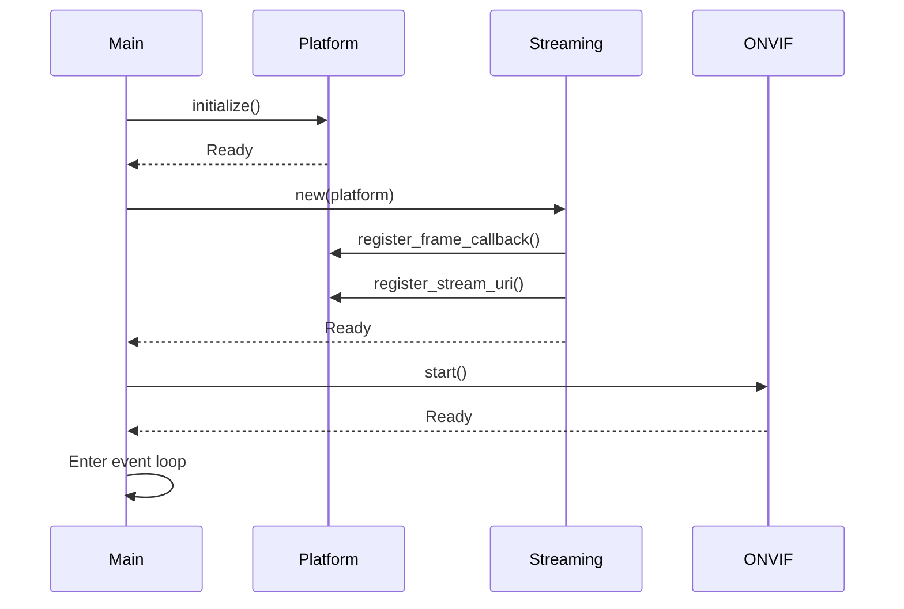

# Main Entry Point & URI Registry

## Overview

Implement the unified executable entry point with proper initialization sequence, URI registry, and component coordination.

## Scope

**In Scope:**
- Update `src/main.rs` with unified entry point
- Implement initialization sequence with error handling:
  1. Initialize platform layer
  2. Initialize streaming layer (RTSP + HTTP-FLV)
  3. Initialize ONVIF server
  4. Start memory monitoring
- Initialization error handling:
  - Platform init failure → Log error, exit with code 1
  - Streaming init failure → Cleanup platform, exit with code 2
  - ONVIF init failure → Cleanup streaming + platform, exit with code 3
  - Rollback strategy for partial initialization
- URI registry integration:
  - Registry implemented in T8a (AnykaPlatform)
  - Use `platform.register_stream_uri()` to register URIs
  - Use `platform.get_stream_uri()` to query URIs
  - Dynamic IP detection using T11's NetworkInfo
  - URI format: `rtsp://{ip}:554/stream{id}`, `http://{ip}:8080/live.flv?stream={id}`
- Create `src/streaming/mod.rs` (StreamingLayer struct)
- Coordinate component lifecycle (startup, shutdown)
- Graceful shutdown handling (SIGTERM, SIGINT):
  1. Receive signal
  2. Stop accepting new clients (set ACCEPT_NEW_CLIENTS = false)
  3. Wait up to 5 seconds for existing streams to finish
  4. Force-close remaining connections
  5. Stop ONVIF server
  6. Stop streaming servers (RTSP, HTTP-FLV)
  7. Stop platform layer (release hardware)
  8. Exit with code 0
- Integration tests:
  - Happy path: All components start successfully
  - Platform init failure: Cleanup and exit
  - Streaming init failure: Cleanup and exit
  - URI registry: Register and query URIs
  - Graceful shutdown: Clean shutdown within 5 seconds
  - Forced shutdown: Cleanup after timeout

**Out of Scope:**
- Individual component implementations (T7-T13)
- Memory monitoring implementation (T15)
- Memory limit enforcement (moved to T15)
- Performance testing (T17)

## Technical Details

**Initialization Sequence:**

**URI Registry:**
- Platform stores mapping: Profile token → StreamUriInfo
- ONVIF GetStreamUri queries platform
- Loose coupling between ONVIF and streaming

## Spec References

- spec:6f9ed714-572c-4c78-a67e-e1e363752b44/6f620a2e-4e66-4b20-b1d1-cd99217bdcba - Section 3.4 (Integration Points), main.rs
- spec:6f9ed714-572c-4c78-a67e-e1e363752b44/3339e6c7-c72c-49ba-8fda-bb6a8ce6150b - Flow 1 (startup), Flow 11 (shutdown)

## Dependencies

- T8b: Platform Frame Callbacks (needs frame callback infrastructure)
- T9: Platform Audio (needs audio)
- T10: Platform PTZ (needs PTZ)
- T11: Platform Imaging & Network (needs imaging/network)
- T12: RTSP Integration (needs RTSP server)
- T13: HTTP-FLV Integration (needs HTTP-FLV server)

## Acceptance Criteria

- ✅ main.rs compiles and runs
- ✅ Initialization sequence completes successfully
- ✅ Initialization error handling works (rollback on failure)
- ✅ Platform init failure: Cleanup and exit with code 1
- ✅ Streaming init failure: Cleanup and exit with code 2
- ✅ ONVIF init failure: Cleanup and exit with code 3
- ✅ URI registry integration validated (register + query)
- ✅ Dynamic IP detection works (correct URIs generated)
- ✅ All components start in correct order
- ✅ Graceful shutdown completes within 5 seconds
- ✅ Forced shutdown cleans up resources (after timeout)
- ✅ Integration tests pass (happy path + all failure scenarios)
- ✅ No resource leaks on shutdown (verified)
