# ONVIF HTTP Request/Response Flow Documentation

## Overview

This document describes how HTTP requests are processed in the ONVIF camera application, from initial client connection through service response generation. Understanding this flow is essential for debugging, monitoring, and extending the ONVIF services.

## Architecture Components

The ONVIF HTTP server consists of several key components that work together to handle client requests:

- **Epoll Server** (`epoll_server.c`) - Handles I/O events and manages network connections
- **Connection Manager** (`connection_manager.c`) - Manages connection lifecycle and HTTP parsing
- **Thread Pool** (`thread_pool.c`) - Distributes work across multiple worker threads
- **HTTP Parser** (`http_parser.c`) - Parses incoming HTTP requests using a state machine
- **Service Handlers** - Implement ONVIF services (Device, Media, PTZ, Imaging)
- **gSOAP Integration** - Processes SOAP requests and generates XML responses

## HTTP Request Flow

The following diagram shows how HTTP requests are processed from client to response:

```mermaid
flowchart TD
    A["🌐 ONVIF Client\n(Camera Management Software)"] --> B["📡 TCP Connection\n(Port 8080)"]
    B --> C["⚡ Epoll Server\n(epoll_server.c)"]

    C --> D{"🔍 Connection Type?"}
    D -->|"HTTP SOAP"| E["🔗 Connection Manager\n(connection_manager.c)"]
    D -->|"WS-Discovery"| F["📻 WS Discovery Handler\n(ws_discovery.c)"]
    D -->|"Snapshot"| G["📸 Snapshot Handler\n(onvif_snapshot.c)"]

    E --> H["🧵 Thread Pool\n(thread_pool.c)\nWorker Thread Assignment"]

    H --> I["📋 HTTP Parser\n(http_parser.c)\nState Machine Processing"]

    I --> J{"📝 Parse Result?"}
    J -->|"✅ Success"| K["🔄 HTTP-ONVIF Adapter\n(http_onvif_adapter.c)"]
    J -->|"❌ Parse Error"| L["⚠️ HTTP 400 Response\n(Bad Request)"]

    K --> M{"🎯 Service Type Detection\n(URL Path Analysis)"}
    M -->|"device"| N["🖥️ Device Service\n(onvif_device.c)"]
    M -->|"media"| O["🎬 Media Service\n(onvif_media.c)"]
    M -->|"ptz"| P["🎮 PTZ Service\n(onvif_ptz.c)"]
    M -->|"imaging"| Q["🎨 Imaging Service\n(onvif_imaging.c)"]

    N --> R["🧠 Service Handler\n(onvif_service_handler.c)\nAction Determination"]
    O --> R
    P --> R
    Q --> R

    R --> S{"🔐 Security Validation"}
    S -->|"✅ Authorized"| T["📊 Business Logic Execution\n(Service-Specific Implementation)"]
    S -->|"❌ Unauthorized"| U["🚫 HTTP 401/403 Response\n(Authentication Required)"]

    T --> V["🏗️ gSOAP Response Generation\n(onvif_gsoap.c)\nXML Response Creation"]

    V --> AA["📤 HTTP Response Builder\n(http_parser.c)\nResponse Header Construction"]

    AA --> BB["🔄 Response Transmission\n(send() syscall)"]
    BB --> CC["📊 Connection Management\n(Keep-Alive vs Close)"]
    CC --> DD["🧹 Memory Cleanup"]

    DD --> EE["✅ Request Complete\n(Back to Epoll Monitoring)"]

    L --> FF["📤 Error Response"]
    U --> FF
    FF --> CC

    F --> GG["📻 Multicast Response\n(WS-Discovery)"]
    GG --> EE

    G --> HH["📸 JPEG Image Response"]
    HH --> CC

    %% Styling
    classDef serviceNode fill:#e1f5fe,stroke:#01579b,stroke-width:2px,color:#000000
    classDef processNode fill:#f3e5f5,stroke:#4a148c,stroke-width:2px,color:#000000
    classDef decisionNode fill:#fff3e0,stroke:#e65100,stroke-width:2px,color:#000000

    class N,O,P,Q serviceNode
    class E,H,I,K,R,V,AA,BB,CC,DD processNode
    class D,J,M,S decisionNode
```



## Detailed Flow Explanation

### 1. Connection Establishment
When an ONVIF client connects to the camera:

1. **TCP Connection**: Client establishes TCP connection on port 8080
2. **Epoll Server**: The epoll server detects the new connection and adds it to the event loop
3. **Connection Type Detection**: The server determines the connection type:
   - **HTTP SOAP**: Standard ONVIF service requests
   - **WS-Discovery**: Device discovery protocol
   - **Snapshot**: Direct image requests

### 2. HTTP Request Processing
For HTTP SOAP requests:

1. **Connection Manager**: Manages the HTTP connection lifecycle
2. **Thread Pool**: Assigns the request to an available worker thread
3. **HTTP Parser**: Parses the incoming HTTP request using a state machine
4. **Request Validation**: Validates HTTP headers and SOAP envelope structure

### 3. Service Routing
The system determines which ONVIF service to handle the request:

- **Device Service** (`/onvif/device_service`): Device information, capabilities, system settings
- **Media Service** (`/onvif/media_service`): Stream profiles, stream URIs, video/audio settings
- **PTZ Service** (`/onvif/ptz_service`): Pan/tilt/zoom control, presets, movement commands
- **Imaging Service** (`/onvif/imaging_service`): Image settings, brightness, contrast, focus

### 4. Service Handler Processing
Each service handler:

1. **Action Determination**: Identifies the specific ONVIF action (e.g., GetDeviceInformation, GetProfiles)
2. **Security Validation**: Checks authentication and authorization
3. **Business Logic**: Executes the service-specific implementation
4. **Response Generation**: Creates the SOAP XML response using gSOAP

### 5. Response Generation and Transmission
1. **gSOAP Processing**: Generates XML response based on ONVIF schema
2. **HTTP Response Builder**: Constructs HTTP headers and response structure
3. **Response Transmission**: Sends the response back to the client
4. **Connection Management**: Determines whether to keep connection alive or close it
5. **Memory Cleanup**: Releases allocated resources

## ONVIF Services Overview

The camera implements four main ONVIF services, each handling specific aspects of camera functionality:

### Device Service
**Purpose**: Provides device information and basic capabilities
**Key Operations**:
- `GetDeviceInformation`: Returns manufacturer, model, firmware version
- `GetCapabilities`: Lists supported services and features
- `GetSystemDateAndTime`: Returns current system time
- `GetNetworkInterfaces`: Lists available network interfaces
- `GetServices`: Returns list of available ONVIF services

**Implementation**: Uses callback-based architecture with comprehensive error handling

### Media Service
**Purpose**: Manages video/audio streams and media profiles
**Key Operations**:
- `GetProfiles`: Returns available media profiles (resolution, codec, etc.)
- `GetStreamUri`: Provides RTSP stream URLs for video feeds
- `GetVideoSources`: Lists available video sources
- `GetVideoSourceConfigurations`: Returns video configuration options
- `GetSnapshotUri`: Provides snapshot image URLs

**Implementation**: Handles complex media profile management and stream configuration

### PTZ Service
**Purpose**: Controls pan, tilt, and zoom functionality
**Key Operations**:
- `AbsoluteMove`: Moves camera to specific position
- `RelativeMove`: Moves camera relative to current position
- `ContinuousMove`: Starts continuous movement
- `Stop`: Stops current movement
- `GetPresets`: Returns saved camera positions
- `SetPreset`: Saves current camera position
- `GotoPreset`: Moves camera to saved position

**Implementation**: Manages motor control and position tracking

### Imaging Service
**Purpose**: Controls image quality and camera settings
**Key Operations**:
- `GetImagingSettings`: Returns current image settings
- `SetImagingSettings`: Configures brightness, contrast, saturation
- `GetOptions`: Returns available imaging options and ranges
- `Move`: Controls focus and iris adjustments

**Implementation**: Manages camera sensor parameters and image processing

## Request/Response Handling

### HTTP Request Structure
ONVIF requests follow standard HTTP/1.1 format with SOAP XML payloads:

```
POST /onvif/device_service HTTP/1.1
Host: 192.168.1.100:8080
Content-Type: application/soap+xml; charset=utf-8
Content-Length: 1234
SOAPAction: "http://www.onvif.org/ver10/device/wsdl/GetDeviceInformation"

<?xml version="1.0" encoding="UTF-8"?>
<soap:Envelope xmlns:soap="http://www.w3.org/2003/05/soap-envelope">
  <soap:Header>
    <wsse:Security xmlns:wsse="http://docs.oasis-open.org/wss/2004/01/oasis-200401-wss-wssecurity-secext-1.0.xsd">
      <!-- Authentication credentials -->
    </wsse:Security>
  </soap:Header>
  <soap:Body>
    <tds:GetDeviceInformation xmlns:tds="http://www.onvif.org/ver10/device/wsdl"/>
  </soap:Body>
</soap:Envelope>
```

### Response Generation
The server generates SOAP XML responses using the gSOAP framework:

```
HTTP/1.1 200 OK
Content-Type: application/soap+xml; charset=utf-8
Content-Length: 5678
Connection: keep-alive

<?xml version="1.0" encoding="UTF-8"?>
<soap:Envelope xmlns:soap="http://www.w3.org/2003/05/soap-envelope">
  <soap:Body>
    <tds:GetDeviceInformationResponse xmlns:tds="http://www.onvif.org/ver10/device/wsdl">
      <tds:Manufacturer>Anyka</tds:Manufacturer>
      <tds:Model>AK3918</tds:Model>
      <tds:FirmwareVersion>1.0.0</tds:FirmwareVersion>
      <tds:SerialNumber>123456789</tds:SerialNumber>
      <tds:HardwareId>AK3918-IPC</tds:HardwareId>
    </tds:GetDeviceInformationResponse>
  </soap:Body>
</soap:Envelope>
```

### Memory Management
The system uses several strategies for efficient memory usage:

- **Response Buffers**: Allocated based on actual response size
- **Buffer Pools**: Pre-allocated buffers for common response sizes
- **Memory Tracking**: All allocations tracked for leak detection
- **Connection Reuse**: HTTP keep-alive for multiple requests per connection

## Error Handling

### HTTP Error Responses
The server returns appropriate HTTP status codes for different error conditions:

- **200 OK**: Successful request processing
- **400 Bad Request**: Malformed HTTP request or SOAP envelope
- **401 Unauthorized**: Authentication required or failed
- **403 Forbidden**: Insufficient permissions for the requested operation
- **404 Not Found**: Requested service or operation not available
- **500 Internal Server Error**: Server-side processing error

### SOAP Fault Responses
For ONVIF-specific errors, the server returns SOAP fault messages:

```xml
<soap:Envelope xmlns:soap="http://www.w3.org/2003/05/soap-envelope">
  <soap:Body>
    <soap:Fault>
      <soap:Code>
        <soap:Value>soap:Sender</soap:Value>
      </soap:Code>
      <soap:Reason>
        <soap:Text xml:lang="en">Invalid parameter value</soap:Text>
      </soap:Reason>
      <soap:Detail>
        <onvif:InvalidParameter xmlns:onvif="http://www.onvif.org/ver10/schema">
          <onvif:Parameter>ProfileToken</onvif:Parameter>
          <onvif:Reason>Token not found</onvif:Reason>
        </onvif:InvalidParameter>
      </soap:Detail>
    </soap:Fault>
  </soap:Body>
</soap:Envelope>
```

## Performance Characteristics

### Response Times
Typical response times for different operations:

- **Device Information**: 10-50ms (small responses)
- **Media Profiles**: 50-200ms (medium responses)
- **PTZ Commands**: 100-500ms (hardware interaction)
- **Imaging Settings**: 20-100ms (sensor configuration)

### Concurrent Request Handling
The system supports multiple concurrent requests through:

- **Thread Pool**: Configurable number of worker threads
- **Connection Pooling**: HTTP keep-alive for connection reuse
- **Memory Pools**: Pre-allocated buffers for efficient memory usage
- **Event-Driven Architecture**: Epoll-based I/O for high concurrency

## Debugging and Monitoring

### Logging
The system provides comprehensive logging at different levels:

- **DEBUG**: Detailed request/response information
- **INFO**: Service operations and status changes
- **WARN**: Non-critical issues and fallback behaviors
- **ERROR**: Service failures and error conditions

### Common Debug Scenarios
1. **Connection Issues**: Check TCP connectivity and port availability
2. **Authentication Failures**: Verify credentials and security configuration
3. **Service Errors**: Review service-specific error logs and configurations
4. **Performance Issues**: Monitor response times and memory usage

### Monitoring Endpoints
The system provides monitoring capabilities through:

- **Health Checks**: Service availability monitoring
- **Statistics**: Request counts, response times, error rates
- **Memory Usage**: Allocation tracking and leak detection
- **Connection Status**: Active connections and thread pool utilization

## Configuration

### Service Configuration
Each ONVIF service can be configured through:

- **Configuration Files**: Service-specific settings and parameters
- **Runtime Configuration**: Dynamic parameter updates
- **Default Values**: Fallback configurations for missing settings

### Network Configuration
HTTP server settings include:

- **Port Configuration**: Default port 8080, configurable
- **Connection Limits**: Maximum concurrent connections
- **Timeout Settings**: Request and connection timeouts
- **Security Settings**: Authentication and encryption options

## Integration Examples

### ONVIF Client Integration
Example client code for common operations:

```python
# Python example using onvif-zeep
from onvif import ONVIFCamera

# Connect to camera
camera = ONVIFCamera('192.168.1.100', 8080, 'admin', 'password')

# Get device information
device_info = camera.devicemgmt.GetDeviceInformation()
print(f"Manufacturer: {device_info.Manufacturer}")
print(f"Model: {device_info.Model}")

# Get media profiles
profiles = camera.media.GetProfiles()
for profile in profiles:
    print(f"Profile: {profile.Name}, Token: {profile.token}")

# Get stream URI
stream_uri = camera.media.GetStreamUri({'ProfileToken': profiles[0].token})
print(f"Stream URI: {stream_uri.Uri}")
```

### HTTP Client Integration
Direct HTTP client example:

```bash
# Get device information using curl
curl -X POST http://192.168.1.100:8080/onvif/device_service \
  -H "Content-Type: application/soap+xml; charset=utf-8" \
  -H "SOAPAction: \"http://www.onvif.org/ver10/device/wsdl/GetDeviceInformation\"" \
  -d '<?xml version="1.0" encoding="UTF-8"?>
<soap:Envelope xmlns:soap="http://www.w3.org/2003/05/soap-envelope">
  <soap:Body>
    <tds:GetDeviceInformation xmlns:tds="http://www.onvif.org/ver10/device/wsdl"/>
  </soap:Body>
</soap:Envelope>'
```

This documentation provides a comprehensive overview of the ONVIF HTTP request/response flow, enabling users to understand, debug, and integrate with the camera's ONVIF services effectively.
