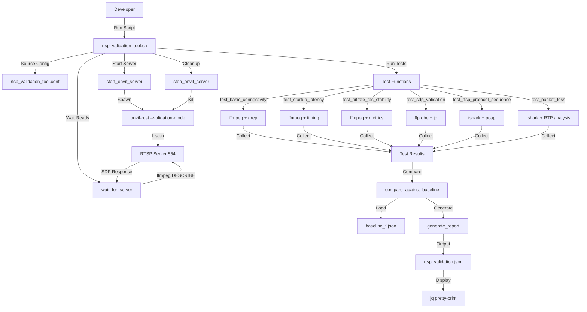
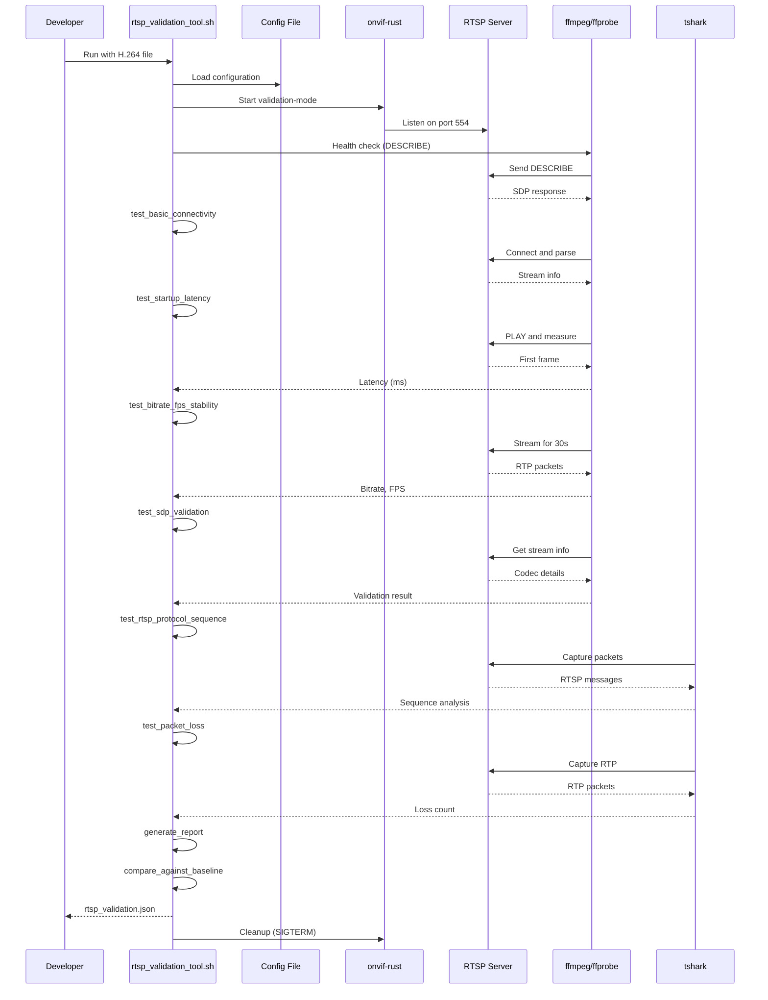

I have created the following plan after thorough exploration and analysis of the codebase. Follow the below plan verbatim. Trust the files and references. Do not re-verify what's written in the plan. Explore only when absolutely necessary. First implement all the proposed file changes and then I'll review all the changes together at the end.

## Observations

The `file:cross-compile/onvif-rust/` project includes a `validation-mode` feature that enables H.264 playback testing without hardware. The application can be launched with `--validation-mode --h264-file <path>` to stream pre-recorded H.264 video via RTSP and HTTP-FLV endpoints. This provides an ideal foundation for building a host-side validation tool that tests RTSP performance and conformity without requiring a physical camera. The existing infrastructure includes Media service with profile management, ONVIF SOAP/XML handling via `quick-xml`, and async streaming via `tokio` and `axum`.

## Approach

Create a standalone host-side validation tool that: (1) Launches onvif-rust in validation-mode with a test H.264 file, (2) Connects to the RTSP endpoint and measures performance metrics (startup latency, bitrate, FPS, audio/video sync), (3) Validates RTSP protocol conformance (SDP, RTP sequences, error handling), (4) Generates structured test reports with pass/fail decisions, and (5) Designs metrics collection to be protocol-agnostic for future HTTP-FLV testing. The tool runs entirely on the host machine, requires no physical hardware, and integrates with CI/CD pipelines.

## Implementation Plan

### 1. Create Host-Side RTSP Validation Tool

**Location**: `file:scripts/rtsp_validation_tool.rs` (new Rust binary)

Create a standalone Rust tool that launches onvif-rust in validation-mode and tests RTSP performance/conformity:

**Tool Structure**:
- **Launcher**: Spawn onvif-rust process with validation-mode flags
  - Accept H.264 test file path as argument
  - Configure RTSP port (default: 554, or custom via `--rtsp-port`)
  - Configure HTTP-FLV port (default: 8080, or custom via `--httpflv-port`)
  - Support loop playback for long-duration tests

- **RTSP Client**: Connect to RTSP endpoint and measure metrics
  - Send DESCRIBE request and parse SDP response
  - Send SETUP requests for video and audio tracks
  - Send PLAY request and measure time to first frame
  - Capture RTP packets and analyze payload
  - Send TEARDOWN and measure cleanup time

- **Metrics Collection**:
  - Startup latency: Time from PLAY to first video frame (target: <1.5s)
  - Audio startup latency: Time from PLAY to first audio frame (target: <2s)
  - Bitrate: Measure actual bitrate from RTP packets
  - Frame rate: Count frames per second
  - Packet loss: Detect RTP sequence gaps
  - A/V sync: Measure drift between video and audio timestamps

- **Conformance Validation**:
  - SDP parsing: Validate media tracks, codecs, parameters
  - RTSP sequences: Verify correct protocol flow
  - Error handling: Test invalid credentials, bogus URLs, etc.
  - RTP validation: Check NAL unit packaging, timestamp progression

- **Output**: Structured JSON report with metrics and pass/fail decisions

**Example invocation**:
```bash
./scripts/rtsp_validation_tool \
  --h264-file test_video.h264 \
  --rtsp-port 554 \
  --duration 60 \
  --output results/rtsp_validation.json
```

**Cargo.toml entry**:
```toml
[[bin]]
name = "rtsp_validation_tool"
path = "scripts/rtsp_validation_tool.rs"
```

### 2. Create RTSP Validation Shell Script Using Standard Tools

**Location**: `file:scripts/rtsp_validation_tool.sh` (new shell script)

Create a shell script that leverages standard tools (ffmpeg, ffprobe, tshark) for RTSP testing:

**Tools Used**:
- **ffmpeg**: Stream capture and metrics extraction
  - Measure startup latency (time to first frame)
  - Calculate bitrate, FPS, frame drops
  - Capture audio/video streams
  
- **ffprobe**: Stream metadata analysis
  - Parse codec information (H.264, AAC)
  - Extract resolution, bitrate, sample rate
  - Validate stream properties
  
- **tshark**: Network packet analysis
  - Capture RTSP protocol messages
  - Validate DESCRIBE/SETUP/PLAY/TEARDOWN sequences
  - Parse SDP responses
  - Detect RTP packet loss (sequence gaps)
  - Analyze RTP timestamps for A/V sync

- **timeout**: Command timeout handling
  - Enforce test duration limits
  - Prevent hanging processes

**Test Functions**:

1. **test_basic_connectivity()**: DESCRIBE request and SDP parsing
   - Send DESCRIBE via ffmpeg
   - Verify SDP response received
   - Check for valid stream information

2. **test_startup_latency()**: Measure time to first frame
   - Record start time
   - Use ffmpeg to capture first frame
   - Calculate elapsed time
   - Target: <1500ms for video, <2000ms for audio

3. **test_bitrate_fps_stability()**: Stream for configured duration
   - Capture stream with ffmpeg
   - Extract bitrate and FPS from ffmpeg output
   - Calculate average and deviation
   - Target: ±15% bitrate, ±10% FPS

4. **test_sdp_validation()**: Validate SDP using ffprobe
   - Use ffprobe to get stream information
   - Verify video and audio tracks present
   - Check codec parameters (H.264, sample rate, channels)
   - Validate resolution and bitrate

5. **test_rtsp_protocol_sequence()**: Capture and analyze RTSP messages
   - Use tshark to capture RTSP traffic
   - Verify DESCRIBE → SETUP → PLAY → TEARDOWN sequence
   - Check for correct response codes
   - Validate session ID handling

6. **test_packet_loss()**: Detect RTP packet loss
   - Capture RTP packets with tshark
   - Analyze RTP sequence numbers
   - Detect gaps (lost packets)
   - Calculate packet loss percentage
   - Target: <1% loss

7. **test_concurrent_clients()**: Test multiple simultaneous connections
   - Launch multiple ffmpeg instances
   - Stream simultaneously
   - Verify all clients receive data
   - Measure per-client bitrate

8. **test_error_handling()**: Test error cases
   - Invalid credentials → expect 401 Unauthorized
   - Bogus URL → expect 404 Not Found
   - Unsupported transport → expect 461 Unsupported Transport

**Script Structure**:
```bash
#!/bin/bash
# rtsp_validation_tool.sh - RTSP performance and conformity testing

set -euo pipefail

# Configuration
RTSP_HOST="${RTSP_HOST:-127.0.0.1}"
RTSP_PORT="${RTSP_PORT:-554}"
RTSP_STREAM="${RTSP_STREAM:-/vs0}"
TEST_DURATION="${TEST_DURATION:-30}"
OUTPUT_FILE="${OUTPUT_FILE:-rtsp_validation.json}"

# Helper functions
log_info() { echo "[INFO] $*"; }
log_error() { echo "[ERROR] $*" >&2; }

# Test 1: Basic Connectivity
test_basic_connectivity() {
    log_info "Testing basic connectivity..."
    
    local describe_output=$(timeout 5 ffmpeg -rtsp_transport tcp \
        -i "rtsp://${RTSP_HOST}:${RTSP_PORT}${RTSP_STREAM}" \
        -t 0.1 -f null - 2>&1 || true)
    
    if echo "$describe_output" | grep -q "Stream #0"; then
        echo "PASS"
        return 0
    else
        echo "FAIL"
        return 1
    fi
}

# Test 2: Stream Startup Performance
test_startup_latency() {
    log_info "Testing stream startup latency..."
    
    local start_time=$(date +%s%N)
    
    local ffmpeg_output=$(timeout 10 ffmpeg -rtsp_transport tcp \
        -i "rtsp://${RTSP_HOST}:${RTSP_PORT}${RTSP_STREAM}" \
        -vframes 1 -f null - 2>&1 || true)
    
    local end_time=$(date +%s%N)
    local latency_ms=$(( (end_time - start_time) / 1000000 ))
    
    if echo "$ffmpeg_output" | grep -q "frame="; then
        echo "$latency_ms"
        return 0
    else
        echo "FAIL"
        return 1
    fi
}

# Test 3: Bitrate and FPS Stability
test_bitrate_fps_stability() {
    log_info "Testing bitrate and FPS stability..."
    
    local ffmpeg_output=$(timeout $((TEST_DURATION + 5)) ffmpeg \
        -rtsp_transport tcp \
        -i "rtsp://${RTSP_HOST}:${RTSP_PORT}${RTSP_STREAM}" \
        -t "$TEST_DURATION" \
        -f null - 2>&1 || true)
    
    local bitrate=$(echo "$ffmpeg_output" | grep -oP 'bitrate=\K[0-9.]+' | tail -1)
    local fps=$(echo "$ffmpeg_output" | grep -oP 'fps=\K[0-9.]+' | tail -1)
    
    echo "bitrate=$bitrate fps=$fps"
}

# Test 4: SDP Validation using ffprobe
test_sdp_validation() {
    log_info "Testing SDP validation..."
    
    local probe_output=$(timeout 5 ffprobe -v error \
        -rtsp_transport tcp \
        -show_streams \
        -of json \
        "rtsp://${RTSP_HOST}:${RTSP_PORT}${RTSP_STREAM}" 2>&1 || true)
    
    local has_video=$(echo "$probe_output" | grep -c '"codec_type": "video"' || echo 0)
    local has_audio=$(echo "$probe_output" | grep -c '"codec_type": "audio"' || echo 0)
    
    if [ "$has_video" -gt 0 ]; then
        echo "PASS video=$has_video audio=$has_audio"
        return 0
    else
        echo "FAIL"
        return 1
    fi
}

# Test 5: RTSP Protocol Sequence using tshark
test_rtsp_protocol_sequence() {
    log_info "Testing RTSP protocol sequence..."
    
    local pcap_file="/tmp/rtsp_capture_$.pcap"
    
    timeout $((TEST_DURATION + 5)) tshark -i lo -f "tcp port $RTSP_PORT" \
        -w "$pcap_file" >/dev/null 2>&1 &
    local tshark_pid=$!
    
    timeout $((TEST_DURATION + 5)) ffmpeg -rtsp_transport tcp \
        -i "rtsp://${RTSP_HOST}:${RTSP_PORT}${RTSP_STREAM}" \
        -t "$TEST_DURATION" \
        -f null - >/dev/null 2>&1 || true
    
    wait $tshark_pid 2>/dev/null || true
    
    if [ -f "$pcap_file" ]; then
        local describe_count=$(tshark -r "$pcap_file" -Y "rtsp.method == \"DESCRIBE\"" 2>/dev/null | wc -l)
        local setup_count=$(tshark -r "$pcap_file" -Y "rtsp.method == \"SETUP\"" 2>/dev/null | wc -l)
        local play_count=$(tshark -r "$pcap_file" -Y "rtsp.method == \"PLAY\"" 2>/dev/null | wc -l)
        
        rm -f "$pcap_file"
        
        if [ "$describe_count" -gt 0 ] && [ "$play_count" -gt 0 ]; then
            echo "PASS describe=$describe_count setup=$setup_count play=$play_count"
            return 0
        fi
    fi
    
    echo "FAIL"
    return 1
}

# Test 6: Packet Loss Detection using tshark
test_packet_loss() {
    log_info "Testing packet loss..."
    
    local pcap_file="/tmp/rtp_capture_$.pcap"
    
    timeout $((TEST_DURATION + 5)) tshark -i lo -f "udp" \
        -w "$pcap_file" >/dev/null 2>&1 &
    local tshark_pid=$!
    
    timeout $((TEST_DURATION + 5)) ffmpeg -rtsp_transport tcp \
        -i "rtsp://${RTSP_HOST}:${RTSP_PORT}${RTSP_STREAM}" \
        -t "$TEST_DURATION" \
        -f null - >/dev/null 2>&1 || true
    
    wait $tshark_pid 2>/dev/null || true
    
    if [ -f "$pcap_file" ]; then
        local rtp_packets=$(tshark -r "$pcap_file" -Y "rtp" -T fields -e rtp.seq 2>/dev/null | wc -l)
        local packet_loss=0
        
        if [ "$rtp_packets" -gt 0 ]; then
            packet_loss=$(tshark -r "$pcap_file" -Y "rtp" -T fields -e rtp.seq 2>/dev/null | \
                awk 'NR>1 {if ($1 - prev != 1) loss++} {prev=$1} END {print loss}')
        fi
        
        rm -f "$pcap_file"
        echo "rtp_packets=$rtp_packets packet_loss=$packet_loss"
        return 0
    fi
    
    echo "FAIL"
    return 1
}

# Main execution
main() {
    log_info "Starting RTSP validation tests..."
    log_info "Target: rtsp://${RTSP_HOST}:${RTSP_PORT}${RTSP_STREAM}"
    
    local results="{\"tests\": ["
    local test_results=()
    
    # Run all tests
    local result=$(test_basic_connectivity)
    test_results+=("$(echo "{\"name\": \"basic_connectivity\", \"result\": \"$result\"}")")
    
    local latency=$(test_startup_latency)
    test_results+=("$(echo "{\"name\": \"startup_latency_ms\", \"value\": $latency}")")
    
    local bitrate_fps=$(test_bitrate_fps_stability)
    test_results+=("$(echo "{\"name\": \"bitrate_fps\", \"data\": \"$bitrate_fps\"}")")
    
    local sdp=$(test_sdp_validation)
    test_results+=("$(echo "{\"name\": \"sdp_validation\", \"result\": \"$sdp\"}")")
    
    local protocol=$(test_rtsp_protocol_sequence)
    test_results+=("$(echo "{\"name\": \"protocol_sequence\", \"result\": \"$protocol\"}")")
    
    local loss=$(test_packet_loss)
    test_results+=("$(echo "{\"name\": \"packet_loss\", \"data\": \"$loss\"}")")
    
    # Combine results
    results+=$(IFS=,; echo "${test_results[*]}")
    results+="]}"
    
    # Write output
    echo "$results" | jq . > "$OUTPUT_FILE"
    log_info "Results written to $OUTPUT_FILE"
}

main "$@"
```

**Usage**:
```bash
# Basic test
./scripts/rtsp_validation_tool.sh

# Custom parameters
RTSP_HOST=192.168.1.100 RTSP_PORT=554 RTSP_STREAM=/vs0 \
  TEST_DURATION=60 OUTPUT_FILE=results.json \
  ./scripts/rtsp_validation_tool.sh

# In CI/CD
./scripts/rtsp_validation_tool.sh && \
  jq '.tests[] | select(.result == "FAIL")' results.json
```

**Advantages**:
- No custom code to maintain
- Uses battle-tested tools
- Simple shell script
- Easy to debug (run commands manually)
- Lower resource usage
- Familiar to DevOps engineers

### 3. Implement Test Scenarios in Shell Script

**Location**: `file:scripts/rtsp_validation_tool.sh` (extended)

Add additional test scenarios to the shell script:

**Scenario: Concurrent Clients**
```bash
test_concurrent_clients() {
    log_info "Testing concurrent clients..."
    
    local client_count="${1:-2}"
    local pids=()
    
    # Launch multiple ffmpeg instances
    for i in $(seq 1 "$client_count"); do
        timeout $((TEST_DURATION + 5)) ffmpeg -rtsp_transport tcp \
            -i "rtsp://${RTSP_HOST}:${RTSP_PORT}${RTSP_STREAM}" \
            -t "$TEST_DURATION" \
            -f null - >/dev/null 2>&1 &
        pids+=($!)
    done
    
    # Wait for all clients
    local failed=0
    for pid in "${pids[@]}"; do
        if ! wait "$pid"; then
            ((failed++))
        fi
    done
    
    if [ "$failed" -eq 0 ]; then
        echo "PASS all_clients=$client_count"
        return 0
    else
        echo "FAIL failed_clients=$failed"
        return 1
    fi
}
```

**Scenario: Long Duration Stability**
```bash
test_long_duration_stability() {
    log_info "Testing long duration stability (10 minutes)..."
    
    local long_duration=600  # 10 minutes
    local interval=30  # Collect metrics every 30 seconds
    
    local ffmpeg_output=$(timeout $((long_duration + 10)) ffmpeg \
        -rtsp_transport tcp \
        -i "rtsp://${RTSP_HOST}:${RTSP_PORT}${RTSP_STREAM}" \
        -t "$long_duration" \
        -f null - 2>&1 || true)
    
    # Extract metrics at different points
    local initial_bitrate=$(echo "$ffmpeg_output" | head -20 | grep -oP 'bitrate=\K[0-9.]+' | head -1)
    local final_bitrate=$(echo "$ffmpeg_output" | tail -20 | grep -oP 'bitrate=\K[0-9.]+' | tail -1)
    
    # Check for degradation (>20% drop)
    if [ -n "$initial_bitrate" ] && [ -n "$final_bitrate" ]; then
        local degradation=$(awk "BEGIN {print int(100 * (1 - $final_bitrate / $initial_bitrate))}")
        if [ "$degradation" -lt 20 ]; then
            echo "PASS degradation=${degradation}%"
            return 0
        fi
    fi
    
    echo "FAIL"
    return 1
}
```

**Scenario: Error Handling**
```bash
test_error_handling() {
    log_info "Testing error handling..."
    
    local test_results=()
    
    # Test 1: Invalid credentials
    local invalid_creds=$(timeout 5 ffmpeg -rtsp_transport tcp \
        -i "rtsp://invalid:invalid@${RTSP_HOST}:${RTSP_PORT}${RTSP_STREAM}" \
        -t 0.1 -f null - 2>&1 || true)
    
    if echo "$invalid_creds" | grep -q "401\|Unauthorized"; then
        test_results+=("invalid_creds=PASS")
    else
        test_results+=("invalid_creds=FAIL")
    fi
    
    # Test 2: Bogus URL
    local bogus_url=$(timeout 5 ffmpeg -rtsp_transport tcp \
        -i "rtsp://${RTSP_HOST}:${RTSP_PORT}/bogus_stream" \
        -t 0.1 -f null - 2>&1 || true)
    
    if echo "$bogus_url" | grep -q "404\|Not Found"; then
        test_results+=("bogus_url=PASS")
    else
        test_results+=("bogus_url=FAIL")
    fi
    
    echo "PASS ${test_results[*]}"
    return 0
}
```

### 4. Create Test Report Generator in Shell

**Location**: `file:scripts/rtsp_validation_tool.sh` (extended with reporting)

Generate structured JSON reports with metrics and pass/fail decisions:

**Report Generation Function**:
```bash
generate_report() {
    local test_results="$1"
    local output_file="$2"
    
    local timestamp=$(date -u +"%Y-%m-%dT%H:%M:%SZ")
    local overall_pass="true"
    
    # Check if any test failed
    if echo "$test_results" | grep -q '"result": "FAIL"'; then
        overall_pass="false"
    fi
    
    # Build JSON report
    local report=$(cat <<EOF
{
  "test_run": {
    "timestamp": "$timestamp",
    "rtsp_host": "$RTSP_HOST",
    "rtsp_port": $RTSP_PORT,
    "rtsp_stream": "$RTSP_STREAM",
    "test_duration_seconds": $TEST_DURATION
  },
  "tests": $test_results,
  "summary": {
    "total_tests": $(echo "$test_results" | jq 'length'),
    "passed": $(echo "$test_results" | jq '[.[] | select(.result == "PASS")] | length'),
    "failed": $(echo "$test_results" | jq '[.[] | select(.result == "FAIL")] | length'),
    "overall_pass": $overall_pass
  }
}
EOF
    )
    
    echo "$report" | jq . > "$output_file"
    log_info "Report written to $output_file"
}
```

**Report Structure**:
```json
{
  "test_run": {
    "timestamp": "2026-02-04T10:30:00Z",
    "rtsp_host": "127.0.0.1",
    "rtsp_port": 554,
    "rtsp_stream": "/vs0",
    "test_duration_seconds": 30
  },
  "tests": [
    {
      "name": "basic_connectivity",
      "result": "PASS"
    },
    {
      "name": "startup_latency_ms",
      "value": 1200
    },
    {
      "name": "bitrate_fps",
      "data": "bitrate=2000 fps=25"
    },
    {
      "name": "sdp_validation",
      "result": "PASS video=1 audio=1"
    },
    {
      "name": "protocol_sequence",
      "result": "PASS describe=1 setup=2 play=1"
    },
    {
      "name": "packet_loss",
      "data": "rtp_packets=750 packet_loss=0"
    }
  ],
  "summary": {
    "total_tests": 6,
    "passed": 5,
    "failed": 1,
    "overall_pass": false
  }
}
```

### 5. Implement Baseline Management in Shell

**Location**: `file:scripts/rtsp_validation_tool.sh` (extended with baseline comparison)

Create baseline storage and comparison functionality:

**Baseline Storage**:
- Location: `file:scripts/rtsp_results/baselines/`
- Filename: `<test_name>_baseline.json`

**Baseline Format**:
```json
{
  "test": "startup_latency_ms",
  "created": "2026-02-04T10:30:00Z",
  "baseline_value": 1200,
  "tolerance_percent": 20
}
```

**Baseline Comparison Function**:
```bash
compare_against_baseline() {
    local test_name="$1"
    local current_value="$2"
    local baseline_file="scripts/rtsp_results/baselines/${test_name}_baseline.json"
    
    if [ ! -f "$baseline_file" ]; then
        log_info "No baseline found for $test_name, skipping comparison"
        return 0
    fi
    
    local baseline_value=$(jq -r '.baseline_value' "$baseline_file")
    local tolerance=$(jq -r '.tolerance_percent' "$baseline_file")
    
    # Calculate regression percentage
    local regression=$(awk "BEGIN {print int(100 * ($current_value - $baseline_value) / $baseline_value)}")
    
    if [ "$regression" -gt "$tolerance" ]; then
        log_error "REGRESSION: $test_name degraded by ${regression}% (tolerance: ${tolerance}%)"
        return 1
    else
        log_info "OK: $test_name within tolerance (${regression}% vs ${tolerance}%)"
        return 0
    fi
}

update_baseline() {
    local test_name="$1"
    local current_value="$2"
    local baseline_dir="scripts/rtsp_results/baselines"
    
    mkdir -p "$baseline_dir"
    
    local baseline_file="$baseline_dir/${test_name}_baseline.json"
    local timestamp=$(date -u +"%Y-%m-%dT%H:%M:%SZ")
    
    cat > "$baseline_file" <<EOF
{
  "test": "$test_name",
  "created": "$timestamp",
  "baseline_value": $current_value,
  "tolerance_percent": 20
}
EOF
    
    log_info "Baseline updated for $test_name: $current_value"
}
```

**Usage**:
```bash
# Compare against baseline
compare_against_baseline "startup_latency_ms" 1250

# Update baseline
update_baseline "startup_latency_ms" 1200
```

### 6. Create Configuration File for Test Parameters

**Location**: `file:scripts/rtsp_validation_tool.conf` (new file)

Define test parameters and thresholds:

```bash
# RTSP connection parameters
RTSP_HOST="127.0.0.1"
RTSP_PORT=554
RTSP_STREAM="/vs0"
RTSP_TIMEOUT=10

# Test durations
SHORT_TEST_DURATION=30
LONG_TEST_DURATION=600
CONCURRENT_CLIENT_COUNT=4

# Performance thresholds
VIDEO_STARTUP_LATENCY_MS=1500
AUDIO_STARTUP_LATENCY_MS=2000
BITRATE_TOLERANCE_PERCENT=15
FPS_TOLERANCE_PERCENT=10
PACKET_LOSS_TOLERANCE_PERCENT=1
AV_SYNC_DRIFT_MS=200

# Regression detection
REGRESSION_ENABLED=true
REGRESSION_TOLERANCE_PERCENT=10
BASELINE_DIR="scripts/rtsp_results/baselines"

# Logging
LOG_LEVEL="info"
LOG_FILE="rtsp_validation.log"
```

**Usage**:
```bash
source scripts/rtsp_validation_tool.conf
./scripts/rtsp_validation_tool.sh
```

### 7. Implement Process Management in Shell

**Location**: `file:scripts/rtsp_validation_tool.sh` (extended with process management)

Manage onvif-rust process lifecycle:

**Process Management Functions**:
```bash
start_onvif_server() {
    local h264_file="$1"
    local rtsp_port="${2:-554}"
    local httpflv_port="${3:-8080}"
    
    log_info "Starting onvif-rust in validation mode..."
    
    # Build if not already built
    if [ ! -f "target/debug/onvif-rust" ]; then
        log_info "Building onvif-rust..."
        cd cross-compile/onvif-rust
        cargo build
        cd - > /dev/null
    fi
    
    # Start server in background
    target/debug/onvif-rust \
        --validation-mode \
        --h264-file "$h264_file" \
        --rtsp-port "$rtsp_port" \
        --httpflv-port "$httpflv_port" \
        > /tmp/onvif_server.log 2>&1 &
    
    ONVIF_PID=$!
    log_info "Started onvif-rust with PID $ONVIF_PID"
    
    # Wait for server to be ready
    wait_for_server "$rtsp_port"
}

wait_for_server() {
    local port="$1"
    local max_attempts=30
    local attempt=0
    
    log_info "Waiting for RTSP server on port $port..."
    
    while [ $attempt -lt $max_attempts ]; do
        if timeout 2 ffmpeg -rtsp_transport tcp \
            -i "rtsp://127.0.0.1:$port/vs0" \
            -t 0.1 -f null - >/dev/null 2>&1; then
            log_info "Server is ready"
            return 0
        fi
        
        sleep 1
        ((attempt++))
    done
    
    log_error "Server failed to start within timeout"
    return 1
}

stop_onvif_server() {
    if [ -n "${ONVIF_PID:-}" ]; then
        log_info "Stopping onvif-rust (PID $ONVIF_PID)..."
        kill -TERM "$ONVIF_PID" 2>/dev/null || true
        wait "$ONVIF_PID" 2>/dev/null || true
        log_info "Server stopped"
    fi
}

cleanup() {
    stop_onvif_server
    # Clean up temporary files
    rm -f /tmp/rtsp_capture_*.pcap /tmp/rtp_capture_*.pcap
}

trap cleanup EXIT
```

**Usage**:
```bash
start_onvif_server "test_video.h264" 554 8080
# Run tests
stop_onvif_server
```

### 8. Create Documentation and Usage Guide

**Location**: `file:scripts/RTSP_VALIDATION_README.md` (new file)

Document the validation tool:

**Overview**:
- Purpose: Test RTSP performance and conformity without physical hardware
- Approach: Launch onvif-rust in validation-mode with test H.264 file
- Tools: ffmpeg, ffprobe, tshark for metrics collection
- Output: Structured JSON reports with metrics and pass/fail decisions

**Prerequisites**:
```bash
# Install required tools
sudo apt-get install ffmpeg ffprobe tshark jq

# Ensure onvif-rust is built
cd cross-compile/onvif-rust
cargo build
```

**Quick Start**:
```bash
# Generate test H.264 file (or use existing)
./scripts/generate_test_h264.sh test_video.h264 30 25 1920x1080

# Run validation tool
./scripts/rtsp_validation_tool.sh

# View results
cat rtsp_validation.json | jq .
```

**Test Scenarios**:
1. **Basic Connectivity**: DESCRIBE request, SDP parsing
2. **Stream Startup**: Time to first frame (video <1500ms, audio <2000ms)
3. **Bitrate Stability**: 30-second stream measurement (±15% tolerance)
4. **Frame Rate Stability**: FPS consistency (±10% tolerance)
5. **SDP Validation**: Codec parameters, media tracks
6. **RTSP Protocol Sequence**: DESCRIBE → SETUP → PLAY → TEARDOWN
7. **Packet Loss**: RTP sequence gap detection (<1% tolerance)
8. **Concurrent Clients**: Multi-client streaming (2, 4 clients)
9. **Long Duration**: 10-minute stability test
10. **Error Handling**: Invalid credentials, bogus URLs

**Configuration**:
```bash
# Edit configuration file
source scripts/rtsp_validation_tool.conf

# Override via environment variables
RTSP_HOST=192.168.1.100 \
RTSP_PORT=554 \
TEST_DURATION=60 \
./scripts/rtsp_validation_tool.sh
```

**Metrics Interpretation**:
- `startup_latency_ms`: Time from PLAY to first frame (target: <1500ms)
- `bitrate`: Actual bitrate in kbps (compare to configured)
- `fps`: Actual frame rate (compare to configured)
- `packet_loss`: RTP packet loss count (target: 0)
- `protocol_sequence`: DESCRIBE/SETUP/PLAY counts (verify correct flow)

**Baseline Management**:
```bash
# Create baseline from current run
./scripts/rtsp_validation_tool.sh --update-baseline

# Compare against baseline
./scripts/rtsp_validation_tool.sh --compare-baseline

# View baseline
cat scripts/rtsp_results/baselines/startup_latency_ms_baseline.json
```

**CI/CD Integration**:
```bash
# Run in CI and fail on regression
./scripts/rtsp_validation_tool.sh && \
  jq '.summary.overall_pass' rtsp_validation.json | grep -q true || exit 1
```

**Troubleshooting**:
- **"ffmpeg not found"**: Install with `sudo apt-get install ffmpeg`
- **"tshark not found"**: Install with `sudo apt-get install tshark`
- **"Permission denied" for tshark**: Run with `sudo` or add user to wireshark group
- **Server not starting**: Check logs in `/tmp/onvif_server.log`
- **Port already in use**: Change RTSP_PORT in config or kill existing process

### 9. Create Test H.264 File Generator

**Location**: `file:scripts/generate_test_h264.sh` (new script)

Create a helper script to generate test H.264 files:

```bash
#!/bin/bash
# Generate a test H.264 file for RTSP validation

OUTPUT_FILE="${1:-test_video.h264}"
DURATION="${2:-10}"  # seconds
FPS="${3:-25}"
RESOLUTION="${4:-1920x1080}"

log_info() { echo "[INFO] $*"; }
log_error() { echo "[ERROR] $*" >&2; }

# Check if ffmpeg is installed
if ! command -v ffmpeg &> /dev/null; then
    log_error "ffmpeg not found. Install with: sudo apt-get install ffmpeg"
    exit 1
fi

log_info "Generating test H.264 file..."
log_info "  Output: $OUTPUT_FILE"
log_info "  Duration: ${DURATION}s"
log_info "  FPS: $FPS"
log_info "  Resolution: $RESOLUTION"

# Use ffmpeg to generate test pattern
ffmpeg -f lavfi -i testsrc=s=${RESOLUTION}:d=${DURATION}:r=${FPS} \
  -c:v libx264 -preset fast -crf 23 \
  -bsf h264_mp4toannexb \
  -y "${OUTPUT_FILE}" 2>&1 | grep -E "frame=|bitrate="

if [ -f "$OUTPUT_FILE" ]; then
    local file_size=$(du -h "$OUTPUT_FILE" | cut -f1)
    log_info "Generated test H.264 file: ${OUTPUT_FILE} (${file_size})"
else
    log_error "Failed to generate H.264 file"
    exit 1
fi
```

**Usage**:
```bash
./scripts/generate_test_h264.sh test_video.h264 30 25 1920x1080
```

## Validation Tool Architecture



## Test Execution Flow



## Performance Targets

| Metric | Target | Warning | Fail |
|--------|--------|---------|------|
| Video startup latency | <1500ms | <2000ms | ≥3000ms |
| Audio startup latency | <2000ms | <3000ms | ≥4000ms |
| Bitrate stability | ±15% | ±20% | ±30% |
| FPS stability | ±10% | ±15% | ±20% |
| Packet loss | <1% | <2% | ≥2% |
| Protocol sequence | DESCRIBE→SETUP→PLAY | Valid flow | Invalid |
| Concurrent clients (4) | All pass | 3/4 pass | <3/4 pass |
| Long duration (10min) | Stable | Minor drift | Degradation |

## Future HTTP-FLV Integration

The validation tool is designed to be protocol-agnostic:

1. **Common Metrics**: Startup latency, bitrate, FPS, A/V sync
2. **Protocol-Specific**: RTSP (RTP sequence), HTTP-FLV (HTTP status, chunking)
3. **Reusable Components**: Test functions, metrics collection, reporting
4. **Extensibility**: Add HTTP-FLV tests without changing core logic

When HTTP-FLV is implemented:
- Create `test_httpflv_*` functions in shell script
- Use `curl` for HTTP requests instead of ffmpeg
- Reuse `generate_report` and baseline comparison
- Add HTTP-specific scenarios (status codes, CORS, chunking)
- Integrate with existing CI/CD pipeline
