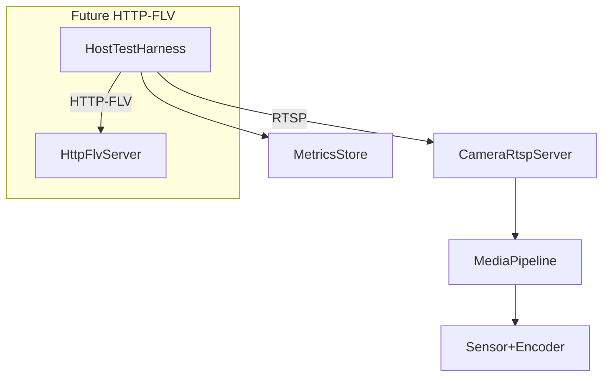

## RTSP Performance & Conformity Testing Plan

### 1. Map the current RTSP/video pipeline and endpoints

- **Load and align with existing docs**: Use `[docs/video-flow.md](docs/video-flow.md)` as the authoritative description of the sensor→encoder→RTSP pipeline (for example, `video_lifecycle.c`, `platform_anyka.c`, `rtsp_multistream.c`).
- **Identify active streams and URLs**: Confirm the exposed RTSP paths on the camera (`rtsp://<user>:<pass>@<ip>:554/vs0`, `/vs1`, etc.) and how they correspond to main/sub streams and audio configs.
- **Clarify onvif-rust integration**: Document how the Rust ONVIF services select or reference these RTSP URLs (Media service profiles, stream setup) so tests can be driven from either direct RTSP URLs or via ONVIF Media calls later.

### 2. Define concrete performance and audio/video quality metrics

- **Per-session timing metrics**:
  - Stream startup latency: time from RTSP PLAY (or test command start) to first decoded **video frame** and first decoded **audio frame**.
  - Tear-down latency: time from TEARDOWN/connection close to resource release (optional, lower priority).
- **Steady-state metrics**:
  - Sustained bitrate and frame rate for video and audio (compare to configured bitrate/FPS in `video_config_t` / `audio_config_t`).
  - Jitter and packet loss indicators (for example, `ffmpeg` reported \"frame drops\" and RTP sequence gaps).
  - CPU and memory usage on the camera during 1–5 minute runs at different resolutions and with multiple clients.
- **Scaling metrics**:
  - Behaviour with 1, 2, 3, and 4 concurrent RTSP clients on `/vs0` and mixed `/vs0` + `/vs1` cases.
- **Acceptance envelopes**:
  - Start by defining reasonable envelopes from `docs/video-flow.md` expectations (for example, total video init < ~1.5s, stable FPS within ±10% of configured, no A/V drift beyond a small threshold), and refine once you have baseline numbers.

### 3. Define RTSP conformance checks (protocol level)

- **Protocol sequence coverage**:
  - Validate correct DESCRIBE → SETUP (video + audio) → PLAY → TEARDOWN flows, including behaviour on malformed or partial sequences.
- **Header and SDP validation**:
  - Check that SDP advertises correct media tracks (video + audio), codecs, sample rates, channel counts, and RTSP transport parameters.
- **RTP payload checks**:
  - For H.264 video: confirm NAL packaging is correct (SPS/PPS presence, keyframe cadence, no invalid NALs).
  - For audio (for example, PCM/AAC): confirm payload type, timestamp progression, and channel/sample rate consistency.
- **Negative and edge cases**:
  - Invalid credentials, unsupported transport, bogus URLs, and multiple SETUPs on the same session.
- **Tools**:
  - Use Wireshark / `tshark` plus `ffprobe` to cross-check headers and payloads for selected runs.

### 4. Design a host-side RTSP test harness targeting real hardware

- **Test entry point**:
  - Create a small test driver (shell scripts under `[scripts/](scripts/)` or a Rust binary in `cross-compile/onvif-rust/tests/` or `tests/`) that takes camera IP, credentials, and stream path as parameters.
- **Use standard tools for measurement**:
  - For performance: drive `ffmpeg` / `ffprobe` to pull RTSP streams for configurable durations, capture stderr/stdout logs, and parse:
    - startup time, average bitrate, FPS, audio sample rate/bitrate, and any reported drops.
  - For visual debug/manual QA: allow optional `ffplay` or `gst-launch-1.0` invocations.
- **Timing and metric collection**:
  - Wrap each test run with timestamps on the host and/or parse `ffmpeg` logs for first-frame timing; record metrics to structured output (for example, JSON or CSV) for later comparison.
  - Add optional SSH hooks to query `/proc/meminfo`, `/proc/<pid>/stat`, or `top -b -n 1` on the camera at intervals to capture CPU/memory utilisation during tests.
- **Scenario coverage**:
  - Single-client tests at each supported resolution/profile with audio enabled.
  - Multi-client tests (1–4 clients) on the main stream, and mixed main + sub-stream scenarios.
  - Long-duration stability tests (for example, 10–30 minutes) for at least one representative configuration.

### 5. Integrate RTSP tests with existing test specifications

- **Leverage `testspecs/`**:
  - Add or extend XML test definitions in `[testspecs/](testspecs/)` to describe RTSP scenarios (parameters: stream path, duration, expected metrics envelope, presence of audio track, etc.).
  - Map each XML spec to the corresponding host-side script or Rust test, so you can run tests by logical name rather than raw commands.
- **ONVIF linkage (optional next step)**:
  - Add higher-level integration tests in `cross-compile/onvif-rust/tests/` that:
    - Use ONVIF Media service operations to get stream URIs.
    - Feed those URIs into the same RTSP harness so ONVIF signalling and RTSP streaming are exercised end to end.

### 6. Reporting and baselining

- **Result storage and regression tracking**:
  - Define a simple result format (JSON/CSV) per run capturing: test id, stream, duration, metrics, and pass/fail decisions.
  - Keep baseline results under version control (or as CI artefacts) so future changes to the video pipeline can be compared against known-good numbers.
- **Pass/fail logic**:
  - Implement simple thresholds in the harness (for example, reject runs with missing audio track, unstable bitrate outside envelope, startup latency above a maximum) and return non-zero exit codes to integrate with CI.

### 7. Future-proofing for HTTP-FLV tests

- **Abstract the stream endpoint in the harness**:
  - Design the host-side harness so that the core metrics logic is independent of protocol, taking a generic \"stream URL + expected media tracks\" input.
  - For now, only RTSP URLs are used; later, you can feed `http://.../live.flv`-style URLs for HTTP-FLV.
- **Reuse metrics and conformance ideas**:
  - Reuse the same timing, bitrate, audio/video continuity, and multi-client metrics for HTTP-FLV once implemented.
  - Add HTTP-specific checks later (status codes, headers, chunking behaviour) without changing the core measurement code.
- **Tie in with streaming components (`xiu` / `streaming-lib`)**:
  - When HTTP-FLV support is added (likely via `cross-compile/xiu/` or `cross-compile/streaming-lib/`), ensure these components expose testable endpoints that can be exercised by the existing harness with minimal new glue code.

### 8. CI and manual execution strategy

- **Manual/local flow (initial phase)**:
  - Provide a documented workflow in `README.md` or a dedicated testing doc describing how to point the harness at a lab camera and run the RTSP test suite from a dev machine.
- **Automated/nightly hardware-in-the-loop vision**:
  - Longer term, add a GitHub Actions or external CI job that assumes a reachable lab camera, runs a subset of the RTSP performance/conformance tests nightly, and publishes metrics/graphs.
  - Use this to detect regressions in streaming performance or protocol behaviour as `onvif-rust` evolves.

### 9. VLC low-latency verification profile

- **Purpose**: Validate camera-side latency improvements with minimal client-side buffering.
- **Recommended launch**:
  - `vlc --network-caching=150 --clock-jitter=0 --clock-synchro=0 --avcodec-hw=none rtsp://<user>:<pass>@<ip>:554/main`
- **Why software decode first**:
  - Hardware decode allocation failures (`hardware acceleration picture allocation failed`) can mask camera-side improvements.
- **Pass criteria for this profile**:
  - No repeated multi-second `picture is too late` bursts.
  - Initial buffering stabilizes within ~1s.
  - No persistent playback drift beyond 500ms.
- **Server-side knob for startup readiness**:
  - `ONVIF_PLAY_READY_TIMEOUT_MS` controls how long RTSP `PLAY` waits for stream readiness (SPS/PPS/track availability) before returning `503`.
  - Suggested starting value for latency tuning runs: `ONVIF_PLAY_READY_TIMEOUT_MS=1500`.

### Mermaid overview of the test flow

