# ONVIF Daemon Shutdown Flow - Developer Guide & Troubleshooting

## Overview

This document provides a comprehensive guide for developers working with the ONVIF daemon shutdown process. It covers the complete shutdown flow, common troubleshooting scenarios, debugging techniques, and validation procedures. Use this guide to understand, debug, and extend the graceful shutdown functionality.

**Target Audience**: Developers, system administrators, and QA engineers working with the ONVIF daemon.

## Quick Reference

### Key Files
- `src/core/lifecycle/signal_lifecycle.c` - Signal handling and main daemon loop
- `src/core/main/onvifd.c` - Main entry point and initialization order
- `src/core/lifecycle/platform_lifecycle.c` - Platform-wide cleanup coordination
- `src/core/lifecycle/network_lifecycle.c` - Network services lifecycle
- `src/networking/http/http_server.c` - HTTP server shutdown with threading

### Common Issues Quick Fix
| Issue | Quick Fix | File Location |
|-------|-----------|---------------|
| Daemon hangs on shutdown | Check epoll thread timeout | `http_server.c:1084-1106` |
| Memory leaks | Verify cleanup order | `platform_lifecycle.c:50-79` |
| Connections not closed | Check connection manager | `connection_manager_cleanup()` |
| Video streams active | RTSP cleanup in signal handler | `signal_lifecycle.c:97-98` |

### Build & Test Commands
```bash
# Debug build with symbols
cd cross-compile/onvif && make debug

# Test shutdown flow
./out/onvifd &
kill -INT $!  # Should complete in <2 seconds

# Memory leak check
valgrind --leak-check=full ./out/onvifd
```

## Shutdown Flow Architecture

### Current Implementation Overview

The ONVIF daemon uses a **coordinated multi-phase shutdown** with these key characteristics:

1. **Signal-driven**: SIGINT/SIGTERM triggers immediate RTSP shutdown, gradual cleanup
2. **Thread-safe**: Uses volatile flags and proper synchronization
3. **Timeout-protected**: 5-second timeout on thread joins prevents hanging
4. **Idempotent**: Cleanup functions can be called multiple times safely
5. **Reverse-order cleanup**: Mirrors initialization order in reverse

### Shutdown Sequence

```mermaid
graph TD
    A["🔴 SIGINT/SIGTERM"] --> B["signal_handler()"]
    B --> C["Set g_signal_running = 0"]
    B --> D["video_lifecycle_stop_servers()"]
    D --> D1["⚡ IMMEDIATE: Stop RTSP streams"]

    C --> E["Main loop exits"]
    E --> F["platform_lifecycle_cleanup()"]

    F --> G["🎥 Video Cleanup"]
    G --> G1["Stop RTSP multistream server"]
    G1 --> G2["Close video input handles"]

    F --> H["🌐 Network Cleanup"]
    H --> H1["ws_discovery_stop()"]
    H1 --> H2["http_server_stop()"]
    H2 --> H3["security_cleanup()"]
    H3 --> H4["epoll_server_cleanup()"]
    H4 --> H5["⏱️ pthread_timedjoin_np(5s)"]
    H5 --> H6["thread_pool_cleanup()"]
    H6 --> H7["connection_manager_cleanup()"]

    F --> I["🔧 Platform Cleanup"]
    I --> I1["platform_ptz_cleanup()"]
    I1 --> I2["platform_cleanup()"]
    I2 --> I3["memory_manager_cleanup()"]

    F --> J["⚙️ Config Cleanup"]
    J --> K["✅ Exit with status 0"]

    style A fill:#ff6b6b,color:#fff
    style D1 fill:#ff9800,color:#fff
    style H5 fill:#f44336,color:#fff
    style K fill:#4caf50,color:#fff
```



## Troubleshooting Guide

### 1. Hanging Shutdown

**Symptoms**: Daemon doesn't exit after Ctrl-C, process remains in `ps` output

**Root Causes**:
- Epoll thread not responding to shutdown signal
- Thread pool threads blocked on I/O operations
- Connection cleanup infinite loop
- Deadlock in resource cleanup

**Debugging Steps**:
```bash
# 1. Check thread status
./out/onvifd &
PID=$!
kill -INT $PID
sleep 10  # Wait for shutdown
ps -p $PID -T  # Should be empty

# 2. Check with timeout
timeout 10s ./out/onvifd
echo $?  # Should be 124 if timeout, 0 if clean exit

# 3. GDB stack trace
gdb ./out/onvifd
(gdb) run
# In another terminal: kill -INT <pid>
# Wait 10 seconds, then Ctrl-C in GDB
(gdb) thread apply all bt
```

**Code Locations**:
- **Epoll timeout**: `http_server.c:1084-1106` - 5-second `pthread_timedjoin_np()`
- **Signal detection**: `signal_lifecycle.c:164` - Check `g_signal_running`
- **Main loop exit**: `signal_lifecycle.c:166-192` - Daemon loop with signal checks

**Fixes**:
1. **Reduce epoll timeout**: Change timeout in `http_server.c:1091`
2. **Add more signal checks**: Insert `signal_lifecycle_should_continue()` checks in long-running loops
3. **Force thread termination**: Add `pthread_cancel()` fallback after timeout

### 2. Memory Leaks

**Symptoms**: Valgrind reports leaked memory, growing RSS during repeated start/stop

**Common Sources**:
- Configuration memory not freed: `config_lifecycle_free_memory()`
- HTTP connections not properly closed
- Buffer pool buffers not returned
- Video input handles not released

**Debugging**:
```bash
# Full leak check
valgrind --leak-check=full --show-leak-kinds=all ./out/onvifd

# Quick leak check
valgrind --leak-check=summary ./out/onvifd

# Check specific components
export MALLOC_CHECK_=2
./out/onvifd
```

**Code Verification Points**:
- `platform_lifecycle.c:51-79` - Cleanup order matches reverse init
- `network_lifecycle.c:66-88` - Network components cleaned up
- `connection_manager_cleanup()` - All connections freed
- `buffer_pool_cleanup()` - All buffers returned

### 3. Connections Not Closed

**Symptoms**: Active sockets remain after shutdown, clients hang

**Root Causes**:
- Connection list not fully traversed
- Socket close() calls failing
- Race condition between epoll and connection cleanup

**Debugging**:
```bash
# Check socket status before/after shutdown
./out/onvifd &
PID=$!
netstat -tlnp | grep $PID  # Note open sockets
kill -INT $PID
sleep 2
netstat -tlnp | grep $PID  # Should be empty
```

**Code Locations**:
- **Connection iteration**: `connection_manager_cleanup()` - Linked list traversal
- **Socket closure**: `connection_destroy()` - Individual socket cleanup
- **Epoll removal**: `epoll_server_remove_connection()` - Remove from epoll first

### 4. Video Streams Still Active

**Symptoms**: RTSP clients still receiving data after shutdown signal

**Root Cause**: RTSP server not stopped immediately in signal handler

**Fix**: Verify `video_lifecycle_stop_servers()` is called in `signal_handler()`

**Code Location**: `signal_lifecycle.c:97-98`

## Developer Guidelines

### Adding New Cleanup Components

When adding new components that need cleanup:

1. **Follow the pattern** in `platform_lifecycle.c:50-79`:
   ```c
   void new_component_cleanup(void) {
       static bool cleanup_done = false;
       if (cleanup_done) return;

       platform_log_info("Cleaning up new component...\n");
       // Cleanup logic here
       cleanup_done = true;
       platform_log_info("New component cleanup completed\n");
   }
   ```

2. **Add to lifecycle cleanup** in reverse initialization order
3. **Make cleanup idempotent** - safe to call multiple times
4. **Add comprehensive logging** for debugging
5. **Handle errors gracefully** - don't prevent other cleanup

### Thread Management Guidelines

For components with threads:

1. **Set running flag** to false first
2. **Wait with timeout** using `pthread_timedjoin_np()`
3. **Log timeout warnings** but continue cleanup
4. **Consider pthread_cancel()** as last resort

Example from `http_server.c:1084-1106`:
```c
struct timespec timeout;
clock_gettime(CLOCK_REALTIME, &timeout);
timeout.tv_sec += 5;  // 5 second timeout

int join_result = pthread_timedjoin_np(g_http_server.epoll_thread, NULL, &timeout);
if (join_result == ETIMEDOUT) {
    platform_log_warning("Epoll thread did not finish within timeout, continuing...\n");
} else if (join_result != 0) {
    platform_log_warning("Failed to join epoll thread: %s\n", strerror(join_result));
} else {
    platform_log_info("Epoll thread finished successfully\n");
}
```

### Signal Handling Best Practices

1. **Keep signal handlers minimal** - only set flags and call immediate stops
2. **Use volatile for shared flags** - `volatile int g_signal_running`
3. **Check signal flags frequently** in long-running loops
4. **Handle signal interruption** of system calls (SA_RESTART)

### Testing Shutdown Scenarios

```bash
# 1. Normal shutdown
./out/onvifd &
PID=$!
sleep 2
kill -INT $PID
wait $PID
echo "Exit code: $?"

# 2. Shutdown under load
./out/onvifd &
PID=$!
# Generate load with curl requests
for i in {1..10}; do
  curl http://localhost:8080/onvif/device_service &
done
sleep 1
kill -INT $PID

# 3. Repeated start/stop (memory leak test)
for i in {1..50}; do
  ./out/onvifd &
  PID=$!
  sleep 0.5
  kill -INT $PID
  wait $PID
done

# 4. Forced termination test
./out/onvifd &
PID=$!
kill -INT $PID
sleep 10
if ps -p $PID > /dev/null; then
  echo "FAIL: Process still running after 10s"
  kill -KILL $PID
else
  echo "PASS: Clean shutdown within 10s"
fi
```

## Expected Log Messages

### Normal Shutdown Sequence
```
[NOTICE] Received SIGINT (Ctrl+C) signal, initiating graceful shutdown...
[INFO] Stopping RTSP servers...
[INFO] RTSP servers stopped
[INFO] Shutdown requested, exiting main loop...
[INFO] Performing full system cleanup...
[INFO] Cleaning up video system...
[INFO] Video system cleanup completed
[INFO] Cleaning up network services...
[INFO] Stopping HTTP server...
[INFO] Waiting for epoll thread to finish...
[INFO] Epoll thread finished successfully
[INFO] Cleaning up thread pool...
[INFO] Thread pool cleanup completed
[INFO] Cleaning up buffer pool...
[INFO] Buffer pool cleanup completed
[INFO] Cleaning up connection manager...
[INFO] Connection manager cleanup completed
[INFO] HTTP server stopped
[INFO] Cleaning up ONVIF services...
[INFO] ONVIF services cleaned up
[INFO] Network services cleanup completed
[INFO] Cleaning up platform components...
[INFO] Platform cleanup completed
[INFO] Cleaning up memory manager...
[INFO] Memory manager cleaned up
[INFO] System cleanup completed
[NOTICE] ONVIF daemon exited
```

### Warning Messages (Non-Fatal)
```
[WARNING] Epoll thread did not finish within timeout, continuing...
[WARNING] Failed to join epoll thread: Connection timed out
[WARNING] Connection cleanup timeout, forcing socket closure...
```

### Error Messages (Investigation Required)
```
[ERROR] Failed to stop RTSP server: Device busy
[ERROR] Video input close failed: Resource temporarily unavailable
[ERROR] HTTP server stop failed: Address already in use
[ERROR] Connection cleanup failed: Bad file descriptor
[ERROR] Platform cleanup failed: Operation not permitted
```

## Performance Expectations

| Phase | Expected Duration | Max Acceptable | Warning Signs |
|-------|------------------|----------------|---------------|
| Signal to RTSP stop | < 10ms | < 50ms | Video streams continue |
| Main loop exit | < 100ms | < 500ms | Process hangs |
| Video cleanup | 50-200ms | 1s | Device errors |
| Network cleanup | 100-500ms | 5s | Thread timeouts |
| Platform cleanup | 50-200ms | 1s | Resource errors |
| **Total shutdown** | **300ms-1s** | **7s** | **Timeout/hanging** |

## Integration with Build System

### Static Analysis Integration
```bash
# Analyze shutdown paths
make static-analysis

# Check for potential deadlocks
clang-tidy --checks='-*,bugprone-infinite-loop,misc-deadlock-*' src/core/lifecycle/*.c

# Memory leak static analysis
scan-build make debug
```

### Automated Testing
Add to CI pipeline:
```bash
# Quick shutdown test
test_shutdown() {
  timeout 30s ./out/onvifd &
  local pid=$!
  sleep 2
  kill -INT $pid
  wait $pid
  local exit_code=$?
  [[ $exit_code -eq 0 ]] || exit 1
}
```

## Conclusion

The ONVIF daemon shutdown system provides a robust, predictable termination process designed for production use. The key principles are:

1. **Fast RTSP shutdown** - Immediate stream termination for user experience
2. **Graceful resource cleanup** - Proper memory/socket/thread cleanup
3. **Timeout protection** - Prevents hanging on unresponsive components
4. **Comprehensive logging** - Detailed visibility for debugging
5. **Error resilience** - Continues cleanup even if some components fail

For development, always test shutdown under load and verify no resource leaks. The extensive logging system makes debugging straightforward when issues occur.