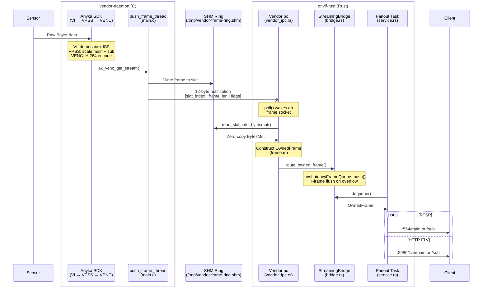

# Video Flow — Developer Guide & Troubleshooting

## 1. Overview

This document covers the complete video path from hardware sensor to client
playback for the Anyka AK3918 camera platform.

The system uses a **dual-process architecture**:

| Process           | Language | Role                                                                         |
|-------------------|----------|------------------------------------------------------------------------------|
| **vendor-daemon** | C        | Wraps the Anyka SDK. Captures, encodes, and pushes frames via shared memory. |
| **onvif-rust**    | Rust     | ONVIF 24.12 server. Consumes pushed frames, serves RTSP and HTTP-FLV.        |

Frame delivery is **push-only** — vendor-daemon writes encoded frames into a
shared-memory ring buffer and sends lightweight 12-byte notifications over
per-stream Unix sockets. There are no pull/poll operations from the Rust side.

**Related documents**: `ARCHITECTURE.md` (system design), `INIT_DEINIT_FLOW.md` (mutex inventory and ordering).

---

## 2. Quick Reference

### Key Files

| File                                                | Description                                                     |
|-----------------------------------------------------|-----------------------------------------------------------------|
| `cross-compile/vendor-daemon/src/main.c`            | C daemon: IPC dispatch, push_frame_thread, ring write           |
| `cross-compile/onvif-rust/src/hal/vendor_ipc.rs`    | Rust IPC client: command protocol, `recv_pushed_frame()`        |
| `cross-compile/onvif-rust/src/hal/shm_ring.rs`      | Shared memory ring reader: `ShmRingReader`, `FrameNotification` |
| `cross-compile/onvif-rust/src/platform/anyka.rs`    | Platform init/shutdown, channel configuration                   |
| `cross-compile/onvif-rust/src/platform/frame.rs`    | `OwnedFrame`, `StreamId`, `FrameType`, `FrameMetadata`          |
| `cross-compile/onvif-rust/src/streaming/bridge.rs`  | `StreamingBridge`, `LowLatencyFrameQueue`, `BytesMutPool`       |
| `cross-compile/onvif-rust/src/streaming/service.rs` | `StreamingService`, fanout tasks, RTSP/HTTP-FLV server spawn    |
| `cross-compile/onvif-rust/src/streaming/config.rs`  | `StreamingConfig`: ports, stream names, defaults                |

### Common Issues Quick Fix

| Issue           | Quick Fix                           | Details                                  |
|-----------------|-------------------------------------|------------------------------------------|
| No video stream | Is vendor-daemon running?           | Check `/tmp/vd-ctrl.sock` exists         |
| Socket missing  | Daemon not started or crashed       | `ls /tmp/vd-*.sock`                      |
| SHM errors      | Shared memory file missing or wrong | `ls -la /tmp/vendor-frame-ring.shm`      |
| Port conflict   | Another process on :554 or :8080    | `ss -tlnp` and grep for 554 or 8080      |
| Frame timeout   | Push thread not active              | Grep daemon logs for `push_frame_thread` |

### Build & Test Commands

```bash
# Build vendor-daemon (cross-compile)
cd cross-compile/vendor-daemon && make

# Build onvif-rust
cd cross-compile/onvif-rust && cargo build --release

# Run tests
cargo test

# Lint
cargo clippy -- -D warnings

# Test RTSP playback
ffplay -fflags nobuffer rtsp://<camera-ip>:554/main

# Grep for errors in daemon log
grep -E 'error|WARN|panic' /tmp/vendor-daemon.log
```

---

## 3. Two-Process Architecture

### 3a. Process Responsibilities

**vendor-daemon (C)**:

- Calls Anyka SDK functions (`ak_vi_*`, `ak_vpss_*`, `ak_venc_*`, `ak_ai_*`, `ak_aenc_*`)
- Manages hardware lifecycle (sensor, VPSS, encoder open/close)
- Runs `push_frame_thread()` per stream — polls `ak_venc_get_stream()` and writes to SHM
- Sends 12-byte frame notifications over per-stream Unix sockets
- Accepts IPC commands from onvif-rust for lifecycle and imaging control

**onvif-rust (Rust)**:

- ONVIF 24.12 web service (Device, Media, Imaging, PTZ, Events)
- Connects to vendor-daemon via IPC sockets
- Reads frames from shared memory via `ShmRingReader`
- Routes frames through `StreamingBridge` to `LowLatencyFrameQueue`
- Serves RTSP (:554) and HTTP-FLV (:8080) streams via `StreamingService`

### 3b. IPC Channels

| Channel           | Path                         | Direction            | Purpose                                      |
|-------------------|------------------------------|----------------------|----------------------------------------------|
| Control socket    | `/tmp/vd-ctrl.sock`          | Rust → C → Rust      | Command RPC (lifecycle, imaging, queries)    |
| Frame main socket | `/tmp/vd-frame-main.sock`    | C → Rust             | 12-byte notifications for main stream frames |
| Frame sub socket  | `/tmp/vd-frame-sub.sock`     | C → Rust             | 12-byte notifications for sub stream frames  |
| Shared memory     | `/tmp/vendor-frame-ring.shm` | C writes, Rust reads | Zero-copy frame data (ring buffer)           |

> **Legacy fallback**: The daemon also accepts connections on `/tmp/vendor-daemon.sock`
> (the original single-socket path). `VendorIpc::new()` tries `/tmp/vd-ctrl.sock` first,
> falling back to the legacy path.

### 3c. Binary Protocol

**Command RPC** (control socket, bidirectional):

```text
Request:  [cmd_id: i32 LE] [req_len: u32 LE] [req_data: bytes]
Response: [status: i32 LE] [resp_len: u32 LE] [resp_data: bytes]
```

**Frame Notification** (frame sockets, daemon → Rust, 12 bytes):

```text
[slot_index: u32 LE] [frame_len: u32 LE] [flags: u32 LE]
```

- `slot_index == u32::MAX` → socket fallback (frame data follows inline, not in SHM)
- `flags & VD_NOTIFY_FRAME_DROPPED` → frame was dropped, diagnostic only

### 3d. End-to-End Frame Flow


```mermaid
sequenceDiagram
    participant Sensor
    box vendor-daemon (C)
        participant SDK as Anyka SDK<br/>(VI → VPSS → VENC)
        participant PFT as push_frame_thread<br/>(main.c)
    end
    participant SHM as SHM Ring<br/>(/tmp/vendor-frame-ring.shm)
    box onvif-rust (Rust)
        participant IPC as VendorIpc<br/>(vendor_ipc.rs)
        participant Bridge as StreamingBridge<br/>(bridge.rs)
        participant Fanout as Fanout Task<br/>(service.rs)
    end
    participant Client

    Sensor->>SDK: Raw Bayer data
    Note over SDK: VI: demosaic + ISP<br/>VPSS: scale main + sub<br/>VENC: H.264 encode
    SDK->>PFT: ak_venc_get_stream()
    PFT->>SHM: Write frame to slot
    PFT-)IPC: 12-byte notification<br/>[slot_index | frame_len | flags]
    Note over IPC: poll() wakes on<br/>frame socket
    IPC->>SHM: read_slot_into_bytesmut()
    SHM-->>IPC: Zero-copy BytesMut
    Note over IPC: Construct OwnedFrame<br/>(frame.rs)
    IPC->>Bridge: route_owned_frame()
    Note over Bridge: LowLatencyFrameQueue::push()<br/>I-frame flush on overflow
    Fanout->>Bridge: dequeue()
    Bridge-->>Fanout: OwnedFrame
    par RTSP
        Fanout->>Client: :554/main or /sub
    and HTTP-FLV
        Fanout->>Client: :8080/live/main or /sub
    end
```

---

## 4. Initialization Sequence

### Startup (Rust → IPC → vendor-daemon)

The `AnykaPlatform::initialize()` method (`anyka.rs:246`) drives the init
sequence by sending IPC commands to vendor-daemon:

| Step | Rust Call                             | IPC Command                        | Description                              |
|------|---------------------------------------|------------------------------------|------------------------------------------|
| 1    | `video_input.match_sensor()`          | `CMD_VI_MATCH_SENSOR (1)`          | Load ISP config, detect sensor           |
| 2    | `video_input.open()`                  | `CMD_VI_OPEN (2)`                  | Open video input device                  |
| 2.5  | `video_input.init_vpss()`             | `CMD_VPSS_INIT (8)`                | Initialize video processing subsystem    |
| 3    | `video_input.get_sensor_resolution()` | `CMD_VI_GET_SENSOR_RESOLUTION (4)` | Query native sensor resolution           |
| 4    | `video_input.set_channel_attr()`      | `CMD_VI_SET_CHANNEL_ATTR (5)`      | Configure dual channels (main + sub)     |
| 5    | `video_input.capture_on()`            | `CMD_VI_CAPTURE_ON (6)`            | Start capture pipeline (200ms stabilize) |
| 6    | `video_encoder.init(config)`          | `CMD_VENC_OPEN (11)` × 2           | Open main and sub encoders               |
| 7    | `video_encoder.start_streaming()`     | `CMD_VENC_START_PUSH (19)`         | Start push_frame_thread per stream       |
| 8    | `StreamingService::start()`           | — (local)                          | Create StreamsHub, spawn RTSP + HTTP-FLV |

Each step includes rollback logic — if step N fails, steps 1..N-1 are reversed
in order. See `anyka.rs:246-345` for the full sequence with error handling.

### Shutdown (Reverse Order)

`AnykaPlatform::shutdown()` (`anyka.rs:406`) and `shutdown_video_pipeline()`
(`anyka.rs:162`) tear down in reverse:

| Step | Action                                       | IPC Command               |
|------|----------------------------------------------|---------------------------|
| 1    | Stop PTZ motors                              | — (local)                 |
| 2    | Stop streaming (abort fanout tasks, servers) | — (local)                 |
| 3    | Stop push threads                            | `CMD_VENC_STOP_PUSH (20)` |
| 4    | Close encoders                               | `CMD_VENC_CLOSE (12)` × 2 |
| 5    | Capture off                                  | `CMD_VI_CAPTURE_OFF (7)`  |
| 6    | Destroy VPSS                                 | `CMD_VPSS_DESTROY (9)`    |
| 7    | Close video input                            | `CMD_VI_CLOSE (3)`        |

Shutdown is **best-effort** — each step logs errors but continues to the next,
ensuring maximum cleanup even if the daemon becomes unresponsive.

---

## 5. Frame Data Path

### Complete Path (per frame)

```text
1.  Sensor hardware                           → Raw Bayer data
2.  VI (ak_vi)                                → Demosaic + ISP processing
3.  VPSS (ak_vpss)                            → Scale to main and sub (640×360)
4.  VENC (ak_venc)                            → H.264 encode
5.  push_frame_thread                         → main.c:754 — polls ak_venc_get_stream()
6.  SHM ring write                            → main.c — writes to SHM ring
7.  Socket notification                       → main.c — sends 12-byte FrameNotification
8.  VendorIpc::recv_pushed_frame()            → vendor_ipc.rs:800 — poll() on frame sockets
9.  ShmRingReader::read_slot_into_bytesmut()  → shm_ring.rs — zero-copy read from SHM
10. OwnedFrame constructed                    → frame.rs — data in BytesMut, no extra copy
11. StreamingBridge::route_owned_frame()      → bridge.rs:380 — routes by StreamId
12. LowLatencyFrameQueue::push()              → bridge.rs:75 — bounded push, I-frame flush
13. Fanout task recv()                        → service.rs:503 — dequeues and fans out
14. RTSP / HTTP-FLV send                      → service.rs:600 — to subscriber channels
```

### Key Data Structures

**`OwnedFrame`** (`frame.rs:94`):

```rust
pub struct OwnedFrame {
    pub data: BytesMut,       // Encoded frame data (owned, zero-copy from SHM)
    pub timestamp: u64,       // Microseconds since epoch
    pub frame_type: FrameType,// VideoIFrame | VideoPFrame | VideoBFrame | AudioPacket
    pub stream_id: StreamId,  // VideoMain | VideoSub | Audio
}
```

**`LowLatencyFrameQueue`** (`bridge.rs:43`):

- Bounded `VecDeque<QueuedFrame>` with overflow policy
- On overflow + incoming I-frame: **flush entire queue** (ensures clean GOP start)
- On overflow + incoming P-frame: drop oldest non-IDR frame
- Telemetry: tracks enqueued, dequeued, dropped_on_overflow, dropped_on_flush, max_depth

**`StreamState`** (`bridge.rs:277`):

- Per-stream (main/sub) bridge state
- Holds `frame_queue`, cached SPS/PPS, `last_timestamp_ms`, `bootstrap_idr`
- Late-joining subscribers receive cached SPS + PPS + latest IDR

### Stream URIs

| Protocol | Main Stream                  | Sub Stream                  |
|----------|------------------------------|-----------------------------|
| RTSP     | `rtsp://<ip>:554/main`       | `rtsp://<ip>:554/sub`       |
| HTTP-FLV | `http://<ip>:8080/live/main` | `http://<ip>:8080/live/sub` |

---

## 6. Troubleshooting Guide

### 6.1 Vendor-Daemon Not Running

**Symptoms**: onvif-rust fails at startup with "VendorIpc connection failed",
`/tmp/vd-ctrl.sock` does not exist.

**Debugging**:

```bash
# Check if daemon is running
ps aux | grep vendor-daemon

# Check socket existence
ls -la /tmp/vd-ctrl.sock /tmp/vd-frame-main.sock /tmp/vd-frame-sub.sock

# Start daemon manually (on device)
/mnt/anyka_hack/vendor-daemon/vendor-daemon.bin &

# Check daemon logs
cat /tmp/vendor-daemon.log | tail -50
```

**Code locations**: `VendorIpc::new()` at `vendor_ipc.rs:336`, connection to
`CTRL_SOCKET_PATH` (`/tmp/vd-ctrl.sock`).

**Fix**: Ensure vendor-daemon starts before onvif-rust. The SD card boot script
(`anyka_hack/init_camera.sh`) should launch vendor-daemon first.

### 6.2 Shared Memory Ring Issues

**Symptoms**: "SHM file missing", "SHM size mismatch", frames arrive but contain
garbage data.

**Debugging**:

```bash
# Check SHM file exists and has correct size
ls -la /tmp/vendor-frame-ring.shm
# Expected size: 1048640 bytes (64 + 8 × 128KB)

# Check permissions
stat /tmp/vendor-frame-ring.shm
# Both processes must have read/write access
```

**Code locations**:

- Ring layout constants: `shm_ring.rs:74-87`
- `ShmRingReader::open()`: `shm_ring.rs`
- Ring creation: `main.c` (vendor-daemon creates the file)

**Expected SHM layout**:

```text
Ring Header:     64 bytes
Slot 0 Header:   64 bytes  ┐
Slot 0 Data:   128KB - 64B ┘  × 8 slots
...
Total: 64 + 8 × 131072 = 1,048,640 bytes
```

**Fix**: If the file is missing, vendor-daemon hasn't been started or failed
during init. If the size is wrong, ensure both processes use matching constants
(`VD_SHM_SLOT_COUNT=8`, `VD_SHM_SLOT_SIZE=128KB`).

### 6.3 Frame Push Timeout

**Symptoms**: onvif-rust connects but never receives frames, `poll()` in
`recv_pushed_frame()` times out.

**Debugging**:

```bash
# Check if push threads are active in daemon logs
grep "push_frame_thread" /tmp/vendor-daemon.log

# Check if encoder is producing frames
grep "venc_get_stream" /tmp/vendor-daemon.log | tail -5

# Verify frame sockets are connected
ls -la /tmp/vd-frame-main.sock /tmp/vd-frame-sub.sock
```

**Code locations**:

- Push thread: `main.c:754` (`push_frame_thread`)
- Start push: `CMD_VENC_START_PUSH (19)` at `main.c:1426`
- Rust poll: `vendor_ipc.rs:800` (`recv_pushed_frame`)

**Fix**: Ensure step 7 of init (start_streaming → `CMD_VENC_START_PUSH`) completed
successfully. Check if encoders were opened (`CMD_VENC_OPEN`) before push was started.

### 6.4 RTSP / HTTP-FLV Connection Failures

**Symptoms**: `ffplay` or browser cannot connect, "connection refused" errors.

**Debugging**:

```bash
# Check if ports are bound
ss -tlnp | grep -E ':554|:8080'

# Test RTSP with ffprobe
ffprobe -v error -show_entries stream=codec_name,width,height \
  rtsp://<camera-ip>:554/main

# Test HTTP-FLV with curl
curl -v http://<camera-ip>:8080/live/main

# Check if streaming service started
grep "Streaming service started" /tmp/onvif-rust.log
```

**Code locations**:

- Port verification: `service.rs:370` (`verify_port_available`)
- Server spawn: `service.rs:342-352`
- Stream names: `config.rs:80-81` (`main_stream_name="main"`, `sub_stream_name="sub"`)

**Fix**: If ports are in use, check for leftover processes. If streaming didn't
start, check for init errors earlier in the log. Verify config values (default:
RTSP=554, HTTP-FLV=8080).

### 6.5 Frame Drops / Queue Overflow

**Symptoms**: Video stuttering, log messages about dropped frames, periodic
telemetry showing high `dropped_on_overflow` or `dropped_on_flush` counts.

**Debugging**:

```bash
# Check for dropped frame notifications from daemon
grep "push_drop_notify" /tmp/vendor-daemon.log

# Check queue telemetry from onvif-rust
grep "Low-latency queue telemetry" /tmp/onvif-rust.log

# Check fanout progress
grep "Fanout task progress" /tmp/onvif-rust.log
```

**Code locations**:

- Daemon drop notification: `main.c:877` (`VD_NOTIFY_FRAME_DROPPED`)
- Queue overflow policy: `bridge.rs:75-95` (`LowLatencyFrameQueue::push`)
- Queue telemetry: `bridge.rs:147` (`maybe_log_telemetry`, every 500 frames)
- Fanout summary: `service.rs:603` (every 300 frames)

**I-frame flush behavior**: When the queue is full and a new I-frame arrives,
the entire queue is flushed and replaced with the fresh I-frame. This ensures
clients always start from a clean GOP boundary rather than accumulating stale
P-frames that would cause decode artifacts.

**Fix**:

- If daemon reports drops → encoder is producing faster than SHM writes (rare)
- If queue overflow → downstream consumption is too slow; check network, increase
  queue capacity via `ONVIF_QUEUE_MAIN` / `ONVIF_QUEUE_SUB` env vars
- Default capacities: main=4, sub=6 (see `service.rs:310-311`)

---

## 7. Developer Guidelines

### Adding a New Stream

1. Add a `StreamId` variant in `frame.rs` (e.g., `VideoThird`)
2. Add a new `LowLatencyFrameQueue` in `StreamingBridge` (`bridge.rs`)
3. Update `route_owned_frame()` routing logic in `bridge.rs`
4. Add a new frame socket path in `vendor_ipc.rs`
5. Add encoder configuration in `anyka.rs`
6. Publish the new stream in `StreamingService::start()` (`service.rs`)
7. Add push thread in vendor-daemon (`main.c`)

### Adding IPC Commands

1. Define the command constant in `vendor_ipc.rs` (e.g., `const CMD_NEW_THING: i32 = 30;`)
2. Add a handler in `main.c` dispatch switch
3. Add a Rust wrapper method on `VendorIpc` that calls `send_command()`
4. Wire the wrapper into the relevant HAL trait implementation

### Error Handling Patterns

Graceful degradation — non-critical failures log and continue:

```rust
// Best-effort shutdown pattern (anyka.rs:174)
if let Err(e) = video_input.capture_off() {
    tracing::warn!("Video capture off failed during shutdown (best-effort): {}", e);
}
```

Rollback on critical init failure:

```rust
// anyka.rs:273 — if set_channel_attr fails, undo open + VPSS
if let Err(e) = self.video_input.set_channel_attr() {
    let _ = self.video_input.destroy_vpss();
    let _ = self.video_input.close().await;
    return Err(e);
}
```

### Performance Notes

- **BytesMutPool** (`bridge.rs:216`): Reuses `BytesMut` buffers (64KB default, pool of 8)
  to reduce malloc pressure on uClibc. I-frames > 64KB get fresh allocations.
- **Zero-copy path**: SHM read → `BytesMut` → `OwnedFrame` → `route_owned_frame()`.
  Frame data is *moved*, never copied between pipeline stages.
- **Queue capacities**: main=4 frames, sub=6 frames (configurable via env vars).
  Smaller queues = lower latency; larger queues = more tolerance for jitter.
- **Tie-breaker fairness**: `recv_pushed_frame()` uses `poll()` on both frame
  sockets simultaneously, preventing main-stream starvation of sub-stream or
  vice versa.
- **Callback budget**: `on_frame` / `on_owned_frame` must complete in < 2ms to
  avoid blocking the encoder pipeline.

### Testing Commands

```bash
# Unit tests
cargo test --lib

# All tests (unit + integration)
cargo test

# Lint check
cargo clippy -- -D warnings

# Format check
cargo fmt --check

# On-device RTSP validation
ffprobe -v error rtsp://<camera-ip>:554/main
ffprobe -v error rtsp://<camera-ip>:554/sub

# Multi-client load test (3 concurrent RTSP streams)
for i in 1 2 3; do
  ffplay -fflags nobuffer rtsp://<camera-ip>:554/main &
done
```

---

## 8. Configuration Reference

### Stream Profiles

| Parameter     | Main Stream                 | Sub Stream         |
|---------------|-----------------------------|--------------------|
| Resolution    | 1280×720 (or sensor-native) | 640×360            |
| Framerate     | 15 fps                      | 15 fps             |
| Bitrate       | 2000 kbps                   | 300 kbps           |
| Codec         | H.264 Main Profile          | H.264 Main Profile |
| Encoder token | `VideoEncoder_1`            | `VideoEncoder_2`   |

> Channel layout is configured in `anyka.rs:609` (`set_channel_attr`). Main
> resolution follows the sensor; sub defaults to 640×360 with fallback for
> small sensors.

### SHM Ring Layout

| Component          | Size                | Count    |
|--------------------|---------------------|----------|
| Ring Header        | 64 bytes            | 1        |
| Slot Header        | 64 bytes            | per slot |
| Slot Data          | 128KB - 64B         | per slot |
| **Total Slots**    | —                   | **8**    |
| **Total SHM Size** | **1,048,640 bytes** | —        |

Constants defined in `shm_ring.rs:74-87`:

- `VD_SHM_SLOT_COUNT = 8`
- `VD_SHM_SLOT_SIZE = 128 KB`
- `VD_SHM_HEADER_SIZE = 64`
- `VD_SHM_SLOT_HDR_SIZE = 64`

### Hardware Limitations (AK3918)

- Max resolution: 1920×1080 @ 30fps
- Codec: H.264 only (no H.265 on this SoC)
- RAM budget: **24 MB** hard cap (enforced via `cap` crate allocator)
- Dual-stream maximum: main + sub simultaneous encoding

---

## 9. Expected Log Messages

### Normal Startup

```text
INFO  AnykaPlatform: using shared VendorIpc client for video/audio/imaging
INFO  ISP sensor matched successfully
INFO  Sensor resolution detected: 1280x720
INFO  Video input initialized: dual-channel config and capture started
INFO  Video encoders initialized: 2 channels
INFO  Streaming service started rtsp_port=554 httpflv_port=8080
DEBUG First frame received in fanout task (pipeline is flowing)
```

### Warnings (Transient / Non-Fatal)

```text
WARN  VPSS init failed during platform init; continuing without VPSS: ...
WARN  IDR frame missing SPS/PPS and cache incomplete
WARN  SPS/PPS missing when subscriber connects (client will see black screen)
WARN  Video capture off failed during shutdown (best-effort, continuing): ...
```

### Errors (Requires Investigation)

```text
ERROR VendorIpc connection failed (is vendor-daemon running?): ...
ERROR Failed to set channel attributes, rolling back: ...
ERROR RTSP port 554 is unavailable for startup: Address already in use
ERROR Video encoder VideoEncoder_1 initialization failed: ...
```

---

## 10. Performance Expectations

| Metric                 | Expected Value | Notes                                  |
|------------------------|----------------|----------------------------------------|
| VendorIpc connect      | < 50ms         | Unix socket connect to daemon          |
| Sensor match + VI open | < 500ms        | ISP config load + device init          |
| VPSS + channel config  | < 100ms        | Includes 200ms capture stabilize delay |
| Encoder open (×2)      | < 200ms        | Main + sub H.264 encoders              |
| Start push             | < 50ms         | Spawns push_frame_thread per stream    |
| First frame arrival    | < 300ms        | After push start, to first OwnedFrame  |
| **Total init budget**  | **< 1.5s**     | All steps, sensor to first RTSP frame  |
| Frame callback budget  | < 2ms          | on_owned_frame must not block encoder  |
| Queue push overhead    | < 100μs        | Mutex lock + VecDeque push + notify    |

---

## 11. Build System Integration

### Cross-Compilation

```bash
# vendor-daemon (C, Anyka toolchain)
cd cross-compile/vendor-daemon
arm-anykav200-linux-uclibcgnueabi-gcc -std=gnu99 -march=armv5te \
  -mfloat-abi=soft -o vendor-daemon main.c \
  -I<sdk-include-dir> -L<sdk-lib-dir> \
  -lplat_vi -lplat_vpss -lplat_venc_cb -lmpi_venc ...

# onvif-rust (Rust, cross-compile for ARM)
cd cross-compile/onvif-rust
cargo build --release
```

### Deploy to SD Card

```bash
# Copy binaries to SD card payload
cp vendor-daemon.bin SD_card_contents/anyka_hack/vendor-daemon/
cp onvif-rust.bin    SD_card_contents/anyka_hack/onvif/
```

### Quality Checks

```bash
cargo clippy -- -D warnings   # Zero warnings required
cargo fmt --check              # Formatting must pass
cargo test                     # All tests must pass
cargo doc --no-deps            # Documentation must build
```

---

## 12. Conclusion

The dual-process video pipeline provides:

- **Process isolation**: SDK crashes in vendor-daemon do not bring down the ONVIF server
- **Push-only delivery**: No polling from Rust; daemon pushes frames as they're encoded
- **Zero-copy path**: SHM ring → BytesMut → OwnedFrame → queue (data is moved, not copied)
- **I-frame queue flush**: On overflow, stale P-frames are discarded for a clean GOP start
- **Dual-stream fairness**: `poll()` on both frame sockets prevents cross-channel blocking
- **ONVIF 24.12 compliance**: Full RTSP and HTTP-FLV streaming with late-join support
- **24 MB RAM budget**: BytesMutPool reuse + bounded queues keep memory predictable
