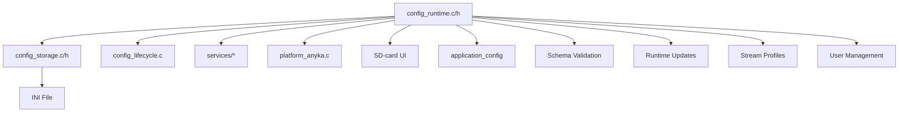

# Technical Implementation Plan: Unified Configuration System

**Feature**: Unified Configuration System for ONVIF Daemon
**Branch**: `001-unified-configuration-system`
**Created**: 2025-10-10
**Status**: Ready for Implementation

## Executive Summary

This plan implements a unified configuration system that consolidates ONVIF daemon configuration management with runtime updates, stream profile support (max 4), and user credential management (max 8 users). The implementation follows the project's established patterns, leverages existing utilities, and maintains full backward compatibility while modernizing the configuration architecture.

## Architecture Overview

### Current State Analysis

**Existing Configuration System**:

- `config.c/h` - Basic configuration management with INI parsing
- `platform_anyka.c` - Platform-specific configuration functions
- `application_config` structure - Centralized configuration container
- Manual parameter definitions with basic validation

**Key Strengths to Preserve**:

- Existing `application_config` structure and layout
- INI file format compatibility
- Platform abstraction layer separation
- Service integration patterns

**Areas for Improvement**:

- Duplicated INI parsing logic between `config.c` and `platform_anyka.c`
- No schema-driven validation
- Limited runtime update capabilities
- No stream profile management
- No user credential management

### Target Architecture



## Implementation Phases

### Phase 1: Core Runtime Manager (Priority: P1)

**Duration**: 3-4 days
**Dependencies**: None

#### 1.1 Create Schema-Driven Runtime Manager

**Files**: `cross-compile/onvif/src/core/config/config_runtime.c`, `cross-compile/onvif/src/core/config/config_runtime.h`

**Key Components**:

- Schema entry definitions with metadata (type, limits, defaults, required flags)
- Runtime manager instance with generation counter
- Typed getter/setter functions with validation
- Bootstrap and defaults application
- Runtime snapshot functionality

**Schema Entry Structure**:

```c
typedef struct {
  config_section_t section;
  const char* section_name;
  const char* key;
  config_value_type_t type;
  int required;
  int min_value;
  int max_value;
  size_t max_length;
  const char* default_literal;
} config_schema_entry_t;
```

**Core APIs**:

```c
int config_runtime_bootstrap(struct application_config* cfg);
int config_runtime_get_int(config_section_t section, const char* key, int* out_value);
int config_runtime_set_int(config_section_t section, const char* key, int value);
const struct application_config* config_runtime_snapshot(void);
int config_runtime_apply_defaults(void);
```

**Implementation Details**:

- Reuse existing parameter arrays from `config.c`
- Integrate with `utils/validation/common_validation.h`
- Maintain thread safety with mutex protection
- Use ONVIF error constants for return codes
- Follow global variable naming: `g_config_runtime_*`

#### 1.2 Implement Safe INI Storage Helpers

**Files**: `cross-compile/onvif/src/core/config/config_storage.c`, `cross-compile/onvif/src/core/config/config_storage.h`

**Key Components**:

- Atomic file operations (temp-file + rename pattern)
- INI parsing with validation
- Checksum handling for integrity
- Graceful fallback to defaults on load failure
- Structured error logging

**Core APIs**:

```c
int config_storage_load(const char* path, config_manager_t* manager);
int config_storage_save(const char* path, const config_manager_t* manager);
int config_storage_reload(const char* path);
```

**Implementation Details**:

- Move INI parsing logic from `config.c` and `platform_anyka.c`
- Use `platform_log_*` APIs for error reporting
- Implement atomic writes to prevent corruption
- Add file size validation (16KB limit)
- Return ONVIF error constants only

### Phase 2: Integration and Refactoring (Priority: P1)

**Duration**: 2-3 days
**Dependencies**: Phase 1 complete

#### 2.1 Refactor Core Config Integration

**Files**: `cross-compile/onvif/src/core/config/config.c`, `cross-compile/onvif/src/core/config/config.h`

**Changes**:

- Update existing APIs to delegate to `config_runtime`/`config_storage`
- Remove redundant global buffers
- Maintain ABI compatibility for existing callers
- Clean up legacy parsing logic

**Preserved APIs**:

```c
int config_init(config_manager_t* config, struct application_config* app_config);
int config_load(config_manager_t* config, const char* config_file);
int config_get_value(config_manager_t* config, config_section_t section, const char* key, void* value_ptr, config_value_type_t value_type);
int config_set_value(config_manager_t* config, config_section_t section, const char* key, const void* value_ptr, config_value_type_t value_type);
```

#### 2.2 Update Lifecycle Bootstrap

**Files**: `cross-compile/onvif/src/core/lifecycle/config_lifecycle.c`

**Changes**:

- Replace manual initialization with `config_runtime_bootstrap`
- Use `config_storage_load` for file operations
- Update generation counters and summaries
- Handle fallback-to-default scenarios

#### 2.3 Replace Platform INI Parsing

**Files**: `cross-compile/onvif/src/platform/platform_anyka.c`, `cross-compile/onvif/src/platform/platform.h`

**Changes**:

- Remove local buffer-based parser
- Delegate to unified storage/runtime functions
- Maintain platform API stability
- Update logging and error codes

**Updated Platform APIs**:

```c
platform_result_t platform_config_load(const char* filename);
platform_result_t platform_config_save(const char* filename);
const char* platform_config_get_string(const char* section, const char* key, const char* default_value);
int platform_config_get_int(const char* section, const char* key, int default_value);
```

### Phase 3: Stream Profile Management (Priority: P2)

**Duration**: 2-3 days
**Dependencies**: Phase 2 complete

#### 3.1 Extend Schema for Stream Profiles

**Files**: `cross-compile/onvif/src/core/config/config_runtime.c`, `cross-compile/onvif/src/core/config/config_runtime.h`

**New Schema Sections**:

```c
typedef enum {
  CONFIG_SECTION_STREAM_PROFILE_1,
  CONFIG_SECTION_STREAM_PROFILE_2,
  CONFIG_SECTION_STREAM_PROFILE_3,
  CONFIG_SECTION_STREAM_PROFILE_4
} config_section_t;
```

**Stream Profile Parameters**:

- `resolution_width`, `resolution_height` (int, 1-4096)
- `framerate` (int, 1-60)
- `bitrate` (int, 100-10000 kbps)
- `codec` (string, "H264"/"H265")
- `profile` (string, "baseline"/"main"/"high")
- `gop_length` (int, 1-300)

#### 3.2 Integrate with Media Service

**Files**: `cross-compile/onvif/src/services/media/onvif_media.c`, `cross-compile/onvif/src/services/media/onvif_media.h`

**Changes**:

- Update `onvif_media_get_profiles()` to use runtime configuration
- Implement profile limit enforcement (max 4)
- Add runtime profile updates via `SetVideoEncoderConfiguration`
- Maintain existing `media_profile` structure compatibility

**New APIs**:

```c
int config_runtime_get_stream_profile(int profile_index, struct media_profile* profile);
int config_runtime_set_stream_profile(int profile_index, const struct media_profile* profile);
int config_runtime_validate_stream_profile(const struct media_profile* profile);
```

### Phase 4: User Credential Management (Priority: P2)

**Duration**: 2-3 days
**Dependencies**: Phase 2 complete

#### 4.1 Extend Schema for User Management

**Files**: `cross-compile/onvif/src/core/config/config_runtime.c`, `cross-compile/onvif/src/core/config/config_runtime.h`

**New Schema Sections**:

```c
typedef enum {
  CONFIG_SECTION_USER_1,
  CONFIG_SECTION_USER_2,
  // ... up to CONFIG_SECTION_USER_8
} config_section_t;
```

**User Parameters**:

- `username` (string, 3-32 chars, alphanumeric)
- `password_hash` (string, 64 chars, SHA256 hex)
- `enabled` (bool, default true)
- `created_timestamp` (int, Unix timestamp)
- `last_modified` (int, Unix timestamp)

#### 4.2 Implement Password Hashing

**Files**: `cross-compile/onvif/src/core/config/config_runtime.c`

**Integration**:

- Use existing `utils/security/sha256.c` implementation
- Add salt generation for enhanced security
- Implement password verification functions

**New APIs**:

```c
int config_runtime_hash_password(const char* password, char* hash_output, size_t output_size);
int config_runtime_verify_password(const char* password, const char* hash);
int config_runtime_add_user(const char* username, const char* password);
int config_runtime_remove_user(const char* username);
int config_runtime_update_user_password(const char* username, const char* new_password);
```

#### 4.3 Integrate with Authentication

**Files**: `cross-compile/onvif/src/networking/http/http_auth.c`

**Changes**:

- Update authentication to use runtime user management
- Implement user limit enforcement (max 8)
- Add user enumeration for management interfaces
- Maintain existing authentication flow

### Phase 5: Runtime Updates and Persistence (Priority: P2)

**Duration**: 3-4 days
**Dependencies**: Phases 1-4 complete

#### 5.1 Implement Async Persistence Queue

**Files**: `cross-compile/onvif/src/core/config/config_runtime.c`

**Components**:

- Thread-safe persistence queue
- Coalescing mechanism for rapid updates
- Atomic write operations
- Error handling and rollback

**Queue Management**:

```c
typedef struct {
  config_section_t section;
  const char* key;
  config_value_type_t type;
  void* value;
  size_t value_size;
  uint64_t timestamp;
} persistence_queue_entry_t;
```

**Core APIs**:

```c
int config_runtime_queue_persistence_update(config_section_t section, const char* key, const void* value, config_value_type_t type);
int config_runtime_process_persistence_queue(void);
int config_runtime_get_persistence_status(void);
```

#### 5.2 Implement Runtime Update APIs

**Files**: `cross-compile/onvif/src/core/config/config_runtime.c`

**Update Flow**:

1. Validate new value against schema
2. Apply change immediately in-memory
3. Queue for async persistence
4. Return success to caller
5. Process queue in background thread

**Performance Requirements**:

- In-memory updates: <10 microseconds
- API response time: <200ms
- Persistence completion: <2 seconds

### Phase 6: Service Integration (Priority: P2)

**Duration**: 2-3 days
**Dependencies**: Phases 1-5 complete

#### 6.1 Update Service Handlers

**Files**:

- `cross-compile/onvif/src/protocol/response/onvif_service_handler.c`
- `cross-compile/onvif/src/services/device/onvif_device.c`
- `cross-compile/onvif/src/services/media/onvif_media.c`
- `cross-compile/onvif/src/services/ptz/onvif_ptz.c`
- `cross-compile/onvif/src/services/imaging/onvif_imaging.c`
- `cross-compile/onvif/src/services/snapshot/onvif_snapshot.c`

**Changes**:

- Replace direct `application_config` access with runtime manager
- Use typed getters for configuration values
- Implement runtime configuration updates via ONVIF operations
- Maintain service handler contracts

#### 6.2 Update Networking Layer

**Files**:

- `cross-compile/onvif/src/networking/http/http_server.c`
- `cross-compile/onvif/src/networking/common/epoll_server.c`
- `cross-compile/onvif/src/core/lifecycle/network_lifecycle.c`

**Changes**:

- Use runtime configuration for server settings
- Implement dynamic configuration updates
- Maintain connection handling during updates

### Phase 7: Testing and Quality Assurance (Priority: P1)

**Duration**: 3-4 days
**Dependencies**: All implementation phases complete

#### 7.1 Unit Testing

**Files**:

- `cross-compile/onvif/tests/src/unit/core/config/test_config_runtime.c`
- `cross-compile/onvif/tests/src/unit/core/config/test_config_storage.c`

**Test Coverage**:

- Schema validation and defaults
- Getter/setter operations
- Load/save success and failure paths
- Corrupt file handling
- Atomic write operations
- User credential management
- Stream profile validation

**Mock Requirements**:

- File I/O operations
- Platform logging functions
- SHA256 hashing functions
- Thread synchronization

#### 7.2 Integration Testing

**Files**:

- `cross-compile/onvif/tests/src/integration/core/config/test_config_integration.c`

**Test Scenarios**:

- Full daemon startup with configuration
- Runtime configuration updates
- Service integration verification
- Platform adapter compatibility
- SD-card payload testing

#### 7.3 End-to-End Testing

**Test Scenarios**:

- ONVIF client configuration updates
- Stream profile switching
- User authentication with new credentials
- Configuration persistence across reboots
- Error recovery and fallback behavior

### Phase 8: Documentation and Cleanup (Priority: P3)

**Duration**: 1-2 days
**Dependencies**: All testing complete

#### 8.1 Update Build System

**Files**: `cross-compile/onvif/Makefile`, `cross-compile/onvif/Doxyfile`

**Changes**:

- Add new source files to build targets
- Update Doxygen configuration
- Ensure formatting/lint scripts recognize new paths

#### 8.2 Update Documentation

**Files**:

- `cross-compile/onvif/README.md`
- `docs/refactoring/06_code_quality.md`

**Content**:

- Unified configuration flow explanation
- New API documentation
- Persistence behavior description
- SD-card tooling guidance

#### 8.3 Remove Legacy Code

**Files**: `cross-compile/onvif/src/platform/platform.h`

**Changes**:

- Remove deprecated `platform_config_*` declarations
- Update mock implementations
- Clean up unused includes

## Implementation Guidelines

### Code Standards Compliance

**MANDATORY Requirements**:

- Follow include ordering: system → third-party → project headers
- Use relative paths from `src/` directory for includes
- Global variables: `g_config_runtime_*` naming pattern
- Return codes: Use ONVIF error constants, no magic numbers
- Function ordering: definitions at top, execution logic at bottom

**Example Include Order**:

```c
#include <stdio.h>
#include <stdlib.h>
#include <string.h>

#include "core/config/config.h"
#include "utils/validation/common_validation.h"
#include "utils/security/sha256.h"
```

**Example Global Variable**:

```c
// Global state variables
static config_manager_t* g_config_runtime_manager = NULL;
static pthread_mutex_t g_config_runtime_mutex = PTHREAD_MUTEX_INITIALIZER;
static uint32_t g_config_runtime_generation = 0;
```

### Testing Requirements

**Unit Testing**:

- All new functions must have corresponding unit tests
- Use CMocka framework with `__wrap_` pattern
- Test success, error, and edge cases
- Achieve >90% code coverage

**Mock Implementation Example**:

```c
// Mock file I/O
int __wrap_fopen(const char* path, const char* mode) {
  function_called();
  return (int)mock();
}

// Test usage
will_return(__wrap_fopen, (uintptr_t)mock_file);
```

**Integration Testing**:

- Test full configuration lifecycle
- Verify service integration
- Test platform compatibility
- Validate ONVIF compliance

### Security Considerations

**Password Security**:

- Use SHA256 with salt for password hashing
- Never store plaintext passwords
- Implement secure password verification
- Log authentication attempts without exposing credentials

**Input Validation**:

- Validate all configuration inputs
- Sanitize strings and check bounds
- Prevent buffer overflows
- Use safe string operations

**File Security**:

- Atomic file operations prevent corruption
- Validate file permissions
- Check file size limits
- Implement secure temporary file handling

### Performance Requirements

**Response Times**:

- Configuration initialization: <150ms
- Runtime getters: <10 microseconds
- Configuration updates: <200ms
- Async persistence: <2 seconds

**Resource Usage**:

- Minimal heap allocations
- Efficient memory management
- Thread-safe operations
- Scalable to 100+ queries/second

## Risk Mitigation

### Technical Risks

**Risk**: Breaking existing service integration
**Mitigation**: Maintain ABI compatibility, comprehensive integration testing

**Risk**: Performance degradation
**Mitigation**: Benchmark existing performance, optimize critical paths

**Risk**: Configuration corruption
**Mitigation**: Atomic file operations, checksum validation, fallback to defaults

### Implementation Risks

**Risk**: Scope creep
**Mitigation**: Strict adherence to specification, phase-based implementation

**Risk**: Testing gaps
**Mitigation**: Comprehensive test coverage, automated testing pipeline

**Risk**: Documentation lag
**Mitigation**: Update documentation with each phase, automated doc generation

## Success Criteria

### Functional Requirements

- ✅ Single source of truth for configuration (FR-001 to FR-005)
- ✅ Schema-driven validation (FR-006 to FR-011)
- ✅ Runtime updates with async persistence (FR-012 to FR-016)
- ✅ Stream profile management (FR-017 to FR-023)
- ✅ User credential management (FR-024 to FR-027)

### Performance Requirements

- ✅ Configuration initialization <150ms
- ✅ Runtime getters <10 microseconds
- ✅ Configuration updates <200ms
- ✅ Async persistence <2 seconds
- ✅ Support 100+ queries/second

### Quality Requirements

- ✅ All unit tests pass (100% success rate)
- ✅ Code coverage >90%
- ✅ Linting passes with zero errors
- ✅ No security vulnerabilities
- ✅ ONVIF compliance maintained

## Dependencies and Prerequisites

### External Dependencies

- Existing `utils/security/sha256.c` implementation
- CMocka testing framework
- Platform abstraction layer
- ONVIF service implementations

### Internal Dependencies

- `utils/validation/common_validation.h`
- `utils/error/error_handling.h`
- `platform/platform.h`
- `services/common/onvif_types.h`

### Build Dependencies

- GNU Make build system
- GCC cross-compiler
- Doxygen documentation generator
- Linting and formatting scripts

## Timeline and Milestones

### Week 1: Core Implementation

- **Day 1-2**: Phase 1 - Core Runtime Manager
- **Day 3-4**: Phase 2 - Integration and Refactoring
- **Day 5**: Phase 3 - Stream Profile Management

### Week 2: Advanced Features

- **Day 1-2**: Phase 4 - User Credential Management
- **Day 3-4**: Phase 5 - Runtime Updates and Persistence
- **Day 5**: Phase 6 - Service Integration

### Week 3: Testing and Polish

- **Day 1-2**: Phase 7 - Testing and Quality Assurance
- **Day 3**: Phase 8 - Documentation and Cleanup
- **Day 4-5**: Final integration testing and validation

## Conclusion

This implementation plan provides a comprehensive roadmap for implementing the unified configuration system while maintaining the project's high standards for code quality, security, and performance. The phased approach ensures incremental progress with clear milestones and risk mitigation strategies.

The plan leverages existing project infrastructure, follows established patterns, and provides a solid foundation for future ONVIF feature development. Success depends on strict adherence to the project's coding standards, comprehensive testing, and thorough documentation.
