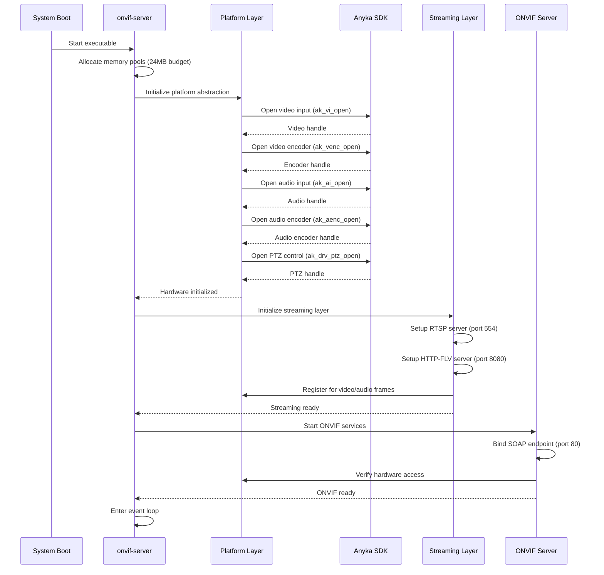
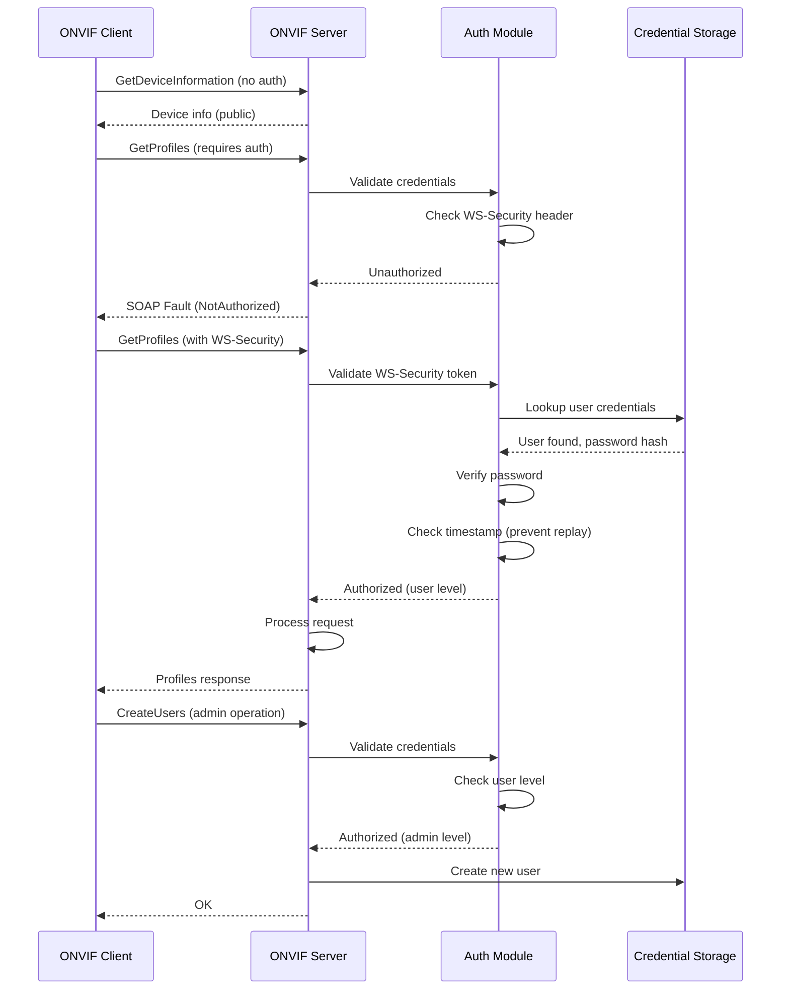
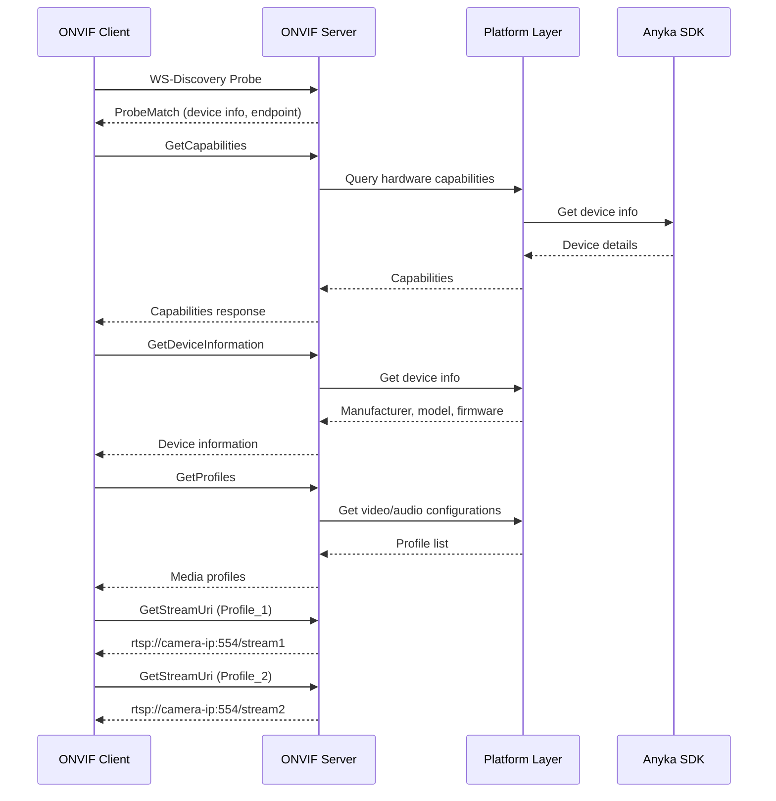
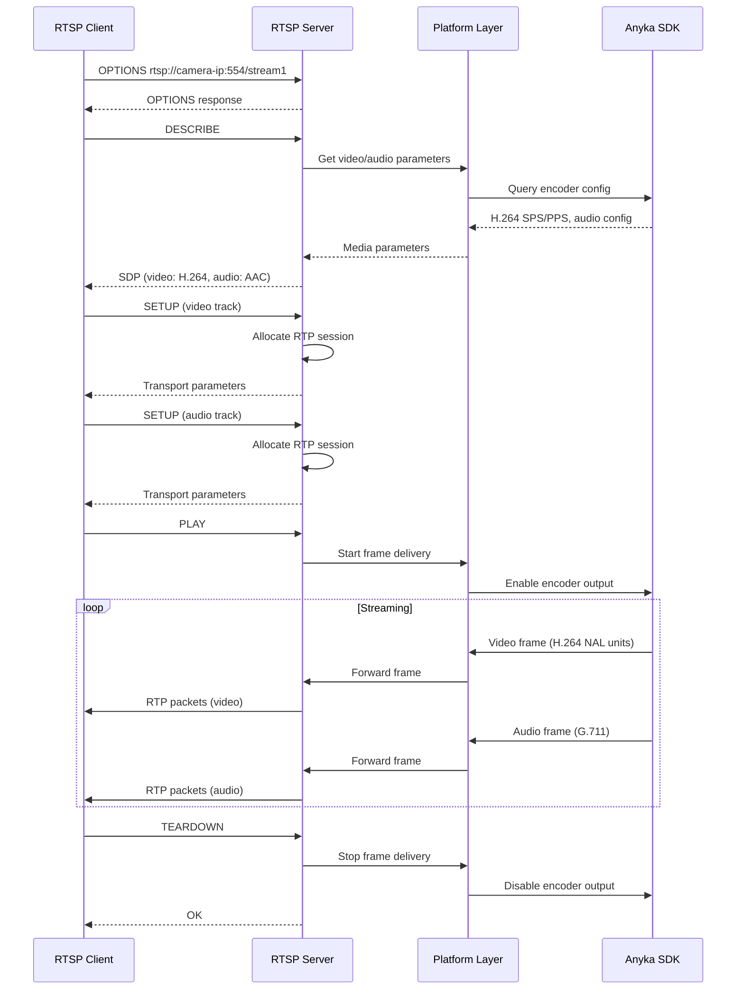
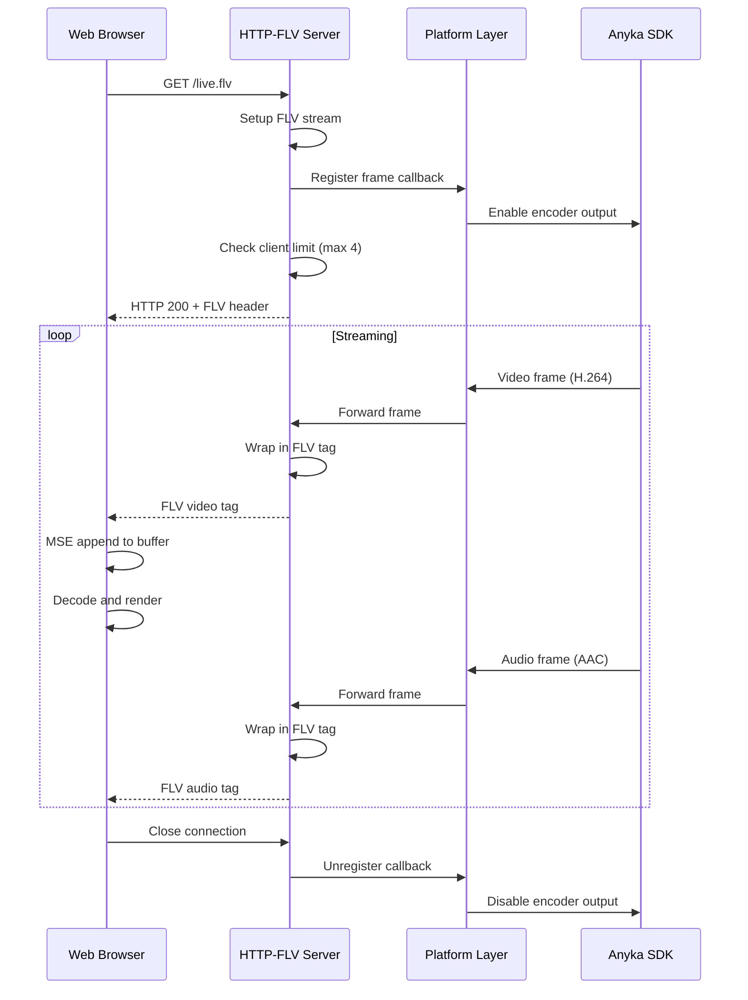
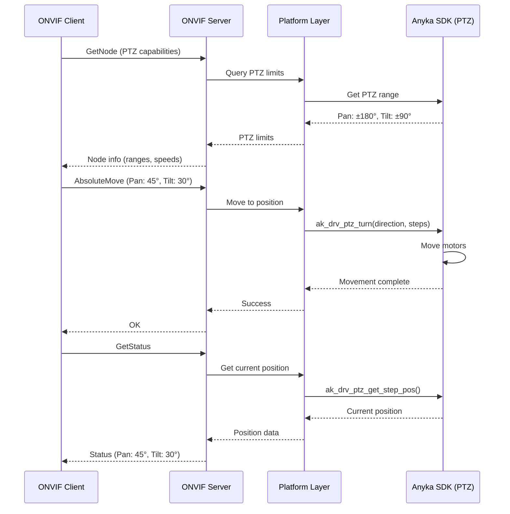
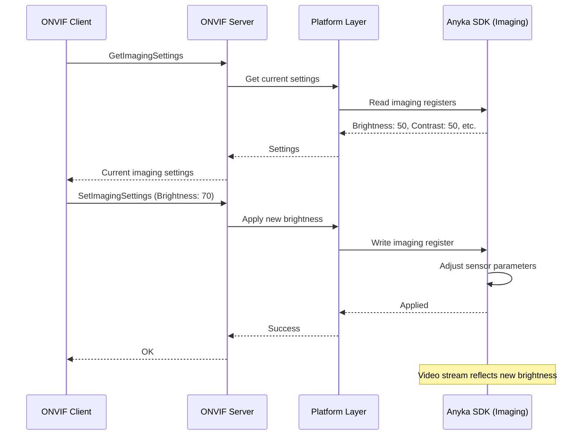
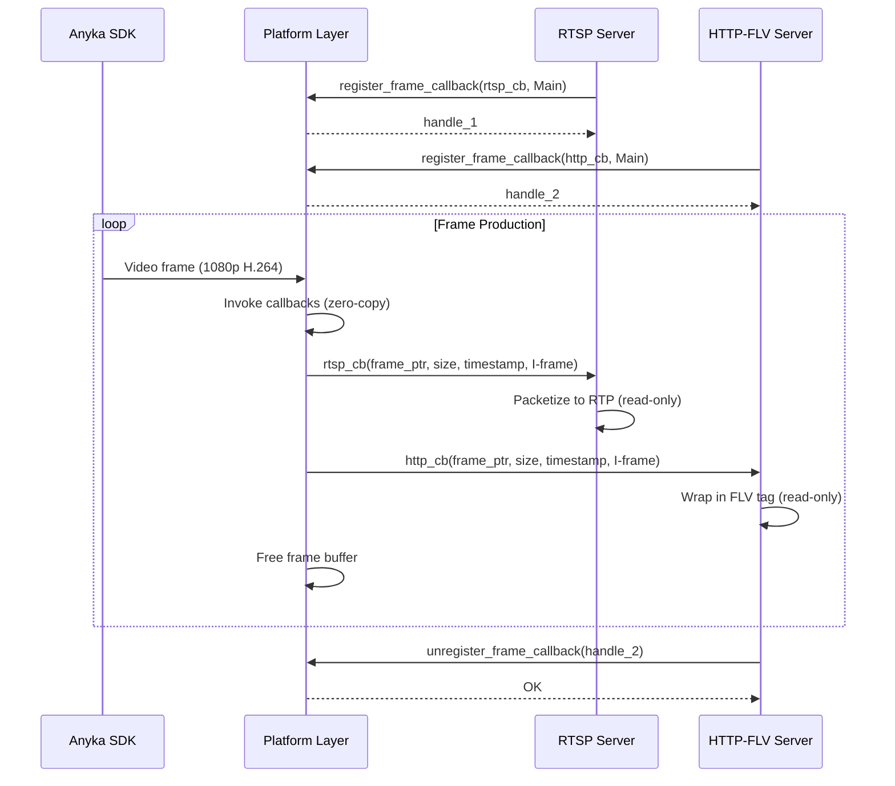
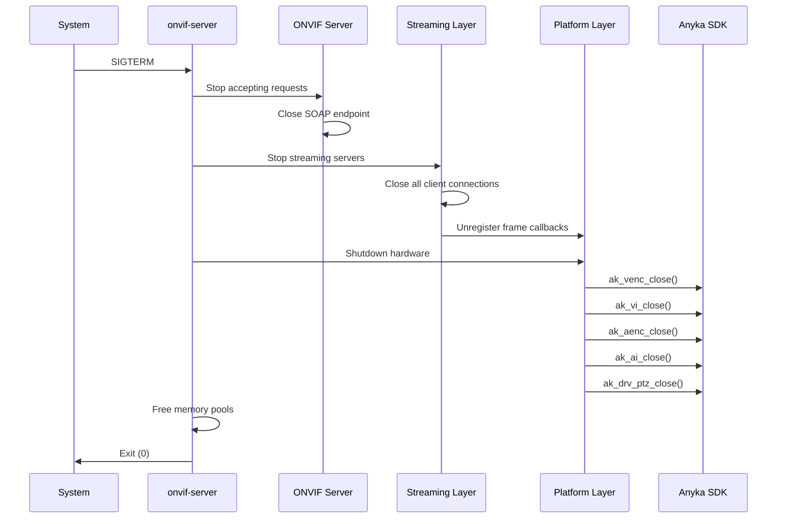

# Core Flows: Hardware Integration and Streaming Operations

## Overview

This spec defines the operational flows for the unified ONVIF server executable integrating Anyka AK3918 hardware and streaming protocols. These flows describe system behavior, initialization sequences, and operational patterns for the embedded camera firmware.

**Target Audience:** Firmware developers, system integrators, QA engineers

**Scope:** System-level operational flows (not end-user UI flows)

---

## Flow 1: System Startup and Initialization

**Description:** Complete initialization sequence when the onvif-server executable starts on AK3918 hardware.

**Trigger:** System boot or manual service start via SD card payload

**Memory Budget Allocation:**

- ONVIF Control Plane: 8MB
- Streaming Media Plane: 16MB
- Total: 24MB (within 32MB system RAM)

### Sequence

**Steps:**

1. **Memory Pool Allocation**
  - Allocate 8MB pool for ONVIF control operations
  - Allocate 16MB pool for streaming operations
  - Setup shared zero-copy buffer regions
2. **Hardware Initialization** (Platform Layer)
  - Open video input device (camera sensor)
  - Configure dual video encoders:
    - Main encoder: H.264, 1080p@25fps (~4MB)
    - Sub encoder: H.264, 720p@30fps (~3MB)
  - Open audio input device (microphone)
  - Configure audio encoder (AAC only, 512KB)
  - Initialize PTZ motors (if available)
  - Initialize imaging controls (brightness, contrast, etc.)
  - Read network configuration from system
3. **Streaming Layer Initialization**
  - Start RTSP server on port 554
  - Start HTTP-FLV server on port 8080
  - Register frame callbacks with platform layer
  - Setup stream routing and protocol conversion
4. **ONVIF Service Initialization**
  - Bind SOAP HTTP endpoint on port 80
  - Register device management services
  - Register media services (profiles, streaming URIs)
  - Register PTZ services
  - Register imaging services
  - Load user credentials and authentication
5. **Ready State**
  - Log initialization complete
  - Enter main event loop
  - Begin accepting ONVIF requests and streaming connections

**Success Criteria:**

- All hardware devices opened successfully
- Dual video encoders operational (1080p + 720p)
- Single audio encoder operational (AAC)
- Memory usage < 24MB
- RTSP and HTTP-FLV servers listening
- ONVIF endpoint responding to GetCapabilities
- Maximum 4 client connection slots available

**Error Handling:**

- Hardware init failure → Log error, retry 3 times, exit if persistent
- Memory allocation failure → Log error, exit immediately
- Port binding failure → Log error, try alternative ports, exit if all fail

---

## Flow 2: ONVIF Authentication and Authorization

**Description:** Client authenticates with ONVIF server before accessing services

**Trigger:** Client attempts to access protected ONVIF operations

**Actors:** ONVIF client, ONVIF server, Authentication module

### Sequence

**Steps:**

1. **Public Access (No Authentication)**
  - GetDeviceInformation, GetCapabilities are public
  - No credentials required
  - Allows device discovery
2. **Authentication Required**
  - Most ONVIF operations require authentication
  - Client must provide WS-Security header or HTTP Digest
  - Server validates credentials before processing
3. **WS-Security Validation**
  - Extract username and password digest from SOAP header
  - Lookup user in credential storage
  - Verify password hash matches
  - Check timestamp to prevent replay attacks (within 5 minutes)
  - Validate nonce uniqueness
4. **Authorization Levels**
  - User level: Can view streams, control PTZ, adjust imaging
  - Administrator level: Can create/delete users, change network settings
  - Operator level: Can control PTZ and imaging (future)
5. **Session Management**
  - No persistent sessions (stateless authentication)
  - Each request must include credentials
  - Credentials cached in memory for performance

**Success Criteria:**

- Unauthorized requests rejected with proper SOAP faults
- Valid credentials grant access
- Replay attacks prevented (timestamp validation)
- Admin operations restricted to admin users

**Error Handling:**

- Invalid credentials → SOAP Fault (NotAuthorized)
- Expired timestamp → SOAP Fault (NotAuthorized)
- Replay attack detected → SOAP Fault (NotAuthorized), log security event
- Missing WS-Security header → SOAP Fault (MissingAttr)

---

## Flow 3: ONVIF Client Connection and Device Discovery

**Description:** ONVIF client discovers and connects to the camera

**Trigger:** ONVIF client performs WS-Discovery or direct connection

**Actors:** ONVIF client (VMS, NVR, test tool), ONVIF server

### Sequence

**Steps:**

1. **Discovery Phase**
  - Client broadcasts WS-Discovery probe
  - Server responds with device UUID and endpoint URL
  - Client caches device information
2. **Capability Query**
  - Client requests GetCapabilities
  - Server queries platform layer for hardware features
  - Server responds with supported services (Device, Media, PTZ, Imaging)
3. **Device Information**
  - Client requests GetDeviceInformation
  - Server returns manufacturer (Anyka), model (AK3918), firmware version
  - Client displays device in UI
4. **Profile Discovery**
  - Client requests GetProfiles
  - Server returns configured media profiles:
    - Profile_1 (Main): 1080p@25fps, H.264, AAC
    - Profile_2 (Sub): 720p@30fps, H.264, AAC
  - Each profile includes video/audio encoder settings
5. **Stream URI Retrieval**
  - Client requests GetStreamUri for specific profile
  - Server returns RTSP URIs:
    - Profile_1: `rtsp://camera-ip:554/stream1` (1080p)
    - Profile_2: `rtsp://camera-ip:554/stream2` (720p)
  - Client prepares to connect to streaming endpoint

**Success Criteria:**

- Client successfully discovers device
- All ONVIF requests return valid responses
- Stream URI is accessible

**Error Handling:**

- Authentication failure → Return SOAP fault (Unauthorized)
- Invalid profile token → Return SOAP fault (InvalidArgVal)
- Hardware unavailable → Return SOAP fault (Action/NotSupported)

---

## Flow 4: RTSP Streaming Session

**Description:** Client establishes RTSP streaming session for live video/audio

**Trigger:** ONVIF client connects to RTSP URI

**Actors:** RTSP client, RTSP server, Platform layer, Anyka SDK

### Sequence

**Steps:**

1. **Connection Establishment**
  - Client sends OPTIONS to check server capabilities
  - Server responds with supported methods (DESCRIBE, SETUP, PLAY, TEARDOWN)
2. **Media Description**
  - Client sends DESCRIBE request
  - Server queries platform for encoder parameters
  - Server generates SDP with H.264 and G.711 tracks
  - Client parses SDP and prepares decoders
3. **Transport Setup**
  - Client sends SETUP for video track (RTP/UDP or RTP/TCP)
  - Server allocates RTP session and port
  - Client sends SETUP for audio track
  - Server allocates second RTP session
  - Server checks concurrent client limit (max 4)
  - If limit reached, reject with 453 Not Enough Bandwidth
4. **Playback Start**
  - Client sends PLAY request
  - Server registers frame callback with platform layer
  - Platform enables encoder output from Anyka SDK
  - Frames begin flowing: SDK → Platform → RTSP → Client
5. **Active Streaming**
  - Video frames packetized into RTP (H.264 NAL units)
  - Audio frames packetized into RTP (AAC samples)
  - RTCP feedback for quality monitoring
  - Latency target: < 100ms end-to-end
  - Client count monitored (max 4 concurrent)
6. **Session Teardown**
  - Client sends TEARDOWN
  - Server stops frame delivery
  - Platform disables encoder output
  - RTP sessions closed

**Success Criteria:**

- Video displays in client with < 100ms latency
- Audio synchronized with video
- No frame drops under normal network conditions
- Memory usage remains within 16MB streaming budget

**Error Handling:**

- Network congestion → RTCP feedback, adaptive bitrate (future)
- Encoder failure → Log error, attempt restart, notify client
- Memory pressure → Drop frames, log warning

---

## Flow 5: Browser HTTP-FLV Streaming

**Description:** Browser client connects for HTTP-FLV streaming with MSE

**Trigger:** User opens browser to `http://camera-ip:8080/live.flv`

**Actors:** Browser, HTTP-FLV server, Platform layer, Anyka SDK

### Sequence

**Steps:**

1. **HTTP Connection**
  - Browser requests `/live.flv` endpoint
  - Server checks concurrent client limit (max 4)
  - If limit reached, return HTTP 503 Service Unavailable
  - Server responds with HTTP 200 and FLV header
  - Connection kept alive for streaming
2. **FLV Stream Initialization**
  - Server sends FLV file header
  - Server sends metadata tag (video: H.264, audio: AAC, dimensions, framerate)
  - Browser initializes MSE (Media Source Extensions)
3. **Frame Delivery**
  - Platform delivers H.264 frames from Anyka SDK
  - Server wraps frames in FLV video tags
  - Server sends tags over HTTP connection
  - Browser appends to MSE source buffer
4. **Playback**
  - Browser decodes H.264 using hardware acceleration
  - Browser renders video in `<video>` element
  - Audio synchronized with video
  - Latency target: < 3 seconds (acceptable for monitoring)
5. **Connection Close**
  - Browser closes connection (user navigates away)
  - Server unregisters frame callback
  - Platform stops encoder output for this client

**Success Criteria:**

- Video plays in Chrome, Firefox, Safari, Edge
- Latency < 3 seconds
- Smooth playback without stuttering
- Memory usage within 16MB streaming budget

**Error Handling:**

- Browser disconnects → Clean up resources, log event
- Encoder failure → Send error tag, close connection
- Memory pressure → Drop frames, maintain connection

---

## Flow 6: PTZ Control via ONVIF

**Description:** Client controls pan/tilt/zoom via ONVIF PTZ service

**Trigger:** User clicks PTZ controls in ONVIF client

**Actors:** ONVIF client, ONVIF server, Platform layer, Anyka SDK

### Sequence

**Steps:**

1. **Capability Query**
  - Client requests GetNode to discover PTZ capabilities
  - Server queries platform for PTZ limits
  - Platform reads from Anyka SDK (pan range, tilt range, zoom range)
  - Server responds with supported ranges and speeds
2. **Absolute Move**
  - Client sends AbsoluteMove command (target position)
  - Server validates position within limits
  - Platform translates degrees to motor steps
  - Platform calls Anyka SDK PTZ functions
  - Motors move to target position
  - Response time target: < 200ms
3. **Status Query**
  - Client requests GetStatus for current position
  - Platform queries Anyka SDK for motor positions
  - Platform translates steps to degrees
  - Server responds with current pan/tilt/zoom
4. **Continuous Move** (Alternative)
  - Client sends ContinuousMove (velocity vector)
  - Platform starts continuous motor movement
  - Client sends Stop command
  - Platform stops motors immediately

**Success Criteria:**

- PTZ responds within 200ms
- Position accuracy within ±2 degrees
- Smooth motor movement without jerking
- No interference with video streaming

**Error Handling:**

- Position out of range → Return SOAP fault (InvalidArgVal)
- Motor failure → Return SOAP fault (Action/OperationProhibited)
- Concurrent move requests → Queue or reject with busy status

---

## Flow 7: Imaging Settings Adjustment

**Description:** Client adjusts camera imaging settings (brightness, contrast, etc.)

**Trigger:** User modifies imaging settings in ONVIF client

**Actors:** ONVIF client, ONVIF server, Platform layer, Anyka SDK

### Sequence

**Steps:**

1. **Get Current Settings**
  - Client requests GetImagingSettings
  - Platform reads current values from Anyka SDK
  - Server responds with brightness, contrast, saturation, sharpness, IR filter state
2. **Modify Settings**
  - Client sends SetImagingSettings with new values
  - Server validates values within supported ranges (0-100)
  - Platform applies settings to Anyka SDK
  - SDK adjusts camera sensor parameters
  - Changes visible in video stream immediately
3. **Persistence**
  - Settings saved to configuration file
  - Settings restored on next boot

**Success Criteria:**

- Settings apply immediately (visible in stream)
- Settings persist across reboots
- No impact on streaming performance

**Error Handling:**

- Invalid value → Return SOAP fault (InvalidArgVal)
- Hardware failure → Return SOAP fault (Action/OperationProhibited)

---

## Flow 8: Frame Delivery Interface

**Description:** Platform layer delivers video/audio frames to streaming servers

**Trigger:** Streaming server registers for frame delivery during initialization

**Actors:** Platform layer, Streaming servers (RTSP, HTTP-FLV), Anyka SDK

### Frame Callback Contract

**Registration:**

- Streaming server calls `platform.register_frame_callback(callback_fn, stream_type)`
- `stream_type`: Main (1080p) or Sub (720p)
- Platform stores callback reference
- Returns registration handle

**Frame Delivery:**

- Anyka SDK produces encoded frame (H.264 NAL unit or AAC packet)
- Platform receives frame in SDK callback
- Platform invokes registered callbacks with frame data:
  - **Frame pointer** (read-only, zero-copy)
  - **Frame size** (bytes)
  - **Timestamp** (microseconds since epoch)
  - **Frame type** (I-frame, P-frame, B-frame for video; audio packet)
  - **Stream ID** (Main or Sub)

**Ownership Semantics:**

- Platform owns frame buffer
- Callbacks receive read-only pointer (no copying)
- Callbacks must process synchronously or copy if async needed
- Platform frees buffer after all callbacks return
- Zero-copy achieved by shared read-only access

**Unregistration:**

- Streaming server calls `platform.unregister_frame_callback(handle)`
- Platform removes callback from list
- No more frames delivered to that callback

### Sequence

**Success Criteria:**

- Zero-copy frame delivery (no memcpy)
- All registered callbacks invoked for each frame
- Frame buffer freed after callbacks complete
- No race conditions or use-after-free

**Error Handling:**

- Callback crashes → Log error, unregister callback, continue
- Callback too slow → Log warning, consider timeout (future)
- Memory pressure → Skip frame delivery, log warning

---

## Flow 9: Concurrent Operations

**Description:** Multiple clients accessing camera simultaneously

**Trigger:** Multiple ONVIF clients and browser viewers connected

**Actors:** Multiple clients, ONVIF server, Streaming servers, Platform layer

### Scenario

- **Client A:** ONVIF client viewing RTSP stream
- **Client B:** Browser viewing HTTP-FLV stream
- **Client C:** ONVIF client controlling PTZ
- **Client D:** ONVIF client adjusting imaging settings

### Resource Coordination

1. **Video/Audio Frames**
  - Dual video encoder outputs (1080p + 720p) shared across streaming clients
  - Single audio encoder output (AAC) shared across all clients
  - Zero-copy frame distribution via callback interface (Flow 8)
  - No duplicate encoding (memory efficient)
  - Clients can subscribe to Main (1080p) or Sub (720p) stream
2. **PTZ Control**
  - Serialized PTZ commands (one at a time)
  - Concurrent requests queued or rejected
  - Status queries allowed during movement
3. **Imaging Settings**
  - Settings apply globally (affect all streams)
  - No per-client imaging settings
4. **Memory Management**
  - Shared frame buffers between streaming protocols (zero-copy)
  - Per-client network buffers (~320KB each)
  - Maximum 4 concurrent clients enforced
  - Total memory stays within 24MB budget:
    - Encoders: 6-8MB (dual video + audio)
    - Clients: 1.3MB (4 × 320KB)
    - Servers: 2MB (RTSP + HTTP-FLV)
    - ONVIF: 8MB
    - Headroom: 4-6MB

**Success Criteria:**

- All clients receive streams simultaneously (up to 4 max)
- PTZ control responsive despite multiple viewers
- Memory usage < 24MB with 4 concurrent clients
- No frame drops or stuttering
- 5th client connection rejected gracefully

**Error Handling:**

- Client limit reached (4) → Reject new connections with HTTP 503 or RTSP 453
- Memory exhaustion → Reject new connections, log warning
- Too many PTZ requests → Queue or return busy status

---

## Flow 10: Error Recovery and Graceful Degradation

**Description:** System behavior under error conditions

**Trigger:** Hardware failure, memory pressure, network issues

### Error Scenarios

1. **Video Encoder Failure**
  - Detect encoder error from Anyka SDK
  - Log error with details
  - Attempt encoder restart (close + reopen)
  - If restart fails 3 times, disable video streaming
  - Continue ONVIF control operations (PTZ, imaging)
  - Return error to streaming clients
2. **Memory Pressure**
  - Monitor memory usage continuously
  - If approaching 24MB limit:
    - Drop video frames (reduce framerate)
    - Reject new streaming connections
    - Log warning
  - If exceeds 24MB:
    - Force close oldest streaming connection
    - Log critical error
3. **PTZ Motor Failure**
  - Detect motor error from Anyka SDK
  - Return SOAP fault to client
  - Log error
  - Disable PTZ service
  - Continue video streaming and other services
4. **Network Disconnection**
  - Detect client disconnect
  - Clean up resources (close SDK handles, free buffers)
  - Log event
  - Ready for new connections

**Recovery Strategy:**

- Isolate failures (one subsystem failure doesn't crash entire server)
- Attempt automatic recovery where possible
- Graceful degradation (disable failed service, continue others)
- Detailed logging for debugging

**Success Criteria:**

- Server remains running despite component failures
- Failed services can be manually restarted
- No memory leaks during error recovery
- Clear error messages in logs

---

## Flow 11: Shutdown and Cleanup

**Description:** Graceful shutdown of onvif-server

**Trigger:** SIGTERM signal or manual stop command

**Actors:** System, onvif-server, Platform layer, Anyka SDK

### Sequence

**Steps:**

1. **Signal Handling**
  - Receive SIGTERM or SIGINT
  - Set shutdown flag
  - Stop accepting new connections
2. **ONVIF Shutdown**
  - Close SOAP HTTP endpoint
  - Reject pending requests
  - Clean up authentication sessions
3. **Streaming Shutdown**
  - Close all RTSP sessions (send TEARDOWN)
  - Close all HTTP-FLV connections
  - Unregister frame callbacks
4. **Hardware Cleanup**
  - Close video encoder
  - Close video input
  - Close audio encoder
  - Close audio input
  - Close PTZ control
  - Release all SDK handles
5. **Memory Cleanup**
  - Free all allocated buffers
  - Release memory pools
  - Verify no leaks (debug builds)
6. **Exit**
  - Log shutdown complete
  - Exit with status 0

**Success Criteria:**

- All SDK handles closed properly
- No memory leaks
- Clean exit (status 0)
- Shutdown completes within 5 seconds

**Error Handling:**

- SDK close failure → Log error, continue shutdown
- Timeout (> 5 seconds) → Force exit

---

## Summary

These flows define the operational behavior of the unified onvif-server executable integrating Anyka AK3918 hardware and streaming protocols. Key characteristics:

- **Single Process:** All operations in one executable (24MB budget)
- **Shared Resources:** Zero-copy frame distribution, shared memory pools
- **Concurrent Operations:** Multiple clients, multiple protocols, simultaneous access
- **Error Resilience:** Graceful degradation, automatic recovery, detailed logging
- **Memory Discipline:** Strict 24MB budget enforcement, continuous monitoring

**Next Steps:** Technical implementation plan (FFI bindings, streaming-lib integration, memory management patterns)