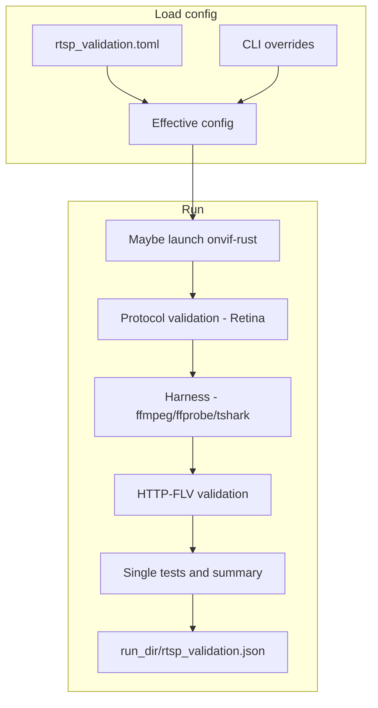

# RTSP Validation Tool

Host-side tool for testing RTSP performance and protocol conformance without physical camera hardware. A single Rust binary launches `onvif-rust` in validation mode (optional), runs protocol checks (Retina), HTTP-FLV checks, and harness scenarios (ffmpeg, ffprobe, tshark), writing one JSON report in the per-run artifacts directory.

## Overview

- **Purpose**: Test RTSP/HTTP-FLV performance and protocol conformance, with or without hardware.
- **Approach**: Optionally start onvif-rust with `--validation-mode --h264-file <path>` (or on the device via SSH), then run protocol validation and harness against the endpoint.
- **Test scenarios**: connectivity, latency, bitrate/fps, SDP, RTSP protocol sequence, packet loss, RTP payload conformance (H.264/AAC), HTTP-FLV, concurrent clients, long-duration, error handling.
- **Tools**: ffmpeg, ffprobe, tshark (invoked by the binary; must be installed).
- **Config**: TOML file with CLI overrides. Example configs in `validation/config/`.
- **Output**: Single structured JSON report with metrics and pass/fail.

## How it works



## Prerequisites

```bash
# Install required tools (used by the binary)
sudo apt-get install ffmpeg tshark

# This repo uses a vendored Rust toolchain. Always use its cargo.
export CARGO=toolchain/arm-anykav200-crosstool-ng/bin/cargo

# Build onvif-rust for host-side validation-mode (only needed for --h264-file local launch)
cd cross-compile/onvif-rust
$CARGO build --target x86_64-unknown-linux-gnu --features validation-mode

# Build the RTSP validation tool
./validation/build_rtsp_validation_tool.sh
```

The build script places the binary at `validation/rtsp_validation_tool`.

## Quick Start

```bash
# Run against an already-running server (e.g. onvif-rust on port 8554)
./validation/rtsp_validation_tool --no-launch --rtsp-port 8554 --rtsp-stream /stream1

# Or launch onvif-rust locally with a test H.264 file
./validation/rtsp_validation_tool --h264-file test_video.h264 --rtsp-port 8554 --rtsp-stream /stream1

# Run against the camera device via SSH (uses config/rtsp_validation.toml)
./validation/rtsp_validation_tool -c validation/config/rtsp_validation.toml

# View results from the most recent run directory
LATEST_RUN="$(ls -1dt rtsp_results/runs/* | head -n1)"
cat "${LATEST_RUN}/rtsp_validation.json" | jq .

# Convert to Markdown
python3 validation/scripts/rtsp_validation_json_to_md.py -o rtsp_validation.md
```

## Config-only run

With a complete `rtsp_validation.toml` (including `[run]` with `no-launch` and/or `launch-on-device`), you can run without any CLI arguments:

```bash
./validation/rtsp_validation_tool
# Or with an explicit config path (-c is short for --config):
./validation/rtsp_validation_tool -c validation/config/rtsp_validation.toml
```

Example configs in `validation/config/`:
- `rtsp_validation.toml` — device connection (default)
- `rtsp_validation_device_real.toml` — real-mode camera sensor (multi-stream)
- `rtsp_validation_external.toml` — external/third-party RTSP server

## Logging and debugging

Logging is controlled by `RUST_LOG` (overrides config) or `[logging]` in the TOML config. The tool bridges the **retina** library's `log` crate output into tracing.
When `logging.file` is set, the validator log is copied into the per-run artifacts directory.
ONVIF server logs are file-only (`onvif.log*`); local launches do not produce separate `onvif_rust.stdout.log`/`onvif_rust.stderr.log` artifacts.

**Config (`rtsp_validation.toml`):**

```toml
[logging]
level = "debug"
# Retina RTSP client level: "debug", "trace", or leave empty to use level above
retina-level = "debug"
# FFmpeg log level: quiet, error, warning, info, verbose, debug, trace
ffmpeg-level = "debug"
file = "rtsp_validation.log"
```

**Environment (overrides config):**

```bash
# More detail from the RTSP client library (e.g. PLAY/RTP-Info, SETUP, TEARDOWN)
RUST_LOG=retina=debug ./validation/rtsp_validation_tool --no-launch --rtsp-port 554

# Maximum verbosity from retina (trace)
RUST_LOG=retina=trace,rtsp_validation_tool=info ./validation/rtsp_validation_tool --no-launch
```

Use `retina=debug` (or `retina-level = "debug"` in config) to see what the library is sending/receiving and why it might reject a response (e.g. missing `rtptime` on PLAY). Use `trace` for full protocol dumps.

## Harness artifacts

Each run creates a timestamped **per-run artifacts directory** under `rtsp_results/runs/`. The JSON report includes `artifacts_dir` so you can jump straight to it.

Configure with `[artifacts]` in `rtsp_validation.toml`:

```toml
[artifacts]
dir = "rtsp_results/runs"
capture-tool-output = true
keep-pcaps = true
```

`capture-tool-output` controls whether ffmpeg/ffprobe/tshark stdout+stderr are saved. Artifacts include:

- `ffmpeg_*.log` — captured ffmpeg-sidecar log events and progress
- `ffprobe_sdp_validation.stdout.log`, `ffprobe_sdp_validation.stderr.log`
- `tshark_*.stdout.log`, `tshark_*.stderr.log`
- `rtsp_protocol_sequence_*.pcap`, `rtp_packet_loss_capture.pcap` (kept by default)
- `device_onvif.log*`, `device_vendor_daemon.log*` — copied from device when using `--launch-on-device`
- `rtsp_validation.json` — report output
- `rtsp_validation.log` — validator log copy (when `logging.file` is set)

## Running against the camera (device validation)

When the camera is on the network with SSH available (default port `22`), you can start `onvif-rust` on the device and run validation against it. The tool starts the server under `/mnt/anyka_hack/onvif/` on the device, runs all tests, collects system telemetry (RAM, CPU, onvif-rust memory), then stops the server.

```bash
# Device at 192.168.2.198 — password via env var (recommended)
RTSP_VALIDATION_DEVICE_PASSWORD=www123 \
./validation/rtsp_validation_tool -c validation/config/rtsp_validation.toml \
  --launch-on-device --no-launch

# Explicit SSH settings
./validation/rtsp_validation_tool --launch-on-device --no-launch \
  --device-host 192.168.2.198 --device-ssh-port 22 --device-user root \
  --device-password www123

# Skip telemetry collection
./validation/rtsp_validation_tool --launch-on-device --no-launch --no-telemetry
```

Requirements:

- SSH enabled on the device (default port 22).
- Device SSH password via `--device-password`, `RTSP_VALIDATION_DEVICE_PASSWORD`, or `[device].password` in config.
- `onvif-rust` and `config.toml` present at `/mnt/anyka_hack/onvif/` on the device.
- RTSP port on device (default 554) must match `--rtsp-port` if overridden.

When `--launch-on-device` is used, the JSON report may include a **telemetry** object with `mem_total_kib`, `mem_free_kib`, `mem_available_kib`, `load_avg_1m`, `load_avg_5m`, `load_avg_15m`, `onvif_rss_kib`, `onvif_vmsize_kib`, and `onvif_pid` (and optionally `error` if a command failed).

### File playback on device (validation mode)

To run against a **file** (H.264 and optional AAC) rather than the live camera sensor, the files must be on the device and `onvif-rust` must be built with the `validation-mode` feature.

**Getting files onto the device:**

1. **SD card** — Copy into `SD_card_contents/anyka_hack/onvif/`; after boot they appear at `/mnt/anyka_hack/onvif/` on device.
2. **SCP** — `scp test.h264 root@192.168.2.198:/mnt/anyka_hack/onvif/`

**Running with device-side files:**

```bash
# H.264 only
./validation/rtsp_validation_tool --launch-on-device --no-launch \
  --device-h264-file /mnt/anyka_hack/onvif/test.h264

# H.264 + AAC, loop playback
./validation/rtsp_validation_tool --launch-on-device --no-launch \
  --device-h264-file /mnt/anyka_hack/onvif/test.h264 \
  --device-aac-file /mnt/anyka_hack/onvif/test.aac \
  --device-loop-playback
```

Or set paths in config:

```toml
[device]
host = "192.168.2.198"
ssh-port = 22
user = "root"
password = ""
h264-file = "/mnt/anyka_hack/onvif/test.h264"
aac-file = "/mnt/anyka_hack/onvif/test.aac"
loop-playback = true
```

### Real-mode device validation (camera sensor)

To validate the live camera pipeline without file playback, set `real-mode = true`. The device `onvif-rust` binary does **not** need the `validation-mode` feature. Both `main` and `sub` streams are validated by default, but can be overridden with `[[device.streams]]`.

```bash
./validation/rtsp_validation_tool -c validation/config/rtsp_validation_device_real.toml \
  --device-password secret
```

Config (`validation/config/rtsp_validation_device_real.toml` is the reference example):

```toml
[device]
host = "192.168.2.198"
ssh-port = 22
user = "root"
password = ""
telemetry = true
real-mode = true

[[device.streams]]
label = "main"
rtsp-stream = "/main"
httpflv-path = "/live/main.flv"

[[device.streams]]
label = "sub"
rtsp-stream = "/sub"
httpflv-path = "/live/sub.flv"
```

Or from the CLI:

```bash
./validation/rtsp_validation_tool --launch-on-device --no-launch --device-real-mode
```

`--device-real-mode` and `--device-h264-file` are mutually exclusive.

## Test Scenarios

1. **Protocol (Retina)** — DESCRIBE, SDP streams, SETUP, PLAY, first-frame latency, RTP loss, H.264 length-prefix.
2. **Basic connectivity** — ffmpeg quick probe.
3. **Stream startup latency** — FFmpeg harness startup to first frame (`harness-startup-latency-ms`).
4. **Bitrate / FPS stability** — Steady-state from ffmpeg progress.
5. **SDP validation** — ffprobe stream/codec checks.
6. **RTSP protocol sequence** — tshark capture + rtshark analysis (DESCRIBE/SETUP/PLAY/TEARDOWN, status codes).
7. **Packet loss + RTP payload conformance** — UDP capture and RTP seq gaps, plus pcap-level RFC checks for H.264 (RFC 6184) and AAC (RFC 3640) payload structure.
8. **HTTP-FLV** — FLV container format validation (binary parse: header + tags) and ffmpeg bitrate/FPS harness.
9. **Concurrent clients** — Multiple ffmpeg clients in parallel (config or `--concurrent N`).
10. **Long duration** — Optional `--long-duration` (config `test.long-duration-sec`).
11. **Error handling** — Invalid credentials, bogus URL (skip with `--skip-error-handling`).

## Configuration reference

Config is read from TOML. Search order: `--config <path>`, env `RTSP_VALIDATION_CONFIG`, then `./rtsp_validation.toml`, then `validation/config/rtsp_validation.toml`. CLI overrides config.

For RTSP servers that omit `RTP-Info rtptime` on `PLAY` (common with MediaMTX), use `initial-timestamp-policy = "permissive"` (default).
When stream authentication is enabled, one credential pair (`rtsp.username` / `rtsp.password` or `--username` / `--password`) is applied to both RTSP and HTTP-FLV checks.

```toml
[run]
no-launch = true
launch-on-device = true
output = "rtsp_validation.json"
update-baseline = false
compare-baseline = false

[rtsp]
host = "192.168.2.198"
port = 554
stream = "/stream1"
timeout-sec = 10
initial-timestamp-policy = "permissive"
# Optional stream credentials (applied to both RTSP and HTTP-FLV checks)
# username = "admin"
# password = "www123"

[test]
short-duration-sec = 30
long-duration-sec = 600
concurrent-clients = 4

[thresholds]
video-startup-latency-ms = 1500
harness-startup-latency-ms = 3000
audio-startup-latency-ms = 2000
bitrate-tolerance-percent = 15
fps-tolerance-percent = 10
packet-loss-tolerance-percent = 1
# Optional expected values; baseline comparison used when unset and baseline exists
# [thresholds.expected]
# bitrate_kbps = 2000
# fps = 25

[baseline]
dir = "rtsp_results/baselines"

[capture]
# Empty = auto (lo for localhost, any for remote)
interface = ""

[logging]
level = "debug"
retina-level = "debug"
ffmpeg-level = "debug"
file = "rtsp_validation.log"

[artifacts]
dir = "rtsp_results/runs"
capture-tool-output = true
keep-pcaps = true

# Optional HTTP-FLV endpoint
[httpflv]
port = 8080
path = "/live/stream1.flv"
timeout-sec = 10

[device]
host = "192.168.2.198"
ssh-port = 22
user = "root"
# Prefer RTSP_VALIDATION_DEVICE_PASSWORD env var for secrets
password = ""
telemetry = true
# File-playback mode (device binary must be built with validation-mode feature)
h264-file = "/mnt/anyka_hack/onvif/test.h264"
aac-file = "/mnt/anyka_hack/onvif/test_audio.aac"
loop-playback = true
# Set real-mode = true to use the camera sensor (h264-file / aac-file ignored)
# real-mode = false
# [[device.streams]]  — override which streams to validate in real mode
```

Common CLI overrides: `--rtsp-host`, `--rtsp-port`, `--rtsp-stream`, `--username`, `--password`, `--transport` (tcp/udp), `--duration`, `-c`/`--config`, `--output`, `--artifacts-dir`, `--update-baseline`, `--compare-baseline`, `--concurrent`, `--long-duration`, `--skip-error-handling`, `--require-audio`, `--skip-httpflv`, `--httpflv-stream`, `--ffmpeg-log-level`.

Device flags: `--launch-on-device`, `--no-launch`, `--device-host`, `--device-ssh-port`, `--device-user`, `--device-password`, `--no-telemetry`, `--device-h264-file`, `--device-aac-file`, `--device-loop-playback`, `--device-real-mode`.

## Metrics

- **first_video_frame_latency_ms** — Protocol path first decoded frame latency (threshold: `video-startup-latency-ms`).
- **harness_startup_latency_ms** — Harness startup to first decoded frame (threshold: `harness-startup-latency-ms`; for external FFmpeg/MediaMTX streams, 2500–4000 ms is common).
- **harness_bitrate_kbps**, **harness_fps** — Steady-state from ffmpeg; also require sane minimums (≥1 kbps, ≥5 fps), then validated via expected values or baselines.
- **harness_packet_loss_percent** — RTP loss from capture.
- **harness_protocol_sequence** — RTSP method counts and status codes from pcap. Auth challenge `401` responses are tracked separately and do not fail the metric.
- **harness_pcap_rfc6184_h264** — RTP payload structural validation for H.264 per RFC 6184 (Single NAL / STAP-A / FU-A).
- **harness_pcap_rfc3640_aac** — RTP payload structural validation for AAC MPEG4-GENERIC per RFC 3640 (AU headers length + AU sizes).
- **httpflv_*** — FLV container parse results and ffmpeg bitrate/FPS for HTTP-FLV.

## Baseline Management

```bash
# Create baseline from current run
./validation/rtsp_validation_tool --no-launch --rtsp-port 8554 --update-baseline

# Compare against baseline (adds baseline_regression_* fail if over tolerance)
./validation/rtsp_validation_tool --no-launch --rtsp-port 8554 --compare-baseline

# Baselines stored under config baseline.dir (default rtsp_results/baselines/)
# Tracked: harness_startup_latency_ms, harness_bitrate_kbps, harness_fps,
#          harness_packet_loss_percent, telemetry_mem_*_kib, telemetry_load_avg_*,
#          telemetry_onvif_rss_kib, telemetry_onvif_vmsize_kib
```

## CI/CD

```bash
./validation/rtsp_validation_tool --no-launch --rtsp-port 8554 && \
  LATEST_RUN="$(ls -1dt rtsp_results/runs/* | head -n1)" && \
  jq -e '.summary.overall_pass' "${LATEST_RUN}/rtsp_validation.json"
```

## Helper scripts

- `validation/scripts/rtsp_validation_json_to_md.py` — Convert a `rtsp_validation.json` report to Markdown.
- `validation/scripts/ws_discovery_validator.py` — Send WS-Discovery probes and validate ONVIF device responses on the local network.

```bash
python3 validation/scripts/rtsp_validation_json_to_md.py -o rtsp_validation.md
python3 validation/scripts/ws_discovery_validator.py --timeout 10 --verbose
```

## Troubleshooting

- **ffmpeg not found** — `sudo apt-get install ffmpeg`
- **tshark not found** — `sudo apt-get install tshark`
- **tshark permission denied** — Run with `sudo` or add your user to the `wireshark` group.
- **Server not starting** — Check that onvif-rust is built with `--features validation-mode` and H.264 file path is valid.
- **Validation-mode stream auth failure** — If `server.auth_enabled=true`, onvif-rust validation mode requires a provisioned `users.toml` in the config directory; missing or empty users will abort startup.
- **Port in use** — Set `--rtsp-port` or stop the process occupying the port.
- **Stream not found** — For onvif-rust use `--rtsp-stream /stream1` and match the port the server reports (e.g. 8554).
- **Device unreachable** — With `--launch-on-device`, verify the device IP (`--device-host`), SSH is enabled (port 22 by default), credentials are correct, and `/mnt/anyka_hack/onvif/onvif-rust` and `config.toml` exist on the device.
- **`--device-real-mode` and `--device-h264-file` are mutually exclusive** — Real mode uses the camera sensor; drop `--device-h264-file`.
