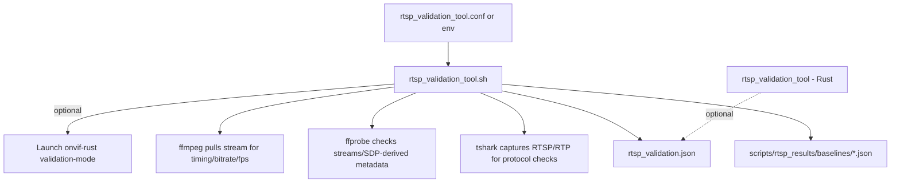

# RTSP Validation Tool

Host-side tool for testing RTSP performance and conformity without physical camera hardware. Can launch `onvif-rust` in validation mode with a test H.264 file and run tests using ffmpeg, ffprobe, and tshark.

## Overview

- **Purpose**: Test RTSP performance and protocol conformance without hardware.
- **Approach**: Optionally start onvif-rust with `--validation-mode --h264-file <path>`, then run tests against the RTSP endpoint.
- **Tools**: ffmpeg, ffprobe, tshark for capture and metrics.
- **Output**: Structured JSON report with metrics and pass/fail.

## How the pieces fit together (current flow)

The validation harness is intentionally split into a **config**, a **bash test runner**, and an **optional Rust validator**:



- **Configuration**: `rtsp_validation_tool.sh` reads defaults from environment and then sources `scripts/rtsp_validation_tool.conf` when present.
- **Primary runner**: `rtsp_validation_tool.sh` executes a fixed suite of scenarios and writes a single JSON report.
- **Optional server launch**: With `--launch-server --h264-file <path>`, the script starts `onvif-rust` in `--validation-mode` and then tests `rtsp://127.0.0.1:<port>/stream1`.
- **Baselines**: `--update-baseline` writes baseline JSON files; `--compare-baseline` compares current metrics against them to detect regressions.

## Bash vs Rust tool (how they differ)

- **`rtsp_validation_tool.sh` (bash)**: Source of truth for **performance metrics** and broad scenarios (concurrency, long-duration, tshark-assisted protocol counts). It depends on ffmpeg/ffprobe/tshark being installed.
- **`rtsp_validation_tool` (Rust binary)**: Optional **protocol-level validator**. Use it when you want deterministic RTSP/SDP/RTP assertions without scraping ffmpeg logs.

## Prerequisites

```bash
# Install required tools
sudo apt-get install ffmpeg tshark jq

# This repo uses a vendored Rust toolchain. Always use its cargo.
export CARGO=toolchain/arm-anykav200-crosstool-ng/bin/cargo

# Build onvif-rust for host-side validation-mode (optional, only if using --launch-server)
cd cross-compile/onvif-rust
$CARGO build --target x86_64-unknown-linux-gnu --features validation-mode

# Build the Rust protocol validator into validation/
./validation/build_rtsp_validation_tool.sh
```

## Quick Start

```bash
# Generate test H.264 file (or use existing)
./validation/generate_test_h264.sh test_video.h264 30 25 1920x1080

# Run validation against an already-running server (e.g. onvif-rust on port 8554)
RTSP_PORT=8554 RTSP_STREAM=/stream1 ./validation/rtsp_validation_tool.sh

# Or launch onvif-rust and run tests
./validation/rtsp_validation_tool.sh --launch-server --h264-file test_video.h264

# View results
cat rtsp_validation.json | jq .
```

## Test Scenarios

1. **Basic connectivity** – DESCRIBE request and SDP parsing.
2. **Stream startup** – Time to first frame (target: video &lt;1500 ms, audio &lt;2000 ms).
3. **Bitrate stability** – 30 s stream measurement (±15% tolerance).
4. **Frame rate stability** – FPS consistency (±10% tolerance).
5. **SDP validation** – Codec parameters and media tracks (ffprobe).
6. **RTSP protocol sequence** – DESCRIBE → SETUP → PLAY → TEARDOWN (tshark).
7. **Packet loss** – RTP sequence gap detection (target &lt;1%).
8. **Concurrent clients** – Multiple clients (e.g. 2 or 4) streaming in parallel.
9. **Long duration** – 10-minute stability (optional, `--long-duration`).
10. **Error handling** – Invalid credentials, bogus URL (optional, can skip with `--skip-error-handling`).

## Configuration

Edit `validation/rtsp_validation_tool.conf` or override via environment:

- Common knobs:
  - `RTSP_HOST`, `RTSP_PORT`, `RTSP_STREAM`
  - `TEST_DURATION` (defaults to `SHORT_TEST_DURATION` from the config)
  - `CAPTURE_IFACE` (tshark interface; defaults to `lo` for localhost targets, otherwise `any`)
  - Thresholds: `VIDEO_STARTUP_LATENCY_MS`, `BITRATE_TOLERANCE_PERCENT`, `FPS_TOLERANCE_PERCENT`, `PACKET_LOSS_TOLERANCE_PERCENT`

```bash
source validation/rtsp_validation_tool.conf

# Override
RTSP_HOST=192.168.1.100 \
RTSP_PORT=554 \
RTSP_STREAM=/stream1 \
TEST_DURATION=60 \
OUTPUT_FILE=results.json \
./validation/rtsp_validation_tool.sh
```

When testing **onvif-rust validation mode**, use `RTSP_STREAM=/stream1` and default RTSP port from the server (e.g. 8554).

## Metrics

- **startup_latency_ms** – Time to first decoded video frame (threshold: `VIDEO_STARTUP_LATENCY_MS`).
- **bitrate_kbps / fps** – Steady-state estimates from ffmpeg logs (validated via expected values or baselines).
- **packet_loss_percent** – UDP-mode RTP loss estimate from tshark capture (threshold: `PACKET_LOSS_TOLERANCE_PERCENT`).
- **protocol_sequence** – RTSP method counts plus a basic “no RTSP >=400 responses” check from tshark capture.

## Baseline Management

```bash
# Create baseline from current run
./validation/rtsp_validation_tool.sh --update-baseline

# Compare against baseline
./validation/rtsp_validation_tool.sh --compare-baseline

# Baselines stored under
cat validation/rtsp_results/baselines/startup_latency_ms_baseline.json
# Other common baselines:
# - validation/rtsp_results/baselines/bitrate_kbps_baseline.json
# - validation/rtsp_results/baselines/fps_baseline.json
# - validation/rtsp_results/baselines/packet_loss_percent_baseline.json
```

## CI/CD

```bash
# Fail on any test failure
./validation/rtsp_validation_tool.sh && \
  jq -e '.summary.overall_pass' rtsp_validation.json
```

## Rust validation tool (optional)

A Rust binary can launch the server and run protocol-level RTSP/SDP/RTP checks with a JSON report.
It is **feature-gated** behind `rtsp-validation-tool`.

```bash
./validation/build_rtsp_validation_tool.sh

# Run (starts server if --h264-file given)
./validation/rtsp_validation_tool \
  --h264-file ./test_video.h264 \
  --rtsp-host 127.0.0.1 \
  --rtsp-port 8554 \
  --rtsp-stream /stream1 \
  --duration 60 \
  --output validation/rtsp_validation_rust.json

# Connect to existing server only
./validation/rtsp_validation_tool \
  --no-launch --rtsp-host 127.0.0.1 --rtsp-port 8554 --rtsp-stream /vs0 --duration 10 --output validation/rtsp_validation_rust.json
```

## Troubleshooting

- **ffmpeg not found** – `sudo apt-get install ffmpeg`
- **tshark not found** – `sudo apt-get install tshark`
- **Permission denied for tshark** – Run with `sudo` or add user to the `wireshark` group.
- **Server not starting** – Check `/tmp/onvif_server.log`.
- **Port in use** – Set `RTSP_PORT` in config or stop the process using the port.
- **Stream not found** – For onvif-rust use `RTSP_STREAM=/stream1` and the port the server reports (e.g. 8554).
