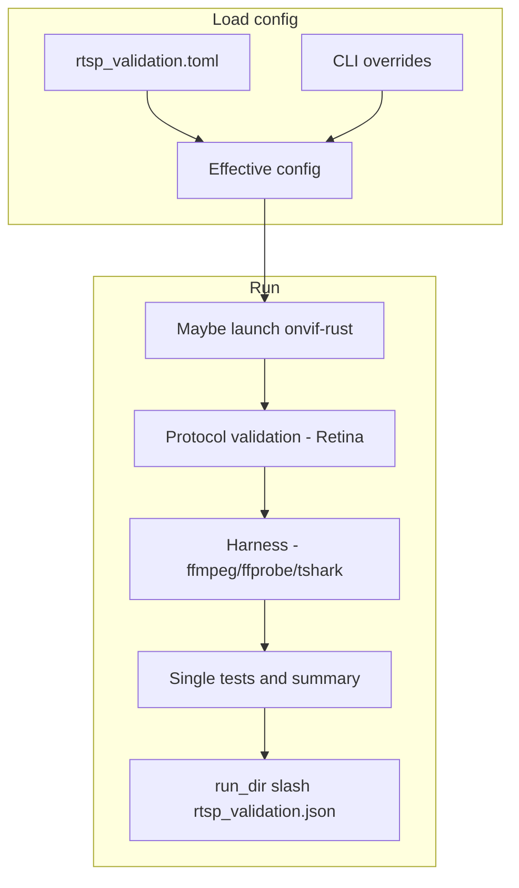

# RTSP Validation Tool

Host-side tool for testing RTSP performance and protocol conformance without physical camera hardware. A single Rust binary launches `onvif-rust` in validation mode (optional), runs protocol checks (Retina), and harness scenarios (ffmpeg, ffprobe, tshark), writing one JSON report in the per-run artifacts directory.

## Overview

- **Purpose**: Test RTSP performance and protocol conformance without hardware.
- **Approach**: Optionally start onvif-rust with `--validation-mode --h264-file <path>`, then run protocol validation and harness (connectivity, latency, bitrate/fps, SDP, protocol sequence, packet loss, concurrent, long-duration, error handling) against the RTSP endpoint.
- **Tools**: ffmpeg, ffprobe, tshark (invoked by the binary; must be installed).
- **Config**: TOML file `rtsp_validation.toml` with CLI overrides.
- **Output**: Single structured JSON report with metrics and pass/fail.

## How it works



## Prerequisites

```bash
# Install required tools (used by the binary)
sudo apt-get install ffmpeg tshark

# This repo uses a vendored Rust toolchain. Always use its cargo.
export CARGO=toolchain/arm-anykav200-crosstool-ng/bin/cargo

# Build onvif-rust for host-side validation-mode (optional, only if using --launch-server)
cd cross-compile/onvif-rust
$CARGO build --target x86_64-unknown-linux-gnu --features validation-mode

# Build the RTSP validation tool
./validation/build_rtsp_validation_tool.sh
```

## Quick Start

```bash
# Generate test H.264 file (or use existing)
./validation/generate_test_h264.sh test_video.h264 30 25 1920x1080

# Run validation against an already-running server (e.g. onvif-rust on port 8554)
./validation/rtsp_validation_tool --no-launch --rtsp-port 8554 --rtsp-stream /stream1

# Or launch onvif-rust and run all tests
./validation/rtsp_validation_tool --h264-file test_video.h264 --rtsp-port 8554 --rtsp-stream /stream1

# View results from the most recent run directory
LATEST_RUN="$(ls -1dt rtsp_results/runs/* | head -n1)"
cat "${LATEST_RUN}/rtsp_validation.json" | jq .

# Or convert to Markdown
python3 validation/rtsp_validation_json_to_md.py -o rtsp_validation.md
```

### Logging and debugging

Logging is controlled by `RUST_LOG` (overrides config) or `[logging]` in the TOML config. The tool bridges the **retina** library’s `log` crate output into tracing.
When `logging.file` is set, the validator log is copied into the per-run artifacts directory.
ONVIF server logs are file-only (`onvif.log*`), without separate `onvif_rust.stdout.log`/`onvif_rust.stderr.log` artifacts.

**Config (rtsp_validation.toml):**

```toml
[logging]
level = "debug"
# Retina RTSP client level: "debug", "trace", or leave empty to use level above
retina-level = "debug"
file = "rtsp_validation.log"
```

**Environment (overrides config):**

```bash
# More detail from the RTSP client library (e.g. PLAY/RTP-Info, SETUP, TEARDOWN)
RUST_LOG=retina=debug ./validation/rtsp_validation_tool --no-launch --rtsp-port 554

# Maximum verbosity from retina (trace)
RUST_LOG=retina=trace,rtsp_validation_tool=info ./validation/rtsp_validation_tool --no-launch
```

Use `retina=debug` (or `retina-level = "debug"` in config) to see what the library is sending/receiving and why it might reject a response (e.g. missing `rtptime` on PLAY). Use `trace` for full protocol dumps.

### Harness artifacts (ffmpeg/ffprobe/tshark output, pcaps)

Each run creates a **per-run artifacts directory** and logs its path at startup. The JSON report also includes `artifacts_dir` so you can jump straight to it.

Configure with `[artifacts]` in `rtsp_validation.toml`:

```toml
[artifacts]
dir = "rtsp_results/runs"
capture-tool-output = true
keep-pcaps = true
```

`capture-tool-output` applies to harness tools (`ffmpeg`/`ffprobe`/`tshark`) only.

Artifacts include (filenames are stable within a run directory):

- `ffmpeg_*.log`: captured ffmpeg-sidecar log events and progress
- `ffprobe_sdp_validation.stdout.log`, `ffprobe_sdp_validation.stderr.log`
- `tshark_*.stdout.log`, `tshark_*.stderr.log`
- `rtsp_protocol_sequence_*.pcap`, `rtp_packet_loss_capture.pcap` (pcaps are kept by default)
- `device_onvif.log*` copies (pulled from `/mnt/anyka_hack/onvif/onvif.log*` when using `--launch-on-device`)
- `rtsp_validation.json` report output
- `rtsp_validation.log` copy (when `[logging].file` is set)

## Running against the camera (device validation)

When the camera is on the network with SSH available (default port `22`), you can start `onvif-rust` on the device and run validation against it. The tool will start the server in `/mnt/anyka_hack/onvif` on the device, run all tests, collect system telemetry (RAM, CPU, onvif-rust memory), then stop the server.

```bash
# Device at 192.168.2.198, SSH on port 22 (default)
./validation/rtsp_validation_tool --launch-on-device --no-launch

# Explicit device host/SSH settings
RTSP_VALIDATION_DEVICE_PASSWORD=www123 \
./validation/rtsp_validation_tool --launch-on-device --no-launch \
  --device-host 192.168.2.198 --device-ssh-port 22 --device-user root

# Skip telemetry collection
./validation/rtsp_validation_tool --launch-on-device --no-launch --no-telemetry
```

Requirements:

- SSH must be enabled on the device (default port 22).
- A device SSH password must be supplied via one of:
  - `--device-password`
  - `RTSP_VALIDATION_DEVICE_PASSWORD`
  - `[device].password` in config
- `onvif-rust` and `config.toml` must be present at `/mnt/anyka_hack/onvif/` on the device.
- RTSP port on device (default 554) must match `--rtsp-port` if you override it.

When `--launch-on-device` is used, the JSON report may include a **telemetry** object with `mem_total_kib`, `mem_free_kib`, `mem_available_kib`, `load_avg_1m`, `load_avg_5m`, `load_avg_15m`, `onvif_rss_kib`, `onvif_vmsize_kib`, and `onvif_pid` (and optionally `error` if a command failed).

### H.264/AAC files on device (validation mode)

To run validation against a **file** (H.264 and optional AAC) instead of the live camera, the files must be on the device and the device `onvif-rust` binary must be built with the **validation-mode** feature.

**Getting files onto the device:**

1. **SD card** – Copy H.264/AAC into the SD card folder `anyka_hack/onvif/` (e.g. `validation/rtsp_results/test.h264` → `SD_card_contents/anyka_hack/onvif/test.h264`). After boot, they appear at `/mnt/anyka_hack/onvif/test.h264` on the device.
2. **SCP** – If the device runs SSH (e.g. Dropbear), copy with `scp test.h264 root@192.168.2.198:/mnt/anyka_hack/onvif/`.

**Running with device-side files:**

```bash
# H.264 only (path is on the device)
./validation/rtsp_validation_tool --launch-on-device --no-launch \
  --device-h264-file /mnt/anyka_hack/onvif/test.h264

# H.264 + AAC, loop playback
./validation/rtsp_validation_tool --launch-on-device --no-launch \
  --device-h264-file /mnt/anyka_hack/onvif/test.h264 \
  --device-aac-file /mnt/anyka_hack/onvif/test.aac \
  --device-loop-playback
```

You can set paths in config instead of argv:

```toml
[device]
host = "192.168.2.198"
ssh_port = 22
user = "root"
password = ""
h264_file = "/mnt/anyka_hack/onvif/test.h264"
aac_file = "/mnt/anyka_hack/onvif/test.aac"
loop_playback = true
```

**Requirement:** The `onvif-rust` binary deployed to `/mnt/anyka_hack/onvif/` must be built with `--features validation-mode` so that `--validation-mode --h264-file` is supported.

## Test Scenarios

1. **Protocol (Retina)**: DESCRIBE, SDP streams, SETUP, PLAY, first-frame latency, RTP loss, H.264 length-prefix.
2. **Basic connectivity** – ffmpeg quick probe.
3. **Stream startup latency** – FFmpeg harness startup to first frame (`harness-startup-latency-ms`).
4. **Bitrate / FPS stability** – Steady-state from ffmpeg progress.
5. **SDP validation** – ffprobe stream/codec checks.
6. **RTSP protocol sequence** – tshark capture + rtshark analysis (DESCRIBE/SETUP/PLAY/TEARDOWN, status codes).
7. **Packet loss + RTP payload conformance** – UDP capture and RTP seq gaps, plus pcap-level RFC checks for H.264 (RFC 6184) and AAC (RFC 3640) payload structure.
8. **Concurrent clients** – Multiple ffmpeg clients in parallel (config or `--concurrent N`).
9. **Long duration** – Optional `--long-duration` (config long_duration_sec).
10. **Error handling** – Invalid credentials, bogus URL (optional, skip with `--skip-error-handling`).

## Configuration

Configuration is read from TOML. Search order: `--config <path>`, env `RTSP_VALIDATION_CONFIG`, then `./rtsp_validation.toml`, then `validation/rtsp_validation.toml`. CLI overrides config.
For RTSP servers that omit `RTP-Info rtptime` on `PLAY` (common with MediaMTX), use `initial_timestamp_policy = "permissive"` (default).
When stream authentication is enabled, use one credential pair (`rtsp.username` / `rtsp.password` or `--username` / `--password`) and the tool applies it to both RTSP and HTTP-FLV checks.

**Config-only run:** With a complete `rtsp_validation.toml` (including `[run]` with `no_launch`, `launch_on_device`, and optionally `output`, `update_baseline`, `compare_baseline`), you can run the full test without any CLI arguments:

```bash
./validation/rtsp_validation_tool
# Or with an explicit config path:
./validation/rtsp_validation_tool --config /path/to/rtsp_validation.toml
```

Example `validation/rtsp_validation.toml`:

```toml
[run]
no_launch = true
launch_on_device = true
output = "rtsp_validation.json" # filename written inside each run artifacts directory
update_baseline = false
compare_baseline = false

[rtsp]
host = "127.0.0.1"
port = 554
stream = "/vs0"
timeout_sec = 10
initial_timestamp_policy = "permissive"
# Optional stream credentials used by both RTSP and HTTP-FLV validation
# username = "admin"
# password = "www123"

[test]
short_duration_sec = 30
long_duration_sec = 600
concurrent_clients = 4

[thresholds]
# Protocol check: `first_video_frame_latency_ms`
video-startup-latency-ms = 1500
# Harness check: ffmpeg startup + first decoded frame
harness-startup-latency-ms = 3000
audio-startup-latency-ms = 2000
bitrate-tolerance-percent = 15
fps-tolerance-percent = 10
packet-loss-tolerance-percent = 1

[baseline]
dir = "rtsp_results/baselines"

[capture]
# Empty = auto (lo for localhost, any for remote)
interface = ""

# Optional: device validation (--launch-on-device)
[device]
host = "192.168.2.198"
ssh_port = 22
user = "root"
password = ""
telemetry = true
```

Common CLI overrides: `--rtsp-host`, `--rtsp-port`, `--rtsp-stream`, `--username`, `--password`, `--duration`, `--config`, `--update-baseline`, `--compare-baseline`, `--concurrent`, `--long-duration`, `--skip-error-handling`, `--output`. For device validation: `--launch-on-device`, `--no-launch`, `--device-host`, `--device-ssh-port`, `--device-user`, `--device-password`, `--no-telemetry`.

## Metrics

- **first_video_frame_latency_ms** – Protocol path first decoded frame latency (threshold: `video-startup-latency-ms` or `--max-video-startup-latency-ms`).
- **harness_startup_latency_ms** – Harness startup to first decoded frame (threshold: `harness-startup-latency-ms`; for external FFmpeg/MediaMTX streams, `2500-4000` ms is common).
- **harness_bitrate_kbps**, **harness_fps** – From ffmpeg progress; also require sane minimums (`>=1 kbps`, `>=5 fps`) before passing, then validated via config expected values or baselines.
- **harness_packet_loss_percent** – RTP loss from capture (threshold in config).
- **harness_protocol_sequence** – RTSP method counts and status codes from pcap. Auth challenge `401` responses are tracked separately and do not fail the metric by themselves.
- **harness_pcap_rfc6184_h264** – RTP payload structural validation for H.264 per RFC 6184 (Single NAL / STAP-A / FU-A).
- **harness_pcap_rfc3640_aac** – RTP payload structural validation for AAC MPEG4-GENERIC per RFC 3640 (AU headers length + AU sizes).

## Baseline Management

```bash
# Create baseline from current run
./validation/rtsp_validation_tool --no-launch --rtsp-port 8554 --update-baseline

# Compare against baseline (adds baseline_regression_* fail if over tolerance)
./validation/rtsp_validation_tool --no-launch --rtsp-port 8554 --compare-baseline

# Baselines stored under config baseline.dir (default rtsp_results/baselines/)
# Harness: harness_startup_latency_ms, harness_bitrate_kbps, harness_fps, harness_packet_loss_percent
# Device telemetry (when using --launch-on-device): telemetry_mem_*_kib, telemetry_load_avg_*, telemetry_onvif_rss_kib, telemetry_onvif_vmsize_kib
```

## CI/CD

```bash
# Fail on any test failure
./validation/rtsp_validation_tool --no-launch --rtsp-port 8554 && \
  LATEST_RUN="$(ls -1dt rtsp_results/runs/* | head -n1)" && \
  jq -e '.summary.overall_pass' "${LATEST_RUN}/rtsp_validation.json"
```

## Troubleshooting

- **ffmpeg not found** – `sudo apt-get install ffmpeg`
- **tshark not found** – `sudo apt-get install tshark`
- **Permission denied for tshark** – Run with `sudo` or add user to the `wireshark` group.
- **Server not starting** – Check that onvif-rust is built with `--features validation-mode` and H.264 file path is valid.
- **Validation-mode stream auth startup failure** – If `server.auth_enabled=true`, `onvif-rust` validation mode now requires a provisioned `users.toml` in the same config directory; missing or empty users will abort startup.
- **Port in use** – Set `--rtsp-port` or stop the process using the port.
- **Stream not found** – For onvif-rust use `--rtsp-stream /stream1` and the port the server reports (e.g. 8554).
- **Device unreachable** – With `--launch-on-device`, ensure the device IP is correct (`--device-host`), SSH is enabled (port 22 by default), credentials are correct, and `/mnt/anyka_hack/onvif/onvif-rust` and `config.toml` exist on the device.
